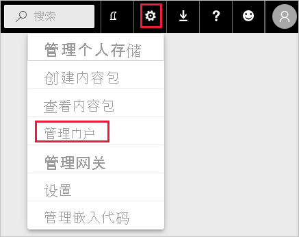
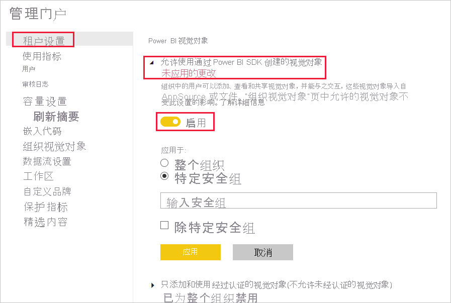
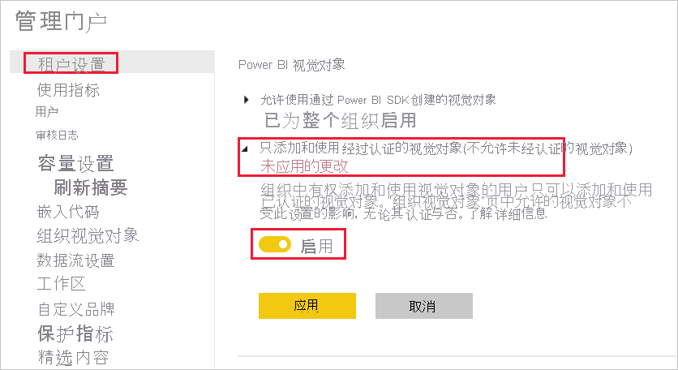
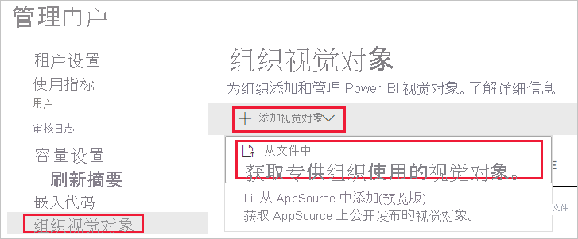
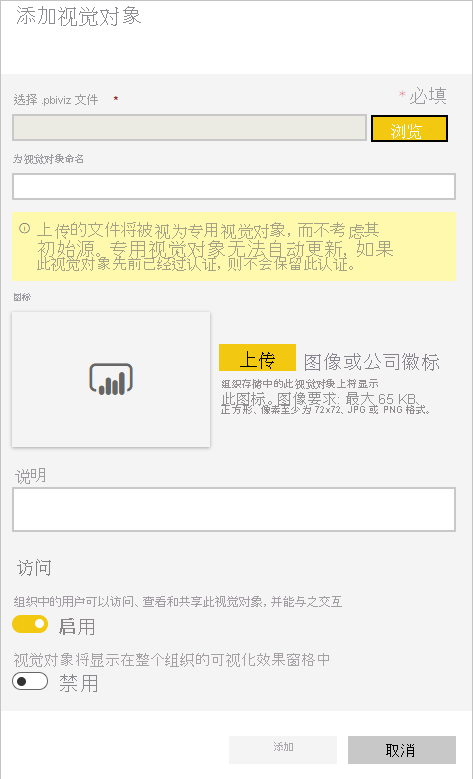
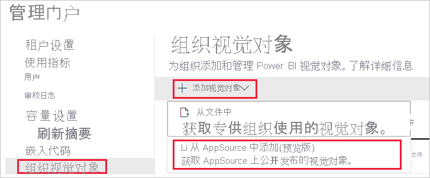
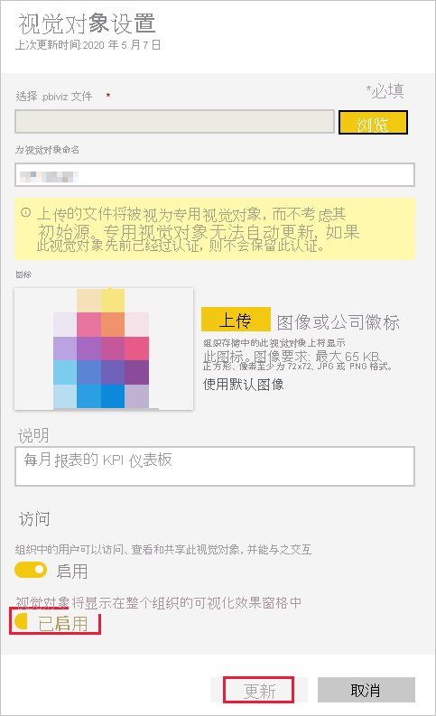

# 管理 Power BI 视觉对象管理员设置

组织的 Power BI 管理员可以控制用户可以在组织中访问的 Power BI 视觉对象的类型。

必须成为 Office 365 中的全局管理员，或分配有 Power BI 服务管理员角色，才能管理 Power BI 视觉对象。 若要详细了解 Power BI 服务管理员角色，请参阅[了解 Power BI 管理员角色](service-admin-role.md)。

## 访问管理门户

若要启用本文所述的设置，需要访问管理门户。

1. 在 Power BI 服务中，选择“设置”。

2. 从“设置”下拉菜单中，选择“管理门户”。

    

## Power BI 视觉对象租户设置

组织的 Power BI 管理员可以控制用户可在组织中访问的 Power BI 视觉对象类型。

UI 租户设置仅会影响 Power BI 服务。 如果希望这些设置在 Power BI Desktop 中生效，请使用组策略。 每部分末尾的表提供了有关在 Power BI Desktop 中启用设置的详细信息。

>[!NOTE]
>更改租户设置不会影响“[组织视觉对象](#organizational-visuals)”选项卡中列出的 Power BI 视觉对象。

### 来自 AppSource 或文件的视觉对象

管理以下类型的 Power BI 视觉对象的组织访问权限：

* 由开发人员创建并保存为 .pbiviz 文件的视觉对象。

* 从 AppSource 获取的视觉对象。

按照以下说明操作，使组织中的用户能够上传 .pbiviz 文件，并可以将来自 AppSource 的视觉对象添加到他们的报表和仪表板中。

1. 展开“允许使用 Power BI SDK 创建的视觉对象”设置。

2. 单击“已启用”。

3. 选择可以上传 .pbiviz 和 AppSource 视觉对象的人员：

    * 选择“整个组织”选项，以允许组织中的所有人员上传 .pbiviz 文件，并可以添加来自 AppSource 的视觉对象。

     * 选择“特定安全组”选项，以管理正在上传的 .pbiviz 文件，并使用安全组添加来自 AppSource 的视觉对象。 将要管理的安全组添加到“输入安全组”文本栏中。 默认情况下，将排除指定的安全组。 如果要包括这些安全组，并排除组织中的所有其他人员，请选择“特定安全组除外”选项。

4. 单击“**应用**”。

对租户设置的 UI 更改仅适用于 Power BI 服务。 若要使组织中的用户能够上传 .pbiviz 文件，并可以将来自 AppSource 的视觉对象添加到 Power BI Desktop 中的可视化窗格，请使用 [Azure AD 组策略](https://docs.microsoft.com/azure/active-directory-domain-services/manage-group-policy)。

|密钥  |值名称  |值  |
|---------|---------|---------|
|Software\Policies\Microsoft\Power BI Desktop\    |EnableCustomVisuals    |0 - 禁用  1 - 启用（默认值）         |
|

### 已认证的 Power BI 视觉对象

如果启用此设置，则组织的报表和仪表板中将仅呈现[已认证的 Power BI 视觉对象](../developer/visuals/power-bi-custom-visuals-certified.md)。 如果来自 AppSource 或文件的 Power BI 视觉对象未经过认证，则将返回错误消息。

1. 在管理门户中，选择“仅添加和使用已认证的视觉对象”。

2. 单击“已启用”。

3. 单击“**应用**”。

对租户设置的 UI 更改仅适用于 Power BI 服务。 若要在 Power BI Desktop 中管理已认证的视觉对象租户设置，请使用 [Azure AD 组策略](https://docs.microsoft.com/azure/active-directory-domain-services/manage-group-policy)。

|密钥  |值名称  |值  |
|---------|---------|---------|
|Software\Policies\Microsoft\Power BI Desktop\    |EnableUncertifiedVisuals    |0 - 禁用  1 - 启用（默认值）         |
|

## 组织视觉对象

Power BI 管理员可以管理组织的[组织商店](../developer/visuals/power-bi-custom-visuals.md#organizational-store)中可用的 Power BI 视觉对象列表。 使用管理门户中的“组织视觉对象”选项卡，你可以添加和删除视觉对象，并决定在组织用户的可视化效果窗格中自动显示哪些视觉对象。 你可以向列表添加任何类型的视觉对象，包括未经认证的视觉对象和 .pbiviz 视觉对象，即使它们与组织的[租户设置](#power-bi-visuals-tenant-settings)相冲突。

组织视觉对象设置会自动部署到 Power BI Desktop。

>[!NOTE]
>Power BI 报表服务器不支持组织组织视觉对象。

### 从文件添加视觉对象

使用此方法从 .pbiviz 文件添加新的 Power BI 视觉对象。

> [!WARNING]
> 从文件上传的 Power BI 视觉对象可能包含存在安全或隐私风险的代码；在部署到组织存储库之前，请确保你信任这些视觉对象的作者和来源。

1. 选择“添加视觉对象” > “从文件” 。

    

2. 填写以下字段：

    * **选择 .pbiviz 文件** - 选择要上传的视觉对象文件。

    * **为视觉对象命名** - 为视觉对象指定简短的标题，以便报表作者可以轻松地了解其功能。

    * **图标** - 上传要在可视化效果窗格中显示的图标文件。

    * **说明** - 提供视觉对象的简短说明，为用户提供更多上下文。

    * **访问** - 此部分有两个选项：
    
        * 选择组织中的用户是否可以访问此视觉对象。 默认情况下，此设置处于启用状态。

        * 选择此视觉对象是否将显示在组织中用户的可视化效果窗格中。 默认情况下，此设置处于禁用状态。 有关详细信息，请参阅[将视觉对象添加到可视化效果窗格](#add-a-visual-to-the-visualization-pane)。

    

3. 选择“添加”，以发起上传请求。 上传完成后，视觉对象将显示在组织视觉对象列表中。

### 从 AppSource 添加视觉对象（预览）

使用此方法从 AppSource 添加新的 Power BI 视觉对象。

AppSource Power BI 视觉对象将自动更新。 组织中的用户将始终拥有最新版本的视觉对象。

1. 选择“添加视觉对象” > “从 AppSource” 。

    

2. 在“Power BI 视觉对象”窗口中，找到要添加的 AppSource 视觉对象，并单击“添加” 。 上传完成后，视觉对象将显示在组织视觉对象列表中。

### 将视觉对象添加到可视化效果窗格

你可以从“组织视觉对象”页中选取视觉对象，以自动显示在组织中所有用户的可视化效果窗格中。

1. 在要添加的视觉对象的行中，单击“设置”。

    organizational-pane

2. 启用“可视化效果窗格”设置，然后单击“更新”。

    

### 删除从文件上传的视觉对象

若要永久删除视觉对象，请选择存储库中视觉对象的回收站图标。

> [!IMPORTANT]
> 删除操作无法撤消。 一旦删除，此视觉对象会立即停止在现有报表中呈现。 即使重新上传同一个视觉对象，它也不会替换已删除的视觉对象。 不过，用户可以重新导入新视觉对象，并替换报表中的现有实例。

### 禁用 .pbiviz 视觉对象

可以禁用通过[组织商店](../developer/visuals/power-bi-custom-visuals.md#organizational-store)提供的 .pbiviz 视觉对象，同时将其保留在组织视觉对象列表中。

1. 在要禁用的 .pbiviz 视觉对象的行中，单击“设置”。

2. 在“访问”部分中，禁用以下设置：组织中的用户可以访问、查看和共享此视觉对象，并能与之交互。

禁用 .pbiviz 视觉对象后，视觉对象将不会在现有报表中呈现，并会显示以下错误消息：

此自定义视觉对象不再可用。有关详细信息，请联系租户管理员。

>[!NOTE]
>已添加为书签的 .pbiviz 视觉对象在禁用后仍可继续正常工作。

### 更新视觉对象

AppSource 视觉对象会自动更新。 AppSource 中提供新版本后，它将替换通过组织视觉对象列表部署的较旧版本。

若要更新 .pbiviz 视觉对象，请按照以下步骤替换视觉对象。

1. 在要添加的视觉对象的行中，单击“设置”。

2. 单击“浏览”，然后选择要用于替换当前视觉对象的 .pbiviz。

3. 单击“更新”。

## 后续步骤

> [!div class="nextstepaction"]
>[在管理门户中管理 Power BI](service-admin-portal.md)

> [!div class="nextstepaction"]
>[Power BI 中的视觉对象](../developer/visuals/power-bi-custom-visuals.md)

> [!div class="nextstepaction"]
>[Power BI 中的组织视觉对象](../developer/visuals/power-bi-custom-visuals-organization.md)