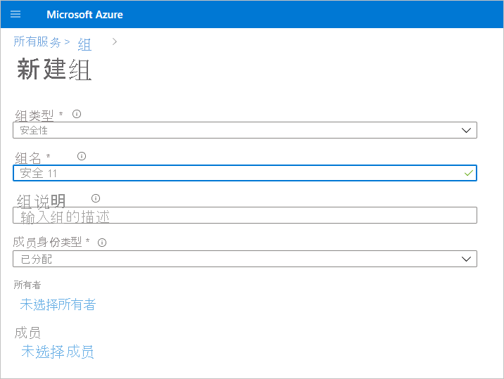
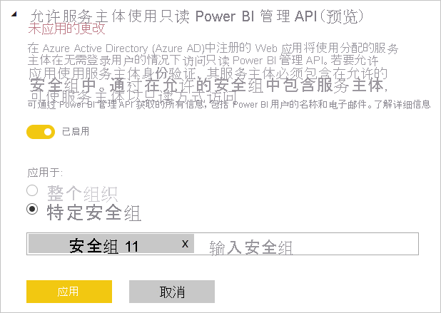

# 为只读管理员 API 启用服务主体身份验证（预览）

服务主体是一种身份验证方法，可用于让 Azure Active Directory (Azure AD) 应用程序访问 Power BI 服务内容和 API。
在 Azure AD 应用创建后，[服务主体对象](https://docs.microsoft.com/azure/active-directory/develop/app-objects-and-service-principals#service-principal-object)也随之创建。 借助服务主体对象（亦简称为“服务主体”），Azure AD 可以对应用进行身份验证。 经过身份验证后，应用程序可以访问 Azure AD 租户资源。

## 方法

若要为 Power BI 只读 API 启用服务主体身份验证，请执行以下步骤：

1. [创建 Azure AD 应用](https://docs.microsoft.com/azure/active-directory/develop/howto-create-service-principal-portal)。 如果你已经具有要使用的 Azure AD 应用，可以跳过此步骤。 请记下应用 Id，以便执行后续步骤。 
2. 在 Azure Active Directory 中创建“安全组”。 [阅读有关如何使用 Azure Active Directory 创建基本组和添加成员的详细信息](https://docs.microsoft.com/azure/active-directory/fundamentals/active-directory-groups-create-azure-portal)。 如果你已有想要使用的安全组，则可以跳过此步骤。
    请确保选择“安全”作为组类型。

    

3. 将你的应用 Id 添加为你创建的安全组的成员。 为此，请执行以下操作：
    1. 导航到“Azure 门户”>“Azure Active Directory”>“组”，然后选择在步骤 2 中创建的安全组。
    1. 选择“添加成员”。
    注意:请确保使用的应用在 Azure 门户中没有设置任何 Power BI 管理员角色。 若要检查此内容： 
       * 以“全局管理员”、“应用程序管理员”或“云应用程序管理员”身份登录到“Azure 门户”。 
        * 依次选择“Azure Active Directory”和“企业应用程序”。 
        * 选择要向其授予访问 Power BI 权限的应用程序。 
        * 选择“权限”。 请确保此应用程序上没有 Power BI 的管理员同意要求的权限集。 有关详细信息，请参阅[管理应用程序的许可和评估同意请求](https://docs.microsoft.com/azure/active-directory/manage-apps/manage-consent-requests)。 
4. 启用 Power BI 服务管理设置。 要执行此操作：
    1. 登录到 Power BI 管理门户。 你需要成为 Power BI 管理员才能看到“租户设置”页。
    1. 在“管理员 API 设置”下，你将看到“允许服务主体使用只读 Power BI 管理员 API (预览)” 。 将“切换”设置为“已启用”，然后选择“特定的安全组”单选按钮，并将在步骤 2 中创建的安全组添加到其下方显示的文本字段中，如下图所示。

        

 5. 开始使用只读管理员 API。 请参阅以下有关受支持 API 的列表。

    >[!IMPORTANT]
    >在使服务主体可用于 Power BI 后，应用程序的 Azure AD 权限将不再有效。 然后，将通过 Power BI 管理门户管理应用程序权限。

## 注意事项和限制
* 无法使用服务主体登录 Power BI 门户。
* 若要在 Power BI 管理门户的“管理员 API 设置”中启用服务主体，需具有 Power BI 管理员权限。
* 服务主体当前支持以下 API：
    * [GetGroupsAsAdmin](https://docs.microsoft.com/rest/api/power-bi/admin/groups_getgroupsasadmin) 与仪表板、数据集、报表和数据流的 $expand 
    * [GetDashboardsAsAdmin](https://docs.microsoft.com/rest/api/power-bi/admin/dashboards_getdashboardsasadmin) 与 $expand 磁贴
    * [GetDatasourcesAsAdmin](https://docs.microsoft.com/rest/api/power-bi/admin/datasets_getdatasourcesasadmin) 
    * [GetDatasetToDataflowsLinksAsAdmin](https://docs.microsoft.com/rest/api/power-bi/admin/datasets_getdatasettodataflowslinksingroupasadmin)
    * [GetDataflowDatasourcesAsAdmin](https://docs.microsoft.com/rest/api/power-bi/admin/dataflows_getdataflowdatasourcesasadmin) 
    * [GetDataflowUpstreamDataflowsAsAdmin](https://docs.microsoft.com/rest/api/power-bi/admin/dataflows_getupstreamdataflowsingroupasadmin) 
    * [GetCapacitiesAsAdmin](https://docs.microsoft.com/rest/api/power-bi/admin/getcapacitiesasadmin)
    * [GetActivityLog](https://docs.microsoft.com/rest/api/power-bi/admin/getactivityevents)
    * [GetModifiedWorkspaces](https://docs.microsoft.com/rest/api/power-bi/admin/workspaceinfo_getmodifiedworkspaces)
    * [WorkspaceGetInfo](https://docs.microsoft.com/rest/api/power-bi/admin/workspaceinfo_postworkspaceinfo)
    * [WorkspaceScanStatus](https://docs.microsoft.com/rest/api/power-bi/admin/workspaceinfo_getscanstatus)
    * [WorkspaceScanResult](https://docs.microsoft.com/rest/api/power-bi/admin/workspaceinfo_getscanresult)
