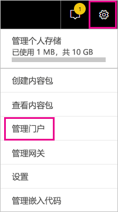
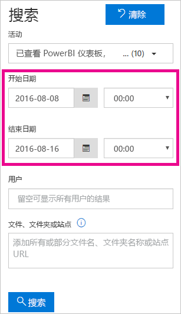
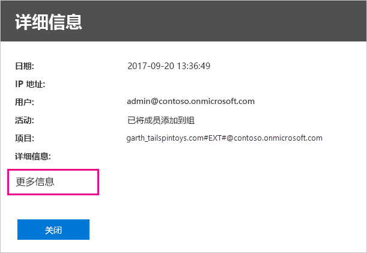

# <a name="track-user-activities-in-power-bi"></a>跟踪 Power BI 中的用户活动

了解 Power BI 租户中谁正在对何项目执行何种操作对帮助组织满足其需求非常关键，如满足法规遵从性和记录管理需求。 使用 Power BI，可以通过两个选项来跟踪用户活动：[Power BI 活动日志](#use-the-activity-log)和[统一审核日志](#use-the-audit-log)。 这些日志都包含 [Power BI 审核数据](#operations-available-in-the-audit-and-activity-logs)的完整副本，但有几个重要区别，如下表所概括。

| **统一审核日志** | **Power BI 活动日志** |
| --- | --- |
| 除了 Power BI 审核事件外，还包括来自 SharePoint Online、Exchange Online、Dynamics 365 和其他服务的事件。 | 仅包括 Power BI 审核事件。 |
| 只有具有仅查看审核日志或审核日志权限的用户才有访问权限，例如全局管理员和审核员。 | 全局管理员和 Power BI 服务管理员具有访问权限。 |
| 全局管理员和审核员可以使用 Microsoft 365 安全中心和 Microsoft 365 合规中心搜索统一审核日志。 | 目前还没有用于搜索活动日志的用户界面。 |
| 全局管理员和审核员可以使用 Microsoft 365 管理 API 和 cmdlet 下载审核日志条目。 | 全局管理员和 Power BI 服务管理员可以使用 Power BI REST API 和管理 cmdlet 下载活动日志条目。 |
| 审核数据可保留 90 天 | 活动数据可保留 30 天（公共预览）。 |
| 即使租户移动到其他 Azure 区域，也要保留审核数据。 | 当租户移到其他 Azure 区域时，不保留活动数据。 |


## <a name="use-the-activity-log"></a>使用活动日志

> [!NOTE]
> Microsoft 云 Deutschland 不支持活动日志记录。 有关德国云的服务限制的详细信息，请参阅[适用于德国云客户的 Power BI 常见问题解答](service-govde-faq.md)。


作为 Power BI 服务管理员，你可以使用基于 Power BI 活动日志的自定义报表来分析租户级别的所有 Power BI 资源的使用情况。 可以使用 REST API 或 PowerShell cmdlet 来下载活动。 还可以按日期范围、用户和活动类型筛选活动数据。

### <a name="activity-log-requirements"></a>活动日志要求

必须满足以下要求才能访问 Power BI 活动日志：

- 必须是全局管理员或 Power BI 服务管理员。
- 你已在本地安装了 [Power BI 管理 cmdlet](https://www.powershellgallery.com/packages/MicrosoftPowerBIMgmt) 或在 Azure Cloud Shell 中使用 Power BI 管理 cmdlet。

### <a name="activityevents-rest-api"></a>ActivityEvents REST API

可以使用基于 Power BI REST API 的管理应用程序将活动事件导出到 blob 存储或 SQL 数据库中。 然后，你可以基于导出的数据生成自定义使用情况报表。 在 ActivityEvents REST API 调用中，必须指定开始日期和结束日期，还可以选择使用筛选器按活动类型或用户 ID 选择活动。 由于活动日志可能包含大量数据，因此 ActivityEvents API 目前仅支持每个请求最多下载一天的数据。 换句话说，开始日期和结束日期必须指定为同一天，如以下示例所示。 请确保以 UTC 格式指定日期时间值。

```
https://api.powerbi.com/v1.0/myorg/admin/activityevents?startDateTime='2019-08-31T00:00:00'&endDateTime='2019-08-31T23:59:59'
```

如果条目数太大，则 ActivityEvents API 只返回约 5,000 到 10,000 个条目和一个继续标记。 使用继续标记再次调用 ActivityEvents API 以获取下一批条目，依此类推，直到检索到所有条目，并且不再收到继续标记。 以下示例演示如何使用继续标记。

```
https://api.powerbi.com/v1.0/myorg/admin/activityevents?continuationToken='%2BRID%3ARthsAIwfWGcVAAAAAAAAAA%3D%3D%23RT%3A4%23TRC%3A20%23FPC%3AARUAAAAAAAAAFwAAAAAAAAA%3D'
```

无论返回的条目数为多少，如果结果包含继续标记，请确保再次使用该标记调用该 API 以检索剩余数据，直到不再返回继续标记。 可能会出现以下情况，调用甚至会返回不包含任何事件条目的继续标记。 以下示例演示如何使用响应中返回的继续标记进行循环操作：

```
while(response.ContinuationToken != null)
{
   // Store the activity event results in a list for example
    completeListOfActivityEvents.AddRange(response.ActivityEventEntities);

    // Make another call to the API with continuation token
    response = GetPowerBIActivityEvents(response.ContinuationToken)
}
completeListOfActivityEvents.AddRange(response.ActivityEventEntities);
```
> [!NOTE]
> 最多 24 小时就会显示所有事件，但完整数据通常更快可用。
>
>
若要详细了解如何使用 Power BI REST API（包括有关如何获取审核活动事件的示例），请参阅 Power BI REST API 参考文档中的[管理员 - 获取活动事件](/rest/api/power-bi/admin/getactivityevents)。

### <a name="get-powerbiactivityevent-cmdlet"></a>Get-PowerBIActivityEvent cmdlet

使用适用于 PowerShell 的 Power BI 管理 cmdlet 下载活动事件。 Get-PowerBIActivityEvent cmdlet 会自动为你处理继续标记。 PowerBIActivityEvent cmdlet 使用与 ActivityEvents REST API 具有相同限制的 StartDateTime 和 EndDateTime 参数 。 换句话说，开始日期和结束日期必须引用相同的日期值，因为一次只能检索一天的活动数据。

以下脚本演示如何下载所有 Power BI 活动。 此命令将来自 JSON 的结果转换为 .NET 对象，以便轻松访问单个活动属性。 这些示例显示了一天可能的最小和最大时间戳，以确保不遗漏任何事件。

```powershell
Login-PowerBI

$activities = Get-PowerBIActivityEvent -StartDateTime '2019-08-31T00:00:00' -EndDateTime '2019-08-31T23:59:59' | ConvertFrom-Json

$activities.Count
$activities[0]

```

### <a name="filter-activity-data"></a>筛选活动数据

你可以按活动类型和用户 ID 筛选活动事件。 以下脚本演示如何仅下载 ViewDashboard 活动的事件数据。 有关受支持参数的其他信息，请使用命令 `Get-Help Get-PowerBIActivityEvent`。

```powershell
Login-PowerBI

$activities = Get-PowerBIActivityEvent -StartDateTime '2019-08-31T00:00:00' -EndDateTime '2019-08-31T23:59:59' -ActivityType 'ViewDashboard' | ConvertFrom-Json

$activities.Count
$activities[0]

```

> [!NOTE]
> PowerShell 示例可帮助你了解如何筛选和检索 Power BI 活动日志事件。 有关详细信息，请参阅[访问 Power BI 活动日志](../guidance/admin-activity-log.md)。

## <a name="use-the-audit-log"></a>使用审核日志

如果你的任务是跟踪 Power BI 和 Microsoft 365 中的用户活动，请在 Office 365 安全与合规中心进行审核，或使用 PowerShell。 审核依赖于 Exchange Online 中的功能，该功能可自动进行预配以支持 Power BI。

可按日期范围、用户、仪表板、报表、数据集和活动类型筛选审核数据。 还可将活动下载到 CSV（逗号分隔值）文件供脱机分析。

### <a name="audit-log-requirements"></a>审核日志要求

必须满足以下要求才能访问审核日志：

- 必须成为全局管理员或在 Exchange Online 中分配有“审核日志”或“仅查看审核日志”角色才能访问审核日志。 默认情况下，会在 Exchange 管理中心的“权限”页上为“符合性管理”和“组织管理”角色组分配这些角色。 有关可查看审核日志的角色的详细信息，请参阅[搜索审核日志的要求](/microsoft-365/compliance/search-the-audit-log-in-security-and-compliance?view=o365-worldwide#requirements-to-search-the-audit-log)。

    若要为非管理员帐户提供访问审核日志的权限，请将该用户添加为其中一个角色组的成员。 如果要以另一种方式执行此操作，可以在 Exchange 管理中心中创建自定义角色组、将“审核日志”或“仅查看审核日志”角色分配给此组，然后将非管理员帐户添加到新角色组。 有关详细信息，请参阅[在 Exchange Online 中管理角色组](/Exchange/permissions-exo/role-groups)。

    如果无法从 Microsoft 365 管理中心访问 Exchange 管理中心，请转到 https://outlook.office365.com/ecp 并使用你的凭据登录。

- 如果你有权访问审核日志，但却不是全局管理员或 Power BI 服务管理员，则你将无法转到 Power BI 管理员门户。 在这种情况下，请使用 [Office 365 安全与合规中心](https://sip.protection.office.com/#/unifiedauditlog)的直接链接。

### <a name="access-your-audit-logs"></a>访问审核日志

若要访问日志，请先确保在 Power BI 中启用日志记录。 有关详细信息，请参阅管理门户文档中的[审核日志](service-admin-portal.md#audit-logs)。 启用审核的时间与可查看审核数据的时间之间最多有 48 小时的延迟。 如果无法立即查看数据，请稍后检查审核日志。 获取查看审核日志的权限和得以访问日志之间也存在类似的延迟。

可直接通过 [Office 365 安全与合规中心](https://sip.protection.office.com/#/unifiedauditlog)访问 Power BI 审核日志。 此外，Power BI 管理门户中也有对应的链接：

1. 在 Power BI 中，依次选择右上角的齿轮图标和“管理门户”。

   

1. 选择“审核日志”。

1. 选择“转到 Microsoft 365 管理中心”。

   

### <a name="search-only-power-bi-activities"></a>仅搜索 Power BI 活动

若要让搜索结果中仅包含 Power BI 活动，请按以下步骤操作。 有关活动列表，请参阅本文稍后介绍的 [Power BI 审核的活动](#operations-available-in-the-audit-and-activity-logs)列表。

1. 在“审核日志搜索”页上，选择“搜索”下的“活动”下拉列表。

2. 选择“Power BI 活动”。

   

3. 选择选框外任意位置以将其关闭。

搜索将仅返回 Power BI 活动。

### <a name="search-the-audit-logs-by-date"></a>按日期搜索审核日志

使用“开始日期”和“结束日期”字段，可按日期范围搜索日志。 默认选择为“过去七天”。 屏幕以协调世界时 (UTC) 格式显示日期和时间。 可以指定的最大日期范围为 90 天。 

如果所选日期范围大于 90 天，将收到错误。 如果使用最大日期范围 90 天，请选择当前时间作为“开始日期”。 否则将收到错误，提醒开始日期早于结束日期。 如果是在过去 90 天内启用审核，日期范围的开始日期不得早于审核启用日期。



### <a name="search-the-audit-logs-by-users"></a>按用户搜索审核日志

可搜索特定用户所执行活动的审核日志条目。 请在“用户”字段中输入一个或多个用户名。 用户名外观类似电子邮件地址。 这是用户登录 Power BI 所使用的帐户。 将此框留空以返回组织中所有用户（和服务帐户）的条目。


### <a name="view-search-results"></a>查看搜索结果

选择“搜索”后，将加载搜索结果。 几分钟后，它们将在“结果”下显示。 搜索完成后，屏幕将显示找到的结果数。 “审核日志搜索”最多显示 1000 个事件。 如果符合搜索条件的事件超过 1000 个，则应用显示最新的 1000 个事件。

#### <a name="view-the-main-results"></a>查看主要结果

“结果”区域包含搜索功能返回的每个事件的以下信息。 选择“结果”下的列标题，即可对结果进行排序。

| **列** | **定义** |
| --- | --- |
| 日期 |事件发生的日期和时间（UTC 格式）。 |
| IP 地址 |用于记录活动的设备的 IP 地址。 应用以 IPv4 或 IPv6 地址格式显示 IP 地址。 |
| 用户 |执行触发该事件的操作的用户（或服务帐户）。 |
| 活动 |用户执行的活动。 此值对应于你在“活动”下拉列表中选择的活动。 对于来自于 Exchange 管理审核日志的事件，此列中的值为 Exchange cmdlet。 |
| 项 |因相应活动而创建或修改的对象。 例如，查看或修改过的文件，或更新的用户帐户。 并非所有活动在此列中都具有值。 |
| 详细信息 |有关活动的其他详细信息。 同样，并非所有活动都具有此值。 |

#### <a name="view-the-details-for-an-event"></a>查看活动的详细信息

要查看有关该事件的更多详细信息，请在搜索结果列表中选择事件记录。 随后会显示“详细信息”页，其中包含事件记录中的详细属性。 “详细信息”页根据在其中发生事件的 Microsoft 365 服务来显示属性。

若要查看这些详细信息，请选择“更多信息”。 所有 Power BI 条目的 RecordType 属性值均为 20。 若要了解其他属性，请参阅[审核日志中的详细属性](/office365/securitycompliance/detailed-properties-in-the-office-365-audit-log/)。

   

### <a name="export-search-results"></a>导出搜索结果

若要将 Power BI 审核日志导出为 CSV 文件，请按以下步骤操作。

1. 选择“导出结果”。

1. 选择“保存已加载结果”或“下载所有结果”。

    

### <a name="use-powershell-to-search-audit-logs"></a>使用 PowerShell 搜索审核日志

也可以使用 PowerShell 根据登录名来访问审核日志。 下面的示例展示了如何连接到 Exchange Online PowerShell，然后使用 [Search-UnifiedAuditLog](/powershell/module/exchange/policy-and-compliance-audit/search-unifiedauditlog?view=exchange-ps/) 命令拉取 Power BI 审核日志条目。 要运行该脚本，管理员必须给你分配相应的权限，如[审核日志要求](#audit-log-requirements)部分中所述。

```powershell
Set-ExecutionPolicy RemoteSigned

$UserCredential = Get-Credential

$Session = New-PSSession -ConfigurationName Microsoft.Exchange -ConnectionUri https://outlook.office365.com/powershell-liveid/ -Credential $UserCredential -Authentication Basic -AllowRedirection

Import-PSSession $Session
Search-UnifiedAuditLog -StartDate 9/11/2018 -EndDate 9/15/2018 -RecordType PowerBI -ResultSize 1000 | Format-Table | More
```

### <a name="use-powershell-to-export-audit-logs"></a>使用 PowerShell 导出审核日志

还可以使用 PowerShell 导出审核日志搜索的结果。 以下示例演示如何通过 [Search-UnifiedAuditLog](/powershell/module/exchange/policy-and-compliance-audit/search-unifiedauditlog?view=exchange-ps/) 命令进行发送以及如何使用 [Export-Csv](/powershell/module/microsoft.powershell.utility/export-csv) cmdlet 导出结果。 要运行该脚本，管理员必须给你分配相应的权限，如[审核日志要求](#audit-log-requirements)部分中所述。

```powershell
$UserCredential = Get-Credential

$Session = New-PSSession -ConfigurationName Microsoft.Exchange -ConnectionUri https://outlook.office365.com/powershell-liveid/ -Credential $UserCredential -Authentication Basic -AllowRedirection

Import-PSSession $Session
Search-UnifiedAuditLog -StartDate 9/11/2019 -EndDate 9/15/2019 -RecordType PowerBI -ResultSize 5000 |
Export-Csv -Path "c:\temp\PowerBIAuditLog.csv" -NoTypeInformation

Remove-PSSession $Session
```

有关连接到 Exchange Online 的详细信息，请参阅[连接到 Exchange Online PowerShell](/powershell/exchange/exchange-online/connect-to-exchange-online-powershell/connect-to-exchange-online-powershell/)。 有关展示了如何对审核日志使用 PowerShell 的其他示例，请参阅[使用 Power BI 审核日志和 PowerShell 分配 Power BI Pro 许可证](https://powerbi.microsoft.com/blog/using-power-bi-audit-log-and-powershell-to-assign-power-bi-pro-licenses/)。

## <a name="operations-available-in-the-audit-and-activity-logs"></a>审核和活动日志中可用的操作

审核和活动日志中均提供以下操作。

| 友好名称                                     | 操作名称                              | 备注                                  |
|---------------------------------------------------|---------------------------------------------|------------------------------------------|
| 已访问 Excel 中的 Power BI 精选表 | AnalyzedByExternalApplication |    |
| 已将数据源添加到 Power BI 网关             | AddDatasourceToGateway                      |                                          |
| 已添加 Power BI 文件夹访问权限                      | AddFolderAccess                             | 当前未使用                       |
| 已添加 Power BI 组成员                      | AddGroupMembers                             |                                          |
| 管理员已将数据流存储帐户附加到租户 | AdminAttachedDataflowStorageAccountToTenant | 当前未使用                       |
| 已分析 Power BI 数据集                         | AnalyzedByExternalApplication               | 用户与服务进行交互时生成                                         |
| 已分析 Power BI 报表                          | AnalyzeInExcel                              |                                          |
| 已将工作区分配到部署管道                          | AssignWorkspaceToPipeline                              |                                          |
| 附加的数据流存储帐户                 | AttachedDataflowStorageAccount              |                                          |
| 将 Power BI 数据集绑定到网关                | BindToGateway                               |                                          |
| 已取消的数据流刷新                        | CancelDataflowRefresh                       |                                          |
| 已更改容量状态                            | ChangeCapacityState                         |                                          |
| 已更改容量用户分配                  | UpdateCapacityUsersAssignment               |                                          |
| 已更改 Power BI 数据集连接              | SetAllConnections                           |                                          |
| 已更改 Power BI 网关管理员                   | ChangeGatewayAdministrators                 |                                          |
| 已更改 Power BI 网关数据源用户        | ChangeGatewayDatasourceUsers                |                                          |
| 已创建组织的自定义视觉对象                          | InsertOrganizationalGalleryItem                                |                                          |
| 已创建组织的 Power BI 内容包      | CreateOrgApp                                |                                          |
| 已创建部署管道      | CreateAlmPipeline                                |                                          |
| 已创建 Power BI 应用                              | CreateApp                                   |                                          |
| 已创建 Power BI 仪表板                        | CreateDashboard                             |                                          |
| 已创建 Power BI 数据流                         | CreateDataflow                              |                                          |
| 已创建 Power BI 数据集                          | CreateDataset                               |                                          |
| 已创建 Power BI 电子邮件订阅               | CreateEmailSubscription                     |                                          |
| 已创建 Power BI 文件夹                           | CreateFolder                                |                                          |
| 已创建 Power BI 网关                          | CreateGateway                               |                                          |
| 已创建 Power BI 组                            | CreateGroup                                 |                                          |
| 已创建 Power BI 报表                           | CreateReport <sup>1</sup>                                |                                          |
| 自定义视觉对象请求的 Azure AD 访问令牌                           | GenerateCustomVisualAADAccessToken                                |                                          |
| 自定义视觉对象请求的 Office Web 应用访问令牌                           | GenerateCustomVisualWACAccessToken                                |                                          |
| 已迁移到外部存储帐户的数据流     | DataflowMigratedToExternalStorageAccount    | 当前未使用                       |
| 已添加的数据流权限                        | DataflowPermissionsAdded                    | 当前未使用                       |
| 已删除的数据流权限                      | DataflowPermissionsRemoved                  | 当前未使用                       |
| 已删除组织的自定义视觉对象     | DeleteOrganizationalGalleryItem                                |                                          |
| 已删除部署管道      | DeleteAlmPipeline                                |                                          |
| 已删除组织的 Power BI 内容包      | DeleteOrgApp                                |                                          |
| 已删除 Power BI 注释                          | DeleteComment                               |                                          |
| 已删除 Power BI 仪表板                        | DeleteDashboard                             | 当前未使用                       |
| 已删除 Power BI 数据流                         | DeleteDataflow                              | 当前未使用                       |
| 已删除 Power BI 数据集                          | DeleteDataset                               |                                          |
| 已删除 Power BI 电子邮件订阅               | DeleteEmailSubscription                     |                                          |
| 已删除 Power BI 文件夹                           | DeleteFolder                                |                                          |
| 已删除 Power BI 文件夹访问权限                    | DeleteFolderAccess                          | 当前未使用                       |
| 已删除 Power BI 网关                          | DeleteGateway                               |                                          |
| 已删除 Power BI 组                            | DeleteGroup                                 |                                          |
| 已删除 Power BI 报表                           | DeleteReport                                |                                          |
| 已部署到管道阶段                           | DeployAlmPipeline                                |                                          |
| 已发现 Power BI 数据集数据源          | GetDatasources                              |                                          |
| 已下载 Power BI 报表                        | DownloadReport                              |                                          |
| 已编辑的数据流属性                        | EditDataflowProperties                      |                                          |
| 已编辑 Power BI 认证权限          | EditCertificationPermission                 | 当前未使用                       |
| 已编辑 Power BI 仪表板                         | EditDashboard                               | 当前未使用                       |
| 已编辑 Power BI 数据集                           | EditDataset                                 |                                          |
| 已编辑 Power BI 数据集属性                | EditDatasetProperties                       | 当前未使用                       |
| 已编辑 Power BI 报表                            | EditReport                                  |                                          |
| 已导出 Power BI 数据流                        | ExportDataflow                              |                                          |
| 已导出 Power BI 报表可视化数据              | ExportReport                                |                                          |
| 已导出 Power BI 磁贴数据                       | ExportTile                                  |                                          |
| 无法添加数据流权限                | FailedToAddDataflowPermissions              | 当前未使用                       |
| 无法删除数据流权限             | FailedToRemoveDataflowPermissions           | 当前未使用                       |
| 已生成 Power BI 数据流 SAS 令牌             | GenerateDataflowSasToken                    |                                          |
| 已生成 Power BI 嵌入令牌                    | GenerateEmbedToken                          |                                          |
| 生成屏幕截图                       | GenerateScreenshot |                     |
| 已将文件导入到 Power BI                         | 导入                                      |                                          |
| 已安装 Power BI 应用                            | InstallApp                                  |                                          |
| 已将工作区迁移到容量                  | MigrateWorkspaceIntoCapacity                |                                          |
| 已发布 Power BI 注释                           | PostComment                                 |                                          |
| 已打印 Power BI 仪表板                        | PrintDashboard                              |                                          |
| 已打印 Power BI 报表页                      | PrintReport                                 |                                          |
| 已将 Power BI 报表发布到 Web                  | PublishToWebReport <sup>2</sup>                         |                                          |
| 已发布或更新精选表 | UpdateFeaturedTables <sup>3</sup>   | |
| 已从 Key Vault 接收 Power BI 数据流机密  | ReceiveDataflowSecretFromKeyVault           |                                          |
| 已从部署管道中删除工作区         | UnassignWorkspaceFromPipeline                 |                                          |
| 已从 Power BI 网关删除数据源         | RemoveDatasourceFromGateway                 |                                          |
| 已删除 Power BI 组成员                    | DeleteGroupMembers                          |                                          |
| 已从容量中删除工作区                 | RemoveWorkspacesFromCapacity                |                                          |
| 已重命名 Power BI 仪表板                        | RenameDashboard                             |                                          |
| 已请求 Power BI 数据流刷新               | RequestDataflowRefresh                      | 当前未使用                       |
| 已请求 Power BI 数据集刷新                | RefreshDataset                              |                                          |
| 已检索 Power BI 工作区                     | GetWorkspaces                               |                                          |
| 已应用敏感度标签                         | SensitivityLabelApplied                     |                                          |
| 已更改敏感度标签                         | SensitivityLabelChanged                     |                                          |
| 已删除敏感度标签                         | SensitivityLabelRemoved                     |                                          |
| 设置工作区的数据流存储位置     | SetDataflowStorageLocationForWorkspace      |                                          |
| 在 Power BI 数据流上设置计划刷新        | SetScheduledRefreshOnDataflow               |                                          |
| 在 Power BI 数据集上设置计划刷新         | SetScheduledRefresh                         |                                          |
| 已共享 Power BI 仪表板                         | ShareDashboard                              |                                          |
| 已共享 Power BI 报表                            | ShareReport                                 |                                          |
| 已启动 Power BI 延期试用版                   | OptInForExtendedProTrial                    | 当前未使用                       |
| 已启动 Power BI 免费试用版                            | OptInForProTrial                            |                                          |
| 已接管 Power BI 数据源                   | TakeOverDatasource                          |                                          |
| 已接管 Power BI 数据集                        | TakeOverDataset                             |                                          |
| 已接管 Power BI 数据流                     | TookOverDataflow                             |                                          |
| 未发布 Power BI 应用                          | UnpublishApp                                |                                          |
| 更新容量资源管理设置      | UpdateCapacityResourceGovernanceSettings    | 目前不在 Microsoft 365 管理中心 |
| 已上传组织的自定义视觉对象                     | UpdateOrganizationalGalleryItem                   |                                          |
| 已更新容量管理员                            | UpdateCapacityAdmins                        |                                          |
| 已更新容量显示名称                     | UpdateCapacityDisplayName                   |                                          |
| 已更新数据流存储分配权限   | UpdatedDataflowStorageAssignmentPermissions |                                          |
| 已更新部署管道访问   | UpdateAlmPipelineAccess |                                          |
| 已更新部署管道配置   | SetConfigurationAlmPipeline |                                          |
| 已更新组织的 Power BI 设置          | UpdatedAdminFeatureSwitch                   |                                          |
| 已更新 Power BI 应用                              | UpdateApp                                   |                                          |
| 已更新 Power BI 数据流                         | UpdateDataflow                              |                                          |
| 已更新 Power BI 数据集数据源             | UpdateDatasources                           |                                          |
| 已更新 Power BI 数据集参数               | UpdateDatasetParameters                     |                                          |
| 已更新 Power BI 电子邮件订阅               | UpdateEmailSubscription                     |                                          |
| 已更新 Power BI 文件夹                           | UpdateFolder                                |                                          |
| 已更新 Power BI 文件夹访问权限                    | UpdateFolderAccess                          |                                          |
| 已更新 Power BI 网关数据源凭据  | UpdateDatasourceCredentials                 |                                          |
| 已查看 Power BI 仪表板                         | ViewDashboard                               |                                          |
| 已查看 Power BI 数据流                          | ViewDataflow                                |                                          |
| 已查看 Power BI 报表                            | ViewReport                                  |                                          |
| 已查看 Power BI 磁贴                              | ViewTile                                    |                                          |
| 已查看 Power BI 使用情况指标                     | ViewUsageMetrics                            |                                          |
|                                                   |                                             |                                          |

<sup>1</sup> 从 Power BI Desktop 发布到服务是服务中的一个 CreateReport 事件。

<sup>2</sup> PublishtoWebReport 是指[发布到 Web](../collaborate-share/service-publish-to-web.md) 功能。

<sup>3</sup> UpdateFeaturedTables 是指 [Excel 中的 Power BI 精选表](../collaborate-share/service-excel-featured-tables.md)。

## <a name="next-steps"></a>后续步骤

- [什么是 Power BI 管理？](service-admin-administering-power-bi-in-your-organization.md)
- [Power BI 管理门户](service-admin-portal.md)
- [访问 Power BI 活动日志](../guidance/admin-activity-log.md)
- 是否有任何问题? [尝试咨询 Power BI 社区](https://community.powerbi.com/)
- 建议？ [提出改进 Power BI 的想法](https://ideas.powerbi.com/)