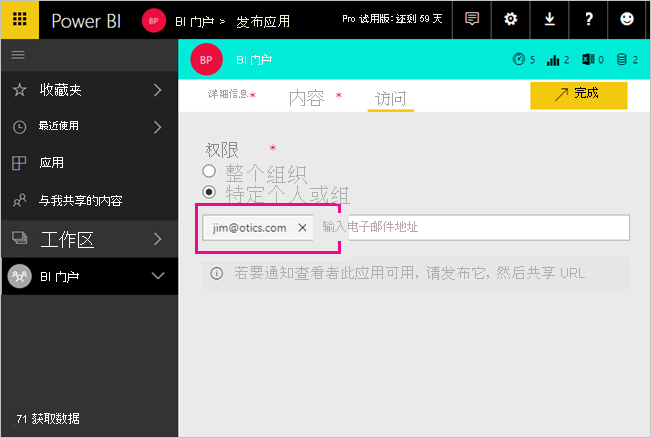
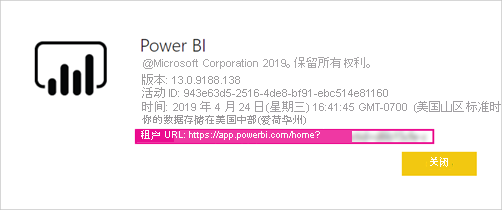

# 使用 Azure AD B2B 将 Power BI 内容分发给外部来宾用户

Power BI 允许通过 Azure Active Directory 企业到企业 (Azure AD B2B) 与外部来宾用户共享内容。 使用 Azure AD B2B，你的组织可以在一个中心位置启用和管理与外部用户的共享。 默认情况下，外部来宾具有仅限使用的体验。 另外，你还可以使组织外部的来宾用户能够编辑和管理组织内的内容。

本文对 Power BI 中的 Azure AD B2B 进行了基本介绍。 有关详细信息，请参阅[使用 Azure Active Directory B2B 将 Power BI 内容分发给外部来宾用户](../guidance/whitepaper-azure-b2b-power-bi.md)。

## 启用访问权限

邀请来宾用户前，请务必先在 Power BI 管理门户中启用[与外部用户共享内容](service-admin-portal.md#export-and-sharing-settings)功能。 即使启用了此选项，也必须向用户授予 Azure Active Directory 中的来宾邀请者角色才能邀请来宾用户。

通过[允许外部来宾用户编辑和管理组织中内容](service-admin-portal.md#allow-external-guest-users-to-edit-and-manage-content-in-the-organization)的选项，可以让来宾用户能够在工作区中查看和创建内容，包括浏览组织的 Power BI。

> [!NOTE]
> [与外部用户共享内容](service-admin-portal.md#export-and-sharing-settings)设置控制 Power BI 是否允许邀请外部用户加入组织。 外部用户接受邀请后，就会成为你组织中的 Azure AD B2B 来宾用户。 他们会在整个 Power BI 体验中显示在人员选取器中。 如果禁用了此设置，组织中的现有来宾用户将继续访问他们已有权访问的任何项目，并继续在人员选取器体验中列出。 此外，如果来宾是通过[计划内邀请](#planned-invites)方法添加的，则他们也会出现在人员选取器中。 若要阻止来宾用户访问 Power BI，可使用 Azure AD 条件访问策略。

## 可以邀请哪些用户？

来宾用户邀请支持大多数电子邮件地址，包括个人电子邮件帐户，如 gmail.com、outlook.com 和 hotmail.com。 Azure AD B2B 将这些地址称为“社交标识”。

不能邀请与政府云服务（如 [Power BI for US Government](service-govus-overview.md)）关联的用户。

## 邀请来宾用户

只有在首次邀请来宾用户加入组织时才需要发出邀请。 若要邀请用户，请使用计划的邀请或临时邀请。

若要使用临时邀请，请使用以下功能：

* 报表和仪表板共享
* 应用访问列表

工作区访问列表中不支持临时邀请。 使用[计划的邀请方法](#planned-invites)将这些用户添加到组织。 当外部用户成为组织中的来宾后，将其添加到工作区访问列表。

### 计划性邀请

如果确定要邀请哪些用户，请使用计划内邀请。 可通过 Azure 门户或 PowerShell 发送邀请。 必须分配有用户管理员角色，才能邀请用户。

若要在 Azure 门户中发送邀请，请按以下步骤操作。

1. 在[Azure 门户](https://portal.azure.com)中，选择“Azure Active Directory”。

1. 在“管理”下，选择“用户” > “所有用户” > “新建来宾用户”。

    

1. 输入“电子邮件地址”和“个人消息”。

    

1. 选择“邀请”。

若要邀请多个来宾用户，请使用 PowerShell 或在 Azure AD 中创建批量邀请。 若要使用 PowerShell 进行批量邀请，请按照[教程：使用 PowerShell 批量邀请 Azure AD B2B 协作用户](/azure/active-directory/b2b/bulk-invite-powershell/)中的步骤进行操作。 若要使用 Azure 门户进行批量邀请，请按照[教程：批量邀请 Azure AD B2B 协作用户](/azure/active-directory/b2b/tutorial-bulk-invite/)中的步骤进行操作。

来宾用户必须在他们收到的电子邮件邀请中选择“开始”。 然后就会将该来宾用户添加到组织。

### 临时邀请

通过共享功能将外部用户添加到仪表板或报表，或通过访问页面添加到应用，即可随时邀请外部用户。 以下示例说明邀请外部用户使用应用时要执行的操作。

该来宾用户将收到说明你已与其共享应用的电子邮件。

该来宾用户必须使用其组织电子邮件地址进行登录。 完成登录后，将收到接受邀请的提示。 登录后，将为来宾用户打开应用。 若要返回到应用，其应将链接设为书签或保存电子邮件。

## 许可

来宾用户必须拥有正确的授权，才能查看已共享的内容。 可使用以下三种方法来确保用户拥有正确的许可证：使用 Power BI Premium；分配 Power BI Pro 许可证；或使用来宾用户的 Power BI Pro 许可证。

[可在组织中编辑和管理内容的来宾用户](service-admin-portal.md#allow-external-guest-users-to-edit-and-manage-content-in-the-organization)需要 Power BI Pro 许可证才能向工作区提供内容或与他人共享内容。

### 使用 Power BI Premium

如果你将工作区分配到 [Power BI Premium 容量](service-premium-what-is.md)，来宾用户无需获取 Power BI Pro 许可证，即可使用应用。 使用 Power BI Premium 时，应用还可以利用其他功能（如加快刷新速率和大模型）。

### 向来宾用户分配 Power BI Pro 许可证

如果你向来宾用户分配来自组织的 Power BI Pro 许可证，来宾用户便能查看与他人共享的内容。 有关分配许可证的详细信息，请参阅[在“许可证”页上将许可证分配给用户](/office365/admin/manage/assign-licenses-to-users#assign-licenses-to-users-on-the-licenses-page)。 在将 Pro 许可证分配给来宾用户之前，请咨询[产品条款网站](https://www.microsoft.com/licensing/terms)，以确保符合与 Microsoft 达成的许可协议条款。

### 来宾用户拥有自己的 Power BI Pro 许可证

来宾用户可能已有通过其自己的组织分配给他们的 Power BI Pro 许可证。

## 可以编辑和管理内容的来宾用户

使用[允许外部来宾用户编辑和管理组织中的内容](service-admin-portal.md#allow-external-guest-users-to-edit-and-manage-content-in-the-organization)功能时，指定的来宾用户将获得对组织 Power BI 的其他访问权限。 经允许的来宾可看到其有权访问的任何内容，包括访问主页、浏览工作区、安装应用、查看自己在访问列表上的位置，以及向工作区提供内容。 还可以创建或成为使用新工作区体验的工作区管理员。 存在一些限制。 “注意事项和限制”部分列出了这些限制。

若要帮助经允许的来宾登录到 Power BI，请向其提供租户 URL。 要查找租户 URL，请执行以下步骤。

1. 在 Power BI 服务的标头菜单中，依次选择帮助图标 (?) 和“关于 Power BI”。

2. 查找“租户 URL”旁的值。 与允许访问的来宾用户共享租户 URL。

    

## 注意事项和限制

* 默认情况下，外部 Azure AD B2B 来宾仅限于使用内容。 外部 Azure AD B2B 来宾可以查看应用、仪表板、报表，导出数据以及为仪表板和报表创建电子邮件订阅。 他们无法访问工作区或发布自己的内容。 若要消除这些限制，可使用[允许外部来宾用户编辑和管理组织中的内容](service-admin-portal.md#allow-external-guest-users-to-edit-and-manage-content-in-the-organization)功能。

* 若要邀请来宾用户，需要 Power BI Pro 许可证。 Pro 试用版用户无法在 Power BI 中邀请来宾用户。

* 某些体验对[可以编辑和管理组织中内容的来宾用户](service-admin-portal.md#allow-external-guest-users-to-edit-and-manage-content-in-the-organization)不可用。 来宾用户需要使用 Power BI 服务来更新或发布报表，包括为上传 Power BI Desktop 文件获取数据。  不支持以下体验：
  * 从 Power BI Desktop 直接向 Power BI 服务发布
  * 来宾用户不能使用 Power BI Desktop 连接 Power BI 服务中的服务数据集
  * 绑定到 Microsoft 365 组的经典工作区
    * 来宾用户无法创建或成为这些工作区的管理员
    * 来宾用户可以是成员
  * 对于工作区访问列表，不支持发送临时邀请
  * 不支持来宾用户使用 Power BI Publisher for Excel
  * 来宾用户不能安装 Power BI Gateway，也不能将它连接到组织
  * 来宾用户不能安装发布到整个组织的应用
  * 来宾用户不能使用、创建、更新或安装组织内容包
  * 来宾用户不能使用“在 Excel 中分析”
  * 无法在评论中 @mentioned 来宾用户
  * 来宾用户不能使用订阅
  * 使用此功能的来宾用户应具有工作或学校帐户

* 使用社交标识的来宾用户会因登录限制受到更多限制。
  * 他们可以通过 Web 浏览器获取 Power BI 服务中的使用体验
  * 他们无法使用 Power BI 移动版应用
  * 他们将无法在需要使用工作或学校帐户的情况下登录

* 此功能当前不可用于 Power BI SharePoint Online 报表 Web 部件。

* 有一些 Azure Active Directory 设置可以限制外部来宾用户在整个组织范围内可以执行的操作。 这些设置也适用于你的 Power BI 环境。 以下文档探讨的设置为：
  * [管理外部协作设置](/azure/active-directory/b2b/delegate-invitations#configure-b2b-external-collaboration-settings)
  * [允许或阻止向特定组织中的 B2B 用户发送邀请](/azure/active-directory/b2b/allow-deny-list)
  * [使用条件访问允许或阻止访问](/azure/active-directory/conditional-access/concept-conditional-access-cloud-apps)

* 你可以将政府云中的内容（如 GCC）共享到外部商业云用户。 但是，来宾用户不能使用自己的许可证。 必须将内容存储在分配给 Premium 的容量中，才能启用访问。 或者，你可以将 Power BI Pro 许可证分配给来宾帐户。

* 国家/地区云（如德国或中国云实例）不支持在组织外部共享。 而是在组织中创建外部用户可以用来访问内容的用户帐户。

* 如果直接与来宾用户共享，Power BI 会向其发送一封包含链接的电子邮件。 若要避免发送电子邮件，请将来宾用户添加到安全组并共享到安全组。  

## 后续步骤

有关详细信息（包括行级别安全性的工作方式），请查看白皮书：[使用 Azure AD B2B 将 Power BI 内容分发给外部来宾用户](../guidance/whitepaper-azure-b2b-power-bi.md)。

若要了解 Azure AD B2B，请参阅[什么是 Azure AD B2B 协作？](/azure/active-directory/active-directory-b2b-what-is-azure-ad-b2b/)。