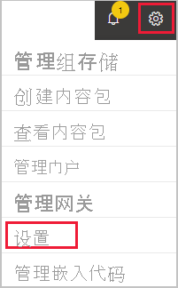
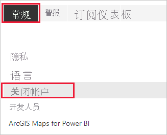
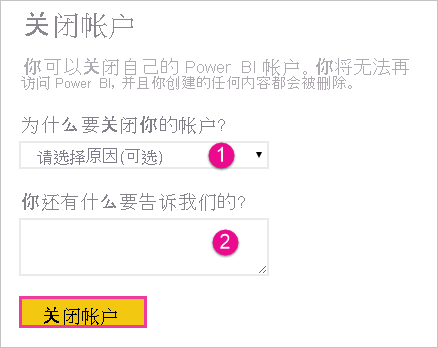

# 关闭 Power BI 帐户

如果不希望再使用 Power BI，可以关闭 Power BI 帐户。  关闭你的帐户后，将无法登录到 Power BI。 另外，根据 [Power BI 服务协议](https://azure.microsoft.com/support/legal/subscription-agreement/)中的数据保留策略，Power BI 会删除你上传或创建的任何客户数据。

## Power BI 个人用户

如果以个人身份注册 Power BI，可以在“设置”屏幕中关闭帐户。

1. 在 Power BI 中，依次选择右上角的齿轮图标和“设置”。

    

1. 在“常规”选项卡上，选择“关闭帐户”。

    

1. 选择关闭帐户的原因（图中的“1”）。 还可以提供更多信息（图中的“2”）。 然后选择**关闭帐户**。

    

1. 确认你要关闭帐户。

    

    应该会看到确认 Power BI 已关闭帐户的消息。 如有必要，可以从此处重新开启帐户。

    

## 托管用户

如果组织已为你注册 Power BI，请联系管理员。让他们取消向你的帐户分配许可证。

更多问题？ [尝试咨询 Power BI 社区](https://community.powerbi.com/)