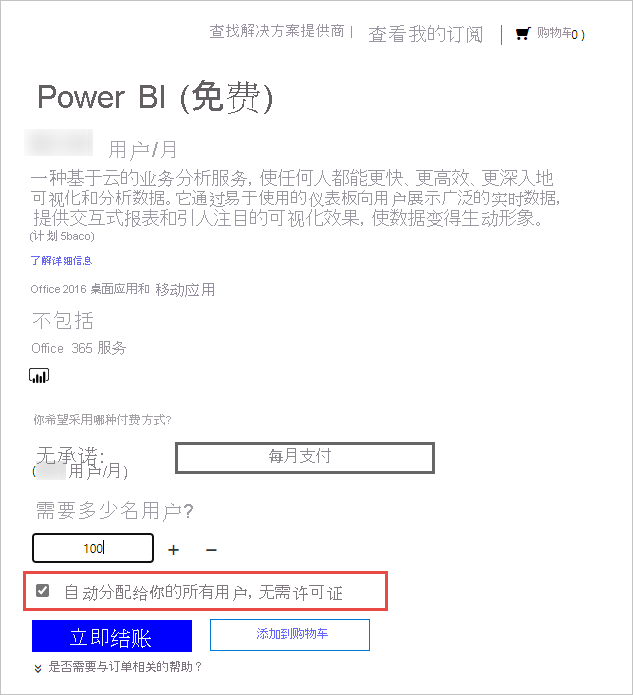

# 为组织中的用户授权 Power BI 服务

用户在 Power BI 服务中可以执行的操作取决于每位用户拥有的许可证类型。 而许可证提供的访问级别取决于要访问的工作区是否为 Premium 工作区。 Power BI 服务的所有用户都必须拥有许可证。

用户可以通过两种方式获取许可证。 使用自助注册功能及其工作或学校帐户，用户可以获得自己的 Pro 或 Premium Per User 许可证。 或者，管理员可以获取 Power BI 许可证并将许可证分配给用户。

本文从管理员角度重点介绍购买服务和用户个人许可。 要详细了解用户如何获取自己的许可证，请参阅[以个人身份注册 Power BI](../fundamentals/service-self-service-signup-for-power-bi.md)。

## 谁可以购买和分配许可证？

必须分到管理员角色才能为组织购买或分配许可证。 使用 Azure Active Directory 管理中心或 Microsoft 365 管理中心分配管理角色。 下表显示了执行与购买和许可相关的任务所需的角色。 要详细了解 Azure Active Directory 中的管理员角色，请参阅[在 Azure Active Directory 中查看和分配管理员角色](/azure/active-directory/users-groups-roles/directory-manage-roles-portal)。 要详细了解 Microsoft 365 中的管理员角色（包括最佳做法），请参阅[关于管理员角色](/microsoft-365/admin/add-users/about-admin-roles?view=o365-worldwide)。

| 谁可以购买服务和许可证？ | 谁可以管理用户许可证？ |
| --------------- | --------------- |
| 帐务管理员 | 许可证管理员 |
| 全局管理员 | 用户管理员 |
|  | 全局管理员 |

这些角色管理组织。 要了解 Power BI 服务管理员角色，请参阅[了解 Power BI 服务管理员角色](service-admin-role.md)。

## 为组织获取 Power BI

有关定价的信息，请参阅[定价和产品比较](https://powerbi.microsoft.com/pricing/)。

全局管理员或计费管理员可以注册 Power BI 服务并为组织中的用户购买许可证。 如果还没有准备好购买，请选择 Power BI Pro 试用版。 你将获得 25 个许可证，有效期为一个月。 有关如何注册的分步说明，请参阅[获取组织的 Power BI 订阅](service-admin-org-subscription.md)。

## 关于自助注册

个人用户可以通过使用他们的工作或学校帐户注册来获得自己的 Power BI 许可证。 通过免费许可证，用户可以使用“我的工作区”探索 Power BI 以进行个人数据分析和可视化，但不能与其他用户共享。 共享内容需要 Power BI Pro 许可证。 使用 Power BI Premium 许可证可访问只能通过 Premium 获得的各种特性、功能和内容类型。 Premium Per User 高级版许可证仅限其他具有 Premium Per User 许可证的用户访问这些功能，基于容量的高级许可证允许具有免费许可证的用户访问任何内容，而只有具有 Pro 许可证的用户才能创建内容。 如果组织正在使用商业云，用户可以将其许可证类型升级到 Pro，或直接注册 Pro。 直接购买或升级到 Pro 不适合部署到 Azure 政府、Azure 德国或 Azure 中国世纪互联云的（教育）组织。

如果不希望组织中的用户使用自助注册，请参阅[启用或禁用自助注册](service-admin-disable-self-service.md)，了解如何关闭此功能。

关闭自助注册可阻止用户浏览 Power BI 进行数据可视化和分析。 如果阻止个人注册，你可能需要获取组织的 Power BI（免费）许可证，并将其分配给所有用户。 按照以下步骤将 Power BI（免费）许可证自动分配给所有现有用户：

1. 使用全局管理员或计费管理员凭据登录到 [Microsoft 365 管理中心](https://admin.microsoft.com)。
1. 在左侧边栏菜单中，选择“计费” > “购买服务”。
1. 搜索或滚动以查找 Power BI（免费）产品。 选择产品/服务，然后选择“立即获取”。
1. 输入涵盖所有用户所需的许可证数。
1. 选择“自动分配给你的所有用户，无需许可证”，然后签出。

  

若要查看组织中哪些用户可能已经拥有许可证，请参阅[查看和管理用户许可证](service-admin-manage-licenses.md)，了解操作方法。

## 许可证类型和功能

Power BI 用户个人许可证有两种类型：免费 Pro 版和高级版。 用户需要的许可证类型取决于内容的存储位置、他们与该内容进行交互的方式以及内容是否使用高级功能。 内容的存储位置取决于组织的[类型](#license-types)。

一种许可证类型（[Power BI Premium](service-admin-premium-purchase.md) 基于容量的许可证）允许拥有免费许可证的用户处理分配给高级容量的工作区中的内容。 在高级容量之外，具有免费许可证的用户只能使用 Power BI 服务连接到数据并在“我的工作区”中创建报表和仪表板。 他们无法与他人共享内容或将内容发布到其他工作区。 若要详细了解工作区类型，请参阅[工作区类型](../consumer/end-user-workspaces.md#types-of-workspaces)。

带有免费和 Pro 用户个人许可证的 Power BI 许可证仅使用共享的有限容量来处理内容。 当内容存储在共享容量中时，分到 Power BI Pro 许可证的用户只能与其他 Power BI Pro 用户协作。 他们可以使用其他用户共享的内容，将内容发布到应用工作区，共享仪表板以及订阅仪表板和报表。  当工作区在高级容量中时，Pro 用户可以将内容分发给没有 Power BI Pro 许可证的用户。

使用 Premium Per User 许可证时，由 Premium Per User 许可用户创建的内容只能与具有高级版许可证的其他用户共享，除非该内容专门放置在托管在高级容量上的工作区中。 下表总结了每种许可证类型的基本功能。 有关每个许可证类型的功能可用性的详细信息，请参阅[按许可证类型列出的功能](../fundamentals/service-features-license-type.md)。

| 许可证类型 | 工作区在共享容量中时的功能 | 工作区在高级容量中时的其他功能 |
| --------- | ----------- | ----------- |
| Power BI（免费） | 访问“我的工作区”的内容 | 使用与之共享的内容 |
| Power BI Pro | 将内容发布到其他工作区，共享仪表板，订阅仪表板和报表，与拥有 Pro 许可证的用户共享 | 向拥有免费许可证的用户分发内容 |

## 许可证类型

来自 Microsoft 的所有基于用户的商业许可证都基于 Azure Active Directory 标识。 若要使用 Power BI 服务，必须使用 Azure Active Directory 支持的商业许可证标识登录。 可以将 Power BI 添加到任何使用 Azure Active Directory 进行标识服务的 Microsoft 许可证。 某些许可证（如 Office 365 E5）包含 Power BI Pro 许可证，因此无需单独注册 Power BI。

组织有两种类型的 Power BI 许可证：标准和高级。

使用标准的自助 Power BI Pro 许可证，管理员可分配用户个人许可证。 Power BI Pro 许可证每月按用户收费。 此许可证类型支持协作、发布、共享和临时分析。 内容将保存到由 Microsoft 完全托管的共享存储容量中。

Power BI Premium 许可证会向组织分配容量。 Premium 适用于企业 BI、大数据分析以及云和本地报表，提供高级管理和部署控制。 专用计算和存储资源由组织中的容量管理员管理。 每月需要为此专用环境支付费用。 除了其他高级优势外，存储在高级容量中的内容可以由没有 Power BI Pro 许可证的用户访问并分发给用户。 必须至少有一个用户分到 Power BI Pro 许可证才能使用 Premium，并且内容创建者和开发人员仍然需要 Power BI Pro 许可证。

这两种类型的许可证不互相排斥。 可以同时拥有 Power BI Premium 和 Power BI Pro。 在此配置中，存储在高级容量中的内容可以与所有用户共享，并且共享容量也可以。 有关容量限制的信息，请参阅[管理 Power BI 工作区中的数据存储](service-admin-manage-your-data-storage-in-power-bi.md)。

若要比较产品功能和定价，请参阅 [Power BI 定价](https://powerbi.microsoft.com/pricing)。

## 来宾用户访问权限

你可能希望将内容分发给组织之外的用户。 可以通过邀请外部用户以来宾身份查看内容来与外部用户共享内容。 Azure Active Directory 企业对企业 (Azure AD B2B) 允许与外部来宾用户共享。 必须满足以下先决条件才能与外部用户共享：

- 必须启用与外部用户共享内容的能力

- 来宾用户必须获得适当许可才能查看共享内容

如需详细了解来宾用户访问权限，请参阅[使用 Azure AD B2B 将 Power BI 内容分发给外部来宾用户](service-admin-azure-ad-b2b.md)。

## 购买 Power BI Pro 许可证

管理员通过 Microsoft Office 365 或 Microsoft 合作伙伴购买 Power BI Pro 许可证。 购买许可证后，你可以将它们分配给个人用户。 有关更多信息，请参阅[购买和分配 Power BI Pro 许可证](service-admin-purchasing-power-bi-pro.md)。

### Power BI Pro 许可证过期

Power BI Pro 许可证到期后有一段宽限期。 对于批量购买的许可证，宽限期为 90 天。 如果是直接购买许可证，则宽限期为 30 天。

Power BI Pro 的许可证生命周期与 Microsoft 365 相同。 有关详细信息，请参阅 [Microsoft 365 商业版订阅过期时，我的数据和访问权限会发生什么变化](/microsoft-365/commerce/subscriptions/what-if-my-subscription-expires)。

## 后续步骤

- [购买和分配 Power BI Pro 许可证](service-admin-purchasing-power-bi-pro.md)
- [商业版订阅和计费文档](/microsoft-365/commerce/?view=o365-worldwide)
- [查找已登录的 Power BI 用户](service-admin-access-usage.md)
- 更多问题？ [尝试咨询 Power BI 社区](https://community.powerbi.com/)

Power BI 推出了 Power BI Premium Gen2 作为预览产品/服务，通过以下方面的改进改善了 Power BI Premium 的体验：
* 性能
* 用户个人许可
* 更大规模
* 改进的指标
* 自动缩放
* 降低管理开销

有关 Power BI Premium Gen2 的详细信息，请参阅 [Power BI Premium 第二代（预览版）](service-premium-what-is.md#power-bi-premium-generation-2-preview)。