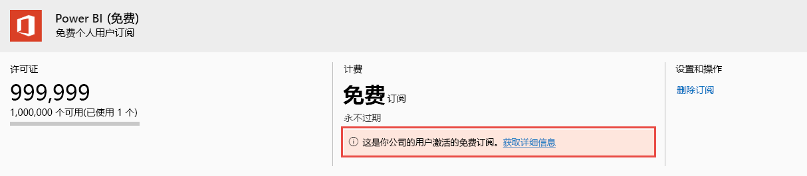

# 查看和管理 Power BI 用户许可证

本文介绍管理员如何使用 Microsoft 365 管理中心或 Azure 门户查看和管理用户许可证。

> [!NOTE]
>
>用户可以同时分配 Power BI（免费）和 Power BI Pro 许可证。 用户注册了免费许可证，稍后又分到 Power BI Pro 许可证时，可能会发生这种情况。 最高许可级别会在这种情况下生效。
>

## 查看订阅

要查看你的组织具有的 Power BI 订阅，请按照以下步骤操作。

1. 登录 [MIcrosoft 365 管理中心](https://admin.microsoft.com)。
2. 在“导航”菜单上，选择“计费” > “产品和服务”   。

活动 Power BI 订阅与拥有的任何其他订阅一起列出。 你可能会看到 Power BI（免费）的意外订阅，如下所示。

  

当用户利用自助注册时，系统将为你创建这种类型的订阅。 若要了解详细信息，请参阅[组织中的 Power BI](https://docs.microsoft.com/microsoft-365/admin/misc/power-bi-in-your-organization?view=o365-worldwide)。

## 管理 Microsoft 365 中的用户许可证

若要使用 Microsoft 365 管理中心管理用户许可证，请参阅[商业版订阅和计费文档](https://docs.microsoft.com/microsoft-365/commerce/?view=o365-worldwide)。

## 管理 Azure 门户中的用户许可证

按照以下步骤使用 Azure 门户查看和分配 Power BI 许可证。

1. 登录 [Azure 门户](https://portal.azure.com)。

2. 搜索并选择“Azure Active Directory”  。

3. 在“Azure Active Directory”资源菜单上的“管理”下方，选择“许可证”   。

4. 从资源菜单中选择“所有产品”，然后选择 Power BI 许可证类型以显示许可用户列表  。

5. 若要分配许可证，请从命令栏中选择“+ 分配”  。 在“分配许可证”页面上，选择一个用户，然后选择“分配选项”为选择的用户帐户启用 Power BI 许可证   。

6. 若要删除许可证，请选择用户名旁的复选框，然后选择“删除许可证”  。

## 后续步骤

- [购买 Power BI Pro](../service-admin-purchasing-power-bi-pro.md)
- [为组织授权](../service-admin-licensing-organization.md)
