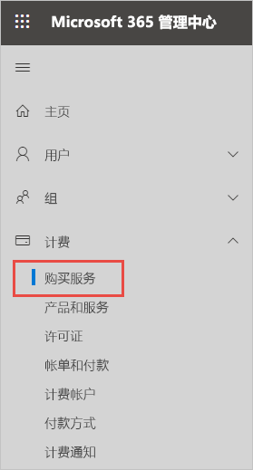
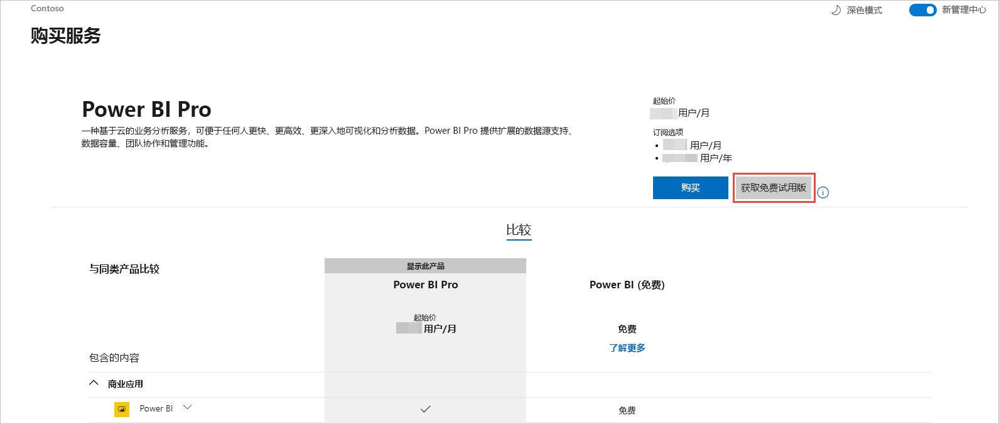
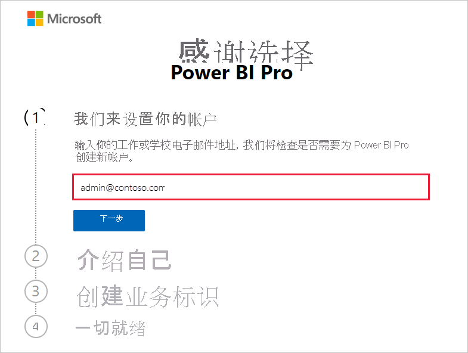
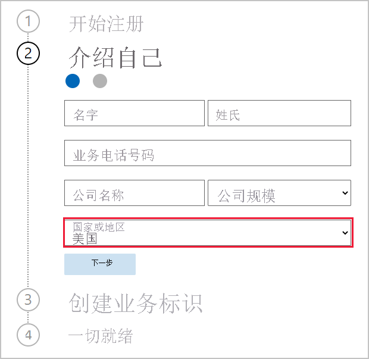
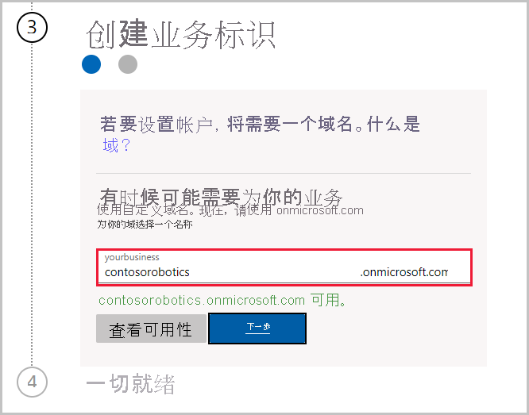

# 为组织获取 Power BI 服务订阅

管理员可通过 Microsoft 365 管理中心内的“购买服务”页面来注册 Power BI 服务。 当管理员注册 Power BI 时，他们可以将许可证分配给应具有访问权限的用户。

组织中的用户可以通过 Power BI 网站注册 Power BI。 当组织中的用户注册 Power BI 时，系统会自动向他们分配 Power BI 许可证。 如果要关闭此自助功能，请按照[启用或禁用自助注册和购买](service-admin-disable-self-service.md)的步骤操作。

## 注册 Microsoft 365

全局管理员或计费管理员可为组织获取 Power BI 订阅。 有关详细信息，请参阅[谁可以购买并分配许可证？](service-admin-licensing-organization.md#who-can-purchase-and-assign-licenses)。

> [!NOTE]
>
> Microsoft 365 E5 订阅已经包含 Power BI Pro 许可证。 若要了解如何管理许可证，请参阅[查看和管理用户许可证](service-admin-manage-licenses.md)。
>
>

按照以下步骤在 Microsoft 365 管理中心购买 Power BI Pro 许可证：

1. 登录 [MIcrosoft 365 管理中心](https://admin.microsoft.com)。

2. 在“导航”菜单上，选择“计费” > “购买服务”。
  
   

3. 搜索或滚动以查找要购买的订阅。 你会发现“Power BI”位于页面底部附近“可能感兴趣的其他类别”下方。 选择链接以查看可供组织使用的 Power BI 订阅。

4. 选择产品/服务，如 Power BI Pro。

5. 在“购买服务”页面上，选择“购买”。 如果以前没有使用过，则可以启用 Power BI Pro 免费试用版订阅。 它包含 25 个许可证并在一个月后过期。

   

6. 根据你的付费方式，选择“按月付费”或“按年付费” 。

7. 在“需要多少个用户?”下，输入要购买的许可证数量，然后选择“立即签出”完成此交易 。

8. 若要验证你的购买情况，请前往“账单” > “产品和服务”并查找“Power BI Pro”。

要详细了解组织如何控制和获取 Power BI 服务，请参阅[组织中的 Power BI](/microsoft-365/admin/misc/power-bi-in-your-organization?view=o365-worldwide)。

## 为组织获取 Power BI 的更多方法

如果你还不是一位 Microsoft 365 订阅者，请按以下步骤为组织获取 Power BI Pro 试用版。 或者可以[注册新的 Microsoft 365 试用版](service-admin-signing-up-for-power-bi-with-a-new-office-365-trial.md)，然后按照上一部分中的步骤添加 Power BI。

注册 Power BI 订阅需要一个工作或学校帐户。 我们不支持由使用者电子邮件服务或电信提供商提供的电子邮件地址。 如果没有工作或学校帐户，可以在注册过程中创建一个。

请按照以下步骤进行注册：

1. 转到 [Power BI Pro 注册](https://signup.microsoft.com/create-account/signup?OfferId=d59682f3-3e3b-4686-9c00-7c7c1c736085&ali=1&products=d59682f3-3e3b-4686-9c00-7c7c1c736085)。 

2. 输入工作或学校电子邮件地址，然后选择“下一步”。 如果你输入的电子邮件地址未被视为工作或学校电子邮件地址，也没关系。 当你创建业务标识时，我们会为你设置一个新帐户。

   

3. 我们将执行一项快速检查，查看是否需要为你创建新帐户。 选择“设置帐户”以继续完成注册。

   > [!NOTE]
   >如果你已在另一项 Microsoft 服务中使用自己的电子邮件地址，就可以“登录”或“创建新帐户” 。 如果选择创建新帐户，请继续按照以下步骤进行设置。
>
>
 
4. 填写表格，告诉我们你的基本情况。 请确保选择正确的国家或地区。 所选的国家/地区决定了数据的存储位置，如[如何确定 Power BI 租户的位置](service-admin-where-is-my-tenant-located.md#how-to-determine-where-your-power-bi-tenant-is-located)中所述。

   

5. 选择“下一步”。 我们需要发送验证码来验证你的身份。 请提供一个我们能给你打电话或发短信的电话号码。 然后选择“发送验证码”。

6. 输入收到的验证码，然后继续进行下一步“创建业务标识”。

   

    输入公司的短名称，我们将进行检查以确保该名称可用。 我们使用此短名称在数据中心创建你的组织名称，作为 onmicrosoft.com 的子域。 以后你可以添加自己的业务域。 如果你输入的短名称已被占用，请不要担心。 很可能是公司名称与你相似的其他人选择了一样的短名称，只需试试不同的短名称即可。 选择“下一步”。
    
7. 创建用户 ID 和密码以登录到自己的帐户。 选择“注册”，就一切准备就绪了。

你创建的帐户现在是新 Power BI Pro 试用版租户的全局管理员。 登录到 [Microsoft 365 管理中心](https://admin.microsoft.com)，可以添加更多用户、设置自定义域、购买更多服务并管理 Power BI 订阅。

## 后续步骤

- [查看和管理用户许可证](service-admin-manage-licenses.md)
- [启用或禁用自助注册和购买](service-admin-disable-self-service.md)
- [商业版订阅和计费文档](/microsoft-365/commerce/?view=o365-worldwide)