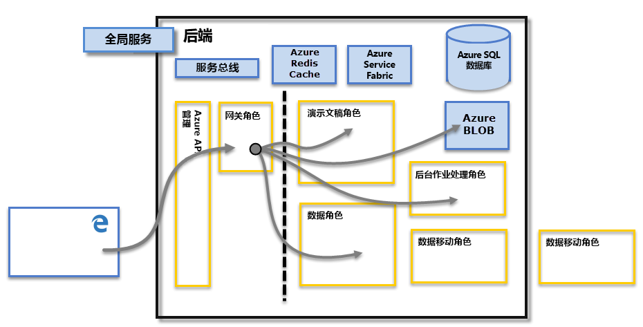

# Power BI 安全

有关 Power BI 安全的详细说明，请[阅读 Power BI 安全白皮书](../guidance/whitepaper-powerbi-security.md)。

Power BI 服务基于 **Azure**，后者是 Microsoft 的云计算基础结构和平台。 Power BI 服务体系结构基于两个群集 – Web 前端 (WFE) 群集和后端群集 。 WFE 群集管理初始连接并对 Power BI 服务进行身份验证，经过身份验证后后，后端会处理所有后续的用户交互。 Power BI 使用 Azure Active Directory (AAD) 来存储和管理用户身份，并分别使用 Azure BLOB 和 Azure SQL Database 管理数据和元数据存储。

## Power BI 体系结构

每个 Power BI 部署均包含两个群集 - Web 前端 (WFE) 群集和后端群集 。

**WFE** 群集为 Power BI 管理初始连接和身份验证进程，使用 AAD 对客户端进行身份验证并为后续客户端连接到 Power BI 服务提供令牌。 Power BI 还使用 **Azure 流量管理器** (ATM) 将用户流量定向到最近的数据中心，由针对身份验证进程尝试连接并下载静态内容和文件的客户端的 DNS 记录确定。 Power BI 使用 **Azure 内容分发网络** (CDN) 来有效地根据地理区域设置将所需的静态内容和文件分发到用户。

**后端** 群集是指经身份验证的客户端如何与 Power BI 服务进行交互。 **后端** 群集管理可视化、用户仪表板、数据集、报表、数据存储、数据连接、数据刷新以及与 Power BI 服务进行交互的其他方面。 **网关角色** 充当用户请求与 Power BI 服务之间的网关。 用户并不直接与 **网关角色** 以外的任何角色进行交互。 **Azure API 管理** 将最终处理 **网关角色**。

> [!IMPORTANT]
> 必须注意，只有 **Azure API 管理** (APIM) 和 **网关** (GW) 角色可通过公共 Internet 访问。 它们提供身份验证、授权、DDoS 保护、限制、负载平衡、路由和其他功能。

## 数据存储安全性

Power BI 使用两个主要的存储库进行数据存储和管理：用户上传的数据通常发送到 Azure Blob 存储，并且所有元数据以及系统本身的项目均存储在 Azure SQL 数据库中。

上方 **后端** 群集映像中的虚线阐明了仅用户可访问的两个组件（左边的虚线）与仅系统可访问的角色之间的边界。 经身份验证的用户连接到 Power BI 服务时，该连接和客户端的任何请求均由 **网关角色**（最终由 **Azure API 管理** 处理）接受和管理，它会以用户的名义与 Power BI 服务的其余部分进行交互。 例如，当客户端尝试查看仪表板时，**网关角色** 接受该请求，然后分别发送请求到 **演示文稿角色** 来检索浏览器呈现仪表板时所需的数据。

## 用户身份验证

Power BI 使用 Azure Active Directory ([AAD](https://azure.microsoft.com/services/active-directory/)) 对要登录到 Power BI 服务的用户进行身份验证，反过来，只要用户尝试访问要求进行身份验证的资源，均使用 Power BI 登录凭据。 用户使用用于建立其 Power BI 帐户的电子邮件地址登录到 Power BI 服务，Power BI 使用登录电子邮件作为有效用户名，每当用户尝试连接到数据时，就会将其传递给资源。 然后，有效用户名将映射到[用户主体名称 (UPN)](/windows/win32/secauthn/user-name-formats)，解析为关联的 Windows 域帐户，并对其应用身份验证 。

对于使用工作电子邮件（如 <em>david@contoso.com</em>）进行 Power BI 登录的组织，*有效用户名* 映射到 UPN 非常简单。 对于未使用工作电子邮件（如 <em>david@contoso.onmicrosoft.com</em>）进行 Power BI 登录的组织，AAD 和本地凭据之间的映射需要[目录同步](/azure/active-directory-domain-services/synchronization)才能正常工作。

Power BI 的平台安全还包括多租户环境安全、网络安全和添加其他基于 AAD 的安全措施的能力。

## 数据和服务安全

有关详细信息，请访问 [Microsoft 信任中心](https://www.microsoft.com/trust-center/product-overview)。

如本文前面部分中所述，用户的 Power BI 登录名由本地 Active Directory 服务器使用以映射到凭据的 UPN。 但是，必须注意的是，用户将负责管理共享的数据：如果用户使用自己的凭据连接到数据源，然后基于这些数据（用户所共享的仪表板未针对原始数据源进行身份验证）共享报表（或仪表板、数据集），并将被授予访问报表的权限。

例外情况是使用本地数据网关连接到 SQL Server Analysis Services；仪表板缓存在 Power BI 中，但对基础报表或数据集的访问会对尝试访问报表（或数据集）启动用户身份验证，且仅当用户有足够的凭据访问数据时才会被授予访问权限 。 有关详细信息，请参阅[深入了解本地数据网关](../connect-data/service-gateway-onprem-indepth.md)。

## 强制使用特定 TLS 版本

网络和 IT 管理员可以强制要求为其网络上的任何安全通信使用当前的 TLS（传输层安全性）。 Windows 通过 Microsoft Schannel 提供程序为 TLS 版本提供支持，如 [TLS Schannel SSP 文章中所述](/windows/desktop/SecAuthN/protocols-in-tls-ssl--schannel-ssp-)。

可通过以管理方式设置注册表项来执行此强制操作。 [管理 AD FS 中的 SSL 协议](/windows-server/identity/ad-fs/operations/manage-ssl-protocols-in-ad-fs)一文中对此强制操作进行了介绍。 

**Power BI Desktop** 遵循这些文章中所述的注册表项设置，并且仅使用这些注册表设置所允许的 TLS 版本（如有）来创建连接。

有关设置这些注册表项的详细信息，请参阅 [TLS 注册表设置](/windows-server/security/tls/tls-registry-settings)一文。
