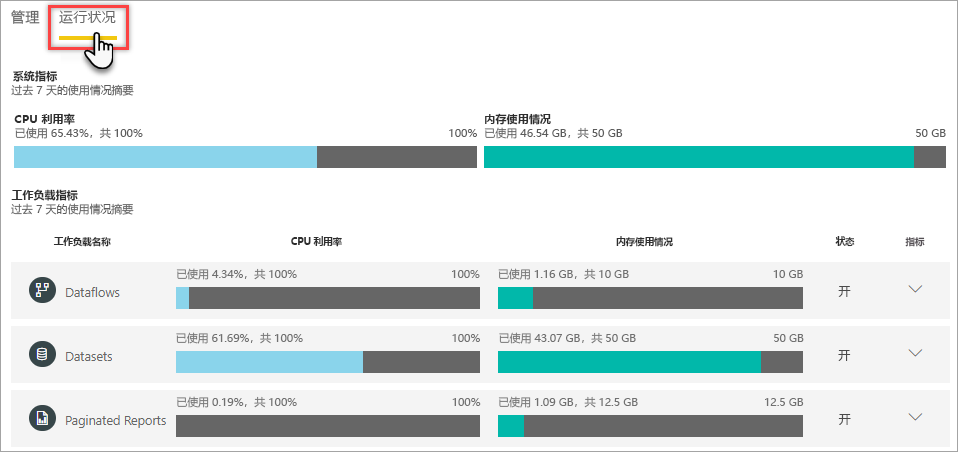

# 在管理门户中监视容量

在管理门户中，“容量设置”区域中的“运行状况”选项卡提供了有关容量和已启用工作负荷的指标摘要   。  

如果需要更全面的指标，请使用 [Power BI Premium 容量指标](service-admin-premium-monitor-capacity.md)应用。 该应用支持向下钻取和筛选，并提供有关影响容量性能的几乎每一方面的最详细的指标。 若要了解详细信息，请参阅[使用应用监视 Premium 容量](service-admin-premium-monitor-capacity.md)。

> [!IMPORTANT]
> 如果 Power BI Premium 容量遇到资源使用量过高的情况，从而导致性能或可靠性问题，可通过接收通知电子邮件来识别和解决问题。 这可以充当一种用于排查重载容量的简化方法。 有关详细信息，请参阅[容量和可靠性通知](service-interruption-notifications.md#capacity-and-reliability-notifications)。

## 系统指标

在“运行状况”选项卡上，会显示非常粗略的 CPU 占用率和内存使用量，让你能够快速了解最重要的容量指标  。 这些指标是累积量，其中包括已启用的所有容量工作负荷。

| **指标** | **说明** |
| --- | --- |
| CPU 利用率 | 平均 CPU 占用率，以占可用 CPU 总量的百分比表示。 |
| 内存使用情况 | 平均内存使用量，以千兆字节 (GB) 表示。|

## 工作负荷指标

适用于为容量启用的每个工作负荷。 显示 CPU 占用率和内存使用量。

| **指标** | **说明** |
| --- | --- |
| CPU 利用率 | 平均 CPU 占用率，以占可用 CPU 总量的百分比表示。 |
| 内存使用情况 | 平均内存使用量，以千兆字节 (GB) 表示。|

### 详细工作负荷指标

每个工作负荷都有附加指标。 显示的指标类型取决于工作负荷。 若要查看工作负荷的详细指标，请单击展开（向下）箭头。

#### 数据流

##### 数据流操作

| **指标** | **说明** |
| --- | --- |
| 总计数 | 每个数据流的总刷新次数。 |
| 成功计数 | 每个数据流的总的刷新成功次数。|
| 平均持续时间（分钟） | 刷新数据流的平均持续时间（以分钟为单位） |
| 最长持续时间（分钟） | 数据流运行时间最长的刷新持续时间（以分钟为单位）。 |
| 平均等待时间（分钟） | 计划时间与刷新数据流开始时间之间的平均延迟（以分钟为单位）。 |
| 最长等待时间（分钟） | 数据流的最长等待时间（以分钟为单位）。  |

#### 数据集

##### 刷新

| **指标** | **说明** |
| --- | --- |
| 总计数 | 每个数据集的总刷新次数。 |
| 成功计数 | 每个数据集的总的刷新成功次数。 |
| 失败计数 | 每个数据集的总的刷新失败次数。 |
| 成功率  | 刷新成功的次数除以刷新总次数。 可靠性。 |
| 平均持续时间（分钟） | 刷新数据集的平均持续时间（以分钟为单位）。  |
| 最长持续时间（分钟） | 数据集运行时间最长的刷新持续时间（以分钟为单位）。 |
| 平均等待时间（分钟） | 计划时间与刷新数据集开始时间之间的平均延迟（以分钟为单位）。 |
| 最长等待时间（分钟） | 数据集的最长等待时间（以分钟为单位）。 |

##### 查询

| **指标** | **说明** |
| --- | --- |
| 总计数 | 为数据集运行的查询的总数。 |
| 平均持续时间(毫秒) |数据集的平均查询持续时间（以毫秒为单位）|
| 最长持续时间(毫秒) |数据集中运行时间最长的查询的持续时间（以毫秒为单位）。 |
| 平均等待时间（毫秒） |数据集的平均查询等待时间（以毫秒为单位）。 |
| 最长等待时间(毫秒) |数据集中等待时间最长的查询的持续时间（以毫秒为单位）。 |

##### 逐出

| **指标** | **说明** |
| --- | --- |
| 模型计数 | 为此容量执行数据集逐出的总数。 容量面临内存压力时，节点从内存中逐出一个或多个数据集。 首先逐出处于非活动状态（当前没有执行查询/刷新操作）的数据集。 然后按“最近最少使用的项”(LRU) 这一顺序依次逐出。 |

#### 分页报表

##### 报表执行情况

| **指标** | **说明** |
| --- | --- |
| 执行计数  | 用户执行和查看报表的次数。|

##### 报表使用情况

| **指标** | **说明** |
| --- | --- |
| 成功计数 | 用户查看报表的次数。 |
| 失败计数 |用户查看报表的次数。|
| 行计数 |报表中数据的行数。 |
| 数据检索耗时（毫秒） |检索报表数据所需的平均时间（以毫秒为单位）。 较长的持续时间可能表示查询速度缓慢或其他数据源问题。  |
| 处理耗时（毫秒） |处理报表数据所需的平均时间（以毫秒为单位）。 |
| 呈现持续时间(毫秒) |在浏览器中呈现报表所需的平均时间（以毫秒为单位）。 |

> [!NOTE]
> 尚未提供 AI 工作负荷的详细指标  。

## 后续步骤

你现已了解如何监视 Power BI Premium 容量，可以了解有关优化容量的更多信息。

> [!div class="nextstepaction"]
> [优化 Power BI Premium 容量](service-premium-capacity-optimize.md)
