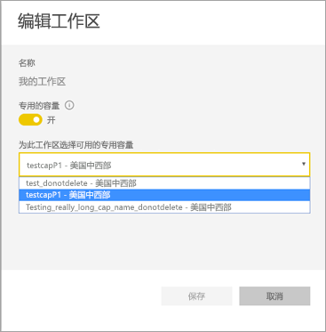
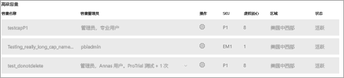

# 配置 Power BI Premium 的 Multi-Geo 支持

Multi-Geo（多地理位置）是一项 Power BI Premium 功能，可帮助跨国客户解决地区、特定于行业或组织的数据驻留要求。 作为 Power BI Premium 客户，可以将内容部署到除 Power BI 租户主区域以外区域的数据中心。 一个地区 (geography) 可以包含多个区域。 例如，美国是一个地区，而美国中西部和美国中南部都是美国的区域。 可以选择将内容部署到以下任何地区：

- 美国
- 加拿大
- 英国
- 巴西
- 欧洲
- 日本
- 印度
- 亚太
- 澳大利亚
- 非洲

Multi-Geo 不适用于 Power BI Germany、由世纪互联运营的 Power BI China 或 Power BI 美国政府版。

Power BI Embedded 现在也提供 Multi-Geo 功能。 阅读[Power BI Embedded 中的 Multi-Geo 支持](../developer/embedded/embedded-multi-geo.md)，了解详细信息。

## 启用和配置

对于新容量，可以通过从下拉列表中选择除默认区域以外的区域来启用 Multi-Geo。  每个可用容量显示它当前所在的区域，如美国中西部。

创建容量后，它仍然在此区域，并且任何创建的工作区都将其内容存储在该区域。 可以通过工作区设置屏幕上的下拉列表将工作区从一个区域迁移到另一个区域。

你会看到此消息以确认更改。

在此次迁移过程中，不需要重置网关凭据。  当它们存储在高级容量区域后，将需要在迁移时进行重置。

在迁移期间，某些操作可能会失败，例如发布新的数据集或已计划的数据刷新。  

启用 Multi-Geo 时，以下各项存储在高级区域中：

- 针对导入和直接查询数据集的模型（.ABF 文件）
- 查询缓存
- R 图像

这些项将保留在租户的主区域中：

- 推送数据集
- Excel 工作簿
- 仪表板/报表元数据：例如，磁贴名称、磁贴查询
- 针对网关查询或计划刷新作业的服务总线
- 权限
- 数据集凭据

## 查看容量区域

在管理门户中，可以查看 Power BI 租户的所有容量，以及它们当前所在的区域。

 

## 更改区域的现有内容

如果需要更改区域的现有内容，有两个选项。

- 创建第二个容量和移动工作区。 只要租户具有备用的 V 核心，免费用户就不会遇到任何停机时间。
- 如果创建第二个容量不可行，则可以暂时将内容从高级容量中移回到共享容量。 不需要额外的 V 核心，但免费用户会遇到一定的停机时间。

## 将内容移出 Multi-Geo  

可以通过以下两种方式之一将工作区移出 Multi-Geo 容量：

- 删除工作区所在的当前容量。  这会使工作区移回到主区域中的共享容量。
- 将各个单独工作区移回到主租户中的高级容量。

不应将大型存储格式的数据集从创建它们的区域移走。 基于大型存储格式数据集的报表将无法加载数据集，并会返回“无法加载模型”错误。 应将大型存储格式的数据集移回其原始区域，以恢复正常使用。

## 限制和注意事项

- 在启动数据传输之前，确认在区域之间发起的任何移动都遵循所有企业和政府的合规性要求。
- 存储在远程区域中的缓存查询将停留在该区域内。 然而，传输中的其他数据可能在多个地区之间来回切换。
- 当在 Multi-Geo 环境中将数据从一个区域移动到另一个区域时，源数据可能保留在从中移出数据的区域内达 30 天。 在此期间，最终用户无权访问该数据。 该数据会在 30 天内从该区域中删除并销毁。
- 导入的数据模型的查询文本和查询结果流量传输不会经过主区域。 报表元数据仍来自远程区域，某些 DNS 路由状态可能会从区域传出流量。 
- 目前，Multi-GEO 暂不支持[“数据流”](../transform-model/dataflows/dataflows-introduction-self-service.md)功能。
- 如果从创建这些数据集的区域移动大存储格式的数据集，则会导致报表无法加载数据集。 将大型存储格式的数据集移回其原始区域，以恢复正常使用。 

## 后续步骤

- [什么是 Power BI Premium？](service-premium-what-is.md)
- [Power BI Embedded 的 Multi-Geo 功能](../developer/embedded/embedded-multi-geo.md)

更多问题？ [尝试咨询 Power BI 社区](https://community.powerbi.com/)