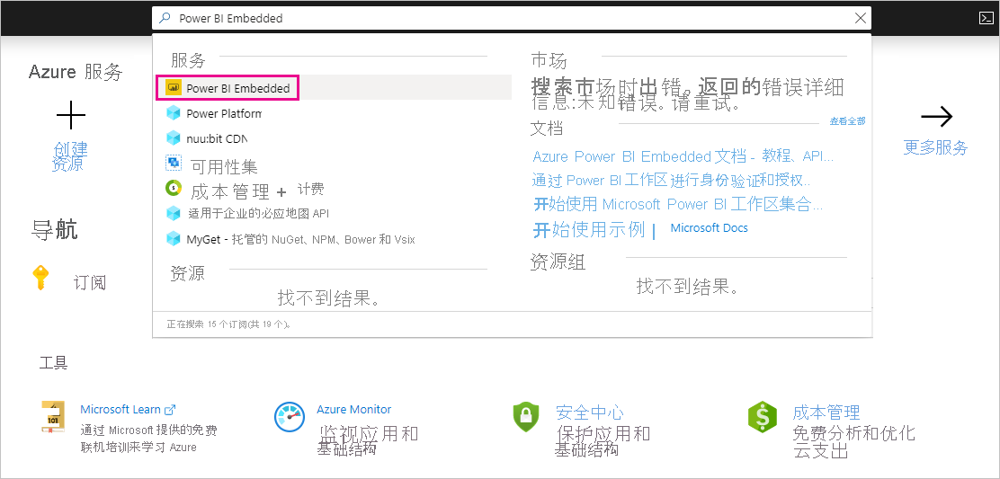
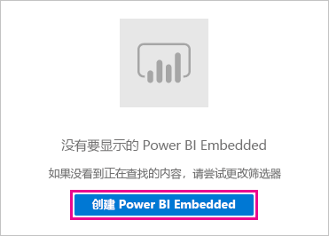
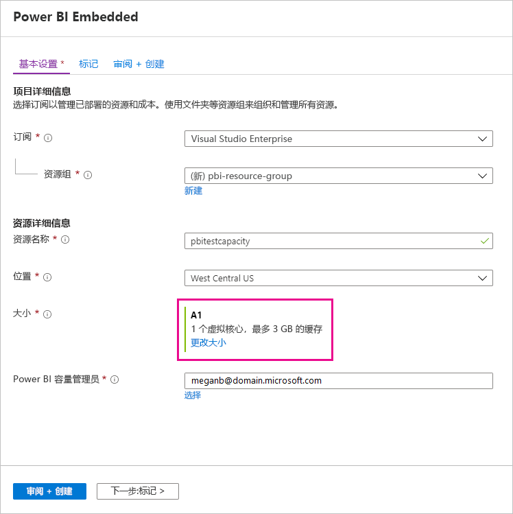
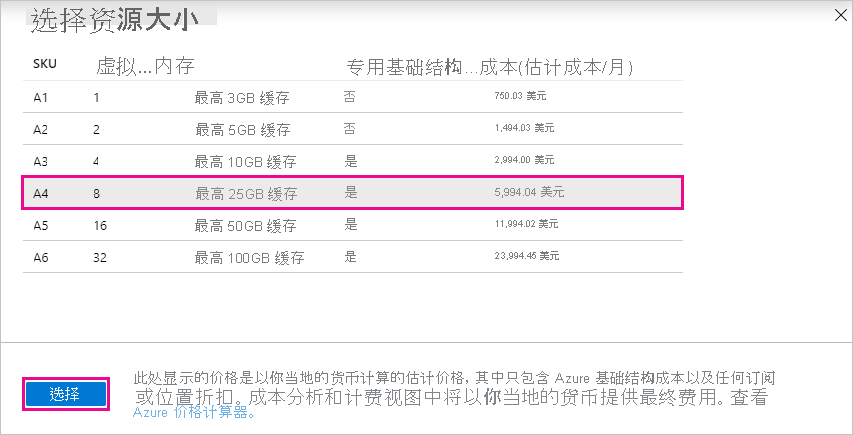
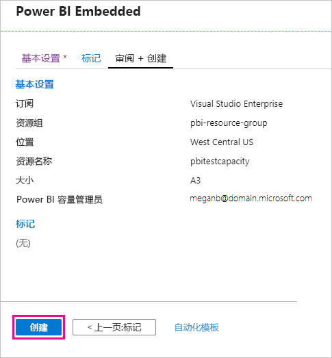
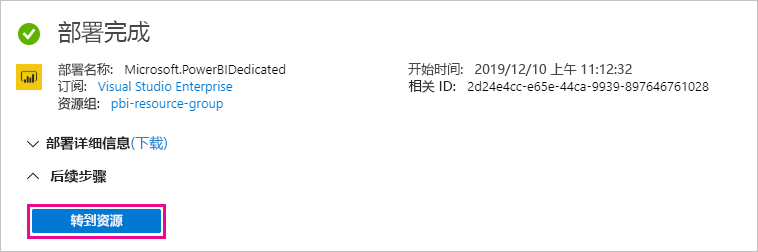
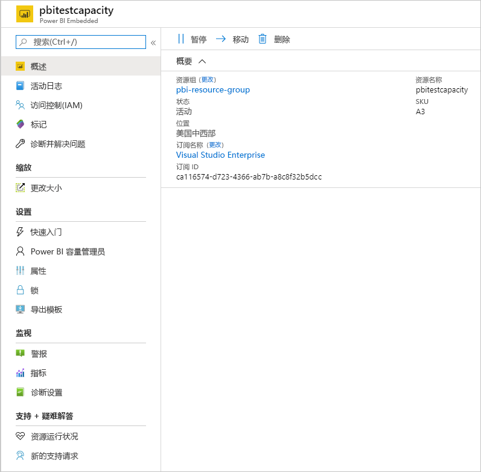

# 购买 Power BI Premium 用于测试

本文介绍如何购买用于测试方案，以及无权购买 P SKU（Microsoft 365 全局管理员角色或计费管理员角色）的情况的 Power BI Premium A SKU。 A SKU 无需时间承诺，按小时计费。 在 [Azure 门户](https://portal.azure.com)中购买 A SKU。

有关 Power BI Premium 的详细信息，请参阅[什么是 Power BI Premium？](service-premium-what-is.md)。 有关当前定价和计划的信息，请参阅 [Power BI 定价页](https://powerbi.microsoft.com/pricing/)和 [Power BI Premium 计算器](https://powerbi.microsoft.com/calculator/)。 即使你的组织使用 Power BI Premium，内容创建者还是需要一个 [Power BI Pro 许可证](service-admin-purchasing-power-bi-pro.md)。 请确保为组织购买至少一个 Power BI Pro 许可证。 使用 A SKU，使用内容的所有用户还需要 Pro 许可证。

> [!NOTE]
> 如果 Premium 订阅到期，将有 30 天的容量完全访问权限。 之后，内容将恢复为共享容量。 共享容量不支持大于 1 GB 的模型。

## 购买适用于测试和其他方案的 A SKU

A SKU 通过 Azure Power BI Embedded 服务提供。 可按以下方式使用 A SKU：

- 在第三方应用程序中启用 Power BI 嵌入。 有关详细信息，请参阅 [Power BI Embedded](../developer/embedded/azure-pbie-what-is-power-bi-embedded.md)。

- 在购买 P SKU 之前，请测试 Premium 功能。

- 与使用 P SKU 的生产环境一起，创建开发和测试环境。

- 即使不是 Microsoft 365 全局管理员角色或计费管理员角色，也可以购买 Power BI Premium。

> [!NOTE]
> 如果购买 A4 或更高的 SKU，可以利用除无限共享内容之外的所有 Premium 功能。 使用 A SKU，使用内容的所有用户都需要 Pro 许可证。

请按照下列步骤在 Azure 门户中购买 A SKU：

1. 使用至少具有 Power BI 容量管理员权限的帐户登录 [Azure 门户](https://portal.azure.com)。

1. 搜索 Power BI Embedded，然后在搜索结果中选择该服务。

    

1. 选择“创建 Power BI Embedded”。

    

1. 在“Power BI Embedded”创建屏幕上，指定下列信息：

    - 要在其中创建 Power BI Embedded 服务的订阅。

    - 要在其中创建包含服务的资源组的物理位置。 为了获得更好的性能，此位置应靠近 Power BI 的 Azure Active Directory 租户的位置。

    - 要使用的现有资源组，或者创建一个新资源组，如示例中所示。

    - Power BI 容量管理员。 容量管理员必须是 Azure AD 租户中的成员用户或服务主体。

    

1. 如果要使用 Power BI Premium 的所有功能（无限共享除外），则至少需要一个 A4 SKU。 选择“更改大小”。

    

1. 选择与 P1、P2 和 P3 对应的 A4、A5 或 A6 容量大小。

    

1. 选择“查看 + 创建”，检查选择的选项，然后选择“创建”。

    

1. 完成部署可能需要几分钟时间。 准备就绪后，请选择“转到资源”。

    

1. 在管理屏幕上，查看用于管理服务的选项，包括用于在不使用服务时暂停该服务的选项。

    

购买容量后，请了解如何[管理容量](service-admin-premium-manage.md#manage-capacity)以及向容量[分配工作区](service-admin-premium-manage.md#assign-a-workspace-to-a-capacity)。

## 后续步骤

[什么是 Power BI Premium？](service-premium-what-is.md)
[如何购买 Power BI Premium](service-admin-premium-purchase.md)
[配置和管理 Power BI Premium 中的容量](service-admin-premium-manage.md)\
[Power BI 定价页](https://powerbi.microsoft.com/pricing/)\
[Power BI Pemium 计算器](https://powerbi.microsoft.com/calculator/)\
[Power BI Premium 常见问题解答](service-premium-faq.md)\
[规划 Power BI Enterprise 部署白皮书](https://aka.ms/pbienterprisedeploy)

更多问题？ [尝试咨询 Power BI 社区](https://community.powerbi.com/)
