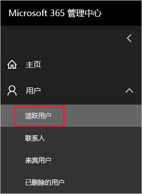
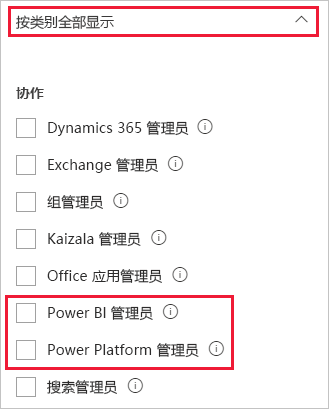

# <a name="understanding-power-bi-administrator-roles"></a>了解 Power BI 管理员角色

你必须是以下角色之一才能管理组织的 Power BI：Power BI 管理员、Power Platform 管理员或 Microsoft 365 全局管理员。Microsoft 365 用户管理管理员可以在 Microsoft 365 管理中心或使用 PowerShell 脚本，向用户分配 Power BI 管理员或 Power Platform 管理员角色。 有关详细信息，请参阅[将角色分配给具有 PowerShell 的用户帐户](/office365/enterprise/powershell/assign-roles-to-user-accounts-with-office-365-powershell)。

拥有 Power BI 管理员或 Power Platform 管理员角色的用户可完全控制组织范围的 Power BI 设置和管理功能（许可除外）。 具有管理员角色后，用户可访问 [Power BI 管理门户](service-admin-portal.md)。 在这里，用户可访问组织范围的使用指标，还能控制组织范围内对 Power BI 功能的使用情况。 这些管理员角色非常适合需要访问 Power BI 管理门户的用户，它们还可不向这些用户授予完整的 Microsoft 365 管理访问权限。

> [!NOTE]
> 在 Power BI 文档中，“Power BI 管理员“指的是拥有 Power BI 管理员或 Power Platform 管理员角色的用户。 本文档清楚地说明了任务何时需要 Microsoft 365 全局管理员角色。

## <a name="limitations-and-considerations"></a>限制和注意事项

Power BI 管理员和 Power Platform 管理员角色不具备以下功能：

* 在 Microsoft 365 管理中心内修改用户和许可证。

* 访问审核日志的功能。 有关详细信息，请参阅[跟踪 Power BI 中的用户活动](service-admin-auditing.md)。

这些功能需要分配 Microsoft 365 管理员角色。

## <a name="assign-users-to-an-admin-role-in-the-microsoft-365-admin-center"></a>在 Microsoft 365 管理中心内向用户分配管理员角色

要在 Microsoft 365 管理中心内向用户分配管理员角色，请按以下步骤操作。

1. 在 [Microsoft 365 管理中心](https://portal.office.com/adminportal/home#/homepage)内，依次选择“用户” > “有效用户” 。

    

1. 选择要向其分配角色的用户。

1. 在“角色”下，选择“管理角色” 。

    

1. 展开“按类别全部显示”，然后选择“Power BI 管理员”或“Power Platform 管理员”  。

    

1. 选择“保存更改”。

## <a name="assign-users-to-the-admin-role-with-powershell"></a>使用 PowerShell 向用户分配管理员角色

也可以使用 PowerShell 向用户分配角色。 用户托管在 Azure Active Directory (Azure AD) 中。 如果还没有 Azure AD PowerShell 模块，请[下载并安装最新版本](https://www.powershellgallery.com/packages/AzureAD/)。

1. 连接到 Azure AD：
   ```
   PS C:\Windows\system32> Connect-AzureAD
   ```

1. 获取 Power BI 管理员角色的 ObjectId 。 可以运行 [Get-AzureADDirectoryRole](/powershell/module/azuread/get-azureaddirectoryrole) 获取 **ObjectId**

    ```
    PS C:\Windows\system32> Get-AzureADDirectoryRole

    ObjectId                             DisplayName                        Description
    --------                             -----------                        -----------
    00f79122-c45d-436d-8d4a-2c0c6ca246bf Power BI Service Administrator     Full access in the Power BI Service.
    250d1222-4bc0-4b4b-8466-5d5765d14af9 Helpdesk Administrator             Helpdesk Administrator has access to perform..
    3ddec257-efdc-423d-9d24-b7cf29e0c86b Directory Synchronization Accounts Directory Synchronization Accounts
    50daa576-896c-4bf3-a84e-1d9d1875c7a7 Company Administrator              Company Administrator role has full access t..
    6a452384-6eb9-4793-8782-f4e7313b4dfd Device Administrators              Device Administrators
    9900b7db-35d9-4e56-a8e3-c5026cac3a11 AdHoc License Administrator        Allows access manage AdHoc license.
    a3631cce-16ce-47a3-bbe1-79b9774a0570 Directory Readers                  Allows access to various read only tasks in ..
    f727e2f3-0829-41a7-8c5c-5af83c37f57b Email Verified User Creator        Allows creation of new email verified users.
    ```

    在此示例中，角色的 ObjectId 为 00f79122-c45d-436d-8d4a-2c0c6ca246bf。

1. 接下来，获取用户的 ObjectId。 为此，可以运行 [Get-AzureADUser](/powershell/module/azuread/get-azureaduser)。

    ```
    PS C:\Windows\system32> Get-AzureADUser -ObjectId 'tim@contoso.com'

    ObjectId                             DisplayName UserPrincipalName      UserType
    --------                             ----------- -----------------      --------
    6a2bfca2-98ba-413a-be61-6e4bbb8b8a4c Tim         tim@contoso.com        Member
    ```

1. 若要向成员添加角色，请运行 [Add-AzureADDirectoryRoleMember](/powershell/module/azuread/add-azureaddirectoryrolemember)。

    | 参数 | 说明 |
    | --- | --- |
    | ObjectId |角色 ObjectId。 |
    | RefObjectId |成员 ObjectId。 |

    ```powershell
    Add-AzureADDirectoryRoleMember -ObjectId 00f79122-c45d-436d-8d4a-2c0c6ca246bf -RefObjectId 6a2bfca2-98ba-413a-be61-6e4bbb8b8a4c
    ```
若要详细了解如何使用 PowerShell 分配管理员角色，请参阅 [AzureAD 目录角色](/powershell/module/azuread/#directory-roles)。

## <a name="next-steps"></a>后续步骤

[在组织中管理 Power BI](service-admin-administering-power-bi-in-your-organization.md)  
[Power BI 管理门户](service-admin-portal.md)  

更多问题？ [尝试咨询 Power BI 社区](https://community.powerbi.com/)
