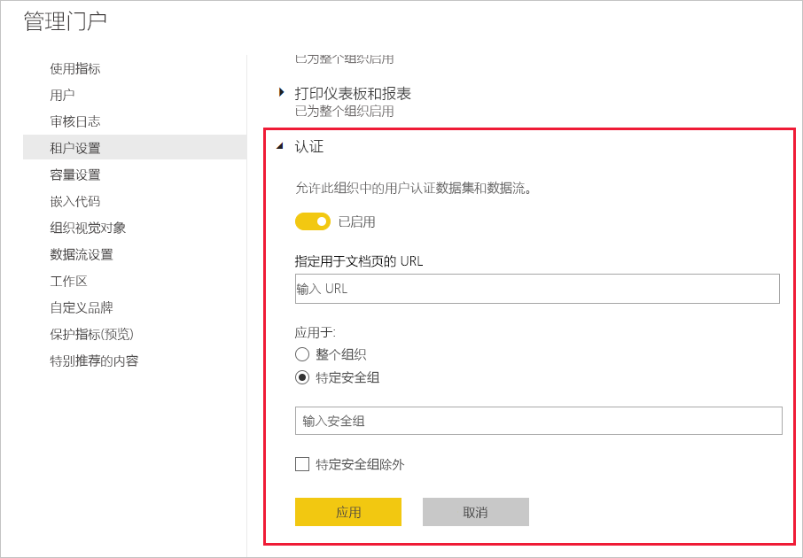

# 启用内容认证

你的组织可以认证所选内容，以将其标识为关键信息的权威源。 目前，可以认证以下内容类型：
* 数据集
* 数据流(预览版)
* 报表（预览版）
* 应用（预览版）

Power BI 管理员负责为组织启用和设置认证过程。 这意味着：
* 对租户启用认证。
* 定义安全组的列表，这些安全组的成员将有权认证内容。
* 提供一个指向组织内容认证过程文档的 URL（如果存在此类文档）。

认证是 Power BI 的认可功能的一部分。 请参阅[认可：推广和认证 Power BI 内容](../collaborate-share/service-endorsement-overview.md)，了解更多信息。

## 设置认证

1. 在管理员门户中，转到“租户设置”。
1. 在“导出和共享设置”部分下，展开“认证”部分。

   

1. 将切换设置为“启用”。
1. 如果组织具有已发布的认证策略，请在此处提供其 URL。 这将成为[认可设置对话框](../collaborate-share/service-endorse-content.md#request-content-certification)中“认证”部分的“了解详细信息”链接。 如果你未提供链接，则将建议想要请求其内容认证的用户联系其 Power BI 管理员。
1. 指定一个或多个安全组，这些安全组的成员将有权认证内容。 这些授权的认证者将能够使用[认可设置对话框](../collaborate-share/service-endorse-content.md#certify-content)中“认证”部分的“认证”按钮。
    
    如果安全组包含不希望向其授予认证权限的子安全组，则可以选中“特定安全组除外”框，然后在出现的文本框中输入这些组的名称。
1. 单击“ **应用** ”。

## 后续步骤
* [推广或认证内容](../collaborate-share/service-endorse-content.md)
* [了解有关 Power BI 中的认可的信息](../collaborate-share/service-endorsement-overview.md)
* 是否有任何问题？ [尝试咨询 Power BI 社区](https://community.powerbi.com/)
