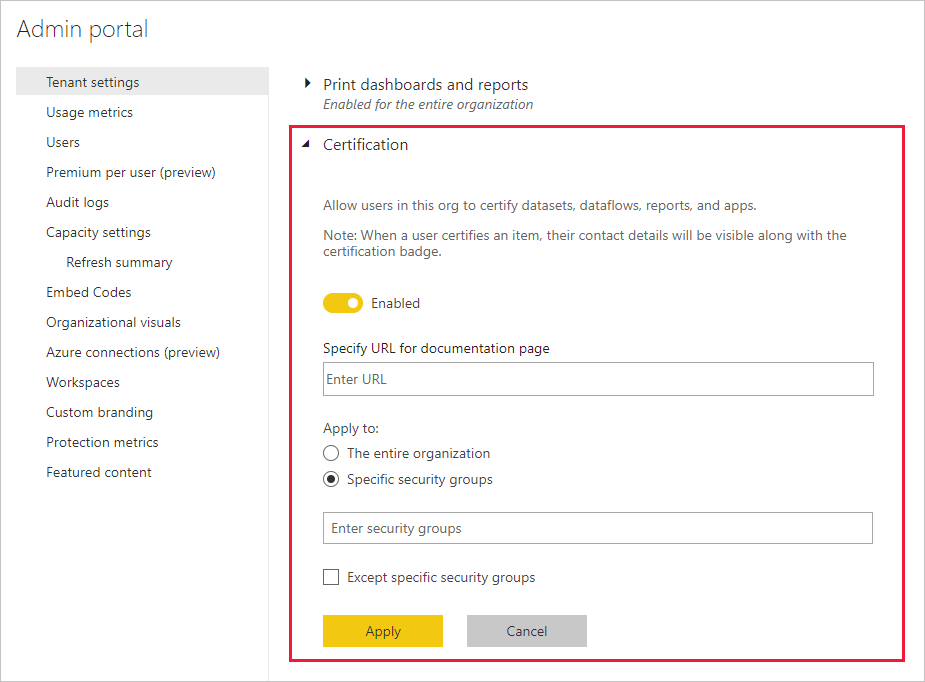

# 设置数据集和数据流认证（预览版）

组织可以认证作为关键信息权威来源的数据集和数据流。

Power BI 租户管理员负责为组织设置认证过程。 这意味着：
* 对租户启用认证。
* 定义有权认证数据集和数据流的组和用户的列表。
* 对于数据集，提供组织数据集认证策略的 URL（如果有）。

数据集和数据流认证是数据集和数据流认可的一部分。 有关详细信息，请参阅[数据集认可](../connect-data/service-datasets-promote.md)和[数据流认可](../transform-model/service-dataflows-promote-certify.md)。

## 设置认证

1. 在管理员门户中，转到“租户设置”。
1. 在“导出和共享设置”部分下，展开“认证”部分。

   

1. 将切换设置为“启用”。
1. 对于数据集认证，如果组织具有已发布的认证策略，则可以在此处提供其 URL。 这将成为[数据流认可设置对话框](../connect-data/service-datasets-promote.md#request-dataset-certification)的认证部分中的“了解更多详细信息”链接 
1. 指定有权认证数据集和数据流的用户或组。 这些授权的认证者将能够使用[数据集](../connect-data/service-datasets-promote.md#request-dataset-certification)或[数据流](../transform-model/service-dataflows-promote-certify.md#certify-a-dataflow)认可设置对话框的认证部分中的“认证”按钮。
1. 单击“**应用**”。

## 后续步骤
* [推广数据集](../connect-data/service-datasets-promote.md)
* [验证数据集](../connect-data/service-datasets-certify.md)
* [推广数据流](../transform-model/service-dataflows-promote-certify.md#promote-a-dataflow)
* [数据流](../transform-model/service-dataflows-promote-certify.md#certify-a-dataflow)
* 是否有任何问题? [尝试咨询 Power BI 社区](https://community.powerbi.com/)
