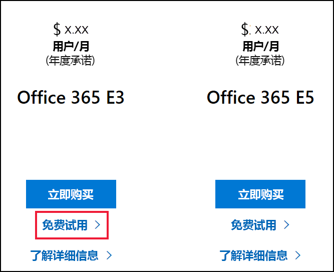
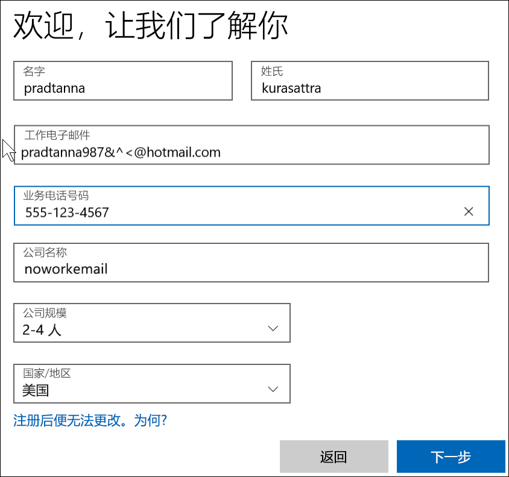

# 通过新 Microsoft 365 试用版注册 Power BI

本文介绍了在尚没有工作或学校电子邮件帐户时，另一种可供选择的 Power BI 注册方法。 

如果无法使用电子邮件地址注册 Power BI，请先确保[电子邮件地址可用于 Power BI](../fundamentals/service-self-service-signup-for-power-bi.md#supported-email-addresses)。 如果这不成功，请注册 Microsoft 365 试用版并创建工作帐户。 然后，使用该新工作帐户注册 Power BI 服务。 即使在 Microsoft 365 试用版到期后，也仍能使用 Power BI。

> [!NOTE]
> Office 365 最近更名为 Microsoft 365。 在我们的所有文章都更新后，你可能仍会看到它被称为 Office 365。

1. 在 [Microsoft 365 网站](https://www.microsoft.com/en-us/microsoft-365/business/compare-more-office-365-for-business-plans)注册 Microsoft 365 试用版。

    

    

    

    

    

    

1. 创建类似于 you@yourcompany.onmicrosoft.com 的新工作登录名。 这是用于 Power BI 的登录名。

    

        

1. 在创建新租户期间，可能需要等待。 

大功告成。  现在，你有了可用于注册 Power BI 的电子邮件地址。 前往[以个人身份注册 Power BI 服务](../fundamentals/service-self-service-signup-for-power-bi.md)

## 重要注意事项
如果无法使用新帐户进行登录，请尝试使用私密浏览器会话。    

使用这种注册方法，就是在新建组织租户，你也将成为此租户的管理员。 有关详细信息，请参阅[什么是 Power BI 管理？](service-admin-administering-power-bi-in-your-organization.md)。 可以先将新用户添加到租户中，然后再与他们共享（如 [Microsoft 365 管理文档](https://support.office.com/en-sg/article/Add-users-individually-to-Office-365---Admin-Help-1970f7d6-03b5-442f-b385-5880b9c256ec)所述）。

## 后续步骤

[什么是 Power BI 管理？](service-admin-administering-power-bi-in-your-organization.md)  
[组织中的 Power BI 许可](service-admin-licensing-organization.md)  
[以个人身份注册 Power BI](../fundamentals/service-self-service-signup-for-power-bi.md)

更多问题？ [尝试咨询 Power BI 社区](https://community.powerbi.com/)