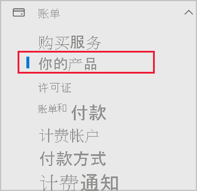

# 将 Power BI 添加到 Microsoft 365 合作伙伴订阅

使用 Microsoft 365，公司可以转售与自己的解决方案捆绑集成的 Microsoft 365，从而为客户提供单一联系人，方便其购买产品、处理帐务和获取支持。

要将 Power BI 添加到 Microsoft 365 订阅，建议联系合作伙伴。 如果合作伙伴当前未提供 Power BI，则可以采用以下所述的选项。

## 联系合作伙伴以购买 Power BI

若要购买 Power BI Pro 或 Power BI Premium 订阅，请联系合作伙伴，以考虑可采用的方法：

* 合作伙伴同意将 Power BI 添加到其产品组合，以便你可以从他们那里购买。

* 合作伙伴能够将你转换到一种模型，在其中可以直接从 Microsoft 或从提供 Power BI 的其他合作伙伴购买 Power BI。

## 从 Microsoft 或其他渠道购买

可以直接从 Microsoft 或其他合作伙伴处购买 Power BI，具体视与合作伙伴的关系而定。 可以在 Microsoft 365 管理中心内验证能否添加 Power BI 订阅（必须有全局管理员或计费管理员角色的成员身份）。

1. 转到 [MIcrosoft 365 管理中心](https://admin.microsoft.com/AdminPortal/Home#/homepage)。

1. 在左侧菜单中，打开“计费”，然后选择“你的产品” ：

   

 1. 按下图所示查找“订阅”。 如果看到“订阅”，可以直接从 Microsoft 获取服务，也可以与提供 Power BI 的其他合作伙伴联系。

    

    如果看不到“订阅”，便无法直接从 Microsoft 或其他合作伙伴处购买。

如果合作伙伴不提供 Power BI，且你无法直接从 Microsoft 或其他合作伙伴处购买，请考虑注册免费试用版。

## 注册免费试用版

可以注册 Power BI 免费试用版。 如果在试用期到期时未购买 Power BI Pro，仍有允许使用许多 Power BI 功能的免费许可证。 有关详细信息，请参阅[以个人身份注册 Power BI](../fundamentals/service-self-service-signup-for-power-bi.md)。

### 启用临时订阅

默认情况下，个人注册（亦称为“临时订阅”）处于禁用状态。 在此情况下，如果尝试注册，会显示以下消息：你的 IT 部门已禁用注册 Microsoft Power BI。

若要启用临时订阅，可以与合作伙伴联系并请求打开该功能。 如果你是租户管理员，并且知道如何使用 Azure Active Directory PowerShell 命令，可以自行启用临时订阅。 有关详细信息，请按照[启用或禁用自助购买](service-admin-disable-self-service.md)中的步骤操作。

## 后续步骤

* [组织中的 Power BI 许可](service-admin-licensing-organization.md)
* [购买和分配 Power BI Pro 许可证](service-admin-purchasing-power-bi-pro.md)

更多问题？ [尝试咨询 Power BI 社区](https://community.powerbi.com/)