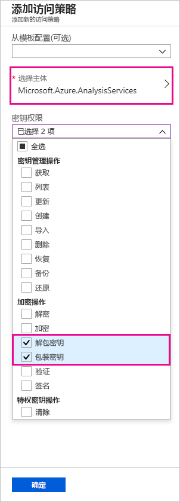
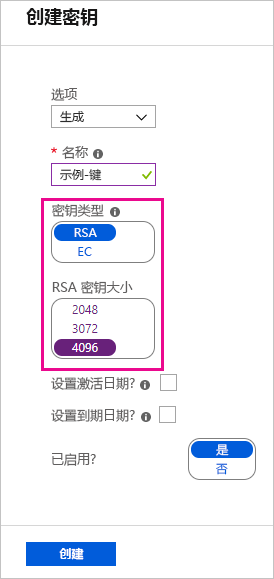
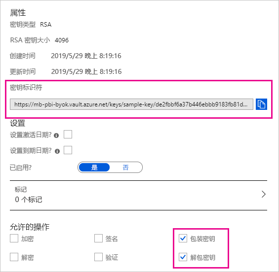

# <a name="bring-your-own-encryption-keys-for-power-bi"></a>自带加密密钥使用 Power BI

Power BI 会对_静态_数据和_正在处理_的数据进行加密。 默认情况下，Power BI 使用 Microsoft 托管密钥来加密数据。 在 Power BI Premium 中，还可以对导入数据集的静态数据使用自己的密钥（有关详细信息，请参阅[数据源和存储注意事项](#data-source-and-storage-considerations)）。 这种方法通常被称为_创建自己的密钥_ (BYOK)。

## <a name="why-use-byok"></a>为何使用 BYOK？

BYOK 让满足有关指定与云服务提供商（在本例中为 Microsoft）的密钥安排的合规性要求变得更轻松。 借助 BYOK，可以在应用程序级别为 Power BI 静态数据提供加密密钥并进行控制。 因此，如果决定退出服务，则可以行使控制权并撤消组织密钥。 撤销密钥后，30 分钟内数据对服务将不可读取。

## <a name="data-source-and-storage-considerations"></a>数据源和存储注意事项

若要使用 BYOK，必须从 Power BI Desktop (PBIX) 文件将数据上传到 Power BI 服务。 不能在以下方案中使用 BYOK：

- Analysis Services 实时连接
- Excel 工作簿（除非是首次将数据导入 Power BI Desktop）
- [推送数据集](/rest/api/power-bi/pushdatasets)
- [流数据集](../connect-data/service-real-time-streaming.md#set-up-your-real-time-streaming-dataset-in-power-bi)
- [大型模型](service-premium-large-models.md)

BYOK 仅适用于数据集。 用户可以上传到服务的推送数据集、Excel 文件和 CSV 文件不使用自己的密钥进行加密。 若要确定哪些项目存储在工作区中，请使用以下 PowerShell 命令：

```PS C:\> Get-PowerBIWorkspace -Scope Organization -Include All```

> [!NOTE]
> 此 cmdlet 需要 Power BI 管理模块 v1.0.840。 可以通过运行 Get-InstalledModule -Name MicrosoftPowerBIMgmt 来查看你拥有的版本。 通过运行 Install-Module -Name MicrosoftPowerBIMgmt 安装最新版本。 可在 [Power BI PowerShell cmdlet 模块](https://docs.microsoft.com/powershell/power-bi/overview)中获取有关 Power BI cmdlet 及其参数的详细信息。

## <a name="configure-azure-key-vault"></a>配置 Azure 密钥保管库

在此部分中，你将学习如何配置 Azure Key Vault - 一种用于安全存储和访问加密密钥等机密的工具。 可以使用现有密钥保管库来存储加密密钥，也可以创建专门与 Power BI 配合使用的新密钥保管库。

本部分中的说明假定具有 Azure 密钥保管库基本知识。 有关详细信息，请参阅[什么是 Azure 密钥保管库？](/azure/key-vault/key-vault-whatis)。 按以下方式配置密钥保管库：

1. 将 Power BI 服务作为密钥保管库的服务主体添加，并提供包装和解包权限。

1. 创建长度为 4096 位的 RSA 密钥（或使用此类型的现有密钥），并提供包装和解包权限。

    > [!IMPORTANT]
    > Power BI BYOK 仅支持 4096 位长度的 RSA 密钥。

1. 建议：检查并确保密钥保管库已启用“软删除”选项  。

### <a name="add-the-service-principal"></a>添加服务主体

1. 在 Azure 门户的密钥保管库中，在“访问策略”下，选择“新建”   。

1. 在“选择主体”下，搜索并选择“Microsoft.Azure.AnalysisServices”  。

    > [!NOTE]
    > 如果找不到“Microsoft.Azure.AnalysisServices”，则可能是与 Azure Key Vault 关联的 Azure 订阅没有与之关联的 Power BI 资源。 请尝试改为搜索以下字符串：00000009-0000-0000-c000-000000000000。

1. 在“密钥权限”下，选择“解包密钥”和“包装密钥”    。

    

1. 依次选择“确定”和“保存”   。

> [!NOTE]
> 若要在将来撤消 Power BI 对你的数据的访问权限，请从 Azure 密钥保管库中删除对此服务主体的访问权限。

### <a name="create-an-rsa-key"></a>创建 RSA 密钥

1. 在密钥保管库中的“密钥”下，选择“生成/导入”   。

1. 选择 RSA 的“密钥类型”和 4096 的“RSA 密钥大小”   。

    

1. 选择“创建”  。

1. 在“密钥”下，选择所创建的密钥  。

1. 选择密钥“当前版本”的 GUID  。

1. 检查并确保已选中“包装密钥”和“解包密钥”   。 复制“密钥标识符”，以在 Power BI 中启用 BYOK 时使用  。

    

### <a name="soft-delete-option"></a>“软删除”选项

我们建议在密钥保管库中启用[软删除](/azure/key-vault/key-vault-ovw-soft-delete)，以防止在意外删除密钥或密钥保险库时丢失数据。 必须使用 [PowerShell 在密钥保管库中启用“软删除”属性](/azure/key-vault/key-vault-soft-delete-powershell)，因为 Azure 门户尚未提供此选项。

正确配置 Azure 密钥保管库后，即可在租户上启用 BYOK。

## <a name="enable-byok-on-your-tenant"></a>在租户上启用 BYOK

使用 [PowerShell](https://www.powershellgallery.com/packages/MicrosoftPowerBIMgmt.Admin) 在租户级别启用 BYOK 时，首先会向 Power BI 租户引入在 Azure Key Vault 中创建和存储的加密密钥。 然后，可以为每个高级容量分配这些加密密钥，以加密容量中的内容。

### <a name="important-considerations"></a>重要注意事项

在启用 BYOK 之前，请记住以下注意事项：

- 目前，无法在启用 BYOK 后再将其禁用。 根据为 `Add-PowerBIEncryptionKey` 指定参数的方式，可以控制将 BYOK 用于一个或多个容量的方式。 但是，无法撤消向租户引入密钥的操作。 有关详细信息，请参阅[启用 BYOK](#enable-byok)。

- 不能_直接_将使用 BYOK 的工作区从 Power BI Premium 中的专用容量移至共享容量。 必须先将工作区移至未启用 BYOK 的专用容量。

- 如果将使用 BYOK 的工作区从 Power BI Premium 中的专用容量移动到共享，则报表和数据集将变为不可访问，因为它们是使用密码进行访问的。 为了避免该情况，必须先将工作区移至未启用 BYOK 的专用容量。

### <a name="enable-byok"></a>启用 BYOK

若要启用 BYOK，你必须是使用 `Connect-PowerBIServiceAccount` cmdlet 登录的 Power BI 服务的租户管理员。 然后，使用 [`Add-PowerBIEncryptionKey`](/powershell/module/microsoftpowerbimgmt.admin/Add-PowerBIEncryptionKey) 启用 BYOK，如下例所示：

```powershell
Add-PowerBIEncryptionKey -Name'Contoso Sales' -KeyVaultKeyUri'https://contoso-vault2.vault.azure.net/keys/ContosoKeyVault/b2ab4ba1c7b341eea5ecaaa2wb54c4d2'
```

要添加多个密钥，请为 `-Name` 和 `-KeyVaultKeyUri` 运行具有不同值的 `Add-PowerBIEncryptionKey`。 

cmdlet 接受两个影响当前和未来容量加密的开关参数。 默认情况下，两个开关均未设置：

- `-Activate`：表示此密钥将用于租户中尚未加密的所有现有容量。

- `-Default`：表示此密钥现在是整个租户的默认密钥。 创建新容量时，容量会继承此密钥。

> [!IMPORTANT]
> 如果指定 `-Default`，则之后在你的租户上创建的所有容量都将使用指定的密钥（或更新的默认密钥）进行加密。 无法撤消默认操作，因此无法创建不在租户中使用 BYOK 的高级容量。

在租户上启用 BYOK 后，请为一个或多个 Power BI 容量设置加密密钥：

1. 使用 [`Get-PowerBICapacity`](/powershell/module/microsoftpowerbimgmt.capacities/get-powerbicapacity) 获取下一步所需的容量 ID。

    ```powershell
    Get-PowerBICapacity -Scope Individual
    ```

    cmdlet 将返回类似于以下输出的输出：

    ```
    Id              : xxxxxxxx-xxxx-xxxx-xxxx-xxxxxxxxxxxx
    DisplayName     : Test Capacity
    Admins          : adam@sometestdomain.com
    Sku             : P1
    State           : Active
    UserAccessRight : Admin
    Region          : North Central US
    ```

1. 使用 [`Set-PowerBICapacityEncryptionKey`](/powershell/module/microsoftpowerbimgmt.admin/set-powerbicapacityencryptionkey) 设置加密密钥：

    ```powershell
    Set-PowerBICapacityEncryptionKey-CapacityId xxxxxxxx-xxxx-xxxx-xxxx-xxxxxxxxxxxx -KeyName 'Contoso Sales'
    ```

可以控制在租户中使用 BYOK 的方式。 例如，若要加密单个容量，请在不调用 `-Activate` 或 `-Default` 的情况下调用 `Add-PowerBIEncryptionKey`。 然后，为想要在其中启用 BYOK 的容量调用 `Set-PowerBICapacityEncryptionKey`。

## <a name="manage-byok"></a>管理 BYOK

Power BI 提供其他 cmdlet 来帮助在租户中管理 BYOK：

- 使用 [`Get-PowerBICapacity`](/powershell/module/microsoftpowerbimgmt.capacities/get-powerbicapacity) 获取容量当前正在使用的密钥：

    ```powershell
    Get-PowerBICapacity -Scope Organization -ShowEncryptionKey
    ```

- 使用 [`Get-PowerBIEncryptionKey`](/powershell/module/microsoftpowerbimgmt.admin/get-powerbiencryptionkey) 获取租户当前正在使用的密钥：

    ```powershell
    Get-PowerBIEncryptionKey
    ```

- 使用 [`Get-PowerBIWorkspaceEncryptionStatus`](/powershell/module/microsoftpowerbimgmt.admin/get-powerbiworkspaceencryptionstatus) 查看工作区中的数据集是否已加密，以及其加密状态是否与工作区同步：

    ```powershell
    Get-PowerBIWorkspaceEncryptionStatus -Name'Contoso Sales'
    ```

    请注意，加密在容量级别启用，但指定工作区的加密状态在数据集级别获取。

- 使用 [`Switch-PowerBIEncryptionKey`](/powershell/module/microsoftpowerbimgmt.admin/switch-powerbiencryptionkey) 切换（或_旋转_）要用于加密的密钥的版本。 cmdlet 只更新密钥 `-Name` 的 `-KeyVaultKeyUri`：

    ```powershell
    Switch-PowerBIEncryptionKey -Name'Contoso Sales' -KeyVaultKeyUri'https://contoso-vault2.vault.azure.net/keys/ContosoKeyVault/b2ab4ba1c7b341eea5ecaaa2wb54c4d2'
    ```


## <a name="next-steps"></a>后续步骤

* [Power BI PowerShell cmdlet 模块](https://docs.microsoft.com/powershell/power-bi/overview) 

* [在 Power BI 中共享工作的方式](../collaborate-share/service-how-to-collaborate-distribute-dashboards-reports.md)

* [在 URL 使用查询字符串参数筛选报表](../collaborate-share/service-url-filters.md)

* [在 SharePoint Online 中嵌入报表 Web 部件](../collaborate-share/service-embed-report-spo.md)

* [从 Power BI 发布到 Web](../collaborate-share/service-publish-to-web.md)

