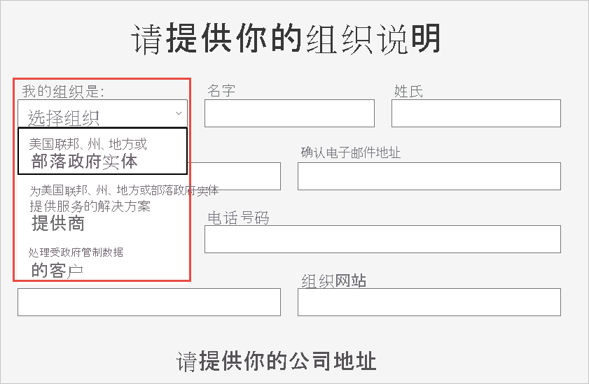

# 在 Power BI 服务中注册你的美国政府组织

[Microsoft 365 政府版计划](https://www.microsoft.com/microsoft-365/government/compare-office-365-government-plans?rtc=1)包含 Power BI 服务版本。 本文面向美国政府客户，此处描述的注册过程不同于 Power BI 服务的商业版本。

有关适用于美国政府的 Power BI 服务的更多信息，请查看[适用于美国政府客户的 Power BI - 概述](service-govus-overview.md)。

> [!NOTE]
> 本文适用于有权为其美国政府组织注册 Power BI 的管理员。 如果你是最终用户，请与你的管理员联系以获取适用于美国政府的 Power BI 订阅。
> 
> 

## 为你的美国政府组织选择正确的注册流程

你的美国政府组织可能是政府云社区的新用户，也可能已经拥有订阅。 以下各节根据你对 Microsoft 365 政府版计划和 Power BI 的参与程度，详细介绍了相应的注册步骤。 步骤因当前注册而异。

注册 Power BI 美国政府版后，请与你的帐户团队合作，启动本文中描述的[允许列表流程](#additional-signup-information)。 需要此步骤才能在政府社区云中完全启用组织。

## 注册新的 Microsoft 365 政府版计划

如果你的组织刚开始接触政府云社区，请按照以下步骤获取 Microsoft 365 政府版计划：

> [!NOTE]
> 这些步骤应由全局管理员执行。
>

1. 转到 [Microsoft 365 政府版计划](https://products.office.com/government/office-365-web-services-for-government)。
2. 选择“立即使用免费试用版”。
3. 填写表格，告诉我们你的组织。 使用下拉列表选择组织类型。

   

4. 提交表单以启动载入流程。 你的 Microsoft 代表或合作伙伴可以帮助解决任何问题。

此过程完成后，按照适用于现有 Microsoft 365 政府版客户的步骤添加 Power BI 订阅。

## 将 Power BI 添加到 Microsoft 365 政府版计划

如果组织已有 Microsoft 365 政府版计划，请按照以下步骤添加 Power BI 订阅：

> [!NOTE]
> 这些步骤应由全局管理员执行。
> 
> 

1. 使用全局管理员或计费管理员凭据登录到 Microsoft 365 管理中心。
2. 选择“计费” > “购买服务”。
4. 搜索或滚动以查找 Power BI Pro 政府版产品/服务，并选择“试用”或“立即购买” 。
5. 完成你的订单。
6. 向用户帐户分配许可证。

## 其他注册信息

在使用美国政府 Power BI 服务之前，必须与 Microsoft 帐户团队合作，以将组织添加到允许列表。 Power BI 工程团队使用允许列表流程将客户从商业版云环境移动到安全的政府社区云。 该步骤可以保证美国政府版云中提供的功能按预期方式工作。 

若要启动允许列表流程，请与 Microsoft 帐户团队联系以获得帮助。 只有管理员才能请求添加到允许列表。 此过程大约需要三个星期。 在此期间，Power BI 工程团队将作出适当更改以确保你的租户可在美国政府版云中正常运行。

## 后续步骤

* [适用于美国政府的 Power BI 的概述](service-govus-overview.md)
- [如何购买 Microsoft 365 政府版？](/office365/servicedescriptions/office-365-platform-service-description/office-365-us-government/microsoft-365-government-how-to-buy#how-do-i-buy-microsoft-365-government)