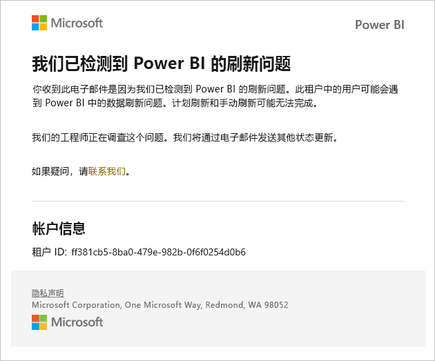
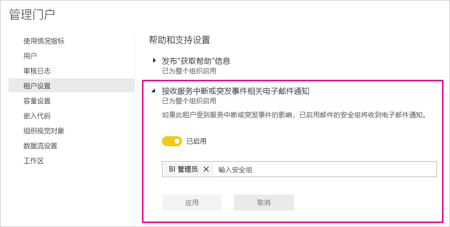

# 服务中断通知

深入了解关键业务应用程序的可用性至关重要。 Power BI 提供事件通知，因此，你可以选择在出现服务中断或降级时接收电子邮件。 Power BI 99.9% 的服务级别协议 (SLA) 使得此类事件发生的概率极低，但万一发生，我们希望确保你能及时了解情况。 以下屏幕截图显示了你在启用通知时将收到的电子邮件类型：

目前，我们会针对以下可靠性场景发送电子邮件：

- 打开报表可靠性
- 模型刷新可靠性
- 查询刷新可靠性

在打开报表、刷新数据集或执行查询等操作中出现较长延迟的情况时，系统会发送通知。 事件解决后，你将收到跟进电子邮件。

> [!NOTE]
> 此功能目前仅适用于 Power BI Premium 中的专用容量。 不适用于共享容量或嵌入容量。

## 容量和可靠性通知

如果 Power BI Premium 容量长期存在资源使用量较高的情况，进而可能影响可靠性时，系统会接收到通知电子邮件。 此类影响的示例包括操作中长时间的延迟，例如在打开报表、刷新数据集和执行查询的时候。 

通知电子邮件提供有关资源使用量高的原因的信息，包括以下详细信息：

* 相关数据集的数据集 ID
* 操作类型
* 与高资源使用量相关的 CPU 时间。 下面是维基百科中 [CPU 时间的定义](https://wikipedia.org/wiki/CPU_time)。

当 Power BI 检测到 Power BI Premium 容量存在重载时，也会发送电子邮件通知。 电子邮件会说明重载的可能原因、过去 10 分钟内产生负载的操作以及每个操作生成的负载量。

如果你有多个 Premium 容量，则电子邮件会包括重载期间的有关这些容量的信息。 你可以根据此信息考虑是否将消耗大量资源的项所在的工作区移动到负载最少的容量。

仅当触发重载阈值时，才会发送重载电子邮件通知。 当 Premium 容量上的负载恢复为非重载水平后，就不会再收到相关电子邮件。

下图显示了通知电子邮件的示例：

## 启用通知

Power BI 管理员在管理门户中启用通知：

1. 标识或创建已启用电子邮件的安全组，该安全组将接收通知。

1. 在管理员门户中，选择“租户设置”。 在“帮助和支持设置”下，展开“接收服务中断或突发事件相关电子邮件通知” 。

1. 启用通知，输入安全组，并选择“应用”。

    

> [!NOTE]
> Power BI 将通过帐户 no-reply-powerbi@microsoft.com 发送通知。 确保已将此帐户添加到“安全发件人”列表，这样通知就不会出现在“垃圾邮件”文件夹中。

## Microsoft 365 中的服务运行状况

本文介绍了如何通过 Power BI 接收服务通知。 你还可以通过 Microsoft 365 监视 Power BI 服务运行状况。 选择从 Microsoft 365 接收有关服务运行状况的电子邮件通知。 在[如何检查 Microsoft 365 服务运行状况](https://docs.microsoft.com/microsoft-365/enterprise/view-service-health)中了解详细信息。

## 后续步骤

[Power BI Pro 和 Power BI Premium 支持选项](service-support-options.md)

更多问题？ [尝试参与 Power BI 社区](https://community.powerbi.com/)
