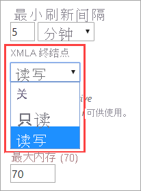
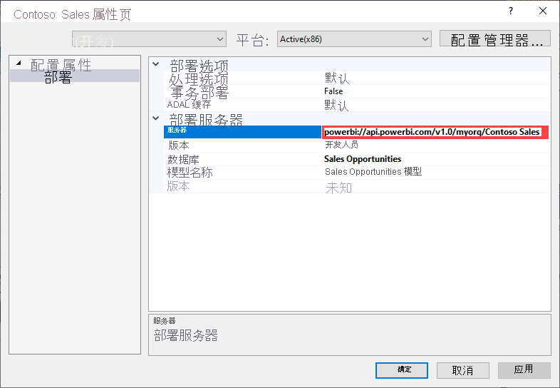
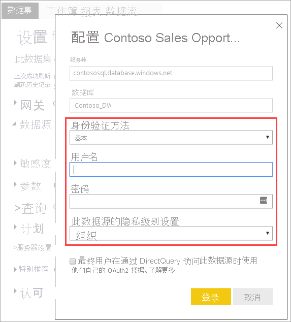
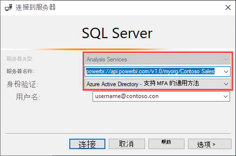
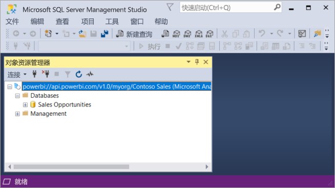
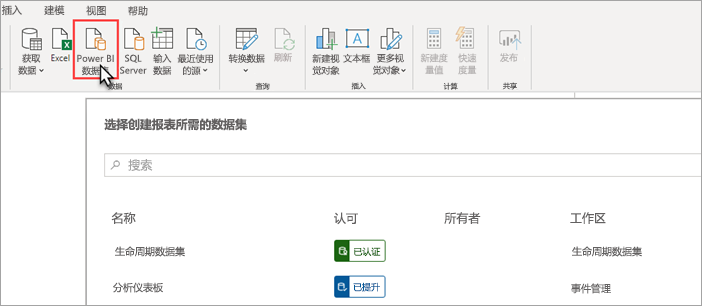
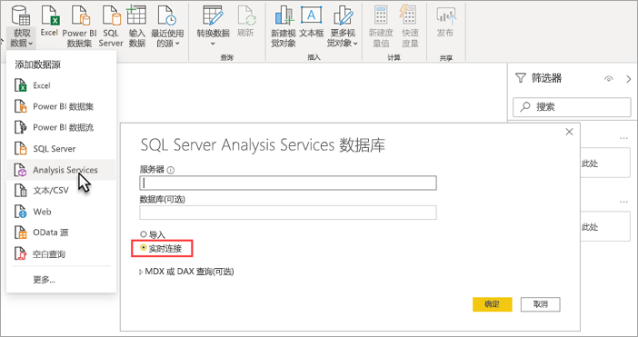

# 使用 XMLA 终结点的数据集连接（预览）

兼容性级别为 1500 及更高级别的 Power BI Premium 工作区和数据集支持，使用 XMLA 终结点从 Microsoft 和第三方客户端应用程序和工具进行开放平台连接。

> [!NOTE]
> 此功能处于预览阶段。 不得在生产环境中使用预览版功能。 某些功能、支持和文档是受到限制的。  若要了解详细信息，请参阅 [Microsoft Online Services 条款 (OST)](https://www.microsoft.com/licensing/product-licensing/products?rtc=1)。

## 什么是 XMLA 终结点？

Power BI Premium 使用 [XML for Analysis](/analysis-services/xmla/xml-for-analysis-xmla-reference?view=power-bi-premium-current) (XMLA) 协议，以规范客户端应用程序与管理 Power BI 工作区和数据集的引擎之间的通信。 这些通信通过通常所说的 XMLA 终结点进行。 XMLA 是 Microsoft Analysis Services 引擎所使用的同一通信协议，该协议在底层运行 Power BI 的语义建模、治理、生命周期和数据管理。

容量的数据集工作负荷默认启用使用终结点实现的只读连接。 利用只读终结点，数据可视化应用程序和工具可以查询数据集模型数据、元数据、事件和架构。 可以启用使用终结点实现的读写操作，从而提供额外的数据集管理、治理、高级语义建模、调试和监视功能。 启用读写终结点后，Power BI Premium 数据集与 Azure Analysis Services 和 SQL Server Analysis Services 企业级表格建模工具和流程的相似之处就更多了。

> [!NOTE]
> 建议采用新式工作区体验，尤其是在使用 XMLA 终结点连接到数据集时。 经典工作区不支持创建或删除数据集等操作。 要将经典工作区升级为新式体验，请参阅[在 Power BI 中升级经典工作区](../collaborate-share/service-upgrade-workspaces.md)。

## 数据建模和管理工具

下面是一些最常与 Azure Analysis Services 和 SQL Server Analysis Services 配合使用的工具，现在也受到 Power BI Premium 数据集的支持：

**包含 Analysis Services 项目的 Visual Studio** - 亦称为“SQL Server Data Tools (SSDT)”，是用于 Analysis Services 表格模型的企业级模型创作工具。 所有 Visual Studio 2017 及更高版本（包括免费的 Community 版本）都支持 Analysis Services 项目扩展。 必须有版本 2.9.6 或更高版本扩展，才能将表格模型部署到 Premium 工作区。 部署到 Premium 工作区的模型的兼容性级别必须为 1500 或更高级别。 必须为数据集工作负荷启用 XMLA 读写终结点。 若要了解详细信息，请参阅 [Analysis Services 工具](/analysis-services/tools-and-applications-used-in-analysis-services?view=power-bi-premium-current)。

**SQL Server Management Studio (SSMS)**  - 支持 DAX、MDX 和 XMLA 查询。 使用[表格模型脚本语言](/analysis-services/tmsl/tabular-model-scripting-language-tmsl-reference) (TMSL) 对数据集元数据执行精细刷新操作，并为之编写脚本。 必须启用只读终结点，才能执行查询操作。 必须启用读写终结点，才能为元数据编写脚本。 SSMS 必须为版本 18.4 或更高版本。 请单击 [此处](/sql/ssms/download-sql-server-management-studio-ssms)下载。

**SQL Server Profiler** - 随 SSMS 一起安装，此工具可以对数据集事件进行跟踪和调试。 尽管 Profiler 已正式被 SQL Server 弃用，但仍继续保留在 SSMS 中，并继续受到 Analysis Services 和 Power BI Premium 支持。 必须启用 XMLA 只读终结点。 若要了解详细信息，请参阅 [适用于 Analysis Services 的 SQL Server Profiler](/analysis-services/instances/use-sql-server-profiler-to-monitor-analysis-services?view=power-bi-premium-current)。

**Analysis Services 部署向导** - 随 SSMS 一起安装，此工具可以将 Visual Studio 创作的表格模型项目部署到 Analysis Services 和 Power BI Premium 工作区。 它可以交互运行，也可以通过命令行自动运行。 必须启用 XMLA 读写终结点。 若要了解详细信息，请参阅 [Analysis Services 部署向导](/analysis-services/deployment/deploy-model-solutions-using-the-deployment-wizard?view=power-bi-premium-current)。

**PowerShell cmdlet** - Analysis Services cmdlet 可用于自动执行数据集管理任务（如刷新操作）。 必须启用 XMLA 读写终结点。 [SqlServer PowerShell 模块](https://www.powershellgallery.com/packages/SqlServer/)必须为版本 21.1.18221 或更高版本。 Power BI Premium 不支持 Az.AnalysisServices 模块中的 Azure Analysis Services cmdlet。 若要了解详细信息，请参阅 [Analysis Services PowerShell 参考](/analysis-services/powershell/analysis-services-powershell-reference?view=power-bi-premium-current)。

**Power BI Report Builder** - 用于创作分页报表的工具。 创建报表定义，用于指定要检索的数据、数据获取位置和数据显示方式。 可以先在 Report Builder 中预览报表，再将报表发布到 Power BI 服务。 必须启用 XMLA 只读终结点。 若要了解详细信息，请参阅  [Power BI Report Builder](../paginated-reports/report-builder-power-bi.md)。

**表格编辑器** - 开放源代码工具，用于使用直观的轻量级编辑器来创建、维护和管理表格模型。 层次结构视图显示表格模型中的所有对象。 对象是使用显示文件夹整理的，它们支持多选属性编辑和 DAX 语法突出显示。 必须启用 XMLA 只读终结点，才能执行查询操作。 必须启用读写终结点，才能执行元数据操作。 若要了解详细信息，请参阅 [tabulareditor.github.io](https://tabulareditor.github.io/)。

**DAX Studio** - 用于 DAX 创作、诊断、性能优化和分析的开放源代码工具。 功能包括对象浏览、集成跟踪、包含详细统计信息的查询执行情况分解、DAX 语法突出显示和格式设置。 必须启用 XMLA 只读终结点，才能执行查询操作。 若要了解详细信息，请参阅  [daxstudio.org](https://daxstudio.org/)。

**ALM 工具包** - 用于 Power BI 数据集的开放源代码架构比较工具，最常用于应用程序生命周期管理 (ALM) 方案。 跨环境执行部署，并保留增量刷新历史数据。 区分和合并元数据文件、分支和存储库。 在数据集之间重用共同定义。 必须启用只读终结点，才能执行查询操作。 必须启用读写终结点，才能执行元数据操作。 若要了解详细信息，请参阅  [alm-toolkit.com](http://alm-toolkit.com/)。

**Microsoft Excel** - Excel 数据透视表是最常用的工具之一，用于汇总、分析、浏览和呈现 Power BI 数据集中的汇总数据。 必须启用只读终结点，才能执行查询操作。 即点即用 Office 必须为版本 16.0.11326.10000 或更高版本。

**第三方** - 包括客户端数据可视化应用程序和工具，可用于连接到、查询和使用 Power BI Premium 中的数据集。 大多数工具都需要最新版本的 MSOLAP 客户端库，但某些可以使用 ADOMD。 需要启用只读还是读写 XMLA 终结点取决于操作是什么。

### 客户端库

客户端应用程序不直接与 XMLA 终结点通信。 而是使用客户端库作为抽象层。 这些也是应用程序用于连接到 Azure Analysis Services 和 SQL Server Analysis Services 的相同客户端库。 Excel、SQL Server Management Studio (SSMS) 和 Visual Studio 的 Analysis Services 项目扩展等 Microsoft 应用程序安装了所有这三个客户端库，并将它们与常规应用程序和扩展更新一起更新。 开发人员还可以使用客户端库来生成自定义应用程序。 在某些情况下，特别是对于第三方应用程序，如果客户端库没有与应用程序一起安装，可能需要安装更高版本的客户端库。 客户端库会每月更新。 若要了解详细信息，请参阅 [用于连接到 Analysis Services 的客户端库](/azure/analysis-services/analysis-services-data-providers)。

## 支持的写入操作

数据集元数据是通过基于表格对象模型 (TOM) 的客户端库公开的，以便开发人员能够生成自定义应用程序。 这样一来，Visual Studio 和开放源代码社区工具（如表格编辑器）可以提供其他数据建模和部署功能，这些功能受 Analysis Services 引擎支持，但尚不受 Power BI Desktop 支持。 其他数据建模功能包括：

- [计算组](/analysis-services/tabular-models/calculation-groups?view=power-bi-premium-current)：用于计算可重用性和简化复杂模型的使用。

- [元数据翻译](/analysis-services/tabular-models/translations-in-tabular-models-analysis-services?view=power-bi-premium-current)：用于支持多语言报表和数据集。

- [透视](/analysis-services/tabular-models/perspectives-ssas-tabular?view=power-bi-premium-current)：用于定义数据集元数据的特定业务域重点视图。

Power BI Premium 数据集尚不支持对象级别安全性 (OLS)。

## 为了支持写入操作而优化数据集

若要将 XMLA 终结点用于执行包含写入操作的数据集管理，建议为数据集启用大型模型。 这减少了写入操作的开销，从而大大提高了写入操作的速度。 对于（压缩后）大小超过 1GB 的数据集，差异可能非常显著。 若要了解详细信息，请参阅 [Power BI Premium 中的大型模型](service-premium-large-models.md)。

## 启用 XMLA 读写终结点

Premium 容量默认启用设置为“只读”的“XMLA 终结点”属性。 也就是说，应用程序只能查询数据集。 为了让应用程序能够执行写入操作，必须启用设置为“读写”的“XMLA 终结点”属性。 容量的“XMLA 终结点”属性设置是在数据集工作负荷中配置的。 “XMLA 终结点”设置应用于分配给容量的所有工作区和数据集。

### 为容量启用读写终结点的具体步骤

1. 在管理门户中，依次单击“容量设置” > “Power BI Premium”和容量名称。
2. 展开“工作负荷”。 在“XMLA 终结点”设置中，选择“读写”。

    

## 连接到 Premium 工作区

分配给专用容量的工作区具有 URL 格式的连接字符串，如下所示：`powerbi://api.powerbi.com/v1.0/[tenant name]/[workspace name]`。

连接到工作区的应用程序使用此 URL，就像是在使用 Analysis Services 服务器名称一样。 例如，`powerbi://api.powerbi.com/v1.0/contoso.com/Sales Workspace`。

同一租户（而不是 B2B）中使用 UPN 的用户可以将租户名称替换为 `myorg`。 例如： `powerbi://api.powerbi.com/v1.0/myorg/Sales Workspace`。

B2B 用户必须在租户名称中指定其组织 UPN。 例如： `powerbi://api.powerbi.com/v1.0/fabrikam.com/Sales Workspace`。

### 获取工作区连接 URL 的具体步骤

在工作区中，依次转到“设置” > “Premium” > “工作区连接”，然后单击“复制”。

## 连接要求

### 初始目录

使用一些工具（如 SQL Server Profiler）时，可能需要指定初始目录。 在工作区中指定数据集（数据库）。 在“连接到服务器”对话框中，依次单击“选项” > “连接属性” > “连接到数据库”，然后输入数据集名称。

### 重复的工作区名称

Power BI 中（使用新工作区体验创建）的[新工作区](../collaborate-share/service-new-workspaces.md)强制执行验证，不允许使用重复名称创建或重命名工作区。 尚未迁移的工作区可能会导致名称重复。 连接到与另一工作区同名的工作区时，可能会出现以下错误：

无法连接到 powerbi://api.powerbi.com/v1.0/[租户名称]/[工作区名称]。

若要修复此错误，请除了指定工作区名称之外，还指定 ObjectIDGuid（可以从工作区 URL 中的 objectID 复制而来）。 将 objectID 追加到连接 URL。 例如，  
“powerbi://api.powerbi.com/v1.0/myorg/Contoso Sales - 9d83d204-82a9-4b36-98f2-a40099093830”。

### 复制数据集名称

连接到与同一工作区中的另一数据集同名的数据集时，请将数据集 guid 追加​​到数据集名称。 在 SSMS 中连接到工作区时，可以同时获取数据集名称和 GUID。

### 显示的数据集中的延迟

连接到工作区后，来自新的、已删除的和已重命名的数据集的更改可能需要几分钟才会出现。

### 不支持的数据集

XMLA 终结点无法访问以下数据集。 在 SSMS 或其他工具中，这些数据集不会显示在工作区下：

- 基于与 Azure Analysis Services 或 SQL Server Analysis Services 模型的实时连接的数据集。 
- 基于与其他工作区中 Power BI 数据集的实时连接的数据集。 若要了解详细信息，请参阅[跨工作区使用数据集简介](../connect-data/service-datasets-across-workspaces.md)。
- 使用 REST API 推送数据的数据集。
- Excel 工作簿数据集。

## 安全性

除了要由容量管理员启用为“读写”的“XMLA 终结点”属性外，还必须启用 Power BI 管理门户中的租户级“导出数据”设置（这也是“在 Excel 中分析”所必需的）。

通过 XMLA 终结点进行的访问遵守在工作区/应用级别设置的安全组成员身份。

工作区参与者及以上人员对数据集拥有写权限，因此相当于 Analysis Services 数据库管理员。 他们可以从 Visual Studio 部署新的数据集，并在 SSMS 中执行 TMSL 脚本。

Power BI Premium 暂不支持需要 Analysis Services 服务器管理员（而不是数据库管理员）权限的操作，如使用 [EffectiveUserName](/analysis-services/instances/connection-string-properties-analysis-services?view=power-bi-premium-current#bkmk_auth) 连接字符串属性进行服务器级别跟踪和用户模拟。

其他对数据集拥有[生成权限](../connect-data/service-datasets-build-permissions.md)的用户相当于 Analysis Services 数据库读取者。 他们可以连接到并浏览数据集，从而使用并可视化数据。 由于遵守的是行级别安全性 (RLS) 规则，因此他们无法查看内部数据集元数据。

### 模型角色

通过 XMLA 终结点访问的数据集元数据可以创建、修改或删除数据集的模型角色，包括设置行级别安全性 (RLS) 筛选器。 Power BI 中的模型角色只用于实现 RLS。 若要控制 RLS 以外的权限，请使用 Power BI 安全模型。

通过 XMLA 终结点处理数据集角色时，需要遵循以下限制：

- **在公共预览版期间，无法使用 XMLA 终结点来指定数据集的角色成员身份**。 相反，请在 Power BI 服务中的“行级别安全性”页上指定数据集的角色成员。
- 对于 Power BI 数据集，唯一可设置的角色权限是读取权限。 无论数据集角色是否存在，都必须设置数据集的生成权限，才能通过 XMLA 终结点读取访问数据集。 若要控制 RLS 以外的权限，请使用 Power BI 安全模型。
- Power BI 暂不支持对象级别安全性 (OLS) 规则。

### 设置数据源凭据

通过 XMLA 终结点指定的元数据可以创建与数据源的连接，但无法设置数据源凭据。 相反，可以在 Power BI 服务的“数据集设置”页中设置凭据。

### 服务主体

Azure 服务主体可用于执行无人参与的资源和服务级别操作。 若要了解详细信息，请参阅[使用服务主体自动完成 Premium 工作区和数据集任务](service-premium-service-principal.md)。

## 部署 Visual Studio 中的模型项目 (SSDT)

将 Visual Studio 中的表格模型项目部署到 Power BI Premium 工作区，与部署到 Azure Analysis Services 或 SQL Server Analysis Services 服务器大致相同。 唯一的不同之处在于，为项目指定的“部署服务器”属性，以及如何指定数据源凭据才能让处理操作将数据从数据源导入到工作区中的新数据集内。

> [!IMPORTANT]
> 在公共预览版期间，使用 XMLA 终结点的工具无法指定角色成员身份。 如果无法部署模型项目，请确保没有在任何角色中指定用户。 在模型成功部署后，在 Power BI 服务中指定数据集角色的用户。 若要了解详细信息，请参阅本文前面介绍的[模型角色](#model-roles)。

必须先在项目“部署服务器”属性中设置工作区连接 URL，然后才能部署 Visual Studio 中创作的表格模型项目。 在 Visual Studio 的“解决方案资源管理器”中，右键单击项目，然后单击“属性”。 在“服务器”属性中，粘贴工作区连接 URL。

指定“部署服务器”属性后，就可以部署项目了。

首次部署时，数据集是通过使用 model.bim 中的元数据在工作区中创建。 在部署操作过程中，在工作区中通过模型元数据创建数据集后，无法执行将数据从数据源加载到数据集中的处理操作。

处理操作之所以失败是因为，在部署到 Azure 或 SQL Server Analysis Server 实例时，系统会在部署操作过程中提示提供数据源凭据，而在部署到 Premium 工作区时，无法在部署操作过程中指定数据源凭据。 相反，在元数据部署成功且数据集创建后，数据源凭据则在 Power BI 服务的“数据集设置”中指定。 在工作区中，依次单击“数据集” > “设置” > “数据源凭据” > “编辑凭据”。

如果数据源凭据已指定，则可以在 Power BI 服务中刷新数据集、配置计划刷新，或从 SQL Server Management Studio 执行处理操作（刷新）以将数据加载到数据集中。

可以观察到在 Visual Studio 项目中指定的部署“处理选项”属性。 不过，如果数据源尚未在 Power BI 服务中指定凭据，即使元数据部署成功，处理操作也会失败。 可以将属性设置为“不处理”，以防止尝试在部署过程中进行处理，但不妨将属性设置回“默认”，因为在数据源设置中指定了新数据集的数据源凭据后，在后续部署操作过程中进行处理将会成功。

## 与 SSMS 连接

使用 SSMS 连接到工作区就像连接到 Azure Analysis Services 或 SQL Server Analysis Services 服务器一样。 唯一的不同之处在于，在服务器名称中指定工作区 URL，且必须使用“Active Directory - 通用且具有 MFA 支持”身份验证。

### 使用 SSMS 连接到工作区

1. 在 SQL Server Management Studio 中，依次单击“连接” > “连接到服务器”。

2. 在“服务器类型”中，选择“Analysis Services”。 在“服务器名称”中，输入工作区 URL。 在“身份验证”中，选择“Active Directory - 通用且具有 MFA 支持”，然后在“用户名”中输入组织用户 ID。

    

连接时，工作区显示为 Analysis Services 服务器，工作区中的数据集显示为数据库。  

若要详细了解如何使用 SSMS 为元数据编写脚本，请参阅[创建 Analysis Services 脚本](/analysis-services/instances/create-analysis-services-scripts-in-management-studio?view=power-bi-premium-current)和[表格模型脚本语言 (TMSL)](/analysis-services/tmsl/tabular-model-scripting-language-tmsl-reference?view=power-bi-premium-current)。

## 数据集刷新

XMLA 终结点支持各种方案，如使用 SSMS 实现精细刷新功能、使用 PowerShell 实现自动化、使用 TOM 实现 [Azure 自动化](/azure/automation/automation-intro)和 [Azure Functions](/azure/azure-functions/functions-overview)。 例如，可以刷新特定[增量刷新](service-premium-incremental-refresh.md)历史分区，而无需重新加载所有历史数据。

与在 Power BI 服务中配置刷新不同，通过 XMLA 终结点执行的刷新操作不限于每天 48 次刷新，并且不强制实施[计划刷新超时](../connect-data/refresh-troubleshooting-refresh-scenarios.md#scheduled-refresh-timeout)。

## 动态管理视图 (DMV)

Analysis Services [DMV](/analysis-services/instances/use-dynamic-management-views-dmvs-to-monitor-analysis-services) 公开了数据集元数据、世系和资源使用情况。 可用于在 Power BI 中通过 XMLA 终结点进行查询的 DMV 最多仅限于需要数据库管理员权限的 DMV。 例如，一些 DMV 不可访问，因为它们需要 Analysis Services 服务器管理员权限。

## Power BI Desktop 创作的数据集

### 增强型元数据

必须启用增强型元数据，才能对在 Power BI Desktop 中创作并发布到 Premium 工作区的数据集执行 XMLA 写入操作。 若要了解详细信息，请参阅[增强型数据集元数据](../connect-data/desktop-enhanced-dataset-metadata.md)。

> [!CAUTION]
> 目前，对在 Power BI Desktop 中创作的数据集执行写入操作会阻止将它下载回 PBIX 文件。 请务必保留原始 PBIX 文件。

### 数据源声明

连接到数据源和查询数据时，Power BI Desktop 使用 Power Query M 表达式作为内联数据源声明。 虽然在 Power BI Premium 工作区中受支持，但 Power Query M 内联数据源声明并不受 Azure Analysis Services 或 SQL Server Analysis Services 支持。 相反，Analysis Services 数据建模工具（如 Visual Studio）使用结构化和/或提供程序数据源声明来创建元数据。 对于 XMLA 终结点，Power BI Premium 也支持结构化和提供程序数据源，但不支持用作 Power BI Desktop 模型中的 Power Query M 内联数据源声明的一部分。 若要了解详细信息，请参阅[了解提供程序](/azure/analysis-services/analysis-services-datasource#understanding-providers)。

### Live Connect 模式下的 Power BI Desktop

Power BI Desktop 可通过实时连接功能连接 Power BI Premium 数据集 使用实时连接功能时，用户不需要在本地复制数据，因此可以更轻松地使用语义模型。 用户可以通过两种方式连接：

选择“Power BI 数据集”，然后选择要创建报表的数据集。 用户可采用这种建议方法实时连接数据集。 这种方法提供了更好的发现体验，能够显示数据集的认可级别。 用户无需查找和跟踪工作区 URL。 要查找数据集，用户只需键入数据集名或滚动即可找到所需的数据集。

用户可以连接的另一种方法是，使用“获取数据” > “Analysis Services”，将 Power BI Premium 工作区名指定为 URL，选择“实时连接”，然后在导航器中选择一个数据集  。 在这种情况下，Power BI Desktop 将使用 XMLA 终结点实时连接数据集，就像它是 Analysis Services 数据模型一样。 

如果组织的现有报表实时连接到要迁移到 Power BI Premium 数据集的 Analysis Services 数据模型，则只需在“转换数据” > “数据源设置”中更改服务器名称 URL 。

> [!NOTE]
> 在 XMLA 读写公共预览版期间，使用 Power BI Desktop 连接 Power BI Premium 数据集时，目前不支持使用“获取数据” > “Analysis Services”，再选择“实时连接”选项，将报表发布到 Power BI 服务  。

## 审核日志

当应用程序连接到工作区时，通过 XMLA 终结点进行的访问记录到包含以下操作的 Power BI 审核日志中：

|操作易记名称   |操作名称   |
|---------|---------|
|从外部应用程序连接到 Power BI 数据集      |  ConnectFromExternalApplication        |
|从外部应用程序请求刷新 Power BI 数据集      | RefreshDatasetFromExternalApplication        |
|从外部应用程序创建了 Power BI 数据集      |  CreateDatasetFromExternalApplication        |
|从外部应用程序编辑了 Power BI 数据集     |  EditDatasetFromExternalApplication        |
|从外部应用程序删除了 Power BI 数据集      |  DeleteDatasetFromExternalApplication        |

若要了解详细信息，请参阅 [审核 Power BI](service-admin-auditing.md)。

## 另请参阅

更多问题？ [尝试咨询 Power BI 社区](https://community.powerbi.com/)