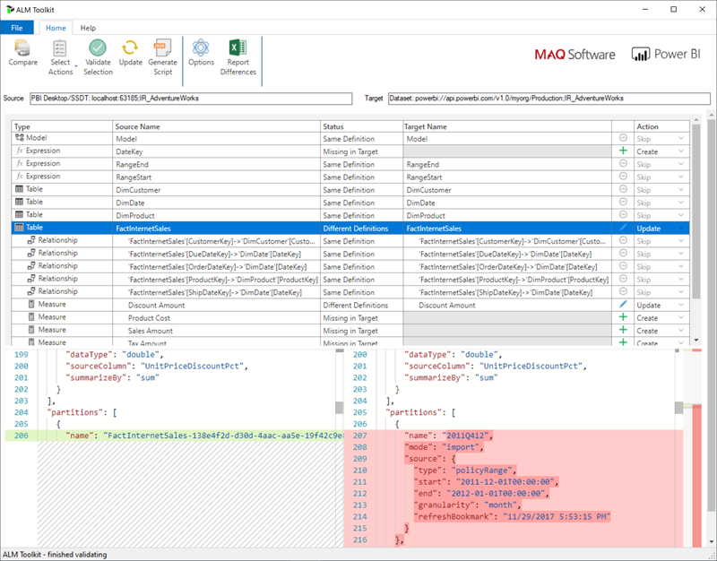

# <a name="incremental-refresh-in-power-bi"></a>Power BI 中的增量刷新

增量刷新功能可在 Power BI 中启用大型数据集，且具备以下优势：

> [!div class="checklist"]
> * **刷新更快捷** - 只需刷新已更改的数据。 例如，只刷新 10 年数据集中最近 5 天的数据。
> * **刷新更可靠** - 不再需要维护与不稳定的源系统的长期连接。
> * **降低资源消耗** - 要刷新的数据量减少，这降低了内存和其他资源的整体消耗。

> [!NOTE]
> 增量刷新现在可用于 Power BI Pro、Premium 以及共享的订阅和数据集。

## <a name="configure-incremental-refresh"></a>配置增量刷新

增量刷新策略在 Power BI Desktop 中进行定义，并在发布到 Power BI 服务时应用。

### <a name="filter-large-datasets-in-power-bi-desktop"></a>在 Power BI Desktop 中筛选大型数据集

Power BI Desktop 模型可能不适合处理具有可能数十亿行的大型数据集，因为 PBIX 文件通常受台式计算机上可用内存资源的限制。 因此，这些数据集通常在导入时进行筛选。 无论是否使用增量刷新，这种类型的筛选都适用。 对于增量刷新，使用 Power Query 日期/时间参数进行筛选。

#### <a name="rangestart-and-rangeend-parameters"></a>RangeStart 和 RangeEnd 参数

对于增量刷新，数据集使用名称为 RangeStart 和 RangeEnd（为保留名称且区分大小写）的 Power Query 日期/时间参数进行筛选 。 这些参数用于筛选导入 Power BI Desktop 的数据，还用于在将数据发布到 Power BI 服务后将其动态地划分为多个范围。 参数值由服务进行替换，以筛选每个分区。 无需在服务的数据集设置中进行设置。 发布后，Power BI 服务会自动替代参数值。

若要使用默认值定义参数，请选择 Power Query 编辑器中的“管理参数”。


借助已定义的参数，可通过为列选择“自定义筛选器”菜单选项来应用筛选。


当列值在 RangeStart 上或其后且在 RangeEnd 之前时，请务必筛选行。 其他筛选器组合可能导致行的重复计数。


> [!IMPORTANT]
> 确保查询中的 RangeStart 或 RangeEnd 参数上存在一个等号 (=)，但二者不能同时具有等号 。 如果这两个参数都具有等号 (=)，部分行可能满足两个分区的条件，导致模型中存在重复数据。 例如，  
> \#"Filtered Rows" = Table.SelectRows(dbo_Fact, each [OrderDate] **>= RangeStart** and [OrderDate] **<= RangeEnd**) 可能导致重复数据。

> [!TIP]
> 虽然参数的数据类型必须是日期/时间，但可进行转换以符合数据源的要求。 例如，下面的 Power Query 函数将日期/时间值转换为类似于 yyyymmdd 形式的整数代理键，这对数据仓库而言非常常见。 此函数可通过筛选步骤调用。
>
> `(x as datetime) => Date.Year(x)*10000 + Date.Month(x)*100 + Date.Day(x)`

在 Power Query 编辑器中选择“关闭并应用”。 必须具备 Power BI Desktop 中数据集的子集。

#### <a name="filter-date-column-updates"></a>筛选日期列更新

对日期列的筛选用于动态地将数据划分为 Power BI 服务中的多个范围。 增量刷新不支持源系统中筛选后的日期列已更新的情况。 更新将体现为插入和删除，而非实际更新。 如果删除发生在历史范围内，而不是增量范围内，则不会被拾取。 这可能会因分区键冲突而导致数据刷新失败。

#### <a name="query-folding"></a>查询折叠

提交查询以执行刷新操作时，请务必将分区筛选器推送到源系统。 将筛选器向下推送，这意味着数据源应支持“查询折叠”。 大多数支持 SQL 查询的数据源都支持查询折叠。 但是，平面文件、blob 和 Web 等数据源通常不支持查询折叠。 如果数据源后端不支持筛选器，则无法将其向下推送。 在这种情况下，混合引擎会在本地补偿和应用筛选器，这可能需要从数据源中检索完整数据集。 此操作可能导致增量刷新非常慢，并且该进程可能耗尽 Power BI 服务或本地数据网关（如果使用）中的资源。

由于已对每个数据源提供各种级别的查询折叠支持，建议执行验证以确保源查询中包含筛选器逻辑。 为简化此操作，Power BI Desktop 会尝试执行此验证。 如果无法验证，则定义增量刷新策略时，增量刷新对话框中会显示警告。 基于 SQL 的数据源（如 SQL、Oracle 和 Teradata）可以依赖此警告。 如果没有跟踪查询，其他数据源可能无法进行验证。 如果 Power BI Desktop 无法进行确认，则显示以下警告。 如果看到此警告并且要检查是否正在执行所需的查询折叠，则可以使用 Query Diagnostics 功能，或者跟踪源数据库收到的查询。

 

### <a name="define-the-refresh-policy"></a>定义刷新策略

除实时连接模型外，表格的上下文菜单中提供增量刷新功能。


#### <a name="incremental-refresh-dialog"></a>“增量刷新”对话框

显示“增量刷新”对话框。 通过切换启用对话框。


> [!NOTE]
> 如果表格的 Power Query 表达式未引用具有保留名称的参数，则禁止切换。

标头文本说明了以下内容：

- 刷新策略是在 Power BI Desktop 中定义的，通过服务中的刷新操作进行应用。

- 即使能够从 Power BI 服务下载包含增量刷新策略的 PBIX 文件，也无法在 Power BI Desktop 中打开该文件。 虽然未来可能会支持此功能，但请记住，这些数据集可能变得很大，以至于无法在典型的台式计算机中下载和打开它们。

#### <a name="refresh-ranges"></a>刷新范围

以下示例定义了一个刷新策略，用于存储五个完整日历年的数据以及当年至今的数据，并以增量方式刷新 10 个整天的数据。 第一次刷新操作会加载历史数据。 后续刷新为增量刷新并执行以下操作（如果计划为每天运行）：

- 添加新的一天的数据。

- 刷新截至当前日期的 10 个整天的数据。

- 删除比当前日期早 5 年的日历年的数据。 例如，如果当前日期为 2019 年 1 月 1 日，则删除 2013 年的数据。

Power BI 服务中的第一次刷新可能需要更长时间才能导入全部五个完整日历年。 随后的刷新用时可能很少。


#### <a name="current-date"></a>当前日期

当前日期基于刷新时的系统日期。 如果为 Power BI 服务中的数据集启用了计划的刷新，则在确定当前日期时将考虑指定的时区。 通过 Power BI 服务手动调用和计划的刷新都将遵循时区（如果可用）。 例如，指定在太平洋时间（美国和加拿大）晚上 8 点刷新并指定时区，将根据太平洋时间确定当前日期，而不是 GMT（若根据后者确定，则当前时间将晚一天）。 不通过 Power BI 服务调用的刷新操作（如 [TMSL 刷新命令](/analysis-services/tmsl/refresh-command-tmsl?view=power-bi-premium-current)）将不考虑计划的刷新时区


> [!NOTE]
> 如果上述范围的定义是你所需的全部内容，可直接转到下面的发布步骤。 其他下拉菜单适用于高级功能。

### <a name="advanced-policy-options"></a>高级策略选项

#### <a name="detect-data-changes"></a>检测数据更改

10 天的增量刷新比 5 年的完全刷新更有效。 但是，还可以做得更好。 如果选中“检测数据更改”复选框，则可选择用于仅标识和刷新数据更改日期的日期/时间列。 此操作假定源系统中存在通常用于审核的列。 这不应与用于使用 RangeStart/RangeEnd 参数对数据进行分区的列相同。 将针对增量范围中的每个周期评估此列的最大值。 如果自上次刷新后未更改，则无需刷新周期。 在示例中，这可将增量刷新的天数从 10 天进一步减少到 2 天左右。


> [!TIP]
> 当前的设计要求将用于检测数据更改的列保留并缓存到内存中。 可能需要考虑采用以下某项技术来降低基数和内存消耗。
>
> 刷新时仅保留此列的最大值（可能是通过 Power Query 功能实现）。
>
> 根据刷新频率要求，将精度降低到可接受的水平。
>
> 请定义使用 XMLA 终结点来检测数据更改的自定义查询，并避免完全暂留列值。 有关详细信息，请参阅下面的“用于检测数据更改的自定义查询”部分。

#### <a name="only-refresh-complete-periods"></a>仅刷新完成周期

假设计划每天凌晨 4:00 运行刷新。 如果在这四个小时期间源系统中出现数据，则无需进行刷新。 对于某些天数而言，石油天然气行业的每日桶数等一些业务指标毫无意义。

再比如刷新财务系统中的数据，其中前一个月的数据在该月的第 12 个公历日获得批准。 可将增量范围设置为 1 个月，并安排在该月的第 12 天运行刷新。 选中此选项后，系统将在 2 月 12 日刷新 1 月份的数据。


> [!NOTE]
> 服务中的刷新操作在 UTC 时间下运行。 这可确定生效日期并对完成周期造成影响。 我们计划添加用于替代刷新操作生效日期的功能。

## <a name="publish-to-the-service"></a>发布到服务

现可刷新模型。 首次刷新可能需要更长时间来导入历史数据。 后续刷新使用增量刷新功能，因此速度可能大幅提升。

## <a name="query-timeouts"></a>查询超时

若要了解超时值如何对 Power BI 服务中的刷新操作进行限制，请参阅[刷新方案故障排除](../connect-data/refresh-troubleshooting-refresh-scenarios.md)一文。 查询还受到数据源的默认超时值的限制。 大多数关系源允许重写 M 表达式中的超时值。 例如，以下表达式通过 [SQL Server 数据访问函数](/powerquery-m/sql-database)将其设置为 2 小时。 策略范围定义的每个周期提交一个查询，以观察命令超时设置。

```powerquery-m
let
    Source = Sql.Database("myserver.database.windows.net", "AdventureWorks", [CommandTimeout=#duration(0, 2, 0, 0)]),
    dbo_Fact = Source{[Schema="dbo",Item="FactInternetSales"]}[Data],
    #"Filtered Rows" = Table.SelectRows(dbo_Fact, each [OrderDate] >= RangeStart and [OrderDate] < RangeEnd)
in
    #"Filtered Rows"
```

## <a name="xmla-endpoint-benefits-for-incremental-refresh"></a>XMLA 终结点有利于增量刷新

可以为 Premium 容量中数据集的 [XMLA 终结点](service-premium-connect-tools.md)启用读写操作，这可能会大大有利于增量刷新。 通过 XMLA 终结点执行的刷新操作不限于[每天 48 次刷新](../connect-data/refresh-data.md#data-refresh)，并且不强制实施[计划刷新超时](../connect-data/refresh-troubleshooting-refresh-scenarios.md#scheduled-refresh-timeout)，这可能对增量刷新方案很有用。

### <a name="refresh-management-with-sql-server-management-studio-ssms"></a>使用 SQL Server Management Studio (SSMS) 管理刷新

在启用 XMLA 终结点读写操作后，可以使用 SSMS 查看和管理通过应用增量刷新策略生成的分区。 例如，这样就可以刷新增量范围之外的特定历史分区，从而执行回溯更新，而无需刷新所有历史数据。 你还可以使用 SSMS，通过以批处理方式增量添加/刷新历史分区，为超大型数据集加载历史数据。


#### <a name="override-incremental-refresh-behavior"></a>重写增量刷新行为

借助 SSMS，还可以更全面地控制如何使用[表格模型脚本语言 (TMSL)](/analysis-services/tmsl/tabular-model-scripting-language-tmsl-reference?view=power-bi-premium-current) 和[表格对象模型 (TOM)](/analysis-services/tom/introduction-to-the-tabular-object-model-tom-in-analysis-services-amo?view=power-bi-premium-current) 调用增量刷新。 例如，在 SSMS 的“对象资源管理器”中，右键单击表，然后选择“处理表”菜单选项。 然后，单击“脚本”按钮，以生成 TMSL 刷新命令。


可以将下面的参数插入到 TMSL 刷新命令中，以重写默认增量刷新行为。

- **applyRefreshPolicy** - 如果表已定义增量刷新策略，applyRefreshPolicy 会确定策略是否已应用。 如果策略未应用，完全处理操作会保持分区定义不变，并且会完全刷新表中的所有分区。 默认值为 True。

- **effectiveDate** - 如果正在应用增量刷新策略，它需要知道当前日期，才能确定历史范围和增量范围的滚动窗口范围。 使用 effectiveDate 参数，可以重写当前日期。 这对于将数据增量刷新到过去或未来某个日期的测试、演示和业务方案（如未来预算）十分有用。 默认值是当前日期。

```json
{ 
  "refresh": {
    "type": "full",

    "applyRefreshPolicy": true,
    "effectiveDate": "12/31/2013",

    "objects": [
      {
        "database": "IR_AdventureWorks", 
        "table": "FactInternetSales" 
      }
    ]
  }
}
```

若要详细了解如何使用 TMSL 重写默认增量刷新行为，请参阅[刷新命令](/analysis-services/tmsl/refresh-command-tmsl?view=power-bi-premium-current)。

### <a name="custom-queries-for-detect-data-changes"></a>用于检测数据更改的自定义查询

可以使用 TMSL 和/或 TOM 重写检测数据更改的行为。 这不仅可用于避免在内存中缓存内暂留“上次更新时间”列，还可以实现以下方案：由 ETL 进程准备配置/指令表，用于仅标记需要刷新的分区。 这可以创建更高效的增量刷新流程，即无论更新是多久之前发生的，都只会刷新所需的时间段。

pollingExpression 应为轻量级 M 表达式或其他 M 查询的名称。 它必须返回标量值，并对各个分区都执行。 如果返回的值不同于上次发生增量刷新时的值，就会将分区标记为要完全处理。

下面的示例涵盖了回溯更改的历史范围中的全部 120 个月。 指定 120 个月（而不是 10 年）意味着，数据压缩的效率可能不那么高，但是可以避免刷新整个历史年份，因为如果一个月就可以完成回溯更改，那么刷新整个历史年份的成本会更高。

```json
"refreshPolicy": {
    "policyType": "basic",
    "rollingWindowGranularity": "month",
    "rollingWindowPeriods": 120,
    "incrementalGranularity": "month",
    "incrementalPeriods": 120,
    "pollingExpression": "<M expression or name of custom polling query>",
    "sourceExpression": [
    "let ..."
    ]
}
```

## <a name="metadata-only-deployment"></a>仅元数据部署

将 Power BI Desktop 中的新版 PBIX 文件发布到 Power BI Premium 中的工作区时，如果已有同名数据集，系统会提示你替换现有数据集。


在某些情况下，你可能不希望替换数据集，特别是在使用增量刷新时。 Power BI Desktop 中的数据集可能比服务中的数据集小得多。 如果服务中的数据集已应用增量刷新策略，它可能包含多个年份的历史数据；如果替换数据集，这些历史数据就会丢失。 刷新所有历史数据可能需要数小时，并导致用户的系统停机时间发生。

相反，最好执行仅元数据部署。 这样，可以部署新对象，而不丢失历史数据。 例如，如果已添加一些度量值，可以只部署新度量值，而无需刷新数据，从而节省了大量时间。

如果已配置读写操作，XMLA 终结点会提供与实现仅元数据部署的工具的兼容性。 例如，ALM 工具包是 Power BI 数据集的架构区分工具，可用于执行仅元数据部署。

请从 [Analysis Services Git 存储库](https://github.com/microsoft/Analysis-Services/releases)下载并安装最新版 ALM 工具包。 可通过“帮助”功能区获取文档链接和关于可支持性的信息。 若要执行仅元数据部署，请执行比较，然后选择正在运行的 Power BI Desktop 实例作为源，并选择服务中的现有数据集作为目标。 请考虑所显示的差异，跳过更新包含增量刷新分区的表，或者使用“选项”对话框为表更新保留分区。 验证选择，以确保目标模型的完整性，然互进行更新。



## <a name="see-also"></a>另请参阅

[使用 XMLA 终结点的数据集连接](service-premium-connect-tools.md)   
[刷新方案故障排除](../connect-data/refresh-troubleshooting-refresh-scenarios.md)