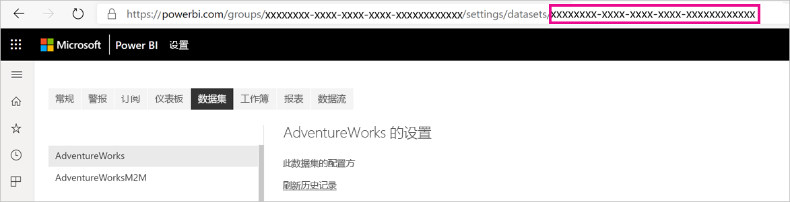

# <a name="large-datasets-in-power-bi-premium"></a>Power BI Premium 中的大型数据集

Power BI 数据集可以在高度压缩的内存中缓存中存储数据，以便优化查询性能，从而实现快速的用户交互性。 利用高级容量，可以使用“大型数据集存储格式”设置启用大小超过默认 10 GB 限制的大型数据集。 启用后，数据集大小受高级容量大小限制。

可以为所有 Premium P SKU 和 Embedded A SKU 启用大型数据集。 就数据模型大小限制而言，Premium 中的大型数据集大小限制可与 Azure Analysis Services 中的限制相比。

尽管数据集需要超过 10 GB，但启用“大型数据集存储格式”设置还具有其他优点。 如果打算使用基于 XMLA 终结点的工具来执行数据集写入操作，请确保启用此设置，即使对于不一定被视为大型数据集的数据集也是如此。 启用后，大型数据集存储格式可以提高 XMLA 写入操作的性能。

服务中的大型数据集不会影响 Power BI Desktop 模型上传大小，该大小仍限制为 10 GB。 然而刷新后，服务中的数据集可超过 10 GB。

## <a name="enable-large-datasets"></a>启用大型数据集

此处所列步骤介绍了如何为发布到服务的新模型启用大型数据集。 对于现有数据集，只需执行第三步。

1. 在 Power BI Desktop 中创建模型。 如果你的数据集将变得越来越大，并且内存消耗将日渐增多，请确保配置[增量刷新](service-premium-incremental-refresh.md)。

1. 将模型作为数据集发布到服务。

1. 在“服务”>“数据集”>“设置”中，展开“大型数据集存储格式”，单击“启用”滑块，再单击“应用”   。

    :::image type="content" source="media/service-premium-large-models/enable-large-dataset.png" alt-text="“启用大型数据集”滑块":::

1. 调用刷新以加载基于增量刷新策略的历史记录数据。 第一次刷新可能需要一些时间来加载历史记录。 后续刷新速度应会更快，具体取决于增量刷新策略。

## <a name="set-default-storage-format"></a>设置默认存储格式

默认情况下，对于在分配给高级容量的工作区中创建的所有新数据集，都可以启用大型数据集存储格式。

1. 在工作区中，单击“设置” > “高级” 。

1. 在“默认存储格式”中，选择“大型数据集存储格式”，然后单击“保存”  。

    :::image type="content" source="media/service-premium-large-models/default-storage-format.png" alt-text="启用默认存储格式":::

### <a name="enable-with-powershell"></a>使用 PowerShell 启用

还可使用 PowerShell 启用大型数据集存储格式。 若要运行 PowerShell cmdlet，必须拥有容量管理员和工作区管理员权限。

1. 查找数据集 ID (GUID)。 在工作区“数据集”选项卡的“数据集设置”下方，可以看到 URL 中的 ID  。

    

1. 从 PowerShell 管理员提示符，安装 [MicrosoftPowerBIMgmt](/powershell/module/microsoftpowerbimgmt.data/) 模块。

    ```powershell
    Install-Module -Name MicrosoftPowerBIMgmt
    ```

1. 运行以下 cmdlet 以登录并检查数据集存储模式。

    ```powershell
    Login-PowerBIServiceAccount

    (Get-PowerBIDataset -Scope Organization -Id <Dataset ID> -Include actualStorage).ActualStorage
    ```

    响应应如下所示。 存储模式为 ABF（Analysis Services 备份文件），这是默认设置。

    ```
    Id                   StorageMode

    --                   -----------

    <Dataset ID>         Abf
    ```

1. 运行以下 cmdlet 以设置存储模式。 转换为“高级文件”可能需要几秒钟。

    ```powershell
    Set-PowerBIDataset -Id <Dataset ID> -TargetStorageMode PremiumFiles

    (Get-PowerBIDataset -Scope Organization -Id <Dataset ID> -Include actualStorage).ActualStorage
    ```

    响应应如下所示。 现在，存储模式已设置为“高级文件”。

    ```
    Id                   StorageMode
    
    --                   -----------
    
    <Dataset ID>         PremiumFiles
    ```

可以使用 [Get-PowerBIWorkspaceMigrationStatus](/powershell/module/microsoftpowerbimgmt.workspaces/get-powerbiworkspacemigrationstatus) cmdlet 检查数据集转为使用和转为不使用“高级文件”的状态。

## <a name="dataset-eviction"></a>数据集逐出

Power BI 使用动态内存管理从内存中逐出不活动的数据集。 Power BI 逐出数据集，以便加载其他数据集来处理用户查询。 动态内存管理允许数据集大小的总和远超过容量中的可用内存，但单个数据集必须符合内存大小要求。 有关动态内存管理的详细信息，请参阅[容量工作原理](service-premium-what-is.md#how-capacities-function)。

应考虑大型模型中逐出的影响。 尽管数据集加载速度相对增加，但如果用户必须等待重新加载已逐出的大型数据集，则可能仍会出现明显的延迟。 出于此原因，在其当前窗体中，建议主要将大型模型功能用于专用于企业 BI 要求的容量，而不将其用于与自助 BI 要求混合的容量。 专用于企业 BI 要求的容量较不可能由于频繁触发逐出而需要重新加载数据集。 另一方面，用于自助 BI 的容量可以拥有许多更频繁地加载和逐出内存的小型数据集。

## <a name="checking-dataset-size"></a>检查数据集大小

加载历史记录数据后，可以通过 [XMLA 终结点](service-premium-connect-tools.md)使用 [SSMS](/sql/ssms/download-sql-server-management-studio-ssms) 在模型属性窗口中检查估计的数据集大小。


还可以从 SSMS 运行以下 DMV 查询来检查数据集大小。 对输出中的 DICTIONARY\_SIZE 和 USED\_SIZE 列求和，得出以字节为单位的数据集大小。

```sql
SELECT * FROM SYSTEMRESTRICTSCHEMA
($System.DISCOVER_STORAGE_TABLE_COLUMNS,
 [DATABASE_NAME] = '<Dataset Name>') //Sum DICTIONARY_SIZE (bytes)

SELECT * FROM SYSTEMRESTRICTSCHEMA
($System.DISCOVER_STORAGE_TABLE_COLUMN_SEGMENTS,
 [DATABASE_NAME] = '<Dataset Name>') //Sum USED_SIZE (bytes)
```

## <a name="limitations-and-considerations"></a>限制和注意事项

使用大型数据集时，记住以下限制：

- **必需提供新工作区**：大型数据集仅适用于[新工作区](../collaborate-share/service-create-the-new-workspaces.md)。

- **下载到 Power BI Desktop**：如果数据集存储在高级文件中，[下载为 .pbix](../create-reports/service-export-to-pbix.md) 文件将失败。
- **支持的区域**：支持高级文件存储的所有 Azure 区域都支持大型数据集。 若要了解详细信息，请参阅[按区域提供的产品](https://azure.microsoft.com/global-infrastructure/services/?products=storage)，并参考以下部分中的表格。

## <a name="region-availability"></a>上市区域

Power BI 中的大型数据集只在支持 [Azure 高级文件存储](/azure/storage/files/storage-files-planning#storage-tiers)的特定 Azure 区域中可用。

下面的列表提供了可以使用 Power BI 中的大型数据集的区域。 未在以下列表中列出的区域不支持使用大型模型：

|Azure 区域  |Azure 区域缩写  |
|---------|---------|
|澳大利亚东部     | australiaeast        |
|Australia Southeast     | australiasoutheast        |
|美国中部     | centralus        |
|东亚     | eastasia        |
|美国东部     | eastus        |
|美国东部 2     | eastus2        |
|Japan East     | japaneast        |
|日本西部     | japanwest        |
|韩国中部     | koreacentral        |
|韩国南部     | koreasouth        |
|美国中北部     | northcentralus        |
|北欧     | northeurope        |
|美国中南部     | southcentralus        |
|Southeast Asia     | southeastasia        |
|英国南部     | uksouth        |
|英国西部     | ukwest        |
|西欧     | westeurope        |
|美国西部     | westus        |
|美国西部 2     | westus2        |

## <a name="next-steps"></a>后续步骤

以下链接提供了与使用大型模型相关的有用信息：

* [Azure 高级文件存储](/azure/storage/files/storage-files-planning#storage-tiers)
* [配置 Power BI Premium 的 Multi-Geo 支持](service-admin-premium-multi-geo.md)
* [对 Power BI 创建自己的加密密钥](service-encryption-byok.md)
* [容量工作原理](service-premium-what-is.md#how-capacities-function)
* [增量刷新](service-premium-incremental-refresh.md)。

Power BI 推出了 Power BI Premium Gen2 作为预览产品/服务，通过以下方面的改进改善了 Power BI Premium 的体验：
* 性能
* 用户个人许可
* 更大规模
* 改进的指标
* 自动缩放
* 降低管理开销

有关 Power BI Premium Gen2 的详细信息，请参阅 [Power BI Premium 第二代（预览版）](service-premium-what-is.md#power-bi-premium-generation-2-preview)。
