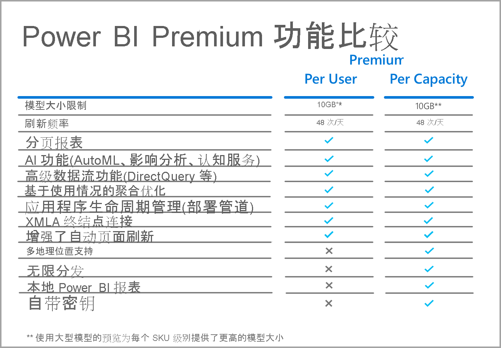

# Power BI Premium Per User 常见问题解答（预览版）

借助 Power BI Premium Per User，组织能够在用户级别上提供高级功能许可。 Premium Per User (PPU) 包括所有 Power BI Pro 许可证功能，还增加了分页报表、AI 和其他仅面向高级订阅者的功能。 

本文提供了有关 Premium Per User 许可的一些常见问题的解答。 在 Premium Per User 预览版期间以及正式发布 (GA) 后，本文中的所有信息可能随时变更。 

本文将问题和答案分为以下几类：
* 一般问题 
* 管理问题 
* 最终用户体验问题 

## 一般问题

1.  什么是 Premium Per User (PPU)？ 

    Premium Per User (PPU) 是一种按用户提供高级功能许可的新方法。 它包括所有 Power BI Pro 许可证功能，还包括分页报表、AI 等功能，以及目前仅在高级版中提供的其他功能。

2.  何时可以购买？

    目前还在开发阶段，预计 2021 年之前不会发布 PPU 正式版。 在正式发布前，公共预览版可供所有组织免费使用。

3.  我是否需要 Power BI Pro 和 Premium Per User 许可证？

    不需要，你可以通过 Premium Per User 许可证获得 Power BI Pro 的所有功能。

4.  如何获取试用版？

    Microsoft 365 提供产品内试用体验和试用体验。 任何用户，假设他们的组织没有限制 PPU，都可以通过为工作区启用 Premium Per User 来访问产品内试用体验。 可通过门户网站启用 Microsoft 365 的试用体验，类似于目前启动 Power BI Pro 试用版的方式。  
    
5.  **初始试用版已过期，我们仍处于预览阶段。在预览期间，如何延长/续订 Premium Per User 试用期？**

    对于使用产品内试用版的客户，你可以在原始试用期到期后的任何时间，通过单击门户右上角的个人资料图标来启动新的试用期。  你将看到一个选项，可再次选择启动试用期。  这样做将启动另一个 60 天的试用期。  整个预览期间都将提供此选项。  
    
    对于使用通过 Microsoft 365 提供的试用版的客户，租户管理员可以将原有的 30 天试用期再延长 30 天。 这是可以延长试用期的最长时间。

6.  Premium Per User 提供哪些功能？

    功能比较网格如下：    

    

7.  我的组织已经有 Power BI Premium **。我现在是否需要 Premium Per User 许可证才能将内容发布到我的容量？**
    
    你的组织可能会选择使用 Premium Per User 许可证作为高级容量的补充，但将内容发布到现有容量不需要 Premium Per User。  

## 管理问题

1.  如何为租户启用 Premium Per User (PPU)？
    
    为租户预配 PPU 许可证后，在启用 PPU 功能的任何工作区内都可以使用该功能。 对于预览版，只需在容量下拉列表中选择 Premium Per User 项，即可启用 Premium Per User 功能，如下图所示。

    

2.  **它的工作原理类似于高级容量吗？可以打开/关闭这些功能吗？**

    不是，没有对 PPU 的内存或 CPU 进行管理；在这方面，它的工作方式类似于当前的 Power BI Pro。 租户管理员可以管理选定的功能设置，但是他们不能禁用分页报表之类的工作负载，就像你目前无法关闭仪表板一样。 

3.  在哪里管理公开的 Premium Per User 设置？

    管理员可以通过 Premium Per User 的租户设置中的新菜单选项管理这些设置。

4.  是否可以限制哪些用户可以创建 PPU 工作区？

    可以，和当前限制可创建工作区的用户的方式相同。

5.  租户管理员可以看到标记为 Premium Per User 的工作区吗？

    可以，可通过租户管理员屏幕的工作区菜单项调出这些工作区，其中显示了标记为 Premium 的工作区。

6.  能否在 Premium Per User 和高级容量之间移动工作区？

    是的。 对于正式发布 (GA) 版，一旦将工作区中的任何数据集或数据流移回高级容量，就需要对其执行一次完全刷新。 这一要求防止了那些想要绕过 Premium Gen2 CPU 收费机制的公司的滥用。

7.  Premium Per User 是否提供了容量 API？

    可以使用一组有限的 API 来允许工作区的移动，但是不能执行诸如关闭工作负载等操作以及类似活动。  
    
7.  **Premium Per User 工作区是否支持服务主体？**

    否，目前不支持 Premium Per User 工作区中的服务主体。  

## 最终用户体验问题

1.  如果我将工作区标记为 Premium Per User，其他用户如何知道？
    
    我们引入了一个新图标以显示 Premium Per User 工作区，如下图所示：

        

2.  谁可以访问 Premium Per User 工作区/应用中的内容？

    任何用户都必须具有 Premium Per User 许可证，才能查看 Premium Per User 工作区中的内容。 这包括用户通过 XMLA 终结点访问内容、在 Excel 中分析、复合模型等场景。 你可能会向还没有 PPU 许可证的用户授予对工作区的访问权限，但他们将收到一条消息，告知他们无法访问内容。 如果他们符合条件，系统将提示他们提供试用许可证。 如果他们不符合条件，则需要租户管理员为他们分配许可证。

3.  当与用户共享许可证时，使用哪种许可证类型的用户可以查看哪些内容？

    下面的图表描述了哪些用户通过 PPU 可以看到哪些类型的内容：

       

4.  能否对嵌入的用例使用 Premium Per User？

    当你使用 Pro 许可证时，Premium Per User 与嵌入式用例的工作方式相同。 你可以嵌入内容，每个用户都需要 PPU 许可证才能查看它。

5.  **如果选择不购买 Premium Per User 许可证，那么在预览期结束时，我的 PPU 工作区会怎样？**

    你和你的用户仍然能够访问工作区，但无法访问要求具有该类型许可证才能访问的内容。 你要么将工作区移动到一个高级容量，要么干脆关闭需求。 

6.  使用 Premium Per User 能获取多少总存储容量？

    就存储而言，整个租户与高级容量具有相同的 100 TB 限制。

7.  “导出 API”是否可用于 Premium Per User？

    当前可用于分页报表，并且仅限于每 5 分钟一次的调用。  目前不支持 Power BI 报表。  

8.  电子邮件订阅在 PPU 中将如何工作？

    拥有 PPU 许可证或 Pro 许可证的任何用户都可以接收订阅及其包括的任何附件，但前提是所有用户的附件均相同。 Pro 用户将无法查看产品门户中的内容。 如果引入了允许不同收件人使用不同数据视图的其他订阅功能，则需要 PPU 许可证（或高级容量）才能使用这些功能。

9.  能否超出通过门户使用刷新 API 进行的 48 次刷新？

    目前不对刷新次数进行限制。  

10. 能否使用 Power BI Premium Capacity Metrics 应用来监视 Premium Per User 使用情况？

    Power BI Premium Capacity Metrics 应用不适用于 Premium Gen2，因此无法查看任何 PPU 项。  

11. 能否将 Power BI 数据集托管到 PPU 工作区，根据它生成报表，在非 PPU 工作区中发布，并允许用户在没有 PPU 许可证的情况下访问此报表？

    不是。 由于数据集驻留在 Premium Per User 工作区中，因此没有许可证的用户无法查看该数据集，即使他们可以访问非 PPU 工作区中的报表。

12. 能否同时刷新多个 10 GB 数据模型？

    你将受到与 Premium Gen2 中的并行刷新数相同的限制。

13. 能否通过“发布到 Web”共享托管在 Premium Per User 中的内容？

    “发布到 Web”的行为方式与通过它共享托管在高级容量中的内容时相同。

14. 能否在 Premium Per User 工作区中运行数据流，将其导入到另一个工作区中的 Power BI 数据集，允许用户在没有 Premium Per User 许可证的情况下使用该内容？

    只要 Power BI 报表作者拥有 Premium Per User 许可证，就可以在 PPU 的预览期间满足这些需要。

15. 能否将 Power BI 移动应用与 Premium Per User 配合使用？

    是的，Power BI 移动应用已更新，可使用发布到 Premium Per User 应用或工作区的任何内容。

后续步骤

* [什么是 Power BI Premium？](service-premium-what-is.md)
* [Microsoft Power BI Premium 白皮书](https://aka.ms/pbipremiumwhitepaper)
* [规划 Power BI Enterprise 部署白皮书](https://aka.ms/pbienterprisedeploy)
* [激活延长的 Power BI Pro 试用期](../fundamentals/service-self-service-signup-for-power-bi.md)
* [Power BI Embedded 常见问题解答](../developer/embedded/embedded-faq.md)

更多问题？ [尝试咨询 Power BI 社区](https://community.powerbi.com/)
