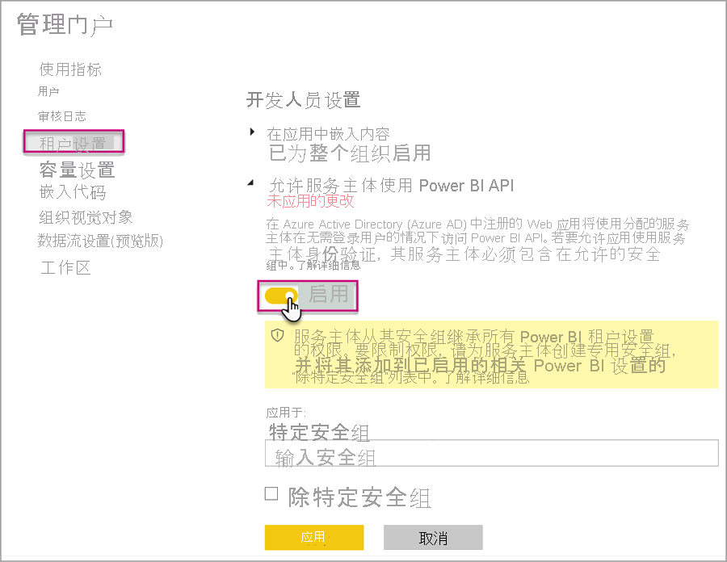
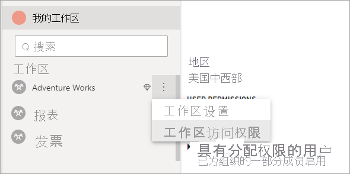

# <a name="automate-premium-workspace-and-dataset-tasks-with-service-principals"></a>使用服务主体自动完成 Premium 工作区和数据集任务

服务主体是在租户中创建的 Azure Active Directory 应用注册，用于执行无人参与的资源和服务级别操作。 服务主体是独特类型的用户标识，具有应用名称、应用程序 ID、租户 ID 和表示密码的客户端机密或证书。

Power BI Premium 使用与 Power BI Embedded 相同的服务主体功能。 有关详细信息，请参阅[使用服务主体嵌入 Power BI 内容](../developer/embedded/embed-service-principal.md)。

在 Power BI Premium 中，也可以搭配使用服务主体与 [XMLA 终结点](service-premium-connect-tools.md)来自动执行数据集管理任务，例如预配工作区、部署模型以及使用以下工具刷新数据集：

- PowerShell
- Azure 自动化
- Azure 逻辑应用
- 自定义客户端应用程序

只有[新工作区](../collaborate-share/service-new-workspaces.md)支持使用服务主体的 XMLA 终结点连接。 不支持经典工作区。 服务主体只具有为其分配的工作区执行任务所需的权限。 权限是通过工作区访问分配的，与常规 UPN 帐户非常类似。

若要执行写入操作，容量的数据集工作负载必须[为读写启用 XMLA 终结点](service-premium-connect-tools.md#enable-xmla-read-write)。 通过 Power BI Desktop 发布的数据集应启用[增强的元数据格式](../connect-data/desktop-enhanced-dataset-metadata.md)功能。

> [!NOTE]
> Power BI Premium 中的 XMLA 终结点功能是一项预览功能。 切勿在生产环境中使用预览功能。 某些功能、支持和文档是受到限制的。  若要了解详细信息，请参阅 [Microsoft Online Services 条款 (OST)](https://www.microsoft.com/licensing/product-licensing/products?rtc=1)。

## <a name="create-a-service-principal"></a>创建服务主体

通过 Azure 门户或 PowerShell 将服务主体创建为应用注册。 在创建服务主体时，请确保分别复制并保存应用名称、应用程序（客户端）ID、目录（租户）ID 和客户端机密。 若要查看创建服务主体的步骤，请参阅：

[创建服务主体 - Azure 门户](/azure/active-directory/develop/howto-create-service-principal-portal)   
[创建服务主体 - PowerShell](/azure/active-directory/develop/howto-authenticate-service-principal-powershell)

## <a name="create-an-azure-ad-security-group"></a>创建 Azure AD 安全组

默认情况下，服务主体有权访问为其启用的任何租户设置。 这包括访问特定安全组或整个组织，具体视管理设置而定。

若要限制服务主体访问特定租户设置，可以允许访问特定安全组。 也可以为服务主体创建专用安全组，并将它排除在相应租户设置之外。 若要查看创建安全组和添加服务主体的步骤，请参阅[创建基本组并使用 Azure Active Directory 添加成员](/azure/active-directory/fundamentals/active-directory-groups-create-azure-portal)。

## <a name="enable-service-principals"></a>启用服务主体

管理员必须先在 Power BI 管理门户中启用服务主体访问权限，才能在 Power BI 中使用服务主体。

在 Power BI 管理门户 > “租户设置”中展开“允许服务主体使用 Power BI API”，然后单击“启用”   。 若要将权限应用到安全组，请将组名称添加到“特定安全组”。



## <a name="workspace-access"></a>工作区访问权限

为了让服务主体具有执行 Premium 工作区和数据集操作所需的权限，必须将服务主体添加为工作区成员或管理员。此处描述了如何在 Power BI 服务中使用工作区访问，但也可使用 [添加组用户 REST API](/rest/api/power-bi/groups/addgroupuser)。

1. 在 Power BI 服务的工作区中选择“更多” > “工作区访问” 。

    

2. 按应用程序的名称进行搜索，以“管理员”或“成员”身份将服务主体添加到工作区 。

    

## <a name="connection-strings-for-the-xmla-endpoint"></a>XMLA 终结点的连接字符串

在创建服务主体、为租户启用服务主体并将服务主体添加到工作区访问中后，就可以将它用作 XMLA 终结点连接字符串中的用户标识。 不同之处在于，对用户 ID 和密码参数，需要指定应用程序 ID、租户 ID 和应用程序机密。

`Data Source=powerbi://api.powerbi.com/v1.0/myorg/<workspace name>; Initial Catalog=<dataset name>;User ID=app:<appId>@<tenantId>;Password=<app_secret>;`

### <a name="powershell"></a>PowerShell

#### <a name="using-sqlserver-module"></a>使用 SQLServer 模块

以下示例将 AppId、TenantId 和 AppSecret 用于对数据集刷新操作进行身份验证：

```powershell
Param (
        [Parameter(Mandatory=$true)] [String] $AppId,
        [Parameter(Mandatory=$true)] [String] $TenantId,
        [Parameter(Mandatory=$true)] [String] $AppSecret
       )
$PWord = ConvertTo-SecureString -String $AppSecret -AsPlainText -Force

$Credential = New-Object -TypeName "System.Management.Automation.PSCredential" -ArgumentList $AppId, $PWord

Invoke-ProcessTable -Server "powerbi://api.powerbi.com/v1.0/myorg/myworkspace" -TableName "mytable" -DatabaseName "mydataset" -RefreshType "Full" -ServicePrincipal -ApplicationId $AppId -TenantId $TenantId -Credential $Credential
```

### <a name="amo-and-adomd"></a>AMO 和 ADOMD

通过客户端应用程序和 Web 应用进行连接时，由 NuGet 提供的 [AMO 和 ADOMD 客户端库](/azure/analysis-services/analysis-services-data-providers) 15.1.42.26（2020 年 6 月）及更高版本的可安装包支持在连接字符串中使用服务主体，可以使用 `app:AppID` 语法以及密码或 `cert:thumbprint`。

以下示例使用 `appID` 和 `password` 执行模型数据库刷新操作：

```csharp
string appId = "xxx";
string authKey = "yyy";
string connString = $"Provider=MSOLAP;Data source=powerbi://api.powerbi.com/v1.0/<tenant>/<workspacename>;Initial catalog=<datasetname>;User ID=app:{appId};Password={authKey};";
Server server = new Server();
server.Connect(connString);
Database db = server.Databases.FindByName("adventureworks");
Table tbl = db.Model.Tables.Find("DimDate");
tbl.RequestRefresh(RefreshType.Full);
db.Model.SaveChanges();
```

## <a name="next-steps"></a>后续步骤

[使用 XMLA 终结点的数据集连接](service-premium-connect-tools.md)  
[Azure 自动化](/azure/automation)  
[Azure 逻辑应用](/azure/logic-apps/)  
[Power BI REST API](/rest/api/power-bi/)