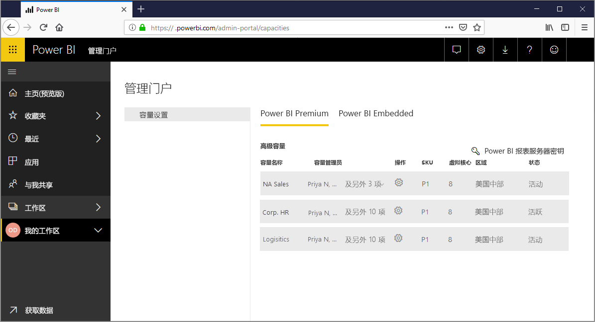
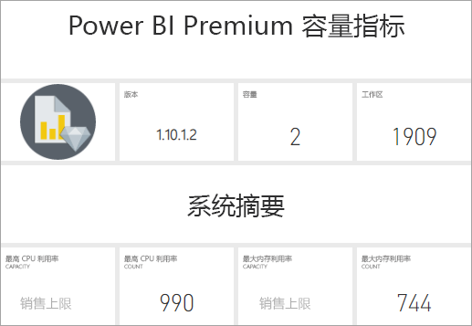
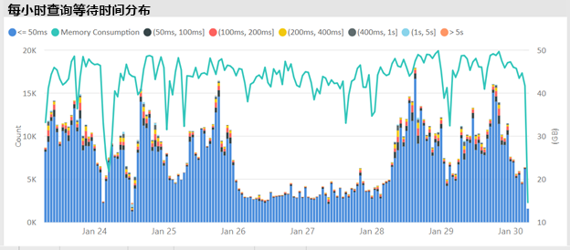
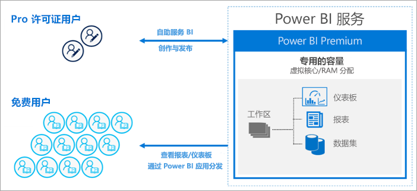
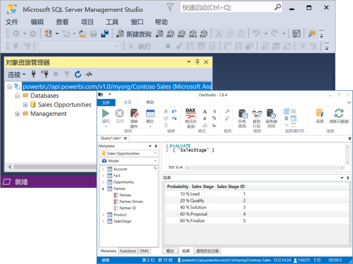

# 什么是 Power BI Premium？

你可以使用 Power BI Premium 为组织获得增强的专用资源，这样组织中的用户就能使用性能更高且响应速度更快的 Power BI 服务。 例如，借助 Power BI Premium 订阅，你和组织用户可以：

> [!div class="checklist"]
> * 规模更大，性能更强
> * 灵活地按容量许可
> * 统一自助服务和企业 BI
> * 使用 Power BI 报表服务器扩展本地 BI
> * 支持按区域数据驻留（多地理位置）
> * 与任何人共享数据而无需购买每用户许可证

 

本文介绍了 Power BI Premium 中的主要功能。 必要时，提供包含更多详细信息的其他文章的链接。 有关 Power BI Pro 和 Power BI Premium 的详细信息，请参阅 [Power BI 定价](https://powerbi.microsoft.com/pricing/)的“Power BI 功能比较”部分。

## 订阅和许可

Power BI Premium 是租户级别的 Office 365 订阅，可在两个 SKU（库存单位）系列中使用：

- P SKU (P1-P5)：用于嵌入和企业功能，需要包月或包年承诺，并按月计费，包含用于在本地安装 Power BI 报表服务器的许可证。

- 用于组织嵌入的 EM SKU (EM1-EM3)，要求按年承诺并按月计费。 EM1 和 EM2 SKU 仅通过批量许可计划提供， 无法直接购买。

另一种方法是在 Azure 中购买 Power BI Embedded 订阅。 有一个 A (A1-A6) SKU 系列，它不需要承诺并按小时计费，以在应用程序、门户和网站中使用带有白色标记的 Power BI，或者作为测试 P 或 EM 容量的一种方法。 所有 SKU 都提供 V 核心用于创建容量，但 EM SKU 仅限于较小规模的嵌入。 V 核心少于四个的 EM1、EM2、A1 和 A2 SKU 不在专用基础设施上运行。

虽然本文的重点是 P SKU，但其中大部分内容也与 A SKU 相关。 与 Premium 订阅 SKU 相反，Azure SKU 不需要时间承诺，并按小时计费。 它们提供全方位的灵活性，可实现纵向扩展、横向扩展、暂停、恢复和删除。 

Azure Power BI Embedded 在很大程度上超出了本文的范围，但在“优化 Premium 容量”一文的[测试方法](service-premium-capacity-optimize.md#testing-approaches)部分将其作为测试和测量工作负载的实用且经济的选项进行了介绍。 若要了解有关 Azure SKU 的详细信息，请参阅 [Azure Power BI Embedded 文档](https://azure.microsoft.com/services/power-bi-embedded/)。

### 购买

Power BI Premium 订阅由 Microsoft 365 管理中心的管理员购买。 具体而言，仅 Office 365 全局管理员或计费管理员才能购买 SKU。 购买时，租户会收到相应数量的 V 核心用于分配给容量，这称为 *V 核心池*。 例如，购买 P3 SKU 会为租户提供 32 个 V 核心。 若要了解详细信息，请参阅[如何购买 Power BI Premium](service-admin-premium-purchase.md)。

## 专用容量

借助 Power BI Premium，可获得*专用容量*。 共享容量的工作负载在与其他客户共享的计算资源上运行，与之相反，专用容量仅供组织使用。 它与专用计算资源分离，专用计算资源为托管内容提供可靠且一致的性能。 请注意，以下资源存储在共享容量而非专用容量中：

* Excel 工作簿（除非是首次将数据导入 Power BI Desktop）
* [推送数据集](/rest/api/power-bi/pushdatasets)
* [流数据集](../connect-data/service-real-time-streaming.md#set-up-your-real-time-streaming-dataset-in-power-bi)
* [问答](../create-reports/power-bi-tutorial-q-and-a.md)

工作区驻留在容量范围内。 每个 Power BI 用户都有一个称为“我的工作区”的个人工作区。 可创建其他工作区来启用协作，这些工作区称为“工作区”。 默认情况下，工作区（包括个人工作区）在共享容量中创建。 如果拥有高级容量，可将“我的工作区”和“工作区”都分配给高级容量。

### 容量节点

如[订阅和许可](#subscriptions-and-licensing)部分所述，有两个 Power BI Premium SKU 系列：**EM** 和 **P**。所有 Power BI Premium SKU 均可作为容量*节点*提供，每个节点代表由处理器、内存和存储组成的一定数量的资源。 除资源外，每个 SKU 还对每秒处理的 DirectQuery 和 Live Connection 连接的数量，以及并行模型刷新次数进行了操作限制。

处理由一定数量的 V 核心实现，并在后端和前端之间平均分配。

**后端 V 核心**负责核心 Power BI 功能，包括查询处理、缓存管理、运行 R 服务、模型刷新以及在服务器端呈现报表和图像。 后端 V 核心分配到固定数量的内存，这些内存主要用于托管模型，也称为“活动数据集”。

**前端 V 核心**负责 Web 服务、仪表板和报表文档管理、访问权限管理、时间安排、API、上传和下载，以及通常与用户体验相关的所有内容。

存储设置为**每个容量节点 100 TB**。

每个 Premium SKU（和等效大小的 A SKU）的资源和限制如下表所述：

| 容量节点 | 总虚拟核心 | 后端 V 核心 | RAM (GB) | 前端 V 核心 | DirectQuery/Live Connection（每秒） | 模型刷新并行度 |
| --- | --- | --- | --- | --- | --- | --- |
| EM1/A1 | 1 | 0.5 | 3 | 0.5 | 3.75 | 1 |
| EM2/A2 | 2 | 1 | 5 | 1 | 7.5 | 2 |
| EM3/A3 | 4 | 2 | 10 | 2 | 15 | 3 |
| P1/A4 | 8 | 4 | 25 | 4 | 30 | 6 |
| P2/A5 | 16 | 8 | 50 | 8 | 60 | 12 |
| P3/A6 | 32 | 16 | 100 | 16 | 120 | 24 |
| P4 | 64 | 32 | 200 | 32 | 240 | 48 |
| P5 | 128 | 64 | 400 | 64 | 480 | 96 |
| | | | | | | |

> [!NOTE]
> 使用单个较大的 SKU（例如一个 P2 SKU）可能比组合较小的 SKU（例如两个 P1 SKU）更可取。 例如，你可以使用更大的模型，还可以实现与 P2 的更好的并行。

### 容量工作负载

容量工作负载是为用户提供的服务。 默认情况下，Premium 和 Azure 容量仅支持与运行 Power BI 查询关联的数据集工作负载。 无法禁用数据集工作负载。 可以为 [AI（认知服务）](https://powerbi.microsoft.com/blog/easy-access-to-ai-in-power-bi-preview/)、[数据流](../transform-model/service-dataflows-overview.md#dataflow-capabilities-on-power-bi-premium)和[分页报表](../paginated-reports/paginated-reports-save-to-power-bi-service.md)启用其他工作负载。 这些工作负载仅在 Premium 订阅中受到支持。 

每个额外的工作负载都允许配置工作负载可使用的最大内存（以占可用内存总量的百分比的形式）。 最大内存的默认值由 SKU 确定。 通过在使用这些额外工作负载时仅启用这些额外工作负载，可以最大化容量的可用资源。 仅在已确定默认设置不满足容量资源要求时，才能更改内存设置。 通过使用[管理门户](service-admin-portal.md)中的“容量设置”，或通过使用[容量 REST API](https://docs.microsoft.com/rest/api/power-bi/capacities)，容量管理员可以为容量启用和配置工作负载。  

若要了解详细信息，请参阅[配置 Premium 容量中的工作负载](service-admin-premium-workloads.md)。 

### 容量工作原理

Power BI 服务始终充分利用容量资源，同时不超过对容量施加的限制。

容量操作分类为*交互式操作*和*后台操作*。 交互式操作包括呈现请求和响应用户交互（筛选、问答查询等）。 通常情况下，导入模型查询为内存资源密集型，而查询 DirectQuery 和 Live Connection 模型则为 CPU 密集型。 后台操作包括数据流和导入模型刷新，以及仪表板查询缓存。

重点是了解交互式操作应始终优先于后台操作，以确保可能的最佳用户体验。 如果资源不足，则会在释放资源时将后台操作添加到队列中进行处理。 后台操作（如数据集刷新）可以由 Power BI 服务在进程中停止并添加到队列中。

导入模型必须完全加载到内存中，以便可以查询或刷新它们。 Power BI 服务通过使用复杂的算法来管理内存使用情况，从而确保最大限度地利用可用内存，这可能导致过度使用容量：虽然容量可以存储许多导入模型（每个 Premium 容量最多 100 TB），但当它们的组合磁盘存储超过支持的内存（并且查询和刷新需要额外的内存）时，它们不能同时全部加载到内存中。

因此，导入模型会根据用途加载到内存中或从内存中移除。 在导入模型被查询（交互式操作）但尚未位于内存中时，或当要刷新导入模型（后台操作）时，系统会加载导入模型。

从内存中移除模型称为*逐出*。 这是 Power BI 可以根据模型的大小快速执行的操作。 如果容量没有遇到任何内存压力，则模型只需加载到内存中并保持原位。 但是，当可用的内存不足以加载模型时，Power BI 服务首先需要释放内存。 它通过寻找在过去三分钟 \[[1](#endnote-1)\] 未使用过的模型来检测已变为非活动状态的模型，然后逐出它们，从而释放内存。 如果没有要逐出的非活动模型，则 Power BI 服务会尝试逐出为后台操作加载的模型。 在尝试失败 30 秒后\[[1](#endnote-1)\]，最终可尝试使交互操作失败。 在这种情况下，报表用户会收到失败通知以及尽快重试的建议。 在某些情况下，由于服务操作，模型可能会从内存中卸载。

需要强调的是，数据集逐出是正常行为和预期行为。 它致力于通过加载和卸载组合大小可能超过可用内存的模型来最大化内存使用率。 这是设计使然，并且对报表用户透明。 高逐出率并不一定意味着容量分配到的资源不足。 然而，如果因高逐出率而导致查询或刷新响应性受到影响，则它们可能会成为问题。

因为必须将模型加载到内存中，所以导入模型的刷新始终为内存密集型。 处理时需要额外的内存。 完全刷新可能会使用大约两倍的模型所需内存量。 这确保了即使在处理模型时也可以查询模型，因为查询被发送到现有模型，直到刷新完成且新模型数据可用。 增量刷新将需要更少的内存并且可以更快地完成，因此可以显著减少容量资源的压力。 对于模型，刷新也可能为 CPU 密集型，特别是那些具有复杂 Power Query 转换的模型，或者复杂或基于大型表的计算表/列。

和查询一样，刷新需要将模型加载到内存中。 如果内存不足，Power BI 服务将尝试逐出非活动模型；如果无法这样做（因为所有模型都处于活动状态），刷新作业将排队。 刷新通常为 CPU 密集型，其出现这种情况的概率甚至比查询出现这种情况的概率更大。 因此，并发刷新数量存在容量限制，其向上舍入设置为后端 V 核心数量的 1.5 倍。 如果并发刷新过多，则计划的刷新将排队。 发生这些情况时，刷新需要更长的时间才能完成。 按需刷新（例如由用户请求或 API 调用触发的刷新）将重试三次\[[1](#endnote-1)\]。 如果仍然没有足够的资源，则刷新将失败。

部分注释：   
\[1\]可能会有所变化。

### 区域支持

创建新容量时，Office 365 全局管理员和 Power BI 服务管理员可以指定分配给容量的工作区将驻留的区域。 这称为**多地理位置**。 借助多地理位置，组织可以通过将内容部署到特定区域中的数据中心来满足数据驻留要求，即使它与 Office 365 订阅所在的区域不同。 若要了解详细信息，请参阅 [Power BI Premium 的多地理位置支持](service-admin-premium-multi-geo.md)。

### 容量管理

管理 Premium 容量涉及创建或删除容量、分配管理员、分配工作区、配置工作负载、监视，以及进行调整来优化容量性能。 

Office 365 全局管理员和 Power BI 服务管理员可以从可用的 V 核心创建 Premium 容量，或修改现有的 Premium 容量。 创建容量时会指定容量大小和地理区域，并分配至少一个容量管理员。 

创建容量后，大多数管理任务都在[管理门户](service-admin-portal.md)中完成。

容量管理员可以将工作区分配给容量、管理用户权限以及分配其他管理员。 容量管理员还可以配置工作负载、调整内存分配，并在必要时重启容量，以及在容量过载的情况下重置操作。

容量管理员还可以确保容量平稳运行。 他们可直接在管理门户中或通过使用 Premium 容量指标应用监视容量运行状况。

若要了解有关创建容量、分配管理员和分配工作区的详细信息，请参阅[管理 Premium 容量](service-premium-capacity-manage.md)。 若要了解有关角色的详细信息，请参阅[与 Power BI 相关的管理员角色](service-admin-administering-power-bi-in-your-organization.md#administrator-roles-related-to-power-bi)。

### 监视

监视 Premium 容量可使管理员了解容量的表现。 可使用管理门户和 [Power BI Premium 容量指标应用](https://app.powerbi.com/groups/me/getapps/services/capacitymetrics)来监视容量。

门户中的监视功能提供快速视图，其中包含指示已放置的负载以及过去七天内容量平均使用的资源量的高级指标。 

**Power BI Premium 容量指标**应用提供有关容量表现的深度信息。 该应用提供高级仪表板和更加详细的报表。

在应用的仪表板中，可单击指标单元格来打开深度报表。 报表提供深度指标和筛选功能，可用于深入了解保持容量平稳运行所需的最重要信息。

若要了解有关监视容量的详细信息，请参阅 [Power BI 管理门户中的监视](service-admin-premium-monitor-portal.md)和[使用 Power BI Premium 容量指标应用进行监视](service-admin-premium-monitor-capacity.md)。

### 优化容量

充分利用你的容量对于确保用户获得良好性能以及让你的 Premium 投资实现最大价值而言至关重要。 通过监视关键指标，管理员可以确定如何最好地解决瓶颈问题以及采取必要的措施。 若要了解详细信息，请参阅[优化 Premium 容量](service-premium-capacity-optimize.md)和 [Premium 容量方案](service-premium-capacity-scenarios.md)。

### 容量 REST API

Power BI REST API 包含[容量 API](https://docs.microsoft.com/rest/api/power-bi/capacities) 的集合。 通过这些 API，管理员能够以编程方式管理 Premium 容量的许多方面，包括启用和禁用工作负载、将工作区分配给容量等等。

## 大型数据集

Power BI Premium 支持上传 Power BI Desktop (.pbix) 模型文件，最大大小为 **10 GB**，具体取决于 SKU。 加载模型后，可将其发布到分配给 Premium 容量的工作区。 随后可将数据集刷新至最大 **12 GB** 的大小。

### 大小注意事项

大型数据集可能为资源密集型。 对于任何大于 1 GB 的数据集，应至少使用 P1 SKU。 虽然将大型数据集发布到 A SKU（最高 A3）支持的工作区可能有用，但刷新它们将不起作用。

下表显示了用于将 .pbix 文件上传或发布到 Power BI 服务的建议 SKU：

   |SKU  |.Pbix 大小   |
   |---------|---------|
   |P1    | < 3 GB        |
   |P2    | < 6 GB        |
   |P3、P4、P5    | 最多 10 GB   |

Power BI Embedded A4 SKU 等同于 P1 SKU、A5 = P2 和 A6 = P3。 将数据集发布到 A 和 EM SKU 可能会返回错误，这些错误并非特定于共享容量中的模型大小限制错误。 A 和 EM SKU 中数据集的刷新错误可能会指向超时。

如果在数据集上启用[大型模型](service-premium-large-models.md)，则 .pbix 文件大小限制仍适用于文件上传或发布。 但是，在结合了增量刷新和大型模型的情况下，数据集的增长可能会远远超出这些限制。 对于大型模型，数据集大小仅受 Power BI Premium 容量大小的限制。

.pbix 文件表示处于*高度压缩状态*的数据。 数据在加载到内存中时可能会扩展，并且在数据刷新期间可能会在内存中扩展数倍。

大型数据集的计划刷新可能需要很长时间，并且会占用大量资源。 请务必不要安排太多的重叠刷新。 建议配置[增量刷新](service-premium-incremental-refresh.md)，因为它更快速、更可靠且使用的资源更少。

如果自上次使用数据集以来已经过去一段时间，则大型数据集的初始报表加载可能需要很长时间。 需要较长时间加载的报表的加载条可显示加载进度。

尽管 Premium 容量中的每个查询内存和时间约束要高得多，但建议使用筛选器和切片器来将视觉对象限制为仅显示必要的内容。

## 增量刷新

增量刷新是在 Power BI Premium 中拥有和维护大型数据集不可或缺的部分。 增量刷新拥有许多优势，例如，刷新速度更快，因为只需刷新已更改的数据。 刷新更可靠，因为不需要维护与不稳定的数据源的长期连接。 资源消耗降低，因为要刷新的数据量减少，这降低了内存和其他资源的整体消耗。 增量刷新策略在 **Power BI Desktop** 中进行定义，并在发布到 Premium 容量中的工作区时应用。 

若要了解详细信息，请参阅 [Power BI Premium 中的增量刷新](service-premium-incremental-refresh.md)。

## 分页报表

P1-P3 和 A4_A6 SKU 支持的分页报表基于 SQL Server Reporting Services 中的报表定义语言 (RDL) 技术。 虽然基于 RDL 技术，但它与 Power BI 报表服务器不同，后者是可下载的报表平台并可在本地安装，其也包含在 Power BI Premium 中。 分页报表的格式设置为适应可以打印或共享的页面。 即使表格跨多个页，数据也能在表格中显示。 通过使用免费的 [**Power BI 报表生成器**](https://go.microsoft.com/fwlink/?linkid=2086513) Windows 桌面应用程序，用户可以创建分页报表并将其发布到服务中。

在 Power BI Premium 中，分页报表是必须使用管理门户为容量启用的工作负载。 容量管理员可以启用内存，然后以容量内存资源总量百分比的形式指定内存量。 与其他类型的工作负载不同，Premium 在容量范所含的空间中运行分页报表。 无论工作负载是否处于活动状态，系统都将使用为此空间指定的最大内存。 默认值为 20%。 

若要了解详细信息，请参阅 [Power BI Premium 中的分页报表](../paginated-reports/paginated-reports-report-builder-power-bi.md)。 若要了解有关启用分页报表工作负载的详细信息，请参阅[配置工作负载](service-admin-premium-workloads.md)。

## Power BI 报表服务器
 
Power BI Premium 随附 Power BI 报表服务器，后者是带有 Web 门户的本地报表服务器。 可以在本地生成 BI 环境，并在组织的防火墙后面分发报表。 报表服务器使用户可以访问 SQL Server Reporting Services 丰富的交互式功能以及企业报告功能。 用户可以浏览可视化数据并快速发现模式，以便更快地作出更好的决策。 报表服务器按照你自己的方式提供治理。 如果时机成熟，Power BI 报表服务器会使其能够轻松迁移到云中，此时，组织可以充分利用所有 Power BI Premium 功能。

若要了解详细信息，请参阅 [Power BI 报表服务器](../report-server/get-started.md)。

## 无限内容共享

借助 Premium，每个人（无论是在组织内外）都可以查看 Power BI 内容（包括分页和交互式报表），而无需购买单独的许可证。 

Premium 允许 Pro 用户广泛分发内容，且不要求查看内容的收件人提供 Pro 许可证。 内容创建者需要提供 Pro 许可证。 创建者连接到数据源、模型数据，并创建打包为工作区应用的报表和仪表板。 如果用户拥有“查看者”角色，即使没有 Pro 许可证仍可访问 Power BI Premium 容量的工作区。 

若要了解详细信息，请参阅 [Power BI 许可](service-admin-licensing-organization.md)。

## Power BI Premium 中的 Analysis Services（预览）

在后台，久经企业考验的 Microsoft Analysis Services Vertipaq 引擎为 Power BI Premium 工作区和数据集提供技术支持。 Analysis Services 通过支持开放标准 XMLA 协议的客户端库和 API 提供可编程性以及客户端应用程序和工具支持。 默认情况下，Power BI Premium 容量数据集工作负荷支持 Microsoft 和第三方客户端应用程序和工具通过 XMLA 终结点执行只读操作。 容量管理员还可以选择禁用或允许通过终结点执行读/写操作。

借助只读权限，SQL Server Management Studio (SSMS) 和 SQL Server Profiler 等 Microsoft 工具以及 DAX Studio 和数据可视化应用程序等第三方应用程序可以使用 XMLA、DAX、MDX、DMV 和跟踪事件连接到并查询 Premium 数据集。 借助读/写权限，企业数据建模工具（如包含 Analysis Services 项目扩展的 Visual Studio 或开放源代码表格编辑器）可以将表格模型作为数据集部署到 Premium 工作区。 借助 SSMS 等工具，管理员可以使用表格模型脚本语言 (TMSL)，为元数据更改和高级数据刷新方案编写脚本。 

若要了解详情，请参阅[使用 XMLA 终结点的数据集连接](service-premium-connect-tools.md)。

## 后续步骤

> [!div class="nextstepaction"]
> [管理 Premium 容量](service-premium-capacity-manage.md)

更多问题？ [尝试咨询 Power BI 社区](https://community.powerbi.com/)

