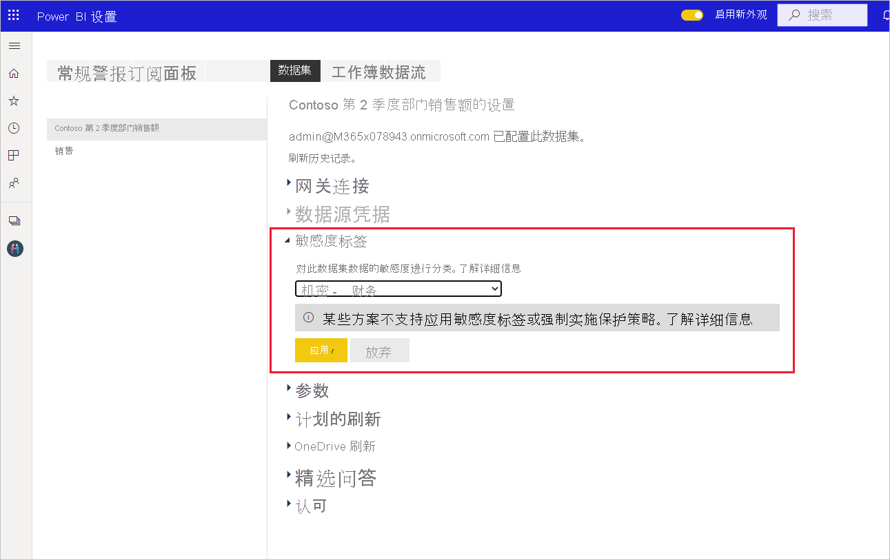
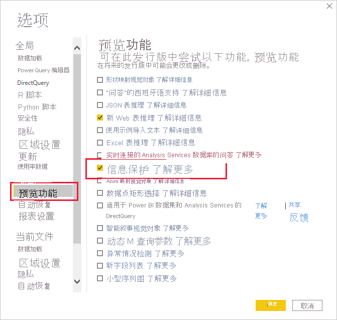
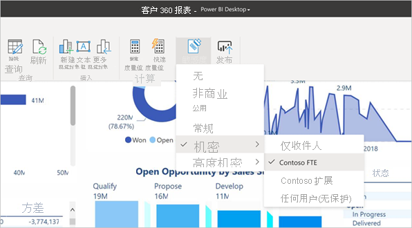

# 如何在 Power BI 中应用敏感度标签

报表、仪表板、数据集、数据流和 .pbix 文件上的 Microsoft 信息保护敏感度标签可以保护敏感内容免遭未经授权的数据访问和泄露。 使用敏感度标签正确标记数据，可确保只有经过授权的用户才能访问数据。 本文介绍如何在 Power BI 服务和 Power BI Desktop 中应用敏感度标签。

有关 Power BI 中敏感度标签的详细信息，请参阅 [Power BI 中的敏感度标签](service-security-sensitivity-label-overview.md)。

## 在 Power BI 服务中应用敏感度标签

在 Power BI 服务中，可以将敏感度标签应用于报表、仪表板、数据集和数据流。

要能够在 Power BI 服务中应用敏感度标签，你需要满足以下条件：
* 必须具有 [Power BI Pro 许可证](./service-admin-purchasing-power-bi-pro.md)，并对要应用标签的内容拥有编辑权限。
* 必须为你的组织启用敏感度标签。 如果不确定，请联系你的 Power BI 管理员。
* 你必须在具有应用敏感度标签权限的安全组内，如[在 Power BI 中启用敏感度标签](./service-security-enable-data-sensitivity-labels.md)中所述。
* 必须满足所有[授权和其他要求](./service-security-enable-data-sensitivity-labels.md#licensing-and-requirements)。

在租户上启用数据保护后，将在仪表板、报表、数据集和数据流列表视图中的敏感度列显示敏感度标签。

**在报表或仪表板上应用或更改敏感度标签**
1. 单击“其他选项(…)”。
1. 选择“设置”。
1. 在“设置”侧窗格中，选择相应的敏感度标签。
1. 保存设置。

下图演示了在报表上执行这些操作的步骤

**在数据集或数据流上应用或更改敏感度标签**

1. 单击“其他选项(…)”。
1. 选择“设置”。
1. 选择“数据集”或“数据流”选项卡，以相关者为准。
1. 展开“敏感度标签”部分，然后选择相应的敏感度标签。
1. 应用设置。

以下两张图片演示了在数据集上执行这些操作的步骤。

依次选择“其他选项(…)”和“设置” 。

在“设置数据集”选项卡上，打开“敏感度标签”部分，选择所需的敏感度标签，然后单击“应用”。

## 在 Power BI Desktop（预览版）中应用敏感度标签

要在 Power BI Desktop 中使用敏感度标签，你需要满足以下条件：
* 你必须拥有 [Power BI Pro 许可证](./service-admin-purchasing-power-bi-pro.md)。
* 必须为你的组织启用敏感度标签。 如果不确定，请联系你的 Power BI 管理员。
* 你必须在具有应用敏感度标签权限的安全组内，如[在 Power BI 中启用敏感度标签](./service-security-enable-data-sensitivity-labels.md)中所述。
* 必须满足所有[授权和其他要求](./service-security-enable-data-sensitivity-labels.md#licensing-and-requirements)。
* Power BI Desktop 中的信息保护预览功能开关必须处于打开状态。 如果你在“主页”选项卡上看到“敏感度”按钮，则预览功能已打开。 如果看不到该按钮，请转到“文件”>“选项和设置”>“选项”>“预览功能”，然后选中“信息保护”旁边的复选框。

    

    >[!Important]
    >启用信息保护预览功能后，必须重启 Desktop 才能开始使用敏感度标签。
    >
    >如果 Desktop 在重启时崩溃，则原因可能是你的计算机缺少必需的 Visual C++ 可再发行运行时库版本。 如果遇到此类崩溃，请访问 [Microsoft Visual C++ 2015 Redistributable Update 3 下载页面](https://www.microsoft.com/download/details.aspx?id=53587)，获取有关如何下载和安装更新的说明。 安装更新后，请尝试再次启动 Desktop。

    如果看不到“信息保护预览”选项，则可能会为你的组织阻止信息保护预览功能。 在这种情况下，请联系你的 Power BI 管理员。

* 你必须登录。

若要对你正在使用的文件应用敏感度标签，请单击“主页”选项卡中的“敏感度”按钮，然后从出现的菜单中选择所需的标签。

>[!NOTE]
> 如果在预览功能中启用了敏感度标签功能，但仍看不到“敏感度”按钮，则可能表示你没有相应的许可证，或者你不在有权应用敏感度标签的安全组内，如[在 Power BI 中启用敏感度标签](./service-security-enable-data-sensitivity-labels.md)中所述。

应用标签后，它将显示在状态栏中。

### 将 .pbix 文件上传到服务或从服务下载该文件时的敏感度标签
* 当你从 Desktop 将 .pbix 文件发布到 Power BI 服务时，或者当你直接使用“获取数据”将 .pbix 文件上传到 Power BI 服务时，.pbix 文件的标签将应用于在该服务中创建的报表和数据集。 如果要发布或上传的 .pbix 文件替换现有资产（即与 .pbix 文件同名的资产），则 .pbix 文件的标签将覆盖这些资产上的所有标签。
* 在 Power BI 服务中使用“下载到 .pbix”时，如果正在下载的报表和数据集都具有标签，并且这些标签不同，则将应用于 .pbix 文件的标签对两者更具限制性。

## 删除敏感度标签

### 服务
若要从报表、仪表板、数据集或数据流中删除敏感度标签，请按照[用于在 Power BI 服务中应用标签的相同过程](#apply-sensitivity-labels-in-the-power-bi-service)操作，但在系统提示对数据的敏感度进行分类时，请选择“(无)”。

### 桌面型
Desktop 当前不支持将 .pbix 文件与敏感度标签一起保存后将标签从该文件中删除。 在这种情况下，建议将该文件发布到 Power BI 服务，然后在该服务中将标签从后续报表和数据集中删除。

## 注意事项和限制

有关 Power BI 中的敏感度标签限制的列表，请参阅 [Power BI 中的敏感度标签](service-security-sensitivity-label-overview.md#limitations)。

## 后续步骤

本文介绍如何在 Power BI 中应用敏感度标签。 以下文章提供了有关 Power BI 中的数据保护的进一步详细信息。 

* [Power BI 中的敏感度标签概述](./service-security-sensitivity-label-overview.md)
* [在 Power BI 中启用敏感度标签](./service-security-enable-data-sensitivity-labels.md)
* [在 Power BI 中使用 Microsoft Cloud App Security 控件](./service-security-using-microsoft-cloud-app-security-controls.md)