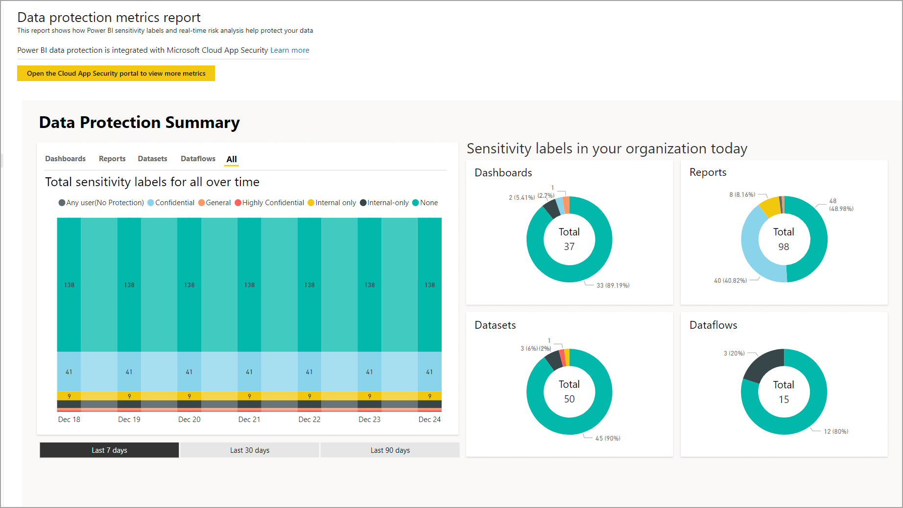
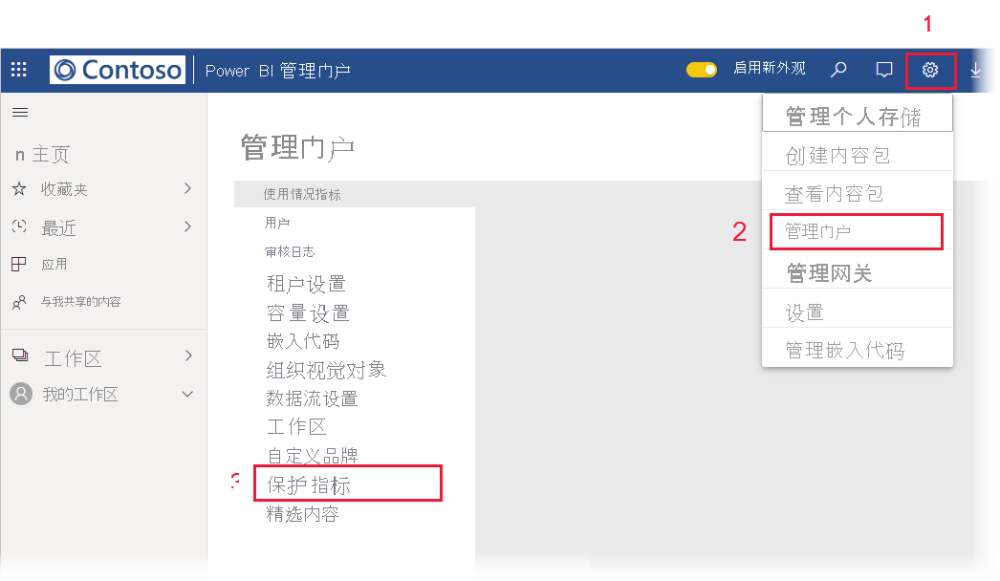

# 数据保护指标报表（预览版）

## 什么是数据保护指标报表？
数据保护指标报表是一种专用报表，[Power BI 管理员](../service-admin-role.md)可以用于监视和跟踪其租户中的数据敏感度标签使用情况和采用情况。

 
该报表具有：
* 一个百分比堆积柱形图，显示最近 7 天、30 天或 90 天内租户中的每日敏感度标签使用情况。 使用此图表可轻松跟踪不同标签类型在一段时间内的相对使用情况。
* 圆环图，针对仪表板、报表、数据集和数据流显示租户中的敏感度标签使用情况的当前状态。
* 指向 Cloud App Security 门户的链接，该门户提供了 Power BI 警报、有风险的用户、活动日志和其他信息。 有关详细信息，请参阅[在 Power BI 中使用 Microsoft Cloud App Security 控件（预览版）](./service-security-using-microsoft-cloud-app-security-controls.md)。

该报表每 24 小时刷新一次。

## 查看数据保护指标报表

必须拥有 [Power BI 管理员角色](../service-admin-role.md)才能打开和查看该报表。
若要查看该报表，请转到“设置”>“管理门户”  ，然后选择“保护指标(预览)”  。

 
 
首次打开数据保护指标报表时，可能需要几秒钟进行加载。 会在“我的工作区”下的专用环境中创建一个报表和数据集（标题为“数据保护指标(自动生成)”  ）。 不建议在此处进行查看（这不是功能完备的报表）。 而是在管理门户中查看该报表，如上所述。

> [!CAUTION]
> 请不要以任何方式更改该报表或数据集，由于会不时推出该报表的新版本，如果更新到新版本，则对原始报表进行的任何更改都会被覆盖。

## 报表更新

数据保护指标报表的改进版本会定期发布。 打开该报表时，如果有新版本可用，则系统会询问你是否要打开新版本。 如果指示“是”，则该报表的新版本会加载并覆盖旧版本。 对旧报表和/或数据集进行的任何更改都会丢失。 可以选择不打开新版本，但在这种情况下，将无法从新版本的改进中受益。 
## 说明和注意事项
* 若要成功生成数据保护指标报表，必须对租户启用[信息保护](./service-security-enable-data-sensitivity-labels.md) 并且[应该应用了敏感度标签](../designer/service-security-apply-data-sensitivity-labels.md)。 
* 若要访问 Cloud App Security 信息，组织必须具有相应的 [Cloud App Security 许可证](https://docs.microsoft.com/power-bi/admin/service-security-using-microsoft-cloud-app-security-controls#microsoft-cloud-app-security-licensing)。
* 如果决定与不是 Power BI 管理员的用户共享数据保护指标报表中的信息，请注意，此报表包含有关组织的敏感信息。
* 数据保护指标报表是一种特殊类型的报表，不会显示在“与我共享”、“最近动态”和“收藏夹”列表中。
## 后续步骤
* [Power BI 中的数据保护（预览版）](./service-security-data-protection-overview.md)
* [在 Power BI 中使用 Microsoft Cloud App Security 控件（预览版）](./service-security-using-microsoft-cloud-app-security-controls.md)
* [了解 Power BI 服务管理员角色](../service-admin-role.md)
* [在 Power BI 中启用数据敏感度标签](./service-security-enable-data-sensitivity-labels.md)
