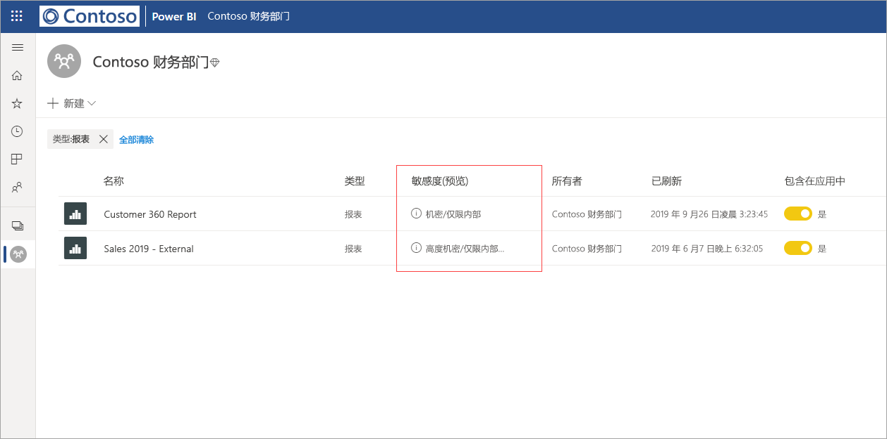
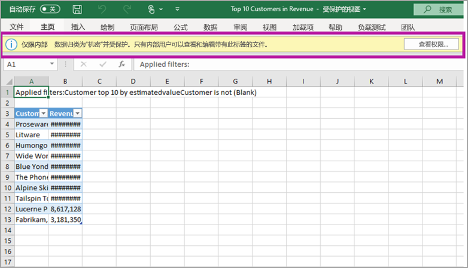

# Power BI 中的数据保护（预览版）

现代企业对如何处理和保护敏感数据有严格的业务法规和要求。 Power BI 可以与 Microsoft 信息保护和 Microsoft Cloud App Security 集成，对 Power BI 中的敏感数据提供更好的控制和可见性。 

使用 Power BI 数据保护，你可以执行以下操作：

* 通过与在 Office 365 中用于分类和保护文件相同的分类法，使用 Microsoft 的敏感度标签对 Power BI 服务（仪表板、报表、数据集和数据流）中的内容进行分类和标记。 

* 通过应用内容的敏感度标签和保护（Excel、PowerPoint 和 PDF），在将数据从 Power BI 服务导出到文件时，强制实施加密或水印等保护设置。 

  例如，用户可以在 Power BI 中对报表应用机密标签。 然后，在将数据导出到 Excel 文件时，Power BI 会对该文件应用机密标签。 标签可以加密内容并应用机密水印。

* 使用 Microsoft Cloud App Security 来监视 Power BI 中的活动；调查安全问题；通过 Microsoft Cloud App Security 条件访问应用控制保护 Power BI 中的内容。 

## Power BI 中的敏感度标签

在 [Microsoft 365 安全中心](https://security.microsoft.com/)或 [Microsoft 365 合规中心](https://compliance.microsoft.com/)创建和管理敏感度标签。

要在任一中心访问敏感度标签，请导航到“分类”>“敏感度标签”  。 这些敏感度标签可由多个 Microsoft 服务（例如 Azure 信息保护、Office 应用和 Office 365 服务）使用。

> [!IMPORTANT]
> Azure 信息保护的客户需要将标签迁移到前面列出的服务之一，以便在 Power BI 中使用敏感度标签。 此外，敏感度标签仅在公有云中受支持，而在云（如主权云）的租户中不受支持。
>
> 详细了解如何[将敏感度标签迁移到 Microsoft 信息保护](https://docs.microsoft.com/azure/information-protection/configure-policy-migrate-labels)。

## 敏感度标签的工作原理

将敏感度标签应用到 Power BI 仪表板、报表、数据集或数据流时，这类似于将标记  应用于该资源，具有以下优点：
*  可自定义 - 可以为组织中不同级别的敏感内容创建类别，如个人、公共、一般、机密和高度机密。
*  明文 - 由于标签为明文形式，因此用户可以轻松地根据敏感度标签指南了解如何处理内容。
*  持续性 - 在对内容应用敏感度标签后，在将内容导出到以下受支持的文件类型时，该标签随之一起导出：Excel、PowerPoint 和 PDF。 

  这意味着，敏感度标签（包括其保护设置）随内容生效，并成为应用和执行策略的基础。 

## 敏感度标签示例 

以下是有关 Power BI 中的敏感度标签如何工作的快速示例。

1. 在 Power BI 服务中，“高度机密 - 仅限内部”  敏感度标签适用于报表。

   

2. 将数据从此报表导出到 Excel 文件时，敏感度标签和保护将应用于导出的 Excel 文件。

   

在 Microsoft Office 应用程序中，敏感度标签作为标记显示在电子邮件或文档中，类似于上面的图像。

你还可以为内容分配一个分类（如标签），它会在使用和共享内容时持续存在并随内容漫游。 可以使用此分类生成使用情况报表并查看敏感内容的活动数据。 基于此信息，你始终可以选择以后应用保护设置。

## 在 Power BI 中使用敏感度标签

在 Power BI 中启用敏感度标签前，必须先完成以下先决条件： 

* 确保在 [Microsoft 365 安全中心](https://security.microsoft.com/)或 [Microsoft 365 合规中心](https://compliance.microsoft.com/)中定义了敏感度标签。 
* 在 Power BI 中[启用敏感度标签](service-security-enable-data-sensitivity-labels.md)（预览版）。
* 确保用户具有适当的许可证；
  * 要在 Power BI 中应用或查看标签，用户必须有 Azure 信息保护高级版 P1 或高级版 P2 许可证。 Microsoft Azure 信息保护可以单独购买，也可以通过一个 Microsoft 许可套件购买。 有关详细信息，请参阅 [Azure 信息保护定价](https://azure.microsoft.com/pricing/details/information-protection/)。
  * 要将标签应用于 Power BI 资源，除上述 Azure 信息保护许可证之一外，用户还必须具有 Power BI Pro 许可证。 

## 使用 Microsoft Cloud App Security 保护内容

可以通过使用 Microsoft Cloud App Security 来保护 Power BI 中的内容免遭意外的泄漏或破坏。 设置并配置 Microsoft Cloud App Security 后，安全管理员可以监视用户访问和活动，执行实时风险分析，并设置标签特定的控件。

例如，组织可以使用 Microsoft Cloud App Security 来配置策略，防止用户将敏感数据从 Power BI 下载到非托管设备。 此类配置可让用户保持工作效率并在任何位置都能连接到 Power BI，同时使用 Microsoft Cloud App Security 来防止损害用户操作，所有这些都是实时的。 

### 要求

在敏感度标签可使用 Microsoft Cloud App Security 之前，必须先满足以下先决条件： 

* 必须为租户[启用 Cloud App Security 和 Azure 信息保护](https://docs.microsoft.com/cloud-app-security/azip-integration)。
* 应用[必须连接到 Microsoft Cloud App Security](https://docs.microsoft.com/cloud-app-security/enable-instant-visibility-protection-and-governance-actions-for-your-apps)。

## 注意事项和限制

以下列表提供了 Power BI 中敏感度标签的一些限制：

* 要在 Power BI 中应用和查看 Microsoft 信息保护敏感度标签，需要 Azure 信息保护高级版 P1 或高级版 P2 许可证。 Microsoft Azure 信息保护可以单独进行购买，也可以通过一个 Microsoft 许可套件进行购买。 有关详细信息，请参阅 [Azure 信息保护定价](https://azure.microsoft.com/pricing/details/information-protection/)。
* 敏感度标签只能应用于仪表板、报表、数据集和数据流。
* 只有 Excel、PowerPoint 和 PDF 文件支持对导出文件执行标签和保护控件。 将数据导出到 CSV 文件、订阅电子邮件、嵌入视觉对象和打印时，不会强制执行标签和保护。
* 从 Power BI 导出文件的用户有权根据敏感度标签设置访问和编辑该文件。 导出数据的用户不会获得该文件的所有者权限。 
* 敏感度标签当前不可用于[分页报表]( https://docs.microsoft.com/power-bi/paginated-reports-report-builder-power-bi)和工作簿。
* Power BI 资产上的敏感度标签仅在工作区列表和世系视图中可见。目前标签在收藏夹、与我共享、最近或应用视图中不可见。 但请注意，应用于 Power BI 资产的标签（即使不可见）将始终保留在导出到 Excel、PowerPoint 和 PDF 文件中的数据上。
* 在 [Microsoft 365 安全中心](https://security.microsoft.com/)或 [Microsoft 365 合规中心](https://compliance.microsoft.com/)中配置的敏感度标签“文件加密设置”仅适用于从 Power BI 导出的文件。该标签不会在 Power BI 中强制实施    。
* 在 Power BI 中应用的标签不支持 [HYOK 保护](https://docs.microsoft.com/azure/information-protection/configure-adrms-restrictions)。
* 要在 Office 应用中查看和应用标签，需满足[许可要求](https://docs.microsoft.com/microsoft-365/compliance/get-started-with-sensitivity-labels#subscription-and-licensing-requirements-for-sensitivity-labels)。
* 仅全球（公有）云中的租户支持敏感度标签。 其他云中的租户不支持敏感度标签。
* 模板应用不支持数据敏感度标签。
* Power BI 不支持“请勿转发”和“临时”这两种保存类型的敏感度标签   。

## 后续步骤

本文概述了 Power BI 中的数据保护。 以下文章提供了有关 Power BI 中的数据保护的进一步详细信息。 

* [在 Power BI 中启用数据敏感度标签](service-security-enable-data-sensitivity-labels.md)
* [在 Power BI 中应用数据敏感度标签](../designer/service-security-apply-data-sensitivity-labels.md)
* [在 Power BI 中使用 Microsoft Cloud App Security 控件](service-security-using-microsoft-cloud-app-security-controls.md)
* [数据保护指标报表](service-security-data-protection-metrics-report.md)