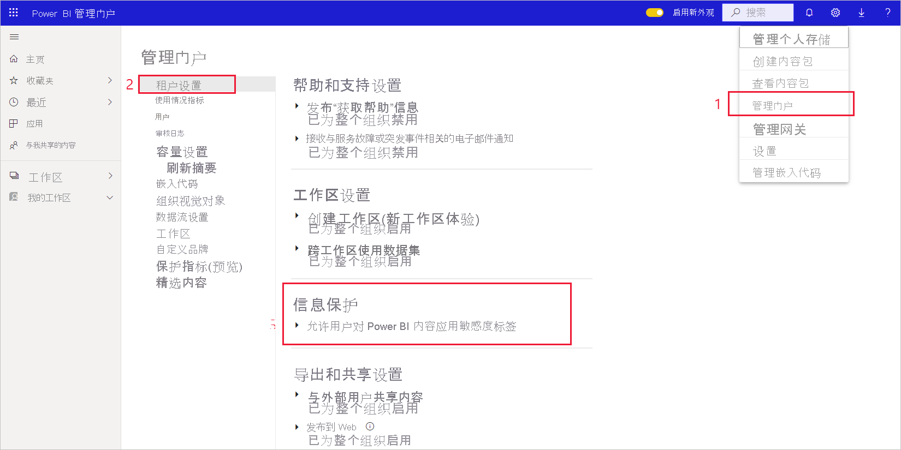

# 在 Power BI 中启用敏感度标签

为了在 Power BI 中使用 [Microsoft 信息保护敏感度标签](/microsoft-365/compliance/sensitivity-labels)，必须在租户中启用这些标签。 本文向 Power BI 管理员介绍如何执行此操作。 有关 Power BI 中敏感度标签的概述，请参阅 [Power BI 中的敏感度标签](service-security-sensitivity-label-overview.md)。 有关在 Power BI 中应用敏感度标签的信息，请参阅[应用敏感度标签](./service-security-apply-data-sensitivity-labels.md) 

启用敏感度标签时：

* 组织中的指定用户和安全组可以对其 Power BI 报表、仪表板、数据集和数据流进行分类并[应用敏感度标签](./service-security-apply-data-sensitivity-labels.md)。
* 组织中的所有成员都可以查看这些标签。

启用敏感度标签需要 Azure 信息保护许可证。 有关详细信息，请参阅[授权和要求](#licensing-and-requirements)。

## 授权和要求

* 要在 Power BI 中应用或查看 Microsoft 信息保护敏感度标签，需要 Azure 信息保护高级版 P1 或高级版 P2 许可证。 Azure 信息保护可以单独进行购买，也可以通过一个 Microsoft 许可套件进行购买。 有关详细信息，请参阅 [Azure 信息保护定价](https://azure.microsoft.com/pricing/details/information-protection/)。

* 要能够向 Power BI 内容应用标签，除上述任一 Azure 信息保护许可证之外，用户还必须具有 Power BI Pro 许可证。

* Office 应用有其自己的[查看和应用敏感度标签的授权要求]( https://docs.microsoft.com/microsoft-365/compliance/get-started-with-sensitivity-labels#subscription-and-licensing-requirements-for-sensitivity-labels )。

* 对租户启用敏感度标签之前，请确保已为相关用户和组定义并发布了敏感度标签。 有关详细信息，请参阅[创建和配置敏感度标签及其策略](/microsoft-365/compliance/create-sensitivity-labels)。

>[!NOTE]
> 如果你的组织使用 Azure 信息保护敏感度标签，则需要将其迁移到 Microsoft 信息保护统一标记平台，以便在 Power BI 中使用它们。 [了解关于迁移敏感度标签的详细信息](/azure/information-protection/configure-policy-migrate-labels)。

## 启用敏感度标签

转到 Power BI 管理门户，打开“租户设置”窗格，并找到“信息保护”部分  。

在“信息保护”部分，执行以下步骤：
1. 打开“允许用户对 Power BI 内容应用敏感度标签”。
1. 启用切换。
1. 定义哪些用户可以在 Power BI 资产中应用和更改敏感度标签。 默认情况下，组织中的每个人都能够应用敏感度标签。 但是，可以选择仅为特定用户或安全组启用敏感度标签。 选择整个组织或特定安全组后，可以排除特定的用户或安全组子集。
   
   * 为整个组织启用敏感度标签时，例外情况通常是安全组。
   * 只为特定用户或安全组启用敏感度标签时，例外通常是特定的用户。  
    该方法可以防止某些用户在 Power BI 中应用敏感度标签，即使他们不属于有权执行此操作的组。

1. 点击“应用”。

> [!IMPORTANT]
> 只有拥有“创建”和“编辑”资产权限，以及在本部分中设置的相关安全组成员的 Power BI Pro 用户，才能设置和编辑敏感度标签 。 不属于本组的用户无法设置或编辑标签。  

## 故障排除

Power BI 使用 Microsoft 信息保护敏感度标签。 因此，如果在尝试启用敏感度标签时遇到错误信息，则可能是由下列原因之一造成的：

* 没有 Azure 信息保护[许可证](#licensing-and-requirements)。
* 敏感度标签尚未[迁移](#enable-sensitivity-labels)到 Power BI 支持的 Microsoft 信息保护版本。
* [组织中未定义](#enable-sensitivity-labels) Microsoft 信息保护敏感度标签。

## 注意事项和限制

有关 Power BI 中的敏感度标签限制的列表，请参阅 [Power BI 中的敏感度标签](service-security-sensitivity-label-overview.md#limitations)。

## 后续步骤

本文介绍如何在 Power BI 中启用敏感度标签。 以下文章提供了有关 Power BI 中的数据保护的进一步详细信息。 

* [Power BI 中的敏感度标签概述](service-security-sensitivity-label-overview.md)
* [如何在 Power BI 中应用敏感度标签](./service-security-apply-data-sensitivity-labels.md)
* [在 Power BI 中使用 Microsoft Cloud App Security 控件](service-security-using-microsoft-cloud-app-security-controls.md)
* [保护指标报表](service-security-data-protection-metrics-report.md)