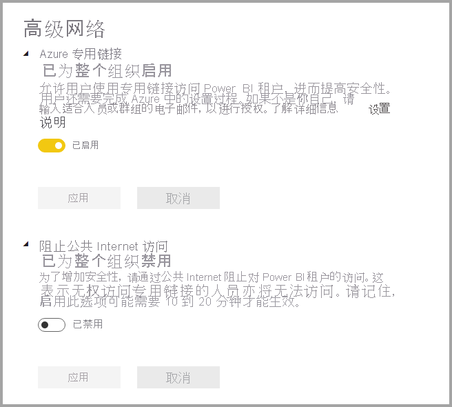
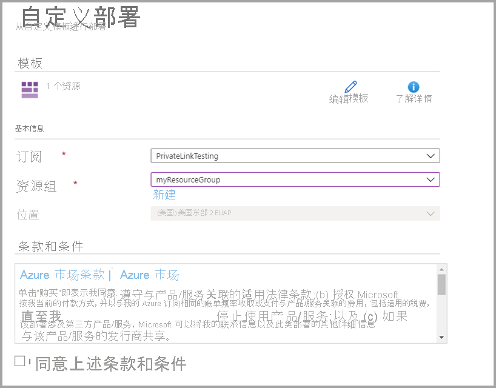
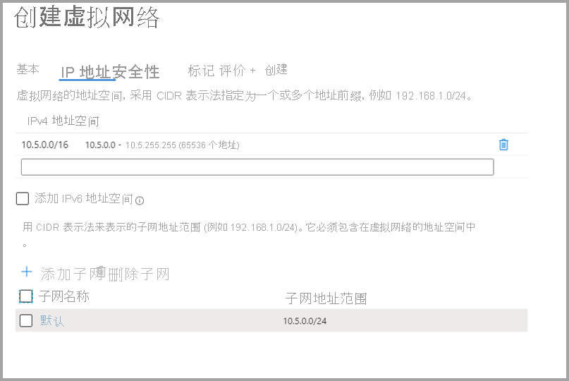
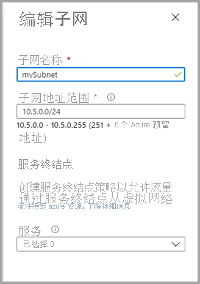
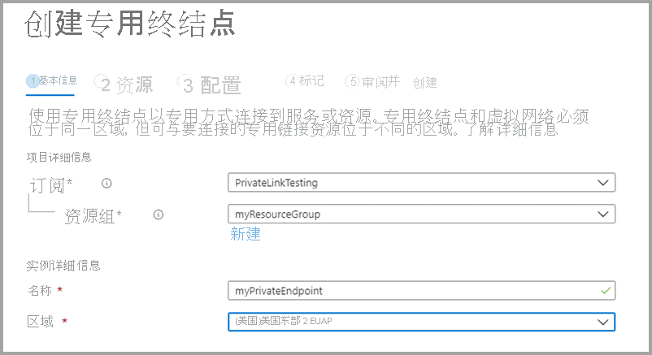
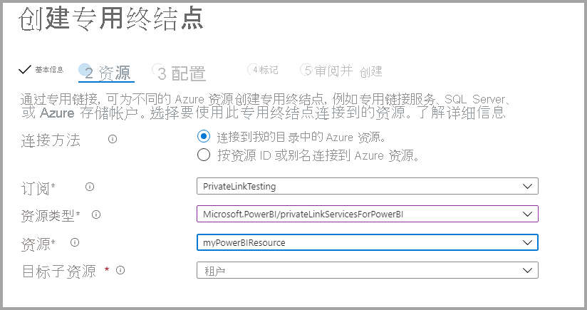
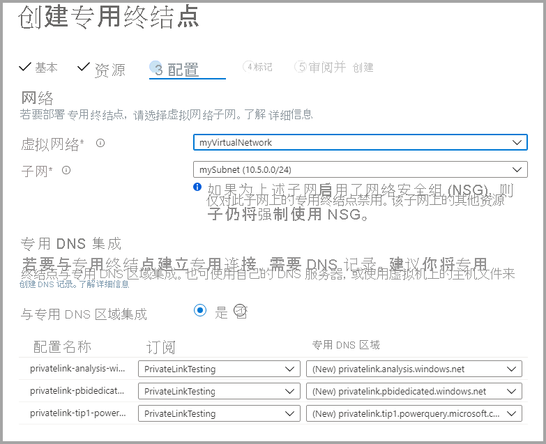

# <a name="private-links-for-accessing-power-bi"></a>用于访问 Power BI 的专用链接

Azure 网络提供了 Azure 专用链接功能，使 Power BI 可以通过 Azure 网络专用终结点提供安全访问。 通过 Azure 专用链接和专用终结点，数据流量通过 Microsoft 主干网络基础结构私密地进行发送，因此数据不会遍历 Internet。 

专用链接可确保 Power BI 用户在转到 Power BI 服务中的资源时使用 Microsoft 专用网络主干。

可以了解有关 [Azure 专用链接](https://azure.microsoft.com/services/private-link/)的更多信息。

## <a name="understanding-private-links"></a>了解专用链接

专用链接可确保进入组织的 Power BI 项目（如报表或工作区）的流量始终遵循组织配置的专用链接网络路径。 进入 Power BI 项目的用户流量必须来自已建立的专用链接，并且你可以将 Power BI 配置为拒绝所有不是来自配置的网络路径的请求。 

专用链接不能保证从 Power BI 到外部数据源（无论是在云中还是在本地）的流量受到保护。 而你必须配置防火墙规则和虚拟网络，以便进一步保护数据源。 

### <a name="power-bi-and-private-links-integration"></a>Power BI 和专用链接集成

适用于 Power BI 的 Azure 专用终结点是一个网络接口，该接口将你私密并安全地连接到由 Azure 专用链接提供支持的 Power BI 服务。   

专用终结点集成使平台即服务 (PaaS) 服务能够从客户的虚拟网络和本地网络进行私密部署和访问，而该服务仍在客户网络的外部运行。 专用终结点是一种单一定向技术，允许客户端启动到给定服务的连接，但不允许服务启动到客户网络的连接。 此专用终结点集成模式提供了管理隔离，因为服务可以独立于客户网络策略配置进行操作。 对于多租户服务，此专用终结点模型提供链接标识符，防止访问同一服务中托管的其他客户资源。 使用专用终结点时，只能从使用该集成服务访问有限的一组其他 PaaS 服务资源。  

Power BI 服务实现专用终结点，而不是服务终结点。  

对 Power BI 使用专用链接提供以下优势：

1. 专用链接可确保流量将通过 Azure 主干流向 Azure 基于云的资源的专用终结点。 

2. 若将网络流量从非基于 Azure 的基础架构隔离（例如本地访问），这要求客户配置 ExpressRoute 或虚拟专用网络 (VPN)。  

## <a name="using-secure-private-links-to-access-power-bi"></a>使用安全的专用链接访问 Power BI

在 Power BI 中，可以配置和使用允许你的组织私密访问 Power BI 的终结点。 若要配置专用链接，你必须是 Power BI 管理员，并且在 Azure 中具有创建和配置资源（例如虚拟机 (VM) 和虚拟网络 (V-Net)）的权限。 

可使用以下步骤通过专用链接安全访问 Power BI：

1. [为 Power BI 启用专用链接](#enable-private-links-for-power-bi)
2. [在 Azure 门户中创建 Power BI 资源](#create-a-power-bi-resource-in-the-azure-portal)
3. [创建虚拟网络](#create-a-virtual-network)
4. [创建虚拟机 (VM)](#create-a-virtual-machine-vm)
5. [创建专用终结点](#create-a-private-endpoint)
6. [使用远程桌面 (RDP) 连接到 VM](#connect-to-a-vm-using-remote-desktop-rdp)
7. [从虚拟机私密访问 Power BI](#access-power-bi-privately-from-the-vm)
8. [禁用 Power BI 的公共访问](#disable-public-access-for-power-bi)

以下部分提供有关各个步骤的更多信息。

## <a name="enable-private-links-for-power-bi"></a>为 Power BI 启用专用链接

若要开始，请以管理员身份通过 app.powerbi.com 登录 Power BI，并导航到管理门户。 选择“租户设置”并滚动到“高级网络”，然后切换单选按钮以打开“Azure 专用链接”，如下图所示  。 

为租户配置专用链接大约需要 15 分钟，这包括为租户配置单独的 FQDN，以便与 Power BI 服务私下进行通信。



完成后，可以转到下一步。

## <a name="create-a-power-bi-resource-in-the-azure-portal"></a>在 Azure 门户中创建 Power BI 资源

接下来，登录 [Azure 门户](https://portal.azure.com)，并使用“Azure 模板”创建 Power BI 资源。 替换下表所示的 ARM 模板示例中的参数，以创建 Power BI 资源。


|**参数**  |**值**  |
|---------|---------|
|```<resource-name>```    | myPowerBIResource         |
|```<tenant-object-id>```     | 52d40f65-ad6d-48c3-906f-1ccf598612d4         |

创建 ARM 模板 

```
{
  "$schema": "http://schema.management.azure.com/schemas/2015-01-01/deploymentTemplate.json#",
  "contentVersion": "1.0.0.0",
  "parameters": {},
  "resources": [
      {
          "type":"Microsoft.PowerBI/privateLinkServicesForPowerBI",
          "apiVersion": "2020-06-01",
          "name" : "<resource-name>",
          "location": "global",
          "properties" : 
          {
               "tenantId": "<tenant-object-id>"
          }
      }
  ]
}
```

在出现的对话框中，选中相应复选框以同意条款和条件，然后选择“购买”。




## <a name="create-a-virtual-network"></a>创建虚拟网络

下一步是创建虚拟网络和子网。 将下表中的示例参数替换为自己的参数，以创建虚拟网络和子网。

| 参数 |   值| 
|---------|---------|
| ```<resource-group-name>```   | myResourceGroup |
| ```<virtual-network-name>```  | myVirtualNetwork |
| ```<region-name>```   | 美国中部  |
| ```<IPv4-address-space>```    | 10.1.0.0/16 |
| ```<subnet-name>```   | mySubnet |
| ```<subnet-address-range>```  | 10.1.0.0/24 |

1. 在屏幕的左上方选择“创建资源”>“网络”>“虚拟网络”，或者在搜索框中搜索“虚拟网络”。  
2. 在“创建虚拟网络”的“基本信息”选项卡中输入或选择以下信息：

    |设置 | 值 |
    |-------------------|---------|
    |**项目详细信息**|
    |订阅 | 选择 Azure 订阅 |
    |资源组 |   选择“新建”，输入 ```<resource-group-name>```，然后选择“确定”，或根据参数选择一个现有的 ```<resource-group-name>``` 。 |
    |**实例详细信息** |
    | 名称  | 输入 ```<virtual-network-name>``` |
    |区域 | 选择 ```<region-name>``` |
    
    下图显示“基本信息”选项卡。
    
    


3. 接下来，选择“IP 地址”选项卡，或选择窗体底部的“下一步:IP 地址”按钮。 在“IP 地址”选项卡上，输入以下信息：

    |设置 | 值 |
    |-------------------|---------|
    |IPv4 地址空间 |输入 ```<IPv4-address-space>``` |
    
    
    

4. 在“子网名称”中，选择字词“默认”，然后在“编辑子网”中输入以下信息：

    |设置 | 值 |
    |-------------------|---------|
    | 子网名称 |输入 ```<subnet-name>``` |
    | 子网地址范围 | 输入 ```<subnet-address-range>``` |
    
    
    

5. 选择“保存”，然后选择“查看 + 创建”选项卡，或选择“查看 + 创建”按钮  。 

6. 然后选择“创建”。

完成这些步骤后，即可创建虚拟机 (VM)，如下一部分中所述。

## <a name="create-a-virtual-machine-vm"></a>创建虚拟机 (VM)


下一步是创建虚拟网络以及托管虚拟机 (VM) 的子网。

1. 在 Azure 门户屏幕的左上方，选择“创建资源”>“计算”>“虚拟机”。

2. 在“创建虚拟机 - 基本信息”中，输入或选择以下信息：

    |设置 | 值 |
    |-------------------|---------|
    |**项目详细信息**||
    |订阅 | 选择 Azure 订阅 |
    |资源组 |   选择在上一部分中创建的 myResourceGroup。 |
    |**实例详细信息** ||
    |名称 | 输入 myVm |
    |区域 | 选择“美国中部” |
    |可用性选项| 保留默认值“不需要基础结构冗余” |
    |映像 | 选择“Windows 10 专业版” |
    |大小 | 保留默认值“标准 DS1 v2” |
    |管理员帐户 ||
    |用户名 |输入所选用户名 |
    |密码 | 输入所选密码。 密码必须至少 12 个字符，且符合[定义的复杂性要求](/azure/virtual-machines/windows/faq#what-are-the-password-requirements-when-creating-a-vm) |
    |确认密码 | 重新输入密码 |
    |入站端口规则 ||
    |公共入站端口 | 保留默认值“无” |
    |节省资金 ||
    |已有 Windows 许可证？ |  保留默认值“否” |

3. 然后选择“下一步:磁盘”
4. 在“创建虚拟机 - 磁盘”中保留默认值，然后选择“下一步: **网络”** 。
5. 在“创建虚拟机 - 网络”中，选择以下信息：

    |设置 | 值 |
    |-------------------|---------|
    |虚拟网络|   保留默认值“MyVirtualNetwork”|
    |地址空间| 保留默认值“10.1.0.0/24”|
    |子网 |保留默认值“mySubnet (10.1.0.0/24)”|
    |公共 IP| 保留默认值“(new) myVm-ip”|
    |公共入站端口|  选择“允许选定的项”|
    |选择入站端口|  选择“RDP”|

6. 选择“查看 + 创建”。 随后你会转到“查看 + 创建”页，Azure 将在此页面验证配置。
7. 看到“验证通过”消息时，选择“创建” 。


## <a name="create-a-private-endpoint"></a>创建专用终结点

本部分中描述的下一个步骤是为 Power BI 创建专用终结点。

1. 在 Azure 门户屏幕的左上方，选择“创建资源”>“网络”>“专用链接中心(预览版)”。
2. 在“专用链接中心 - 概述”中的“与服务建立专用连接”选项的旁边，选择“创建专用终结点”  。
3. 在“创建专用终结点(预览版) - 基本信息”中，输入或选择以下信息：

    |设置 | 值 |
    |-------------------|---------|
    |**项目详细信息** ||
    |订阅|  选择 Azure 订阅|
    |资源组|    选择“myResourceGroup”。 已在上一部分创建此内容|
    |**实例详细信息** ||
    |名称|  输入“myPrivateEndpoint”。 如果此名称已被使用，请创建唯一的名称|
    |区域|    选择“美国中部”|
    
    下图显示了“创建专用终结点 - 基本信息”窗口。
    
    

4. 完成此信息后，选择“下一步:资源”，在“创建专用终结点 - 资源”页上，输入或选择以下信息：

    |设置 | 值 |
    |-------------------|---------|
    |连接方法| 选择“连接到我的目录中的 Azure 资源”|
    |订阅|  选择订阅|
    |资源类型| 选择 Microsoft.PowerBI/privateLinkServicesForPowerBI |
    |资源|  myPowerBIResource|
    |目标子资源|   租户|
    
    下图显示了“创建专用终结点 - 资源”窗口。
    
    

5. 正确输入此信息后，选择“下一步:配置”，在“创建专用终结点(预览版) - 配置”中，输入或选择以下信息：

    |设置 | 值 |
    |-------------------|---------|
    |**网络** ||
    |虚拟网络|   选择“myVirtualNetwork” |
    |子网 |选择“mySubnet” |
    |**专用 DNS 集成** ||
    |与专用 DNS 区域集成|   选择“是” |
    |专用 DNS 区域   |选择 <br> (New)privatelink.analysis.windows.net <br> (New)privatelink.pbidedicated.windows.net <br> (New)privatelink.tip1.powerquery.microsoft.com |
    
    下图显示了“创建专用终结点 - 配置”窗口。
    
    
    
    接下来，选择“查看 + 创建”，其中显示了“查看 + 创建”页，Azure 将在此页面验证配置 。 看到“验证通过”消息时，选择“创建” 。

## <a name="connect-to-a-vm-using-remote-desktop-rdp"></a>使用远程桌面 (RDP) 连接到 VM

创建名为 myVM 的虚拟机后，使用以下步骤通过 Internet 连接到该虚拟机：

1. 在门户的搜索栏中，输入 *myVm*。
2. 选择“连接”按钮。 选择“连接”按钮后，“连接到虚拟机”随即打开 。
3. 选择“下载 RDP 文件”。 Azure 会创建远程桌面协议 ( .rdp) 文件，并将其下载到计算机。
4. 打开下载的 .rdp 文件。
5. 出现提示时，选择“连接”。
6. 输入在上一步中创建 VM 时指定的用户名和密码。
7. 选择“确定”  。
8. 你可能会在登录过程中收到证书警告。 如果收到证书警告，请选择“确定”或“继续” 。

## <a name="access-power-bi-privately-from-the-vm"></a>从 VM 私密访问 Power BI

接下来，使用以下步骤从你在上一步中创建的虚拟机私密访问 Power BI： 

1. 在 myVM 的远程桌面中，打开 PowerShell。
2. 输入 nslookup 52d40f65ad6d48c3906f1ccf598612d4-api.privatelink.analysis.windows.net。
3. 将收到类似于下面的消息：

    ```
    Server:  UnKnown
    Address:  168.63.129.16
    
    Non-authoritative answer:
    Name:    52d40f65ad6d48c3906f1ccf598612d4-api.privatelink.analysis.windows.net
    Address:  10.1.0.4
    ```

4. 打开浏览器并转到 app.powerbi.com，以私密访问 Power BI。

## <a name="disable-public-access-for-power-bi"></a>禁用 Power BI 的公共访问

最后，需要禁用 Power BI 的公共访问。 

以管理员身份登录 app.powerbi.com，然后导航到“管理门户”。 选择“租户设置”并滚动到“高级网络”部分 。 启用“阻止公共 Internet 访问”部分中的切换按钮，如下图所示。 系统大约需要 15 分钟才能禁止你的组织通过公共 Internet 访问 Power BI。

就是这样 - 按照这些步骤进行操作之后，就只能通过专用链接访问组织的 Power BI，而不能通过公共 Internet 访问它。 

## <a name="considerations-and-limitations"></a>注意事项和限制

使用 Power BI 中的专用链接时需要牢记几个注意事项：

* 使用专用链接环境时，不能使用外部图像或主题，使用外部图像或主题可能会影响自定义视觉对象
* 使用专用链接环境时，“导出到 PDF”、从报表导出到 Excel 以及其他导出服务不可用
* SQL Server Reporting Services 报表（通常称为 RDL 文件 [*.rdl 格式文件]）不会在专用链接环境中呈现
* 如果 Internet 访问被禁用，并且如果数据集或数据流连接到作为数据源的 Power BI 数据集或数据流，则连接将失败
* 启用专用链接后，使用情况指标将失效
* 在 Power BI 中启用“阻止公共 Internet 访问”时，不支持“发布到 Web”（灰显）


## <a name="next-steps"></a>后续步骤

- [在组织中管理 Power BI](service-admin-administering-power-bi-in-your-organization.md)  
- [了解 Power BI 管理员角色](service-admin-role.md)  
- [在组织中审核 Power BI](service-admin-auditing.md)  

更多问题？ [尝试咨询 Power BI 社区](https://community.powerbi.com/)
