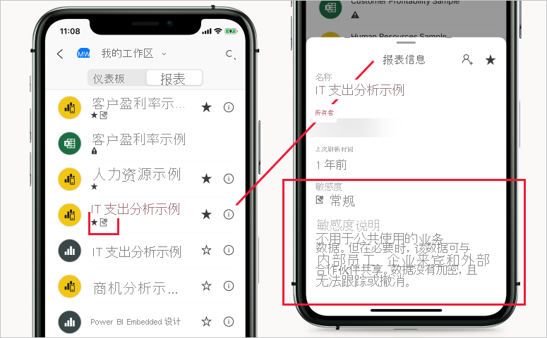

# Power BI 中的敏感度标签

本文介绍 Power BI 中 Microsoft 信息保护敏感度标签的功能。

有关在租户上启用敏感度标签的信息（包括许可要求和先决条件），请参阅[在 Power BI 中启用数据敏感度标签](service-security-enable-data-sensitivity-labels.md)。

有关如何将敏感度标签应用于 Power BI 报表、仪表板、数据集和数据流的信息，请参阅[如何在 Power BI 中应用敏感度标签](./service-security-apply-data-sensitivity-labels.md)。

## 简介

Microsoft 信息保护敏感度标签为用户提供了一种简单的方法，可在不影响生产力或协作能力的情况下，在 Power BI 中对关键内容进行分类。

敏感度标签可应用于数据集、报表、仪表板和数据流。 如果标记的数据离开 Power BI（通过导出到 Excel、PowerPoint 或 PDF 文件或通过其他支持的导出方案，如在 Excel 中分析或实时连接在 Excel 中的数据透视表），则 Power BI 会自动将标签应用于导出的文件，并根据标签的文件加密设置对其进行保护。 这样一来，无论敏感数据位于何处，都将受到保护。

应用于报表、仪表板、数据集和数据流的敏感度标签在 Power BI 服务中的许多地方可见。 报表和仪表板上的敏感度标签也在 Power BI iOS 和 Android 移动应用以及嵌入式视觉对象中可见。

借助 Power BI 管理门户中提供的[保护指标报表](service-security-data-protection-metrics-report.md)，Power BI 管理员可完整查看 Power BI 租户中的敏感数据。 此外，Power BI 审核日志包含有关活动（如应用、删除和更改标签，以及查看报表、仪表板等）的敏感度标签信息，使 Power BI 和安全管理员能够查看敏感数据使用情况，以便监视和调查安全警报。

## 重要注意事项

敏感度标签不会影响对 Power BI 中内容的访问权限 - 对 Power BI 中内容的访问权限由 Power BI 权限单独管理。 如果标签可见，则不会应用任何相关的加密设置（在 [Microsoft 365 安全中心](https://security.microsoft.com/)或 [Microsoft 365 合规中心](https://compliance.microsoft.com/)内配置）。 它们仅适用于通过导出到 Excel、PowerPoint 或 PDF 文件或其他支持的导出路径之一离开 Power BI 的数据。

不在不支持的导出路径中应用敏感度标签和文件加密。 Power BI 管理员可以阻止从不支持的导出路径进行导出：

>[!NOTE]
> 有权访问报表的用户具有访问整个基础数据集的权限，除非[行级别安全性 (RLS)](./service-admin-rls.md) 限制其访问权限。 报表作者可使用敏感度标签对报表进行分类和标注。 如果敏感度标签具有保护设置，则当报表数据导出到 Excel、PowerPoint 或 PDF 文件时，Power BI 将应用这些保护设置。 只有经过授权的用户才能打开受保护的文件。

## 支持的导出路径
以下导出路径当前支持将敏感度标签及其关联的保护应用于离开 Power BI 的数据：
* 导出到 Excel、PowerPoint 和 PDF 文件。
* Power BI 服务中的“在 Excel 中分析”，会触发通过实时连接到 Power BI 数据集来下载 Excel 文件。
* 通过实时连接到 Power BI 数据集的 Excel 中的数据透视表，适用于具有 M365 E3 及更高版本的用户。 

## 敏感度标签在 Power BI 中的工作原理

向 Power BI 仪表板、报表、数据集或数据流应用敏感度标签时，类似于对资源应用标记，这样做具有以下优点：
* 可自定义 - 可以为组织中不同级别的敏感内容创建类别，如个人、公共、一般、机密和高度机密。
* 明文 - 由于标签为明文形式，因此用户可以轻松地根据敏感度标签指南了解如何处理内容。
* **持久** - 向内容应用敏感度标签之后，在将内容导出到 Excel、PowerPoint 和 PDF 文件时，将随内容一起导出标签，并成为应用和强制执行策略的基础。

以下是有关 Power BI 中的敏感度标签如何工作的快速示例。 下图显示了如何在 Power BI 服务中将敏感度标签应用于报表，然后如何将报表中的数据导出到 Excel 文件，最后如何在导出的文件中保留敏感度标签及其保护。

应用于内容的敏感度标签与内容一起保留和漫游，如同在整个 Power BI 中使用和共享一样。 可以使用此标签生成使用情况报表并查看敏感内容的活动数据。

## 创建新内容时敏感度标签的继承

在 Power BI 服务中创建新报表和仪表板时，它们会自动继承以前应用于父数据集或报表的敏感度标签。 例如，在具有“高度机密”敏感度标签的数据集上创建的新报表也会自动接收“高度机密”标签。

下图显示了数据集的敏感度标签如何自动应用于在该数据集上构建的新报表。

>[!NOTE]
>如果出于某些原因而无法在新报表或仪表板上应用敏感度标签，则 Power BI 将不会阻止创建新项。

## 导出的数据的敏感度标签和保护

将数据从 Power BI 导出到 Excel、PowerPoint 或 PDF 文件时，Power BI 会自动对导出的文件应用敏感度标签，并根据标签的文件加密设置对其进行保护。 这样一来，无论敏感数据位于何处，都将受到保护。

从 Power BI 导出文件的用户有权根据敏感度标签设置访问和编辑该文件；他们不会获得该文件的所有者权限。

在将数据导出到 .csv、.pbix 文件或任何其他导出路径时，不会应用敏感度标签和保护。

对导出的文件应用敏感度标签和保护不会向文件添加内容标记。 但是，如果标签配置为应用内容标记，则在 Office 桌面应用中打开文件时，Azure 信息保护统一标签客户端会自动应用这些标记。 在为桌面、移动或 Web 应用使用内置标签时，不会自动应用内容标记。 有关更多详细信息，请参阅 [Office 应用何时应用内容标记和加密](/microsoft-365/compliance/sensitivity-labels-office-apps#when-office-apps-apply-content-marking-and-encryption)。

如果在将数据导出到文件时无法应用标签，导出将失败。 要检查导出失败的原因是否为无法应用标签，请在标题栏的中心单击报表或仪表板名称，然后在打开的信息下拉菜单中查看是否显示“无法加载敏感度标签”。 如果安全管理员取消发布或删除了应用的标签，或出现了临时系统问题，则可能会发生这种情况。

## “在 Excel 中分析”的敏感度标签继承

当你通过实时连接到 Power BI 数据集在 Excel 中创建数据透视表（可以从 Power BI 通过[在 Excel 中分析](../collaborate-share/service-analyze-in-excel.md)或从 [Excel](https://support.microsoft.com/office/create-a-pivottable-from-power-bi-datasets-31444a04-9c38-4dd7-9a45-22848c666884?ui=en-US&rs=en-US&ad=US) 执行此操作）时，将继承数据集的敏感度标签，并将其应用于 Excel 文件以及任何关联的保护。 如果数据集上的标签稍后更改为更具限制性的标签，则会在数据刷新时自动更新应用于链接的 Excel 文件的标签。

 
Excel 中手动设置的敏感性标签不会由数据集的敏感度标签自动覆盖。 相反，横幅会通知你数据集具有敏感度标签，并建议你应用该标签。

>[!NOTE]
>如果数据集的敏感度标签比 Excel 文件的敏感度标签限制少，则不会发生标签继承或更新。 Excel 文件永远不会继承限制性较低的敏感度标签。

## 嵌入式报表和仪表板中的敏感度标签保留性

可在商业应用程序（如 Microsoft Teams 和 SharePoint）或组织的网站中嵌入 Power BI 报表、仪表板和视觉对象。 如果嵌入的视觉对象、报表或仪表板应用了敏感度标签，则该敏感度标签会显示在嵌入视图中，并且在将数据导出到 Excel 时，该标签及其保护将保持不变。

支持以下嵌入方案：
* [为组织嵌入内容](../developer/embedded/embed-sample-for-your-organization.md)
* Microsoft 365 应用（例如 [Teams](../collaborate-share/service-embed-report-microsoft-teams.md) 和 [SharePoint](../collaborate-share/service-embed-report-spo.md)）
* [安全 URL 嵌入](../collaborate-share/service-embed-secure.md)（从 Power BI 服务嵌入） 

## Power BI 移动应用中的敏感度标签

可在 Power BI 移动应用中的报表和仪表板上查看敏感度标签。 报表或仪表板名称附近的图标指示它具有敏感度标签，并且可在报表或仪表板的信息框中找到标签的类型及其说明。

## 受支持的云
敏感度标签仅在全局（公有）云的租户中受支持，而在云（如国家/地区云）的租户中不受支持。

## 授权和要求

请参阅[授权和要求](service-security-enable-data-sensitivity-labels.md#licensing-and-requirements)。

## 创建和管理敏感度标签

在 [Microsoft 365 安全中心](https://security.microsoft.com/)或 [Microsoft 365 合规中心](https://compliance.microsoft.com/)创建和管理敏感度标签。

要在任一中心访问敏感度标签，请导航到“分类”>“敏感度标签”。 这些敏感度标签可由多个 Microsoft 服务（例如 Azure 信息保护、Office 应用和 Office 365 服务）使用。

>[!Important]
> 如果你的组织使用 Azure 信息保护敏感度标签，则需要将这些标签[迁移](/azure/information-protection/configure-policy-migrate-labels)到前面列出的服务之一，以便在 Power BI 中使用它们。

## 限制

以下列表提供了 Power BI 中敏感度标签的一些限制：

* 敏感度标签只能应用于仪表板、报表、数据集和数据流。 它们当前不可用于[分页报表](../paginated-reports/report-builder-power-bi.md)和工作簿。
* Power BI 资产上的敏感度标签在工作区列表、世系、收藏夹、最近使用和应用视图中可见。这些标签目前在“与我共享”视图中不可见。 但请注意，应用于 Power BI 资产的标签（即使不可见）将始终保留在导出到 Excel、PowerPoint 和 PDF 文件中的数据上。
* 模板应用不支持数据敏感度标签。 模板应用创建者设置的敏感度标签在提取和安装应用时被删除，应用使用者添加到已安装模板应用项目的敏感度标签在更新应用时丢失（重置为无）。
* Power BI 不支持[请勿转发](/microsoft-365/compliance/encryption-sensitivity-labels#let-users-assign-permissions)、[用户定义](/microsoft-365/compliance/encryption-sensitivity-labels#let-users-assign-permissions)和 [HYOK](/azure/information-protection/configure-adrms-restrictions) 这三种保护类型的敏感度标签。 “请勿转发”和“用户定义”保护类型引用 [Microsoft 365 安全中心](https://security.microsoft.com/)或 [Microsoft 365 合规中心](https://compliance.microsoft.com/)内定义的标签。
* 建议不允许用户在 Power BI 中应用父标签（标签只有在具有子标签时才会被视为父标签）。 如果对内容应用了父标签，则无法将数据从该内容导出到文件（Excel、PowerPoint 和 PDF）。 请参阅[子标签（分组标签）](/microsoft-365/compliance/sensitivity-labels#sublabels-grouping-labels)。

## 后续步骤

本文概述了 Power BI 中的数据保护。 以下文章提供了有关 Power BI 中的数据保护的进一步详细信息。 

* [在 Power BI 中启用敏感度标签](service-security-enable-data-sensitivity-labels.md)
* [如何在 Power BI 中应用敏感度标签](service-security-apply-data-sensitivity-labels.md)
* [在 Power BI 中使用 Microsoft Cloud App Security 控件](service-security-using-microsoft-cloud-app-security-controls.md)
* [保护指标报表](service-security-data-protection-metrics-report.md)