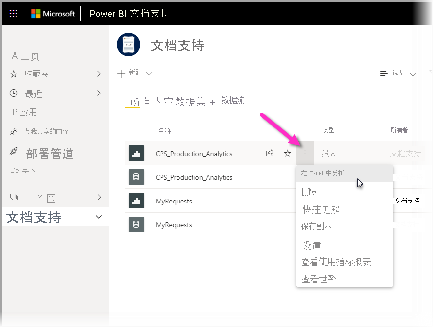
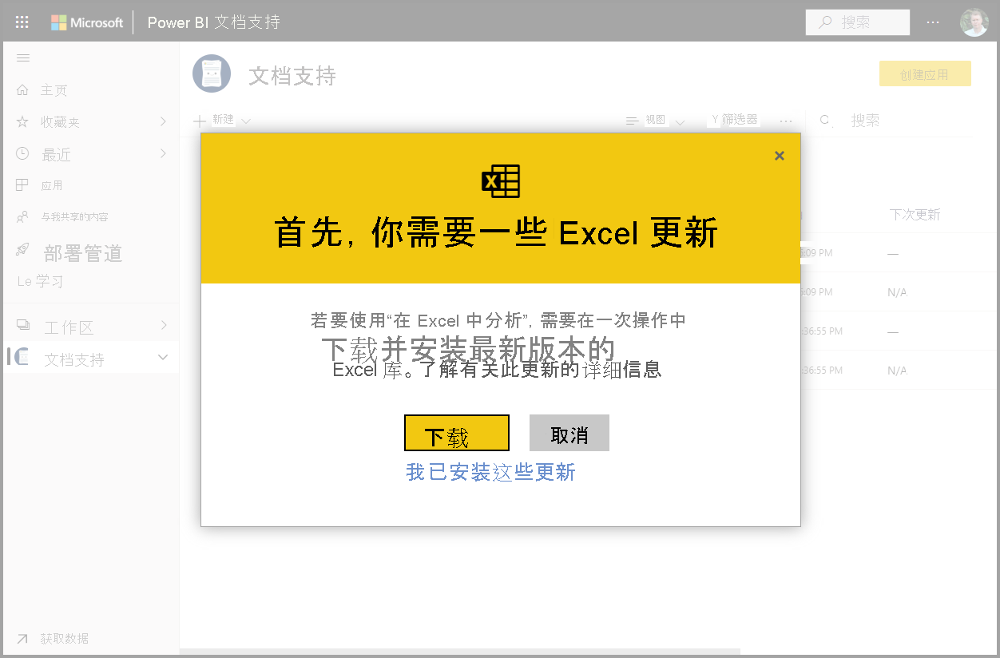
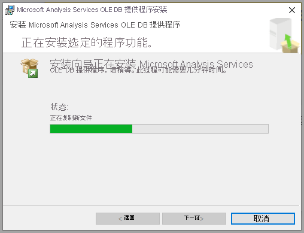
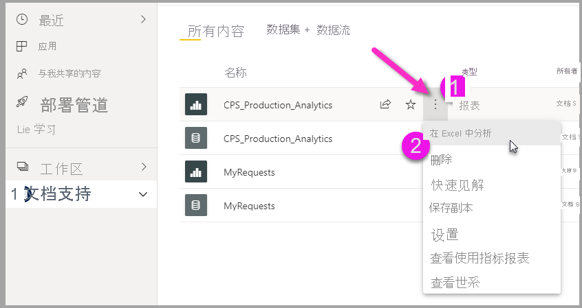
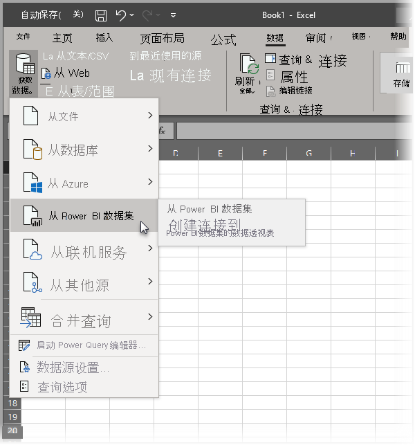

# 在 Excel 中分析
借助“在 Excel 中分析”，可以将 Power BI 数据集引入到 Excel 中，然后使用数据透视表、图表、切片器和其他 Excel 功能查看这些数据集并与其交互。 若要使用“在 Excel 中分析”必须先从 Power BI 下载并安装该功能，然后选择一个或多个要在 Excel 中使用的数据集。 

本文说明了如何安装和使用“在 Excel 中分析”，介绍了它的限制以及一些后续步骤。 学习内容：

* [安装“在 Excel 中分析”](#install-analyze-in-excel)
* [连接到 Power BI 数据](#connect-to-power-bi-data)
* [使用 Excel 分析数据](#use-excel-to-analyze-the-data)
* [保存和共享工作簿](#saving-and-sharing-your-new-workbook)
* [要求](#requirements)

首先从安装开始。

## 安装“在 Excel 中分析”

必须从 Power BI 服务提供的链接中安装“在 Excel 中分析”。 Power BI 会检测计算机上的 Excel 版本，并自动下载适当的版本（32 位或 64 位）。 Power BI 服务在浏览器中运行。 可以使用以下链接登录到 Power BI：

* [登录 Power BI](https://app.powerbi.com)

登录并且浏览器中运行 Power BI 服务后，请在右上角选择“更多选项”项 (...)，然后选择“下载 > 在 Excel 更新中分析”。 此菜单项适用于新安装“在 Excel 中分析”更新的情况。

也可以从 Power BI 服务中导航到要分析的数据集，然后为数据集、报表或其他 Power BI 项选择“更多选项”。 从显示的菜单中，选择“在 Excel 中分析”选项，如下图所示。

无论采用哪种方式，Power BI 都将检测是否已安装“在 Excel 中分析”，如果未安装，则会提示你下载它。 

选择“下载”时，Power BI 将检测已安装的 Excel 版本，并从 Excel 安装程序中下载适当的“在 Excel 中分析”版本。 你可以在浏览器的底部或者显示下载进度的任何其他位置看到下载状态。 

下载完成后，运行安装程序 (.msi)，安装“在 Excel 中分析”。 安装进程的名称不同于“在 Excel 中分析”；该名称将为“Microsoft Analysis Services OLE DB Provider”（如下图所示）或类似的内容。

安装完成后，就可以从 Power BI 服务中选择报表（或数据集等其他 Power BI 数据元素），然后在 Excel 中进行分析。

## 连接到 Power BI 数据

在 Power BI 服务中，导航到要在 Excel 中分析的数据集或报表，然后执行以下操作：

1. 选择“更多选项”菜单。

1. 从显示的菜单项中选择“在 Excel 中分析”。

    下图显示了如何选择报表。

    
    
    >[!NOTE]
    >请记住，如果从“报表”菜单中选择“在 Excel 中分析”，则会将报表的基础数据集导入到 Excel 中。

    然后，Power BI 服务会创建数据集的 Excel 文件，该文件设计（和结构化），适合在 Excel 中分析；随后，该服务将在浏览器中开始下载过程。
    
    

    文件名与它派生自的数据集（或报表以及其他数据源）相匹配。 因此，如果报表叫做“季度报表”，则下载的文件将为“季度报表.xlsx”。

3. 启动 Excel 文件。

    >[!NOTE]
    >首次打开文件时，你可能需要“启用编辑”，然后“启用内容”，具体取决于[受保护的视图](https://support.microsoft.com/en-gb/office/what-is-protected-view-d6f09ac7-e6b9-4495-8e43-2bbcdbcb6653?ui=en-us&rs=en-gb&ad=gb)和[受信任的文档](https://support.microsoft.com/en-us/office/trusted-documents-cf872bd8-47ec-4c02-baa5-1fdba1a11b53)设置 。
    >
    >
    >
    >

## 使用 Excel 分析数据

启用编辑和内容后，Excel 会显示 Power BI 数据集中的空白“数据透视表”和“字段”列表，这些列表可供分析 。

Excel 文件有一个 MSOLAP 连接字符串，该字符串连接到 Power BI 中的数据集。 当你分析或处理数据时，Excel 会在 Power BI 中查询该数据集，并将结果返回到 Excel。 如果该数据集使用 DirectQuery 连接到实时数据源，Power BI 会查询该数据源，并将结果返回到 Excel。

现在已经与 Power BI 中的数据建立连接，接下来可以创建数据透视表和图表，并分析该数据集，就像在 Excel 中处理本地数据集一样。

“在 Excel 中分析”特别适用于连接到以下数据源的数据集和报表：

* Analysis Services 表格或多维数据库
* 含数据模型的 Power BI Desktop 文件或 Excel 工作簿，这些数据模型包含使用数据分析表达式 (DAX) 创建的模型度量值。

> [!IMPORTANT]
> 使用“在 Excel 中分析”会向具有数据集访问权限的任何用户公开所有详细信息级别的数据。

开始使用“在 Excel 中分析”时，需要考虑几个事项，这可能需要额外的一个或两个步骤来进行协调。 下面各节介绍了这些可能性。 

### 登录到 Power BI
即便你已经在浏览器中登录 Power BI，在 Excel 中首次打开新的 Excel 文件时，也会看到使用 Power BI 帐户登录 Power BI 的提示。 这会对 Excel 到 Power BI 的连接进行身份验证。

### 拥有多个 Power BI 帐户的用户
一些用户拥有多个 Power BI 帐户。 如果你是这种情况，则你可能会使用一个帐户登录到 Power BI，但你的其他帐户有权访问用于“在 Excel 中分析”的数据集。 在这种情况下，如果尝试访问用于“在 Excel 工作簿中分析”的数据集，你可能会遇到“禁止”错误或登录失败。

上述问题发生时，你有机会再次登录，届时你可以使用有权访问“在 Excel 中分析”所访问的数据集的 Power BI 帐户登录。 你还可以在 Excel 的顶部功能区选择你的名称，该名称可标识当前登录的帐户。 注销并使用其他帐户重新登录。

## 保存和共享新工作簿

可以“保存”使用 Power BI 数据集创建的 Excel 工作簿，就像保存任何其他工作簿一样。 但是，你不能将该工作簿发布或导回到 Power BI，因为你只能将表中有数据或具有数据模型的工作簿发布或导入到 Power BI。 因为新工作簿与 Power BI 中的数据集建立了连接，所以将其发布或导入到 Power BI 无疑是在兜圈子！

保存工作簿后，可以将它与组织中的其他 Power BI 用户共享。 

当你与某位用户共享了你的工作簿，而该用户打开该工作簿时，他将看到你在上一次保存该工作簿时显示的数据透视表和数据，但这些可能不是最新版本的数据。 若要获取最新数据，用户必须使用**数据**功能区上的**刷新**按钮。 由于工作簿连接到 Power BI 中的数据集，因此，尝试刷新工作簿的用户在首次尝试使用此方法更新时，必须登录 Power BI 并安装 Excel 更新。

由于用户需要刷新数据集，但 Excel Online 不支持刷新外部连接，因此，建议用户在其计算机上的桌面版 Excel 中打开工作簿。

> [!NOTE]
> 本地数据集托管在 Analysis Services (AS) 数据库中的情况下，Power BI 租户的管理员可以使用“Power BI 管理门户”禁用“在 Excel 中分析”。 禁用该选项时，会对 AS 数据库禁用**在 Excel 中分析**，但它仍可用于其他数据集。

## 从 Excel 访问 Power BI 数据集的其他方法
具有特定 Office SKU 的用户还可以使用 Excel 中的“获取数据”功能从 Excel 中连接到 Power BI 数据集。 如果 SKU 不支持此功能，则不会显示“获取数据”菜单选项。

从“数据”功能区菜单中，选择“获取数据 > 从 Power BI 数据集中”，如下图所示。

此时将显示一个窗格，可在其中浏览你有权访问的数据集、查看数据集是否经过认证或升级，并确定数据保护标签是否已应用到这些数据集。 

若要详细了解这种将数据导入 Excel 的方法，请参阅 Excel 文档中的[从 Power BI 数据集创建数据透视表](https://support.office.com/article/31444a04-9c38-4dd7-9a45-22848c666884)。

此外，你还可以在 Excel 的“数据类型”库中访问“精选表”。 若要详细了解精选表及其访问方式，请参阅[访问 Excel 中的 Power BI 精选表（预览版）](service-excel-featured-tables.md)。

## 要求
使用**在 Excel 中分析**时有以下几点要求：

* Microsoft Excel 2010 SP1 和更高版本支持**在 Excel 中分析**。

* Excel 数据透视表不支持对数值字段进行拖放聚合。 你在 Power BI 中的数据集 *必须具有预定义的度量值* 。 阅读有关[创建度量值](../transform-model/desktop-measures.md)的信息。
* 某些组织可能有组策略规则，导致无法对 Excel 安装所需的**在 Excel 中分析**更新。 如果无法安装更新，请与管理员联系。
* “在 Excel 中分析”功能要求数据库位于 Power BI Premium 中或者用户具有 Power BI Pro 许可证。 若要详细了解许可证类型之间的功能差异，请参阅 [Power BI 定价](https://powerbi.microsoft.com/pricing/)的“Power BI 功能比较”部分。
* 如果用户具有基本数据集的权限，则可通过“在 Excel 中分析”功能连接到数据集。  用户可通过多种方式获取此权限，例如成为包含此数据集的工作区的成员、具有他人向其共享了使用该数据集的报表或仪表板，或者在包含该数据集的应用或工作区中具有该数据集的生成权限。 详细了解数据集的[“生成”权限](../connect-data/service-datasets-build-permissions.md)。
* 来宾用户无法将“在 Excel 中分析”用于发送自（源自）另一个租户的数据集。 
* “在 Excel 中分析”是一项 Power BI 服务功能，该功能在 Power BI 报表服务器或 Power BI Embedded 中不可用。 
* “在 Excel 中分析”仅在运行 Microsoft Windows 的计算机上受到支持。

如果用户需要卸载“在 Excel 中分析”功能，可以使用 Windows 计算机上的“添加或删除程序 ”系统设置执行此操作。

## 故障排除
有时，在使用 Analyze in Excel 期间可会能收意外的结果，或功能未按预期工作。 [本页针对在 Excel 中使用分析功能时遇到的常见问题提供解决方案](desktop-troubleshooting-analyze-in-excel.md)。

## 后续步骤

你可能还会对以下文章感兴趣：

* [在 Power BI Desktop 中使用跨报表钻取](../create-reports/desktop-cross-report-drill-through.md)
* [在 Power BI Desktop 中使用切片器](../visuals/power-bi-visualization-slicers.md)
* [TAnalyze in Excel 故障排除](desktop-troubleshooting-analyze-in-excel.md)
* [访问 Excel 中的 Power BI 精选表（预览版）](service-excel-featured-tables.md)。

