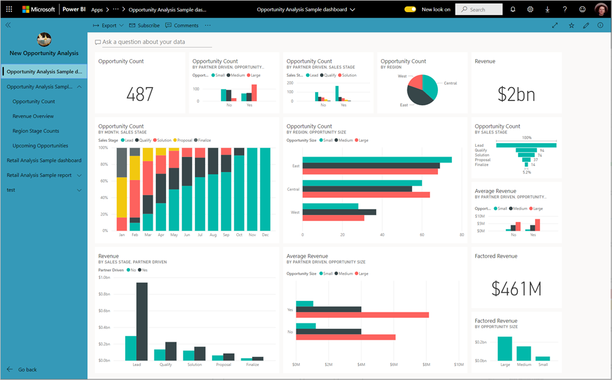

# 在 Power BI 中发布应用

在 Power BI 中，可创建正式的打包内容，然后将其作为应用分发给广大受众。 在工作区中创建应用，可在工作区中与同事协作处理 Power BI 内容。 然后可以将已完成的应用发布给组织中的许多人员。 

业务用户通常需要多个 Power BI 仪表板和报表，才能经营自己的业务。 使用 Power BI 应用，可以创建仪表板和报表集合并将这些集合作为应用发布到整个组织或发布到特定人员或组。 对于报表创建者或管理员，应用能使管理这些集合的权限变得更轻松。

业务用户可以通过多种不同的方式获取你的应用：

- 他们可以从 Microsoft AppSource 中找到并安装应用。
- 你可以向他们发送直接链接。
- 如果 Power BI 管理员已授予权限，则可将这些应用自动安装到同事的 Power BI 帐户中。
- 在你分发或更新应用时，Power BI 不会向内部用户发送任何电子邮件。 如果你将应用分发给外部用户，则这些用户会收到附有直接链接的电子邮件。 

你可以创建其中具有内置导航的应用，这样你的用户就可以轻松找到你的内容。 他们无法修改应用的内容。 但可以在 Power BI 服务或其中一个移动应用中与之进行交互 - 自行对数据进行筛选、突出显示和排序。 他们将自动获得更新，你可以控制数据刷新的频率。 你还可以为他们提供生成权限以连接到基础数据集，并在应用中创建报表的副本。 详细了解[生成权限](../connect-data/service-datasets-build-permissions.md)。

## 应用许可证
若要创建或更新应用，你需要具有 Power BI Pro 许可证。 对应用使用者来说，有以下两种选项。

* **选项 1** 此应用的工作区不包括在 Power BI Premium 容量中：所有业务用户都需要 Power BI Pro 许可才能查看应用。 
* **选项 2** 此应用的工作区包含在 Power BI Premium 容量中：组织中没有 Power BI Pro 许可证的业务用户也可查看应用内容。 但是，他们无法复制报表，也无法基于基础数据集创建报表。 请阅读[什么是 Power BI Premium？](../admin/service-premium-what-is.md)了解详细信息。

## 发布你的应用
工作区中的仪表板和报表准备就绪后，选择要发布的仪表板和报表，然后将其作为应用发布。 

1. 在工作区列表视图中决定应用要包含的仪表板和报表。

    

    如果选择不包含具有相关仪表板的报表，则该报表旁边将显示一条警告。 此时仍然可以发布应用，但这个相关的仪表板将缺少来自该报表的磁贴。

    

2. 选择右上角的“发布应用”按钮，启动从工作区创建和发布应用的进程。
   
    

3. 在“设置”中，填写名称和说明以帮助用户查找应用。 可以选择主题颜色对其进行个性化设置。 还可以添加指向支持站点的链接。
   
    

4. 在“导航”中，选择要作为应用的一部分进行发布的内容。 然后添加应用导航以组织各节的内容。 请参阅本文中的[设计应用的导航体验](#design-the-navigation-experience)，获取详细信息。
   
    

5. 在“权限”中，确定可以访问应用的人员，以及他们可对应用进行的操作。 

    - 在[经典工作区](service-create-workspaces.md)中：你组织中的每个人、特定人员或 Azure Active Directory (Azure AD) 安全组。
    - 在[新的体验工作区](service-create-the-new-workspaces.md)中：特定人员、Azure AD 安全组和通讯组列表，以及 Microsoft 365 组。 所有工作区用户都将自动获得对工作区应用的访问权限。
    - 可以允许应用用户通过授予他们“生成”权限来连接到应用的基础数据集。 他们在搜索共享数据集时会看到这些数据集。 阅读本文，了解有关[允许用户连接到应用的数据集](#allow-users-to-connect-to-datasets)的详细信息。
    - 具有“生成”权限的用户还有权将此应用中的报表复制到其他工作区。 阅读本文，了解有关[允许用户在应用中复制报表](#allow-users-to-copy-reports)的详细信息。
    
    >[!IMPORTANT]
    >如果你的应用依赖于其他工作区中的数据集，则由你负责确保所有应用用户都有权访问基础数据集。
    >如果应用或报表与数据集位于相同的工作区中，那么请确保还向应用添加与该数据集关联的报表。

6. 如果 Power BI 管理员已在 Power BI 管理员门户中为你启用了此设置，则你可自动为收件人安装应用。 详细了解本文中的[自动安装应用](#automatically-install-apps-for-end-users)。

    

7. 选择“发布应用”时，将看到一条消息，用于确认应用已准备好发布。 在“共享此应用”对话框中，可以复制指向此应用的直接链接 URL。
   
    

可将该直接链接发送给你已与其共享过的人，或者他们可以通过转到“从 AppSource 下载并浏览更多应用”，在“应用”选项卡上找到你的应用。 详细了解[业务用户的应用体验](../consumer/end-user-apps.md)。

## 更改已发布的应用
发布应用后，你可能想要更改或更新它。 如果你是新工作区的管理员或成员，则很方便进行更新。 

1. 打开对应于应用的工作区。 
   
    

2. 对仪表板或报表进行任何想要的更改。
 
    该工作区为临时区域，因此应用中所做更改在再次发布前不会生效。 这样就方便进行更改，而不会影响已发布的应用。  
 
    > [!IMPORTANT]
    > 如果删除报表并更新应用，那么即使将报表添加回应用，应用使用者也会丢失书签、评论等所有自定义设置。  
 
3. 返回到内容的工作区列表，然后在右上角选择“更新应用”。
   
1. 如有需要，更新“设置”、“导航”和“权限”，然后选择“更新应用”   。
   
应用的发布对象会自动看到更新版应用。 

## 设计导航体验
通过“新建导航生成器”选项可为应用生成自定义导航。 用户通过自定义导航可以更轻松地找到和使用应用中的内容。 现有应用的此选项处于关闭状态，而新应用的此选项默认开启。

关闭该选项时，可以选择将“应用登录页”设置为“特定内容”（例如仪表板或报表），或者选择“无”来向用户展示内容基本列表  。

打开“新建导航生成器”时，你可以设计自定义导航。 应用中包含的所有报表、仪表板和 Excel 工作簿默认以简单列表形式列出。 

可以通过以下方式进一步自定义应用导航：

* 使用向上/向下箭头重新排列项。 
* 重命名“报表详细信息”、“仪表板详细信息”和“工作簿详细信息”中的项  。
* 隐藏导航栏中的某些项。
* 使用“新建”选项为组相关内容添加“节” 。
* 使用“新建”选项将指向外部资源的“链接”添加到导航窗格 。 

添加“链接”时，可在“链接详细信息”中选择打开链接的位置 。 链接默认在“当前选项卡”中打开，但也可以选择在“新选项卡”或“内容区域”中打开  。 

### 使用“新建导航生成器”选项的注意事项
以下是使用“新建导航生成器”时，需要注意的一般事项：

* 报表页在应用导航区域（可展开的部分）中显示。 当报表具有一个可见页时，只显示报表名称。 单击导航中的报表名称将打开报表的第一页。 

    > [!NOTE]
    > 报表可能只有一个可见页，因为已使用按钮或钻取操作设置了对其余页的导航。

* 如果关闭“新建导航生成器”，然后发布或更新应用，那么你将丢失已完成的自定义设置。 例如，导航项的节、排序、链接和自定义名称将全部丢失。
* 提供不使用应用生成器的选项。

为应用导航添加链接和选择“内容”区域选项时，需注意以下方面：
* 确保可以嵌入链接。 某些服务在 Power BI 等第三方站点会阻止嵌入其内容。
* 不支持在其他工作区中嵌入报表或仪表板等 Power BI 服务内容。 
* 通过本地嵌入 URL 内容从本地部署嵌入 Power BI 报表服务器内容。 使用[创建 Power BI 报表服务器 URL](../report-server/quickstart-embed.md#create-the-power-bi-report-url) 中的步骤获取 URL。 注意，常规身份验证规则适用，因此查看内容需要与本地服务器建立 VPN 连接。 
* 嵌入内容的顶部显示安全警告，表示该内容不在 Power BI 中。

## 自动为最终用户安装应用
如果管理员为你提供了权限，则你可以自动安装应用，并将其推送到最终用户。 借助此推送功能可以更轻松地将合适的应用分发给合适的人员或组。 最终用户的应用内容列表中自动显示你的应用。 用户无需通过 Microsoft AppSource 或单击安装链接查找你的应用。 请在 Power BI 管理员门户文章中参阅管理员如何确保[将应用推送给最终用户](../admin/service-admin-portal.md#push-apps-to-end-users)。

### 如何将应用自动推送给最终用户
管理员分配权限后，可通过一个新选项来自动安装应用。 选中该框并选择“发布应用”（或“更新应用”）时，该应用将推送到“访问”选项卡上应用“权限”部分中定义的所有用户或组   。

### 用户如何获取你推送给他们的应用
推送应用后，应用将自动显示在用户的“应用”列表中。 按此方式，你可以精选组织中特定用户或工作角色需要随时使用的应用。

### 自动安装应用的注意事项
下面是将应用推送给最终用户时需要注意的事项：

* 自动向用户安装应用可能需要一些时间。 大多数应用立即为用户安装，但推送的应用可能需要一些时间。  这取决于应用中的项数和授予访问权限的人员数。 我们建议在下班期间推送应用，那时的时间充足，用户也不需要使用应用。 请先与多位用户验证，再发送有关应用可用性的广泛沟通。

* 刷新浏览器。 用户可能需要刷新或关闭和重新打开浏览器才能看到“应用”列表中的推送应用。

* 如果用户没有在“应用”列表中立即看到应用，则应刷新浏览器，或者关闭浏览器然后重新打开。

* 尽量不要让用户不知所措。 请注意不要推送太多应用，以便用户了解预先安装的应用是有用的。 最好控制可以将应用推送给最终用户的人员，以协调计时。 建立联系点，用于将组织中的应用推送给最终用户。

* 不会为未接受邀请的来宾用户自动安装应用。  

## 允许用户连接到数据集

选中“允许用户连接到应用基础数据集”的选项时，即意味着应用用户将获得对这些数据集的“生成”权限。 具有此权限的用户可以执行几个关键操作：

- [使用应用数据集](../connect-data/service-datasets-across-workspaces.md)作为其报表的基础。
- 在 Power BI Desktop 和 Power BI 服务的“获取数据”体验中搜索这些数据集。
- 根据这些数据集创建报表和仪表板。

清除此选项后，添加到应用的新用户将无法获得生成权限。 但是，对于现有应用用户，基础数据集的权限不变。 可以为不应再拥有生成权限的应用用户手动删除该权限。 详细了解[生成权限](../connect-data/service-datasets-build-permissions.md)。

## 允许用户复制报表

选中“允许用户创建此应用中报表的副本”选项时，即意味着用户可以将应用中的任何报表保存到“我的工作区”或其他工作区。 若要创建副本，即使原始报表位于高级容量的工作区中，用户也需要一个 Pro 许可证。 然后，他们可以根据自己的独特需求自定义报表。 必须首先选择“允许所有用户使用生成权限连接到应用的基础数据集”选项。 选中这些选项，即意味着启用新的[从其他工作区复制报表](../connect-data/service-datasets-copy-reports.md)功能。

## 取消发布应用
工作区的任何成员都可以取消发布应用。

>[!IMPORTANT]
>取消发布应用后，应用用户将丢失其自定义设置。 来宾用户将丢失与应用中的内容相关联的任何个人书签、注释或订阅。 仅在必须删除应用时才取消发布该应用。
> 

* 在工作区中，依次选择右上角的省略号 (...) 和“取消发布应用” 。
  
    

此操作会为已向其发布该应用的所有人员卸载此应用，而且他们也不再有权访问此应用。 此操作不会删除工作区或其内容。

## 查看已发布的应用

应用使用者打开你的应用时，他们将看到你创建的导航，而不是标准的 Power BI 导航窗格。 应用导航列出你定义的各节中的报表和仪表板。 它还列出每个报表中的各个页面，而不仅仅是报表名称。 使用菜单栏中的箭头可以展开和折叠左侧导航。

在全屏模式下，可以通过选择角落中的选项来显示或隐藏导航。

## 注意事项和限制
发布应用时的注意事项：

* “权限”页不会更改其他工作区中数据集的权限。 你会看到一个警告，提醒你单独向这些数据集授予访问权限。 最佳做法是在开始构建应用之前与数据集所有者联系，以确保允许所有应用用户访问这些数据集。 
* 应用访问列表中最多可以有 100 个用户或组。 但是，可以向超过 100 个用户提供对应用的访问权限。 为此，请使用包含全部所需用户的一个或多个用户组。
* 对于新工作区体验，如果添加到应用访问列表中的用户已经可以通过工作区访问应用，则他们不会在该应用的访问列表中显示。  
* 支持网站 URL 显示在项信息卡中。
* 应用有一个选项，可允许用户通过使用共享权限来共享应用和应用的基础数据集。 对于新应用，该选项默认情况下处于关闭状态。 我们建议对现有应用关闭此选项，并更新对基础数据集的权限。 已为现有应用启用此选项，因为设计应用的最初目的是替换具有此行为的内容包。
* 应用最多可以包含 200 个仪表板。 

## 后续步骤
* [创建工作区](service-create-workspaces.md)
* [在 Power BI 中安装并使用应用](../consumer/end-user-apps.md)
* [适用于外部服务的 Power BI 应用](../connect-data/service-connect-to-services.md)
* [Power BI 管理门户](../admin/service-admin-portal.md)
* 是否有任何问题? [尝试咨询 Power BI 社区](https://community.powerbi.com/)
