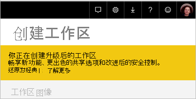
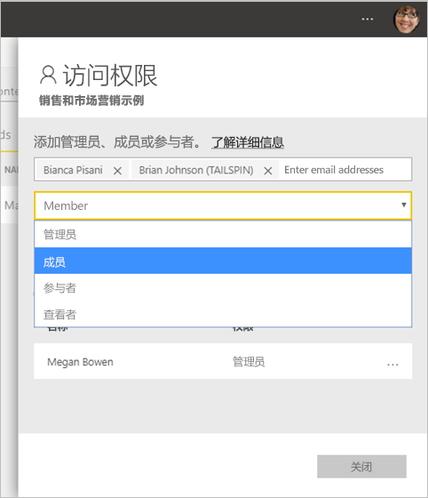
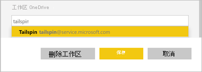
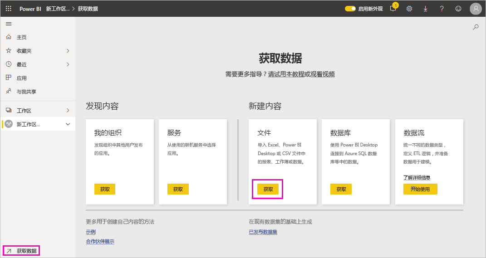
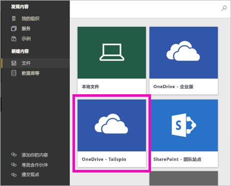
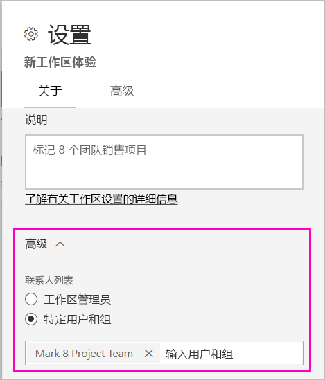

# 在 Power BI 中创建新工作区

本文介绍如何创建一个新工作区（非经典工作区） 。 在这两种工作区中，均可以与同事进行协作。 可在其中创建仪表板、报表和分页报表的集合。 如果需要，你还可以将该集合捆绑到应用中，并将其分发给更多受众。 有关详细背景信息，请参阅[新工作区](service-new-workspaces.md)一文。

已准备好迁移经典工作区？ 有关详细信息，请参阅[在 Power BI 中将经典工作区升级到新工作区](service-upgrade-workspaces.md)。

> [!NOTE]
> 若要对在工作区中浏览内容的 Power BI Pro 用户强制执行行级别安全性 (RLS)，请向用户分配查看者角色。 有关不同角色的说明，请参阅[新工作区中的角色](service-new-workspaces.md#roles-in-the-new-workspaces)。

## 创建一个新工作区

1. 首先，创建工作区。 选择“工作区” > “创建工作区”。
   
     

2. 将自动创建已升级的工作区，除非选择“还原为经典”。
   
     
     
     如果选择“还原为经典”，则会[基于 Microsoft 365 组创建经典工作区](service-create-workspaces.md)。

2. 为工作区指定唯一的名称。 如果命名不可用，则对其进行编辑以给定一个唯一名称。
   
     在工作区中创建的应用将与工作区具有相同的名称和图标。
   
1. 下面是可以为工作区设置的一些可选项：

    - 上传工作区图像。 文件可以是 .png 或 .jpg 格式。 文件大小必须小于 45 KB。 
    - [指定工作区 OneDrive](#set-a-workspace-onedrive) 以使用 Microsoft 365 组文件存储位置。    
    - [添加联系人列表](#create-a-contact-list)。 默认情况下，工作区管理员是联系人。 
    - [允许参与者为工作区更新应用](#allow-contributors-to-update-the-app)
    - 若要将工作区分配给专用容量，请在“高级”选项卡上选择“专用容量”  。

        

1. 选择“保存”。

    Power BI 创建工作区并将其打开。 可以在你所属的工作区列表中看到它。 

## 授予对工作区的访问权限

具有工作区管理员角色的任何人，均可将其他人添加到不同的角色，以便为其提供工作区的访问权限。 工作区创建者自动成为管理员。 有关各角色的说明，请参阅[新工作区中的角色](service-new-workspaces.md#roles-in-the-new-workspaces)。

1. 在工作区内容列表页中，由于你是管理员，因此会看到“访问”。

    

1. 将安全组、通讯组列表、Microsoft 365 组或个人作为管理员、成员、参与者或查看者添加到这些工作区中。 

    

9. 选择“添加” > “关闭” 。

## 设置工作区 OneDrive

借助工作区 OneDrive 功能，你可以配置 Microsoft 365 组，使其 SharePoint 文档库文件存储可供工作区用户使用。 首先在 Power BI 之外创建组。 

Power BI 不会将配置为拥有工作区访问权限的用户或组的权限，与 Microsoft 365 组成员身份同步。 最佳做法是，为在此设置 Microsoft 365 组中配置其文件存储的同一个 Microsoft 365 组提供[工作区访问权限](#give-access-to-your-workspace)。 然后通过管理 Microsoft 365 组的成员身份来管理工作区访问权限。 

1. 使用以下两种方法之一访问新的“工作区 OneDrive”设置：

    第一次创建工作区时，在“创建工作区”窗格中。

    在导航窗格中，选择“工作区”旁边的箭头，然后选择工作区名称旁边的“更多选项”(…)，接下来选择“工作区设置”  。 随即打开“设置”窗格。

    

2. 在“高级” > “工作区 OneDrive”下，键入之前创建的 Microsoft 365 组的名称。 只输入名称，不要输入 URL。 Power BI 会自动为组选择 OneDrive。

    

3. 选择“保存”。

### 访问工作区 OneDrive 位置

配置 OneDrive 位置之后，访问该位置的方式与访问 Power BI 服务中的其他数据源的方式相同。

1. 在导航窗格中选择“获取数据”，然后在“文件”框中选择“获取”。

    

1.  “OneDrive – Business”条目是你自己的个人 OneDrive for Business。 第二个 OneDrive 是你添加的 OneDrive。

    

## 创建联系人列表

可以指定哪些用户接收关于工作区中发生的问题的通知。 默认情况下，任何指定为工作区管理员的用户或组都会收到通知，但你可以将其他用户和组添加到联系人列表。 联系人列表中的用户或组将在用户界面 (UI) 中列出，以帮助用户获得与工作区相关的帮助。

1. 使用以下两种方法之一访问新的“联系人列表”设置：

    第一次创建工作区时，在“创建工作区”窗格中。

    在导航窗格中，选择“工作区”旁边的箭头，然后选择工作区名称旁边的“更多选项”(…)，接下来选择“工作区设置”  。 随即打开“设置”窗格。

    

2. 在“高级”、“联系人列表”下，接受默认的“工作区管理员”，或添加自己的“特定用户或组”列表。    

    

3. 选择“保存” 。

## 允许参与者更新应用

“允许参与者更新此工作区的应用”设置允许工作区管理员向“参与者”角色中的用户委托更新工作区应用的能力。 默认情况下，只有工作区管理员和成员才能发布和更新工作区应用。 

1. 若要访问此设置，请在导航窗格中选择“工作区”旁边的箭头，然后选择工作区名称旁边的“更多选项”(…)，接下来选择“工作区设置”  。 随即打开“设置”窗格。

    

2. 在“高级”下，展开“安全设置”。  选择“允许参与者为此工作区更新应用”。 

启用后，参与者可以执行以下操作：
* 更新应用元数据，如名称、图标、说明、支持站点和颜色
* 添加或删除应用中包含的项，例如添加报表或数据集
* 更改应用打开的应用导航或默认项

但是，参与者不能执行以下操作：
* 首次发布应用
* 更改对应用具有权限的人员

## 新工作区中的应用

可在新工作区体验中创建和使用应用，而非内容包。 应用是连接到第三方服务和组织数据的仪表板、报表和数据集的集合。 通过应用，可以轻松地从 Microsoft Dynamics CRM、Salesforce 和 Google Analytics 等服务获取数据。

在新工作区体验中，无法创建或使用组织内容包。 请要求内部团队为你当前使用的任何内容包提供应用。 

### 分发应用

如果要将官方内容分发给组织内的大量受众，可以从工作区发布应用。  内容准备好后，选择想要发布的仪表板和报表，然后将其作为应用发布。 可从每个工作区创建一个应用。

请参阅如何[从新工作区发布应用](service-create-distribute-apps.md)。

## 后续步骤
* 请参阅[在 Power BI 的新工作区体验中组织工作](service-new-workspaces.md)
* [创建经典工作区](service-create-workspaces.md)
* [从 Power BI 的新工作区发布应用](service-create-distribute-apps.md)
* 是否有任何问题? [尝试咨询 Power BI 社区](https://community.powerbi.com/)
