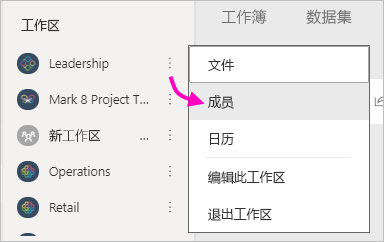

# 在 Power BI 中创建经典工作区

在 Power BI 中，你可以创建工作区，与同事协作，以创建和优化仪表板、报表和分页报表的集合。 然后可将这些集合捆绑到应用，并可将该应用分发到整个组织或特定人员或组。 

**你知道吗？** Power BI 提供了新的默认工作区体验。 有关新工作区的详细信息，请参阅[在新工作区中组织工作](service-new-workspaces.md)。 已准备好迁移经典工作区？ 有关详细信息，请参阅[在 Power BI 中将经典工作区升级到新工作区](service-upgrade-workspaces.md)。

创建经典工作区时，将创建关联的基础 Microsoft 365 组。 所有工作区管理操作都在 Microsoft 365 中进行。 可以以成员或管理员身份将同事添加到这些工作区。 在工作区中，所有人可协作处理计划向更广大受众发布的仪表板、报表和其他项目。 添加到工作区中的每个人都需要 Power BI Pro 许可证。

## 视频：应用和工作区
<iframe width="640" height="360" src="https://www.youtube.com/embed/Ey5pyrr7Lk8?showinfo=0" frameborder="0" allowfullscreen></iframe>

## 根据 Microsoft 365 组创建经典工作区

创建工作区时，是基于 Microsoft 365 组构建的。

[!INCLUDE [powerbi-service-create-app-workspace](../includes/powerbi-service-create-app-workspace.md)]

首次创建工作区时，可能需要等待一小时左右，让工作区传播到 Microsoft 365。

### 将图像添加到 Microsoft 365 工作区（可选）
默认情况下，Power BI 会为应用创建一个带有应用首字母的彩色小圆圈。 但你可能会想要使用图像对其进行自定义。 若要添加映像，需要 Exchange Online 许可证。

1. 选择“工作区”，选择工作区名称旁边的“更多选项”(…)，然后选择“成员”  。 
   
     
   
    工作区的 Microsoft 365 Outlook 帐户将在新的浏览器窗口中打开。
2. 选择编辑铅笔。
   
     
3. 选择照相机图像，然后找到你要使用的图像。
   
     

     图像可以是 .png、.jpg 或 .bmp 文件。 它们的文件大小可能会很大，最大为 3 MB。 

4. 依次选择“确定”和“保存” 。
   
    图像会替换 Microsoft 365 Outlook 窗口中的彩色圆圈。
   
     
   
    几分钟后，它将在 Power BI 中的应用中显示。

## 将内容添加到工作区

创建工作区后，便可向其中添加内容。 添加内容的操作类似于将内容添加到“我的工作区”，只不过工作区中的其他人员也可以查看并使用它。 一个明显区别是，在操作完成后，可以将内容作为应用发布。 在工作区内容列表中查看内容时，工作区名称列为所有者。

### 在工作区中连接到第三方服务

为 Power BI 支持的所有第三方服务都提供了应用，使用户可以轻松从所用服务（如 Microsoft Dynamics CRM、Salesforce 或 Google Analytics）获取数据。 可以发布组织应用程序，为用户提供所需数据。

在当前工作区中，也可以使用组织内容包和 Microsoft Dynamics CRM、Salesforce 或 Google Analytics 等第三方内容包进行连接。 请考虑将组织内容包迁移到应用。

## 分发应用

如果要将官方内容分发给组织内的大量受众，可以从工作区发布应用。  内容准备好后，选择想要发布的仪表板和报表，然后将其作为应用发布。 可从每个工作区创建一个应用。

导航窗格中的“应用”列表显示已安装的所有应用。 你的同事可通过几种不同的方式获取你的应用。 
- 他们可以从 Microsoft AppSource 中查找并安装应用
- 你可以向他们发送直接链接。 
- 如果 Power BI 管理员已授予权限，则可将这些应用自动安装到同事的 Power BI 帐户中。 

从工作区发布更新后，会自动向用户显示更新后的应用内容。 可以通过在工作区中的应用内容使用的数据集中设置刷新计划来控制数据刷新的频率。 有关详细信息，请参阅[从 Power BI 中的新工作区发布应用](service-create-distribute-apps.md)。

## Power BI 经典应用常见问题解答

### 应用与组织内容包有什么不同？
应用由组织内容包演变而来。 如果你已具有组织内容包，它们将继续与应用并行工作。 应用和内容包有几个主要区别。 

* 业务用户在安装内容包后，它将失去其分组的标识：它只是穿插了其他仪表板和报表的仪表板和报表列表。 另一方面，应用即使在安装后也会维护其分组和标识。 因此，随着时间的推移，此分组使业务用户能够继续轻松地导航到应用。
* 你可以从任何工作区创建多个内容包，但应用与其工作区具备一对一的关系。 
* 随着时间的推移，我们计划弃用组织内容包，因此，我们建议你从现在开始构建应用。  
* 通过新工作区体验，我们迈出了弃用组织内容包的第一步。 无法在新工作区中使用或创建它们。

请参阅[新的和经典的工作区差异](service-new-workspaces.md#new-and-classic-workspace-differences)对两者进行比较。 

## 后续步骤
* [在 Power BI 中安装并使用应用](service-create-distribute-apps.md)
- [创建新工作区](service-create-the-new-workspaces.md)
* 是否有任何问题? [尝试咨询 Power BI 社区](https://community.powerbi.com/)
