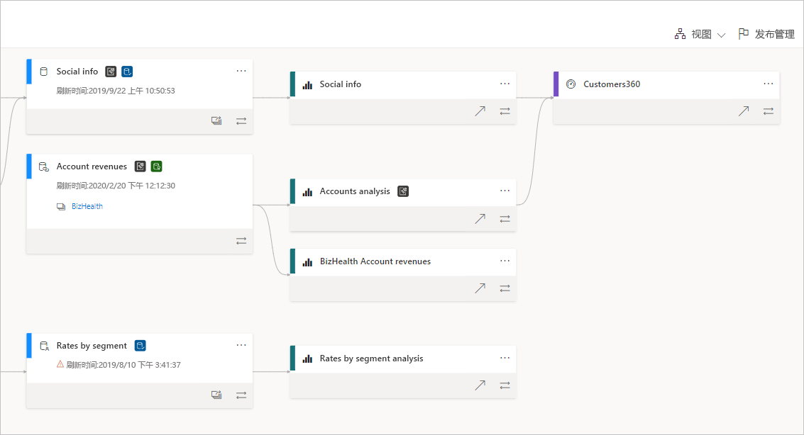
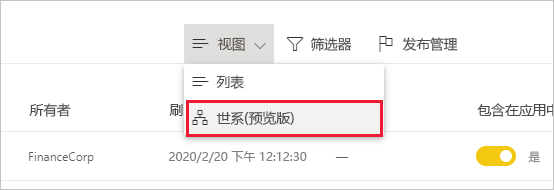
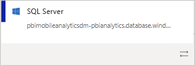
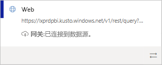
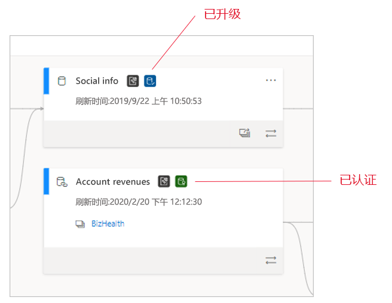
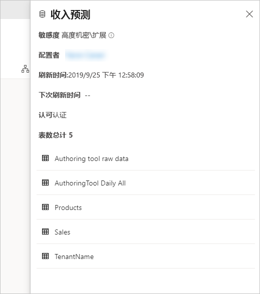
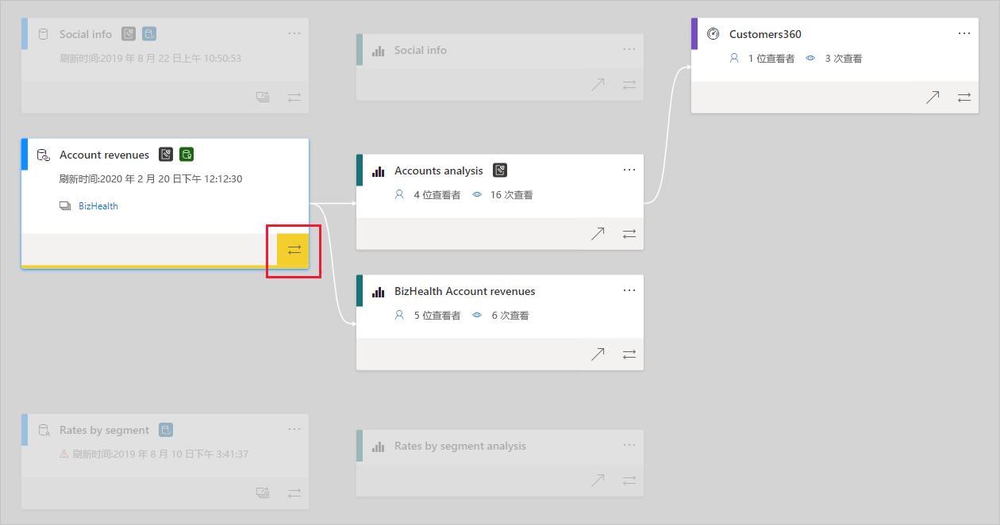

# 数据世系
在现代商业智能 (BI) 项目中，了解数据从数据源到其目标的流可能是一项挑战。 如果已生成跨多个数据源、项目和依赖项的高级分析项目，则该挑战甚至更艰巨。 “如果更改此数据会发生什么情况？” 或“为什么此报表不是最新的？”之类的问题 可能很难回答。 他们可能需要专家团队或进行深入调查才能找到答案。 我们设计了数据世系视图来帮助你回答这些问题。

 
Power BI 具有多种项目类型，如仪表板、报表、数据集和数据流。 许多数据集和数据流连接到外部数据源（如 SQL Server）和其他工作区中的外部数据集。 如果数据集位于你的工作区外部，则它可能位于 IT 中的某人或其他分析师所拥有的工作区中。 最终，外部数据源和数据集导致更加难以知道数据的来源。 我们针对复杂和较简单的项目引入了世系视图。

在世系视图中，可以看到工作区中所有项目与其所有外部依赖项之间的世系关系。 它显示所有工作区项目之间的连接，包括与数据流（上游和下游）的连接。

## 浏览世系视图

每个工作区（无论是新的还是经典的）都自动具有世系视图。 需要在工作区中至少具有参与者角色才能查看。 有关详细信息，请参阅本文中的[权限](#permissions)。

* 若要访问世系视图，请转到工作区列表视图。 点击“列表视图”旁边的箭头，然后选择“世系视图”   。

   

在此视图中，可以看到所有工作区项目以及数据如何从一个项目流向另一个项目。

**数据源**

可以看到数据集和数据流从中获取其数据的数据源。 在数据源卡上，可以看到有助于识别源的详细信息。 例如，对于 Azure SQL Server，还会看到数据库名称。

 
**网关**

如果数据源通过本地网关进行连接，则会将网关信息添加到数据源卡。 如果你具有网关管理员或数据源用户的权限，将看到详细信息，如网关名称。

**数据集和数据流**
 
在数据集和数据流上，你会看到上次刷新时间，以及数据集或数据流是否经过认证或升级。

 
如果工作区中的报表基于位于另一个工作区中的数据集或数据流生成，则会在该数据集或数据流的卡上看到源工作区名称。 选择源工作区的名称以转到该工作区。

* 对于任何项目，选择“更多选项”(…) 以查看选项菜单  。 它具有列表视图中可用的所有相同操作。

若要查看任何项目的更多元数据，请选择项目卡本身。 有关项目的其他信息显示在侧窗格中。 在下图中，侧窗格显示所选数据集的元数据。

 
## 显示任何项目的世系视图 

假设要查看特定项目的世系视图。

* 选择项目下的双箭头。

   

   Power BI 突出显示与该项目相关的所有项目，并使其他项目变暗。 

## 导航和全屏 

世系视图为交互式画布。 可以使用鼠标和触摸板在画布中导航以及放大或缩小。

* 若要放大和缩小，请使用右下角的菜单，或使用鼠标或触摸板。
* 若要为图形本身腾出更多空间，请使用右下角的全屏选项。 

    

## 权限

* 需要 Power BI Pro 许可证才能查看世系视图。
* 世系视图仅适用于具有工作区访问权限的用户。
* 用户必须在工作区中具有管理员、成员或参与者角色。 具有查看者角色的用户无法切换到世系视图。

## 注意事项和限制

- 世系视图在 Internet Explorer 中不可用。 有关详细信息，请参阅 [Power BI 支持的浏览器](../power-bi-browsers.md)。

## 后续步骤

* [跨工作区使用数据集简介（预览）](../service-datasets-across-workspaces.md)
* [数据集影响分析](service-dataset-impact-analysis.md)
