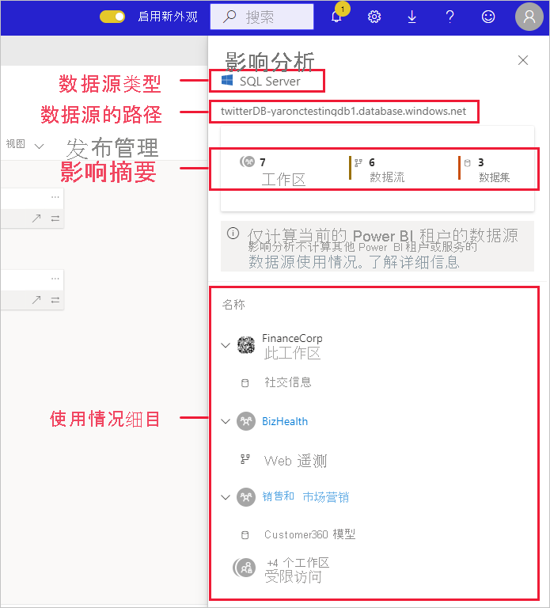
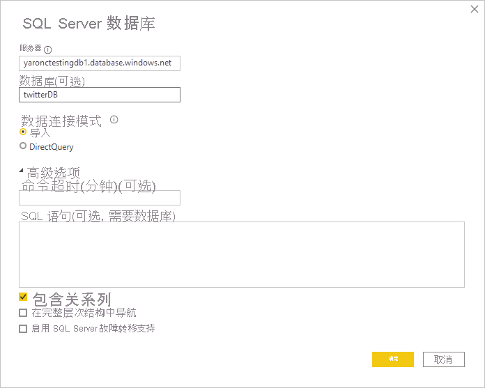
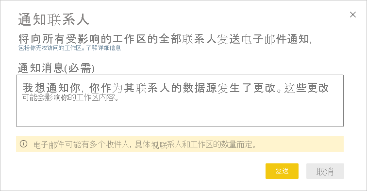

# 数据源影响分析

数据源影响分析可帮助你查看整个组织中哪里用到了你的数据源。 当数据源暂时或永久脱机，并且你想了解谁受到影响时，这很有用。 它可以显示使用数据源的工作区、数据流和数据集的数量，并允许轻松导航到受影响的数据流和数据集所在的工作区，以便进一步调查。

数据源影响分析还可以帮助发现租户中的数据重复，例如许多不同用户以同一数据源为基础构建相似模型时出现的数据重复。 通过帮助发现此类冗余数据集和数据流，数据源影响分析支持拥有“单一事实来源”这一目标。

## 执行数据源影响分析

执行数据源影响分析的步骤：

1. 转到包含你感兴趣的数据源的工作区，然后打开[世系视图](service-data-lineage.md)。
1. 找到数据源的卡，然后单击影响分析图标。

    
 
“影响分析”侧窗格随即打开。

 
* **数据源类型**：指示数据源类型
* **数据源的路径**：Power BI Desktop 中定义的数据源路径。 例如，在上图中，SQL Server 数据库数据源的路径是连接字符串“twitterDB-yaronctestingdb1.database.windows.net”，如 Power BI Desktop 中所定义（如下所示）。 它由数据库名称“twitterDB”和服务器名称“yaronctestingdb1.database.windows.net”组成。

    
 
* **影响摘要**：显示可能受影响的工作区、数据流和数据集的数量。 此计数包括你无权访问的工作区。
* **使用情况细目**：显示每个工作区受影响的数据流和数据集的名称。 若要进一步研究对特定工作区的影响，请单击工作区名称以打开工作区。 进入受影响的工作区后，使用[数据集影响分析](service-dataset-impact-analysis.md)查看有关已连接报表和仪表板的详细使用情况。

## 通知联系人

如果你对数据源进行了更改，或考虑进行更改，那么你可能需要联系相关用户，告诉他们此事。 当你通知联系人时，需将一封电子邮件发送到所有受影响工作区的[联系人列表](service-create-the-new-workspaces.md#create-a-contact-list)（如果是经典工作区，则将电子邮件发送给工作区管理员）。 你的名字会显示在电子邮件中，这样联系人就可以找到你，并在新的电子邮件会话中进行回复。 

1. 在影响分析侧窗格中，单击“通知联系人”。 “通知联系人”对话框随即显示。

   

1. 在文本框中，提供一些关于更改的详细信息。
1. 准备好消息后，单击“发送”。

## 隐私

在影响分析侧窗格中，你只会看到有权访问的工作区、数据集和数据流的真实名称。 你无权访问的项目列于“访问受限”中。 这是因为某些项目名称可能包含个人信息。
影响汇总计数包括所有受影响的数据流和数据集，甚至包括你无权访问的工作区中的数据流和数据集。

## 限制

分页报表尚不支持数据源影响分析，因此你将看不到数据源是否对租户中的此类报表有任何直接影响。

## 后续步骤

* [数据集影响分析](service-dataset-impact-analysis.md)
* [数据世系](service-data-lineage.md)