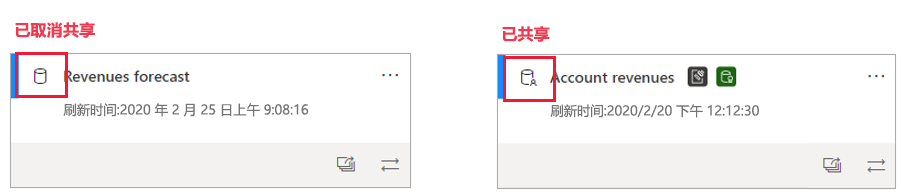
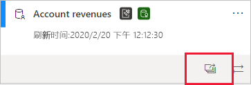
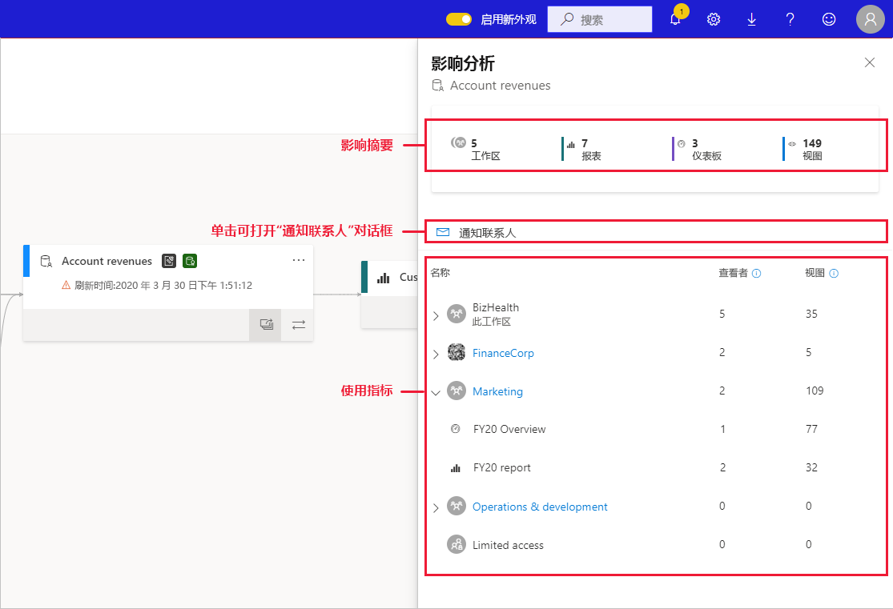
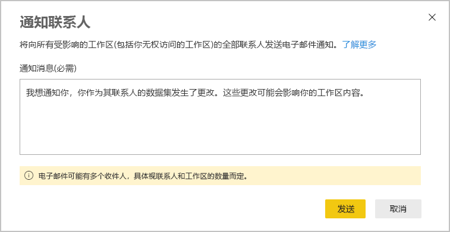
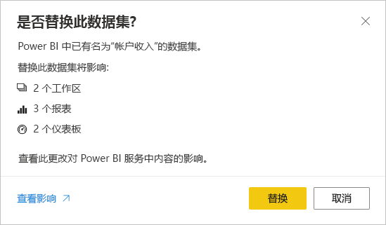

# 数据集影响分析

对数据集进行更改或考虑进行更改时，能够评估这些更改对依赖于该数据集的下游报表和仪表板的影响非常重要。 数据集影响分析提供有助于进行此项评估的信息  。
* 它可以显示可能受到更改影响的工作区、报表和仪表板，并能轻松导航到受影响的报表和仪表板所在的工作区，方便你进行进一步的调查。
* 它可以显示唯一访问者的数量，以及潜在受影响项目的查看次数。 这有助于确定更改对下游项目的整体影响。 例如，调查更改对拥有 20,000 名唯一查看者的报告的影响，可能比调查更改对拥有 3 名查看者的报告的影响更为重要。
* 它提供了一种简单的方法，可以用来通知相关人员你所做的或正在考虑进行的更改。

可以从 [数据世系视图](service-data-lineage.md)中轻松启动数据集影响分析。

## 识别共享数据集

你可以对共享和非共享数据集执行数据集影响分析。 但是，此分析对于跨工作区共享的数据集特别有用，因为与非共享数据集（所有依赖项都与数据集本身位于同一工作区中）相比，清楚地了解下游依赖项更为复杂。

在世系视图中，你可以通过显示在数据集卡片左上角的图标来区分共享数据集和非共享数据集。

## 执行数据集影响分析

你可以在工作区中对任何数据集执行分析，无论数据集是否为共享数据集。 你无法对显示在世系视图中，但实际位于另一工作区的外部数据集执行影响分析。 若要对外部数据集执行影响分析，你需要导航到源工作区。

要执行数据集影响分析，请单击数据集卡片上的“影响分析”按钮。

“影响分析”侧窗格随即打开。

* “影响摘要”  显示可能受影响的工作区、报表和仪表板的数量，以及所有连接到数据集的下游报告和仪表板的查看次数。
* “通知联系人”  链接会打开一个对话框，你可以在其中创建关于对数据集所做的任何更改的消息，并发送给受影响工作区的联系人列表。 
* “使用情况细分”  ：对于每个工作区，它向你显示其中包含的可能受影响的报表和仪表板的总查看次数；对于每个报表和仪表板，它向你显示总查看者人数和查看次数，其中
   * 查看者人数：查看报表或仪表板的不同用户的数量。
   * Views:报表或仪表板的总查看次数

使用情况指标与过去 30 天相关，不包括当天。 计数包括通过相关应用获得的使用情况。 这些指标可以帮助你了解整个租户中数据集的使用情况，以及评估对数据集的任何更改可能造成的影响。

## 通知联系人

如果你对数据集进行了更改，或考虑进行更改，那么你可能需要联系相关用户，告诉他们有关更改的信息。 通知联系人时，会向所有受影响工作区的[联系人列表](../collaborate-share/service-create-the-new-workspaces.md#create-a-contact-list)发送电子邮件。 你的名字会显示在电子邮件中，这样联系人就可以找到你，并在新的电子邮件会话中进行回复。 

1. 在影响分析侧窗格中，单击“通知联系人”  。 “通知联系人”对话框随即显示。

   

1. 在文本框中，提供一些关于更改的详细信息。
1. 准备好消息后，单击“发送”  。

> [!NOTE]
> 如果执行影响分析的数据集位于经典工作区中，“通知联系人”将不可用。

## 隐私

要对数据集执行影响分析，必须对其具有写入权限。 在影响分析侧窗格中，你只会看到有权访问的工作区、报表和仪表板的真实名称。 你无权访问的项目列于“访问受限”中  。 这是因为某些项目名称可能包含个人信息。

即使不能访问某些工作区，你仍然可以看到这些工作区的汇总使用指标，并且你的通知联系人消息将送达这些工作区的联系人列表。

## 在 Power BI Desktop 中进行影响分析

在 Power BI Desktop 中对数据集进行更改，然后将它重新发布到 Power BI 服务时，会显示一条消息，说明可能受更改影响的工作区、报表和仪表板数量，并会要求你确认是否将当前已发布的数据集替换为你修改过的数据集。 该消息还提供了指向 Power BI 服务中完整数据集影响分析的链接，你可以在其中了解更多信息并采取措施来降低更改的风险。

> [!NOTE]
> 消息中显示的信息只表示潜在的影响，它并不一定表明某些内容已损坏。 对数据集的更改通常不会对它们的下游报表和仪表板产生负面影响 - 尽管如此，你仍会收到这条消息，它的作用是告知你关于潜在影响的明确信息。
>
>仅当多个工作区包含受影响的报表和仪表板时，消息中才会显示工作区的数量。

## 限制

* 目前，经典和个人工作区不支持使用情况指标。

## 后续步骤

* [跨工作区使用数据集简介（预览）](../connect-data/service-datasets-across-workspaces.md)
* [数据世系](service-data-lineage.md)

