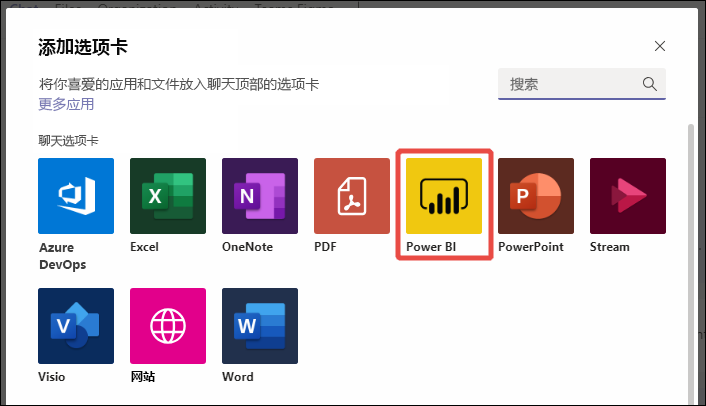
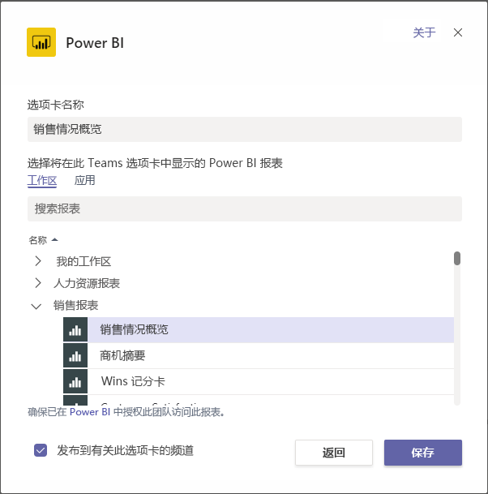
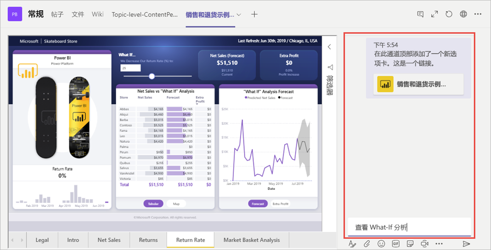

# 在 Microsoft Teams 中嵌入 Power BI 内容

可以轻松地将交互式 Power BI 报表嵌入 Microsoft Teams 频道和聊天中。 

## 要求

若要使用 Microsoft Teams 中的“Power BI”选项卡，请确保以下元素：

- Microsoft Teams 具有“Power BI”选项卡。
- 若要使用“Power BI”选项卡在 Microsoft Teams 中添加报表，需要在报表所在的工作区中至少具有“查看者”角色。 有关不同角色的信息，请参阅[新工作区中的角色](service-new-workspaces.md#roles-in-the-new-workspaces)。
- 若要在 Microsoft Teams 的“Power BI”选项卡中查看报表，用户必须具有查看报表的权限。
- 用户必须是有权访问频道和聊天的 Microsoft Teams 用户。

请参阅[使用 Power BI 在 Microsoft Teams 中开展协作](service-embed-report-microsoft-teams.md)，其中介绍了 Power BI 和 Microsoft Teams 协同工作的背景以及其他要求。

## 在 Microsoft Teams 中嵌入报表

按照以下步骤将报表嵌入 Microsoft Teams 频道或聊天。

1. 在 Microsoft Teams 中打开频道或聊天，然后选择“+”图标。

    

1. 选择“Power BI”选项卡。

    

1. 使用提供的选项从工作区或 Power BI 应用中选择报表。

    

1. 选项卡名称会自动更新以匹配报表名称，但你可以自行更改。

1. 选择“保存”。

### 可以在“Power BI”选项卡上嵌入的报表

可以在“Power BI”选项卡上嵌入以下类型的报表：

- 交互式报表和分页报表。
- 我的工作区、新工作区体验和经典工作区中的报表。
- Power BI 应用中的报表。

## 开始对话

将“Power BI 报表”选项卡添加到 Microsoft Teams 时，Microsoft Teams 可自动为报表创建选项卡对话。

- 选择右上角的“显示选项卡对话”图标。

    

    第一个注释是指向报表的链接。 该 Microsoft Teams 频道中的每个人都可以在对话中查看并讨论报表。

    

## 已知问题和限制

- 在 Microsoft Teams 中，当你从 Power BI 报表中的视觉对象导出数据时，该数据会自动保存到下载文件夹中。 它是名为“data (n).xlsx”的 Excel 文件，其中 n 是将数据导出到同一个文件夹的次数。
- 你不能在 Microsoft Teams 的“Power BI”选项卡中嵌入 Power BI 仪表板。
- Microsoft Teams 的“Power BI”选项卡不支持 [URL 筛选器](service-url-filters.md)。
- 在国家/地区云中，新的“Power BI”选项卡不可用。 可能有较旧的版本可用，该版本不支持 Power BI 应用中的新工作区体验或报表。
- 保存选项卡之后，无法通过选项卡设置更改选项卡名称。 使用“重命名”选项对其进行更改。
- 请参阅“在 Microsoft Teams 中开展协作”一文中的[已知问题和限制](service-collaborate-microsoft-teams.md#known-issues-and-limitations)部分以了解其他问题。

## 后续步骤

- [使用 Power BI 在 Microsoft Teams 中开展协作](service-collaborate-microsoft-teams.md)

更多问题？ [尝试咨询 Power BI 社区](https://community.powerbi.com/)。
