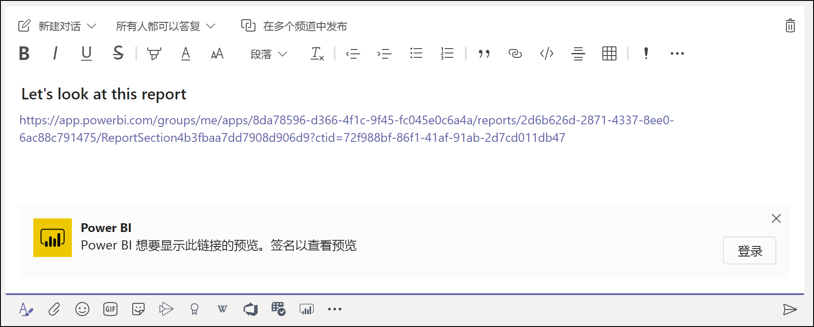
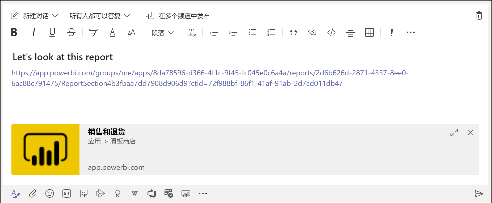
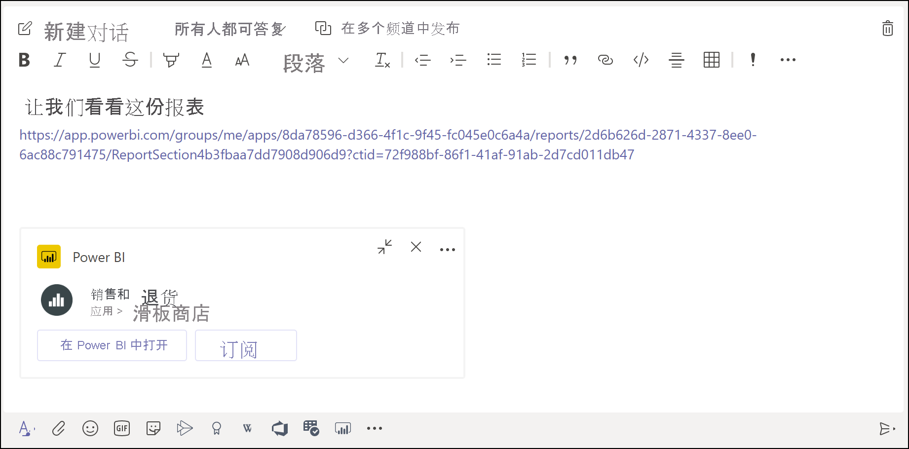
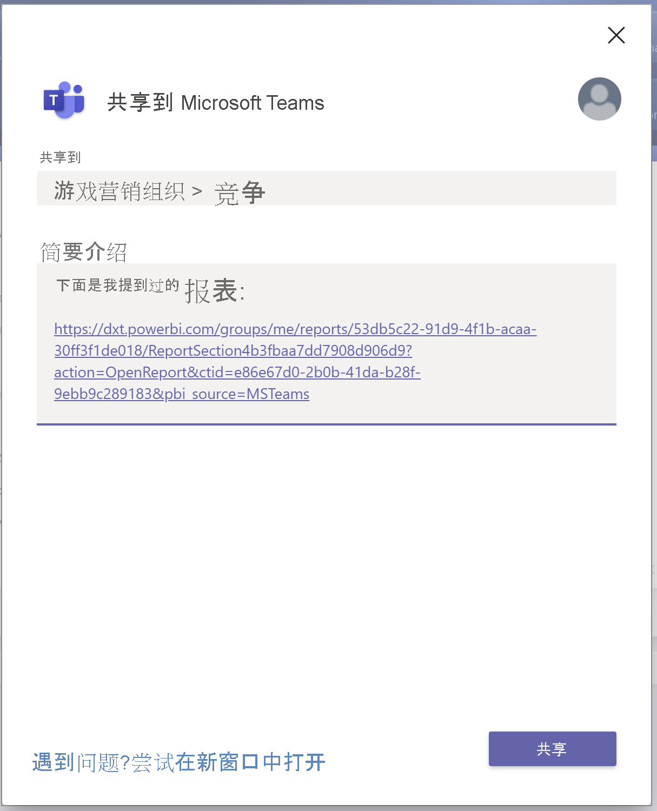

# 使用 Power BI 在 Microsoft Teams 中开展协作

通过 Microsoft Teams 的“Power BI”选项卡，可以在 Microsoft Teams 频道和聊天中轻松嵌入交互式报表。 使用 Microsoft Teams 的“Power BI”选项卡，可帮助你的同事查找团队所使用的数据并在团队频道中进行讨论。 将报表、仪表板和应用的链接粘贴到 Microsoft Teams 消息框中时，链接预览会显示有关该链接的信息。 在 Power BI 中查看报表和仪表板时，使用“共享到 Teams”按钮可快速开始对话。

## 要求

若要使 Microsoft Teams 的“Power BI”选项卡正常工作，请确保：

- 用户具有 Power BI Pro 许可证，或报告包含在具有 Power BI 许可证的 [Power BI Premium 容量（EM 或 P SKU）](../admin/service-premium-what-is.md)中。
- Microsoft Teams 具有“Power BI”选项卡。
- 用户已登录到 Power BI 服务以激活其 Power BI 许可证，从而使用报表。
- 若要使用“Power BI”选项卡在 Microsoft Teams 中添加报表，必须在托管报表的工作区中至少具有一个查看者角色。 有关不同角色的信息，请参阅[新工作区中的角色](service-new-workspaces.md#roles-in-the-new-workspaces)。
- 若要在 Microsoft Teams 的“Power BI”选项卡中查看报表，用户必须具有查看报表的权限。
- 用户必须是有权访问频道和聊天的 Microsoft Teams 用户。

若要使链接预览正常工作，请确保：

- 用户满足使用 Microsoft Teams 的“Power BI”选项卡的要求。
- 用户已登录到 Power BI。

若要使“共享到 Teams”按钮正常工作，请确保：

- 用户满足使用 Microsoft Teams 的“Power BI”选项卡的要求。
- 用户已登录到 Power BI。
- Power BI 管理员未禁用“共享到 Teams”租户设置。

## 嵌入报表

按照以下步骤将报表嵌入 Microsoft Teams 频道或聊天。

1. 在 Microsoft Teams 中打开频道或聊天，然后选择“+”图标。

    

1. 选择“Power BI”选项卡。

    

1. 使用提供的选项从工作区或 Power BI 应用中选择报表。

    

1. 选项卡名称会自动更新以匹配报表名称，但你可以自行更改。

1. 选择“保存”。

## 嵌入“Power BI”选项卡的受支持报表

可以在“Power BI”选项卡上嵌入以下类型的报表：

- 交互式报表和分页报表。
- 我的工作区、新工作区体验和经典工作区中的报表。
- Power BI 应用中的报表。

## 获取链接预览

按照以下步骤获取 Power BI 服务中内容的链接预览。

1. 复制指向 Power BI 服务中的报表、仪表板或应用的链接。 例如，从浏览器地址栏中复制链接。

1. 在 Microsoft Teams 消息框中粘贴链接。 如果出现提示，请登录链接预览服务。 可能需要等待几秒钟才能加载链接预览。

    

1. 成功登录之后，将显示基本链接预览。

    

1. 选择“展开”图标以显示丰富预览卡。

    

1. 丰富链接预览卡显示链接和相关操作按钮。

    

1. 发送消息。

## Power BI 服务中的“共享到 Teams”按钮

查看 Power BI 服务中的报表或仪表板时，按照以下步骤共享指向 Microsoft Teams 频道和聊天的链接。

1. 使用操作栏或特定视觉对象上的上下文菜单中的“共享到 Teams”按钮。

   * 操作栏中的“共享到 Teams”按钮：

       
    
   * 视觉对象上下文菜单中的“共享到 Teams”按钮：
    
      

1. 在“共享到 Microsoft Teams”对话框中，选择要将链接发送到的频道或用户。 如果需要，可以输入一条消息。 系统可能会要求你先登录到 Microsoft Teams。

    

1. 选择“共享”以发送链接。
    
1. 该链接将添加到现有对话或开始新聊天。

    

1. 选择链接可在 Power BI 服务中打开该项。

1. 如果使用了特定视觉对象的上下文菜单，则在打开报表时会突出显示该视觉对象。

    
    

## 授予报表访问权限

在 Microsoft Teams 中嵌入报表或发送项的链接不会自动授予用户报表查看权限。 你需要[在 Power BI 中允许用户查看报表](service-share-dashboards.md)。 可以使用 Microsoft 365 组，从而为团队提供更轻松的体验。

> [!IMPORTANT]
> 请务必在 Power BI 中检查哪些人员可以查看报表，然后向未列出的人员授予访问权限。

要确保团队中的每个人都有权访问报表，一种方法是将报表放在单个工作区中，并为团队的 Microsoft 365 组授予访问权限。

## 链接预览

为 Power BI 中的以下各项提供了链接预览：
- 报表
- 仪表板
- 应用

链接预览服务需要用户登录。 若要注销，请选择消息框底部的“Power BI”图标。 然后选择“注销”。

## 开始对话

将“Power BI 报表”选项卡添加到 Microsoft Teams 时，Teams 可自动为报表创建选项卡对话。

- 选择右上角的“显示选项卡对话”图标。

    

    第一个注释是指向报表的链接。 该 Microsoft Teams 频道中的每个人都可以在对话中查看并讨论报表。

    
    
## 共享到 Teams 租户设置

Power BI 管理门户中的“共享到 Teams”租户设置允许组织隐藏“共享到 Teams”按钮 。 如果设置为“已禁用”，则用户在查看 Power BI 服务中的报表和仪表板时将看不到操作栏或上下文菜单中的“共享到 Teams”按钮。

## 已知问题和限制

- Power BI 不支持 Microsoft Teams 支持的本地化语言。 因此，可能无法在嵌入的报表中看到正确的本地化内容。
- 不能在 Microsoft Teams 的“Power BI”选项卡中嵌入 Power BI 仪表板。
- 没有用于访问报表的 Power BI 许可证或权限的用户会看到“内容不可用”消息。
- 如果使用 Internet Explorer 10，则可能会遇到问题。 <!--You can look at the [browsers support for Power BI](../consumer/end-user-browsers.md) and for [Microsoft 365](https://products.office.com/office-system-requirements#Browsers-section). -->
- Microsoft Teams 的“Power BI”选项卡不支持 [URL 筛选器](service-url-filters.md)。
- 在国家/地区云中，新的“Power BI”选项卡不可用。 可能有较旧的版本可用，该版本不支持 Power BI 应用中的新工作区体验或报表。
- 保存选项卡之后，无法通过选项卡设置更改选项卡名称。 使用“重命名”选项对其进行更改。
- 链接预览服务不支持单一登录。
- 链接预览在会议聊天或私人频道中不起作用。
- 如果浏览器使用严格的隐私设置，则“共享到 Teams”按钮可能不起作用。 如果未正确打开对话框，则使用“遇到问题? 尝试在新窗口中打开”选项。
- “共享到 Teams”不包括链接预览。
- 链接预览和“共享到 Teams”不向用户授予查看该项的权限。 权限必须单独进行管理。
- 当报表作者将视觉对象的“更多”选项设置为“关闭”时，视觉对象上下文菜单中的“共享到 Teams”按钮将不可用 。

## 后续步骤

- [与同事和其他人共享仪表板](service-share-dashboards.md)
- [在 Power BI 中构建和分发应用](service-create-distribute-apps.md)
- [什么是 Power BI Premium？](../admin/service-premium-what-is.md)

更多问题？ [尝试咨询 Power BI 社区](https://community.powerbi.com/)。
