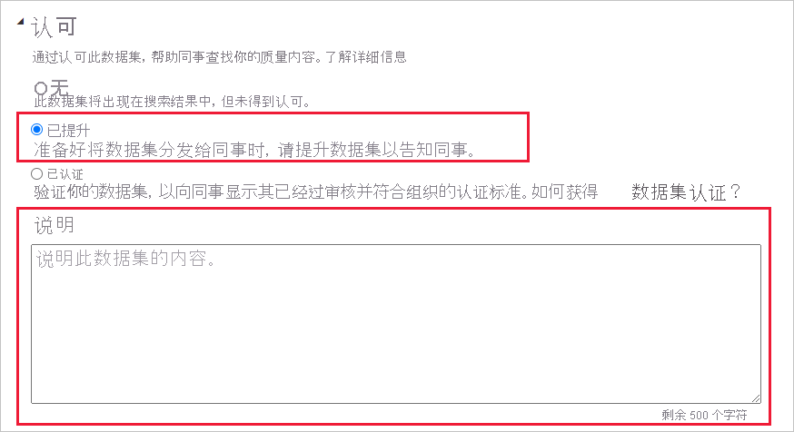
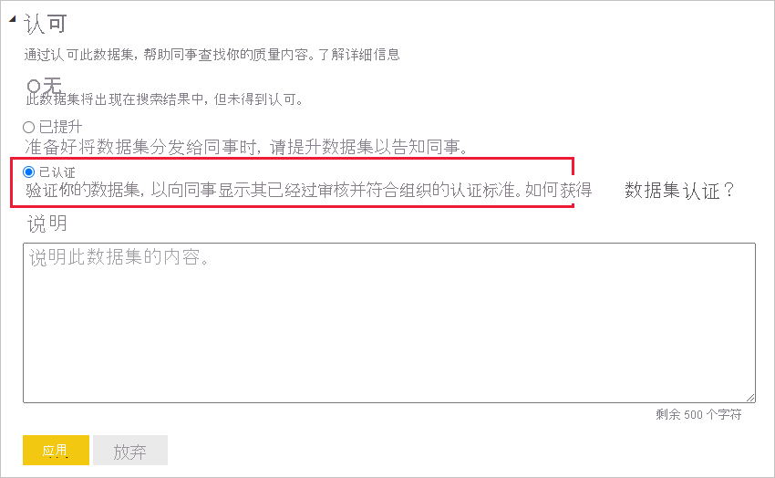

# 认可你的内容

Power BI 提供了两种方法来认可有价值且高质量的内容以提高其可见性：“推广”和“认证” 。

* **推广**：推广是一种突出显示你认为有价值并且值得他人使用的内容的方法。 这鼓励在组织内以协作方式使用和传播内容。

    任何内容所有者以及任何对内容所在工作区具有写入权限的成员，只要认为内容有共享价值，他们就可以推广该内容。

* **验证**：认证意味着该内容符合组织的质量标准，可被视为可靠且权威的内容，并且可供在整个组织中使用。

    只有[获得授权的审阅者（由 Power BI 管理员定义）](../admin/service-admin-setup-certification.md)可以认证内容。 如果内容所有者希望自己的内容获得认证，但自己无权对其进行认证，则需要遵循其组织的准则来认证其内容。

目前可以认可：
* 数据集
* 数据流(预览版)
* 报表（预览版）
* 应用（预览版）

本文介绍了如何[推广内容](#promote-content)，如何[认证内容](#certify-content)（如果你是经过授权的审阅者）以及如何[请求认证](#request-content-certification)（如果你不是经过授权的审阅者）。

请参阅[认可：推广和认证 Power BI 内容](service-endorsement-overview.md)，了解有关认可的详细信息。

## 推广内容

若要推广内容，必须对要推广的内容所在的工作区具有写入权限。

>[!NOTE]
>为了便于说明，下面显示了数据集的认可对话框。 其他内容类型的对话框几乎完全相同，具有相同的单选按钮选项。 

1. 转到要推广的内容的[设置](#how-to-get-to-content-settings)。

1. 展开“认可”部分，并选择“已推广”  。 如果要推广数据集，请提供数据集的简要说明。

    

1. 选择 **应用**。

## 认证内容

内容认证责任重大，只有经过授权的用户才可以认证内容。 其他用户可以[请求内容认证](#request-content-certification)。 本部分介绍如何认证内容。

>[!NOTE]
>为了便于说明，下面显示了数据集的认可对话框。 其他内容类型的对话框几乎完全相同，具有相同的单选按钮选项。 

1. 获取要认证的内容所在的工作区的写入权限。 可以向内容所有者或对该工作区具有管理权限的任何人请求这些权限。

1. 仔细查看内容并确定它是否符合组织的认证标准。

1. 如果决定认证该内容，请转到其所在的工作区，然后打开要认证的内容的[设置](#how-to-get-to-content-settings)。

1. 展开“认可”部分，并选择“已认证”。 

    

1. 选择“应用”。

## 请求内容认证

如果你想要认证自己的内容，但无权执行此操作，请执行以下步骤。

>[!NOTE]
>为了便于说明，下面显示了数据集的认可对话框。 其他内容类型的对话框几乎完全相同，具有相同的单选按钮选项。 

1. 转到要获得认证的内容所在的工作区，然后打开该内容的[设置](#how-to-get-to-content-settings)。

1. 展开“认可”部分。 由于你无权认证内容，“已认证”按钮将灰显。 单击有关如何使内容获得认证的链接。

    
    
    >[!NOTE]
    >如果单击上面的链接，但重定向回此说明，则表示你的 Power BI 管理员尚未提供任何信息。 在这种情况下，请直接联系 Power BI 管理员。

## 如何获取内容设置

通过要认可的内容的设置，可以访问“认可”对话框。 按照下面的说明操作，转到每种内容类型的设置。

* 数据集：在列表视图中，将鼠标悬停在要认可的数据集上，单击“更多选项(…)”，然后从出现的菜单中选择“设置” 。
* 数据流（预览版）：在列表视图中，将鼠标悬停在要认可的数据流上，单击“更多选项(…)”，然后从出现的菜单中选择“设置” 。

* 报表（预览版）：在列表视图中，将鼠标悬停在要认可的报表上，单击“更多选项(…)”，然后从出现的菜单中选择“设置” 。 或者，如果该报表处于打开状态，选择“文件”>“设置”。

* 应用（预览版）：转到应用工作区中，单击菜单栏上的“更多选项(…)”，然后选择“认可此应用” 。

    

## 后续步骤

* [阅读有关内容认可的详细信息](service-endorsement-overview.md)
* [启用内容认证](../admin/service-admin-setup-certification.md)（Power BI 管理员）
* 是否有任何问题？ [尝试咨询 Power BI 社区](https://community.powerbi.com/)
