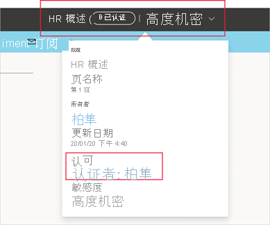
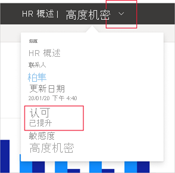

# 认可 - 推广和认证 Power BI 内容

## 认可概述

组织通常有大量 Power BI 内容可供其 Power BI 用户共享和重用，而确定可信赖的权威内容可能比较困难。 认可是一种使用户更容易找到所需的高质量内容的方法。 在 Power BI 和用户查找 Power BI 内容的其他地方（例如 Excel），已认可的内容均带有清晰的标记。 在某些搜索中，这些内容也被赋予优先级，你可以在某些列表中对其进行排序。

有两种类型的认可：“推广”和“认证” 。

* **推广**：借助推广，用户可以突出显示他们认为有价值、值得并且可供他人使用的内容。 这鼓励在组织内以协作方式传播内容。

    任何内容所有者或任何对内容所在工作区具有写入权限的成员，只要认为内容有共享价值，他们就可以轻松地推广该内容。

* **验证**：认证意味着该内容符合组织的质量标准，并可被视为可靠且权威的内容，可供在整个组织中使用。

    只有一组选定的审阅者（由 Power BI 管理员定义）有权认证内容。 如果内容所有者希望自己的内容获得认证，但自己无权对其进行认证，则需要遵循其组织的准则来认证其内容。

    仅当 Power BI 管理员已为组织启用并配置了认证后，认证才可用。

下图显示了当你搜索数据集，将其作为生成报表的依据时，如何清楚地识别认可的内容（已推广和已认证）。

## 可以认可的内容类型
Power BI 当前支持对以下项进行认可：
* 数据集
* 数据流(预览版)
* 报表（预览版）
* 应用（预览版）

## 标识认可的内容

在 Power BI 以及可以在其中找到 Power BI 内容的地方（例如 Excel）中，在列表、卡片和其他位置，认可的内容都带有徽章和图标标记。 以下徽章和图标标识了认可的内容。

|徽章|图标|
|---------|---------|
|||
|||
|||

此外，如果你位于报表或应用中，可以通过标头查看认可状态。
* 标头和标头下拉列表中均指示了认证，你还可以在标头下拉列表中查看是谁进行了认证。

    

* 推广仅在标头下拉列表中指示。
 
    

## 确定是要认可应用还是报表

认可旨在用于你希望人们找到、使用以及可能重新共享的内容项（应用、报表、数据集和数据流）。

当你与广泛的受众共享数据时，一种 Power BI 最佳做法是通过应用共享该数据。 如果你遵循此最佳做法，则你希望人们能够轻松找到该应用。 那么在这种情况下，你应该认可该应用。 

不过，如果你仍然认为直接共享报表很有用，则请认可报表本身。 

无论是共享报表还是应用，如果基础数据集干净且可以共享，那么最好也对这些数据集进行认可。 这同样适用于数据流。  

## 后续步骤

* [推广或认证 Power BI 内容](service-endorse-content.md)
* [为组织启用认证](../admin/service-admin-setup-certification.md)（Power BI 管理员）
* 是否有任何问题？ [尝试咨询 Power BI 社区](https://community.powerbi.com/)