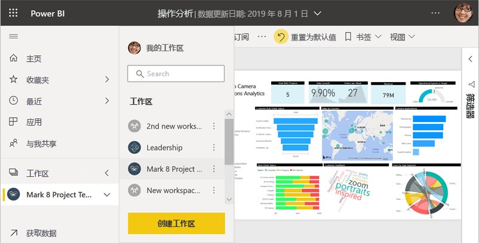
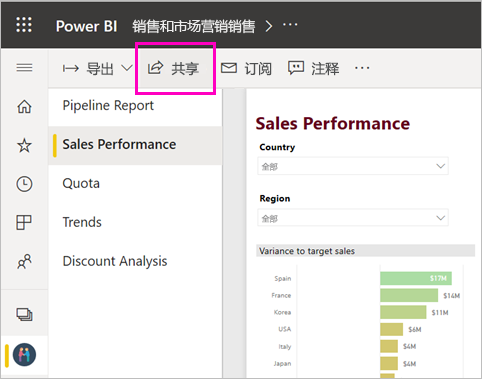
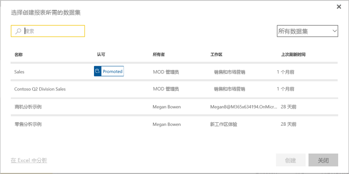

# 在 Power BI 中协作和共享的方式

你已创建仪表板和报表。 可能你希望与同事一起协作处理。 或者你已准备好更广泛地分发仪表板和报表。 协作和共享的最佳方式是什么？ 本文将对各选项展开比较。

Power BI 服务中的应用

**协作**

- [在工作区中与同事协作](#collaborate-in-a-workspace)，创建有价值的报表和仪表板。
- [在 Microsoft Teams 中开展协作](#collaborate-in-microsoft-teams)。

**分发或共享仪表板和报表**

- 可从“我的工作区”或其他工作区[共享仪表板或报表](#share-dashboards-and-reports)。
- [从 Power BI 移动应用添加批注并共享](#annotate-and-share-from-the-power-bi-mobile-apps)。
- 将工作区中的仪表板和报表打包为应用，并[将应用分发](#distribute-insights-in-an-app)到更大的组或整个组织。
- 在安全门户或公共网站中[嵌入报表](#embed-reports-in-secure-portals-or-public-web-sites) 。
- [打印报表](#print-or-save-as-pdf-or-other-static-file)。
- [创建模板应用](#create-and-deploy-template-apps)，以便通过 Microsoft AppSource 将其分发给外部 Power BI 用户。
 
**共享数据**

- [创建共享数据集](#share-a-dataset)，以便同事可在其自己的工作区中将共享数据集用作其自己的报表的基础。
- [创建数据流](#create-dataflows)作为共享公共数据源的一种方法。

无论选择哪个选项，都需要 [Power BI Pro 许可证](../fundamentals/service-features-license-type.md)才能共享内容，否则内容需要位于[高级容量](../admin/service-premium-what-is.md)中。 许可证要求因查看内存的同事而异，具体取决于所选择的选项。 以下各节将进行详细说明。 

## 在工作区中协作

当团队协同工作时，他们需要访问相同的文档，以便轻松协作。 在 Power BI 工作区中，团队能够共享其仪表板、报表、数据集和工作簿的所有权及管理权。 Power BI 用户组有时会根据组织结构组织其工作区，或者为特定项目创建工作区。 仍有一些组织使用多个工作区来存储所用报表或仪表板的不同版本。 

工作区提供的角色可确定同事拥有的权限。 使用这些角色来确定可以管理工作区、编辑或分发内容或只是查看内容的人员。 详细了解[新工作区中的角色](service-new-workspaces.md#roles-in-the-new-workspaces)。

工作区比“我的工作区”更适用于协作，因为前者允许共同拥有内容。 用户和整个团队可以轻松进行更新或为其他人授予访问权限。 “我的工作区”最适合个人用于一次性或个人内容。

现在，假设你需要与同事共享已完成的仪表板。 为他们提供仪表板访问权限的最佳方法是什么？ 答案取决于多种因素。 

- 如果同事需要使仪表板保持最新，或者需要访问工作区中的所有内容，请将他们作为“成员”或“参与者”添加到工作区。 
- 如果同事只需查看工作区中的内容，请将其添加为“查看者”。
- 如果同事只需要查看该仪表板而不是工作区中的所有内容，则可以与他们直接共享仪表板。
- 如果仪表板是需要分发给多个同事的一组仪表板或报表的一部分，则发布应用可能是最佳选择。

详细了解如何[创建新工作区](service-create-the-new-workspaces.md)。 

## 在 Microsoft Teams 中开展协作

通过将 Power BI 报表和 Power BI 分页报表嵌入 Microsoft Teams 中，增强组织中数据驱动的协作能力。 Power BI 服务有一个用于报表的“在 Teams 中聊天”按钮。 可以为每个单独的报表添加单独的 Power BI 选项卡，并为每个选项卡指定报表名称或任何其他名称。 

将“Power BI 报表”选项卡添加到 Microsoft Teams 时，Teams 可自动为报表创建选项卡对话。 该 Microsoft Teams 频道中的每个人都可以在对话中查看并讨论报表。 

:::image type="content" source="media/service-how-to-collaborate-distribute-dashboards-reports/power-bi-teams-conversation-tab.png" alt-text="Microsoft Teams 对话选项卡":::

详细了解[如何通过 Power BI 在 Microsoft Teams 开展协作](service-collaborate-microsoft-teams.md)。

## 共享仪表板和报表

假设你在 Power BI Desktop 中的报表已准备就绪，并且你希望其他人有权访问它。 一种用于访问的方法是在 Power BI 服务中共享它。 将其发布到你自己的“我的工作区”或其他工作区。 或许你创建了可用于访问报表的仪表板，并且已准备就绪。

需要 Power BI Pro 许可证方可共享内容。 你与之共享的人员也需要许可证才能共享，或者该内容需要位于[高级容量](../admin/service-premium-what-is.md)中的工作区内。 共享仪表板或报表时，收件人可以查看仪表板并与其交互。 如果你向他们提供权限，则他们可以对其进行编辑、创建副本，并与同事共享。 他们会看到你在仪表板或报表中看到的相同数据。 他们有权访问基础数据集中的所有数据，除非应用[行级别安全性 (RLS)](../admin/service-admin-rls.md)。

也可以与组织外的用户共享。 他们可以查看仪表板或报表并与之交互，但无法进行共享。 

详细了解如何从 Power BI 服务[共享仪表板和报表](service-share-dashboards.md)。 或阅读有关向链接添加筛选器并[共享报表的筛选视图](service-share-reports.md)的信息。

## 从 Power BI 移动应用添加批注并共享

在适用于 iOS 和 Android 设备的 Power BI 移动应用中，可以为磁贴、报表或视觉对象添加批注，并通过电子邮件与任何人共享。

你正在共享磁贴、报表或视觉对象的快照。 你的收件人看到的内容与你发送邮件时的内容完全一致。 邮件还包含仪表板或报表的链接。 如果他们有 Power BI Pro 许可证，或者该内容位于[高级容量](../admin/service-premium-what-is.md)中，并且你已与他们共享内容，则他们可以打开此内容。 可以向任何人（不仅仅是同一电子邮件域的同事）发送磁贴快照。

详细了解从 iOS 和 Android 移动应用[添加注释并共享磁贴、报表和视觉对象](../consumer/mobile/mobile-annotate-and-share-a-tile-from-the-mobile-apps.md)。

还可以通过适用于 Windows 10 设备的 Power BI 应用[共享磁贴快照](../consumer/mobile/mobile-windows-10-phone-app-get-started.md)，但不能添加批注。

## 在应用中分发见解

假设想要将仪表板分发给组织中的广泛受众。 你和同事创建了工作区，然后在此工作区中创建并优化了仪表板、报表和数据集。 现在选择仪表板和报表，并将其作为应用发布到组或整个组织。

可以在 Power BI 服务 ([https://app.powerbi.com](https://app.powerbi.com)) 中轻松找到应用并进行安装。 可以向业务用户发送应用的直接链接，或者他们可以在 AppSource 中搜索此应用。 如果 Power BI 管理员已授予你权限，则可以将应用自动安装到同事的 Power BI 帐户中。 详细了解如何[发布应用](service-create-distribute-apps.md)。

安装应用后，他们可以在浏览器或移动设备中查看应用。

对于查看你的应用的用户，他们同样需要拥有 Power BI Pro 许可证，或者应用需要存储在 Power BI 高级容量中。 请阅读[什么是 Power BI Premium？](../admin/service-premium-what-is.md)了解详细信息。

也可以将应用发布给组织外部的人员。 他们可以查看应用内容并与之交互，但无法与他人共享。 现在，可以创建模板应用并将它们部署到任何 Power BI 客户。

## 在安全门户或公共网站中嵌入报表

### 在安全门户中嵌入

可以在用户希望看到 Power BI 报表的门户或网站中嵌入这些报表。  
利用 Power BI 服务中的“在 SharePoint Online 中嵌入”和“嵌入”选项，可以为内部用户安全地嵌入报表。 无论选择哪个选项，Power BI 都会强制执行所有权限和数据安全措施，然后才允许用户查看内容。 查看报告的人员需要具有相应许可证。  

- “在 SharePoint Online 中嵌入”适用于 SharePoint Online 的 Power BI Web 部件。 它提供单一登录体验，并可控制报表的嵌入方式。 详细了解如何[嵌入 SharePoint Online](service-embed-report-spo.md)。
- **嵌入** 适用于支持使用 URL 或 iFrame 嵌入内容的任何门户或网站。 详细了解[嵌入](service-embed-secure.md)选项。

### 发布到公共网站

借助“发布到 Web”，可通过将可视化效果嵌入到博客文章、网站、社交媒体和其他联机交流媒介，来将 Power BI 报表发布到整个 Internet。 Internet 上的任何人都可查看你的报表，而且你无法控制谁查看你已发布的内容。 他们不需要 Power BI 许可证。 只能将可以编辑的报表发布到 Web。 如果是与你共享的报表或者报表位于应用内部，则无法将其发布到 Web。 详细了解如何[发布到 Web](service-publish-to-web.md)。

>[!Warning]
>使用[发布到 Web](service-publish-to-web.md)只用于公开共享内容，而不用于内部共享。

## 打印或另存为 PDF 或其他静态文件

在 Power BI 服务中，可以对以下任何项执行打印、另存为 PDF 或另存为其他静态文件格式操作：

- 整个仪表板
- 仪表板磁贴
- 报表页
- 分页报表
- Power BI 服务中的可视化效果。 

一次只能打印一页 Power BI 报表。 不能一次性打印整个报表。 详细了解如何[打印报表或仪表板或另存为静态文件](../consumer/end-user-print.md)。

另一方面，分页报表是设计用于打印的报表。 有关详细信息，请阅读 [Power BI 报表和分页报表的比较](../paginated-reports/paginated-reports-report-builder-power-bi.md#compare-power-bi-reports-and-paginated-reports)。 

## 创建和部署模板应用

*模板应用* 设计为公开分发，并通常在 Microsoft AppSource 中进行。 你会生成应用，并且在只需很少编码或无需编码的情况下，就可以将其部署到任何 Power BI 客户。 你的客户连接到其自己的数据并实例化其自己的帐户。 详细了解 [Power BI 模板应用](../connect-data/service-template-apps-overview.md)。

## 共享数据集

让我们面对现实，有些人更擅长在其报表中创建设计精良的高质量数据模型。 也许你就是那个人。 你的整个组织都能够因使用这一设计精良的数据模型而受益。 *共享数据集* 可填补这一空缺。 使用每个人都应使用的数据模型创建报表时，可以将该报表保存到 Power BI 服务，并授予合适的人员使用它的权限。 他们随后可以基于你的数据集生成其报表。 这样一来，每个人都基于相同的数据创建其报表，并可看到“同一个版本的事实”。

详细了解[创建和使用共享数据集](../connect-data/service-datasets-across-workspaces.md)。

## 创建数据流

数据流是一种自助方式，可用于统一来自不同来源的数据并为建模做好数据准备。 分析师创建数据流来引入、转换、集成和丰富大数据。 他们在 Power BI 服务的工作区中创建和管理数据流。 详细了解[数据流自助数据准备](../transform-model/dataflows/dataflows-introduction-self-service.md)。

## 注意事项和限制

- 不能从 Power BI 报表服务器共享报表。 不过，你可以[为自己或其他人创建订阅](/sql/reporting-services/working-with-subscriptions-web-portal)。

## 后续步骤

- [与同事和他人共享仪表板](service-share-dashboards.md)
- [在 Power BI 中构建和发布应用](service-create-distribute-apps.md)
- [在安全门户或网站中嵌入报表](service-embed-secure.md)

想提供反馈？ 请转到 [Power BI 社区站点](https://community.powerbi.com/)提出你的建议。

更多问题？ [尝试参与 Power BI 社区](https://community.powerbi.com/)