# 在新的工作区体验中监视使用指标（预览）

了解内容的使用方式有助于说明影响，并划分工作的优先级。 使用指标可能会显示组织的大部分部门每天会使用其中一个报表，还可能会显示根本没人查看你创建的某个仪表板。 这种类型的反馈在指导工作方面极其重要。

如果在新式工作区中创建报表，则可以访问改进的使用情况指标报表，这些报表使你能够发现在整个组织中使用这些报表的方式以及使用者。 还可以确定高级性能问题。 新式工作区体验中改进的使用情况报表替换[监视 Power BI 仪表板和报表的使用情况指标](service-usage-metrics.md)中记录的现有使用情况指标报表。

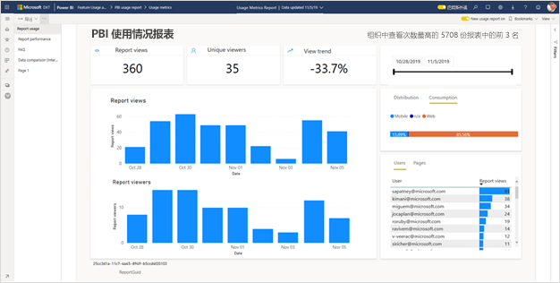

> [!NOTE]
> 只能在 Power BI 服务中运行使用指标报表。 但是，如果保存使用情况指标报表或将其固定到仪表板，则可在移动设备上打开该报表并与其交互。

## 先决条件

- 需要有 Power BI Pro 许可证才能运行和访问使用指标数据。 但是，使用指标功能可捕获所有用户的使用情况信息，无论用户分配的许可证为何。
- 若要访问报表的改进使用情况指标，报表必须位于新式工作区，并且你必须对该报表具有编辑访问权限。
- Power BI 管理员必须已启用内容创建者的使用情况指标。 Power BI 管理员可能还支持收集使用情况指标中的每个用户数据。 了解如何[在管理门户中启用这些选项](../admin/service-admin-portal.md#control-usage-metrics)。

## 创建和查看改进的使用情况指标报表

只有具有“管理员”、“成员”或“参与者”权限的用户才能查看改进后的使用情况指标报表。 “查看者”权限不够。 如果你在报表所在的新式工作区上至少是一个参与者，则可以使用以下过程来显示改进的使用情况指标：

1. 打开包含要分析其使用情况指标的报表的工作区。
2. 从“工作区内容”列表中，打开报表的上下文菜单，然后选择“查看使用情况指标报表”。 或者打开报表，在命令栏上打开上下文菜单，然后选择“使用情况指标”。

    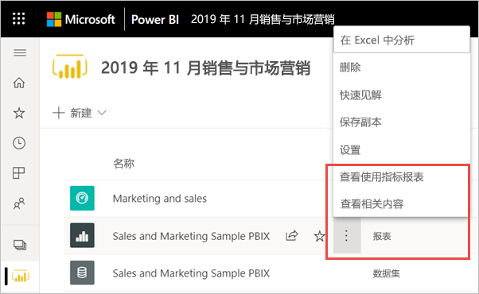

1. 首次执行此操作时，Power BI 会创建使用情况指标报表，并在创建完成后通知你。

    

1. 要查看结果，请选择“查看使用指标”。
2. 如果这是你第一次执行此操作，Power BI 可能会打开旧的使用情况指标报表。 若要显示改进的使用情况指标报表，请在右上角将新使用情况报表关闭开关切换为“打开”。

    

    > [!NOTE]
    > 如果报表驻留在新式工作区，则只能看到新的使用情况报表切换。 旧工作区不提供改进的使用情况指标报表。

## 关于改进的使用情况指标报表

按照上述步骤显示改进的使用情况指标报表时，Power BI 会生成一个预生成报表，其中包含相应内容在过去 30 天内的使用情况指标。 此报表看起来与你已经熟悉的 Power BI 报表非常类似。 基于最终用户接收访问权限的方式以及他们是通过 Web 还是移动应用等方式访问，可以进行切片。报表发生更改时，使用情况指标报表也会随之更改（使用情况指标报表每天更新新数据）。

> [!NOTE]
> 使用情况指标报表不会显示在“最新动态”、“工作区”、“收藏夹”或其他内容列表中。 不能将使用指标报表添加到应用。 如果将使用指标报表中的磁贴固定到仪表板，则无法将该仪表板添加到应用。

### 使用情况指标报表数据集

改进后的使用情况指标报表依赖于“使用情况指标报表”数据集，该数据集由 Power BI 在你首次启动改进的使用情况指标报表时自动创建。 然后 Power BI 每日刷新此数据集。 虽然不能更改刷新计划，但可以更新 Power BI 用来刷新使用情况指标数据的凭据。 如果从数据集所在的工作区中删除了首次启动使用情况指标报表的用户，则在凭据过期的情况下，可能需要恢复计划的刷新。

> [!NOTE]
> 尽管仍处于预览阶段，但使用指标数据集可能会有影响自定义报表的细微更改。  

### 使用情况指标报表页

改进后的使用情况指标报表包含以下报表页：

- **报表使用情况**    提供有关报表查看和报表查看者的信息，例如，按日期查看报表的用户数。
- **报表性能**    显示按使用方法和浏览器类型细分的典型报表打开时间。
- **常见问题解答**     提供常见问题解答，如“查看者”和“查看”是什么？

### 报表中包含哪些指标？

| **第** | **指标** | **说明** |
| --- | --- | --- |
| 报告使用情况 | 报表查看 | 每次有人打开报表时，都会记录一次报表查看。 请注意，查看的定义不同于以前的使用情况指标报表。 更改报表页不再被视为一次查看。 使用指标中不再考虑共享和固定等活动。|
| 报告使用情况 | 唯一查看者 | 查看者是指在一段时间内至少打开一次报表的用户（以 AAD 用户帐户为依据）。 |
| 报告使用情况 | 查看趋势 | 查看趋势反映了一段时间内的查看计数变化。 它将所选时间段的前半部分与后半部分进行比较。 |
| 报告使用情况 | “日期”切片器 | 可以更改“报表使用情况”页上的时间段，例如计算每周或每两周的趋势。 在“报表使用情况”页的左下角，可以确定所选报表可用的使用情况数据的最早和最晚日期。 |
| 报告使用情况 | 排名 | 根据查看计数，排名显示了报表与组织中所有其他报表相比的受欢迎程度。 排名为 1 表示在组织的所有报表中，该报表的查看次数最多。   |
| 报告使用情况 | 每日报表查看次数 | 每日查看总数。 |
| 报告使用情况 | 每日报表查看者数 | 查看了报表的唯一身份用户总数（以 AAD 用户帐户为依据）。 |
| 报告使用情况 | 分发方法 | 用户访问报表的方式，例如成为工作区的成员、与他们共享报表或安装应用程序。 |
| 报告使用情况 | “平台”切片器 | 是通过 Power BI 服务 (powerbi.com)、Power BI Embedded 还是移动设备访问报表。 |
| 报告使用情况 | 查看过报表的用户 | 显示打开按查看计数排序的报表的用户列表。 |
| 报告使用情况 | 页数 | 如果报表有多页，按已查看的一个或多个报表页对报表进行切片。 如果看到列表选项为“空白”，这意味着报表页为最近添加（新页的实际名称会在 24 小时内显示在切片器列表中），并且/或者报表页已删除。 “空白”可捕获此类情况。 |
| 报表性能 | 典型的打开时间 | 典型的报表打开时间对应于打开报表所用时间的第 50 个百分位。 换句话说，这个时间低于 50% 的完成的打开报表操作的时间。 “报表性能”页还按使用方法和浏览器类型细分典型报表打开时间。 目前，我们评估初始报表加载和首页查看的性能。 评估在请求报表时开始，并在最后一个视觉对象完成呈现时结束。 报表交互（如切片、筛选或更改页面）不包括在性能指标中。  |
| 报表性能 | 打开时间趋势 | 打开时间趋势反映了一段时间内的打开报表性能变化。 它将所选时间段的前半部分报表的打开时间与后半部分的打开时间进行比较。 |
| 报表性能 | “日期”切片器 | 可以更改“报表性能”页上的时间段，例如计算每周或每两周的趋势。 在“报表性能”页的左下角，可以确定所选报表可用的使用情况数据的最早和最晚日期。 |
| 报表性能 | 每日性能 | 为每一天计算的打开报表操作的 10%、50% 和 90% 的性能。 |
| 报表性能 | 7 天性能 | 在过去 7 天内为每个日期计算的打开报表操作的 10%、50% 和 90% 的性能。 |
| 报表性能 | 使用方法 | 用户打开报表的方式，如通过 Power BI 服务 (powerbi.com)、Power BI Embedded 或移动设备。 |
| 报表性能 | 浏览器 | 用户用于打开报表的浏览器，如 Firefox、Microsoft Edge 和 Chrome。 |

## 更新使用情况指标报表凭据

使用以下过程来接管使用情况指标报表数据集并更新凭据。

1. 打开包含要更新其“使用情况指标报表”数据集的报表的工作区。
2. 在顶部的黑色标题栏中，选择“设置”图标，然后选择”设置”。

    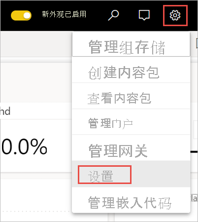

3. 切换到“数据集”选项卡。

1. 选择“使用情况指标报表”数据集。 

    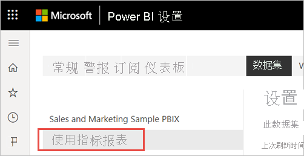
    
    如果不是当前的数据集所有者，则必须接管所有权，然后才能更新数据源凭据。 
    
5. 选择“接管”按钮，然后在“接管数据集设置”对话框中再次选择“接管”。

1. 在“数据源凭据”下，选择“编辑凭据”。

    

2. 在“配置使用情况指标报表”对话框中，选择“登录”。

    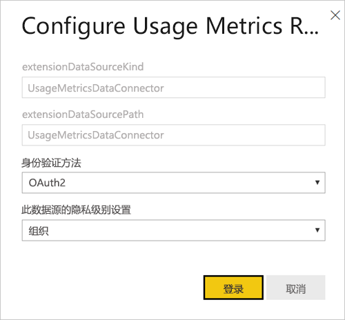

1. 完成登录顺序并注意数据源已成功更新的通知。

    > [!NOTE]
    > “使用情况指标报表”数据集包含过去 30 天的使用情况数据。 导入新的使用情况数据可能需要 24 小时。 不能使用 Power BI 用户界面触发手动刷新。

## 禁用使用情况指标报表

使用指标报表是 Power BI 或全局管理员可以启用或禁用的一项功能。 管理员可以精确控制哪些用户可以访问使用指标；默认情况下，对于组织中的所有用户，它们都处于“启用”状态。 有关这些设置的详细信息，请参阅“管理门户”一文中的[控制使用指标](../admin/service-admin-portal.md#control-usage-metrics)。

> [!NOTE]
> 只有 Power BI 租户的管理员才能看到管理门户和编辑设置。

## 排除使用情况指标报表中的用户信息

默认情况下，每个用户的数据都启用了使用指标并在指标报表中包含内容使用者帐户信息。 如果管理员不希望对某些或所有用户公开此信息，可以通过在指定安全组或整个组织的 Power BI 管理门户租户设置中禁用内容创建者的使用情况指标中的每个用户数据，从使用情况报表中排除用户信息。

1. 在管理门户的“租户设置”选项卡上，在“审核和使用情况设置”下，展开“内容创建者指标中的每个用户数据”，然后选择“禁用”。

2. 决定是否“删除当前使用情况指标内容中的所有现有每个用户的数据”，并选择“应用”。

    

如果排除了用户信息，则使用情况报表会将用户称为“未命名用户”。

当禁用其整个组织的使用情况指标时，管理员可以使用“删除所有现有的使用情况指标内容”选项，删除通过使用情况指标报表构建的所有现有报表和仪表板磁贴。 此选项可以删除组织中可能已在使用的所有用户对使用指标数据的所有访问内容。 删除现有的使用指标内容是不可逆转的操作。

> [!NOTE]
> 只有 Power BI 租户管理员才能查看管理门户，并在内容创建者设置的使用情况指标中配置每个用户数据。

## 自定义使用情况指标报表

若要深入了解报表数据，或基于基础数据集生成自己的报表，有以下几个选项：

- 在 Power BI 服务中[创建报表的副本](#create-a-copy-of-the-usage-report)。   使用“保存副本”来创建使用情况指标报表的单独实例，你可以自定义该实例来满足你的特定需求。
- 使用新报表[连接到数据集](#create-a-new-usage-report-in-power-bi-desktop)。   对于每个工作区，数据集都具有名称“使用情况指标报表”，如前面的[使用情况指标报表数据集](#usage-metrics-report-dataset)部分所述。 可以使用 Power BI Desktop 基于基础数据集生成自定义使用情况指标报表。
- [使用“在 Excel 中分析”](#analyze-usage-data-in-excel)。   还可以利用 Microsoft Excel 2010 SP1 或更高版本中的数据透视表、图表和切片器功能来分析 Power BI 使用情况数据。 阅读有关[在 Excel 中分析](service-analyze-in-excel.md)功能的详细信息。

### 创建使用情况报表的副本

创建预生成的只读使用情况报表的副本时，Power BI 将创建可编辑的报表实例。 从表面看，报表看上去相同。 但是，现在能在编辑视图中打开报表，添加新的可视化效果、筛选器和页面，以及修改或删除现有可视化效果等。 Power BI 将新报表保存到当前工作区中。

1. 在新的使用情况指标报表中，选择“更多选项”菜单 (...)，然后选择“保存副本”。

    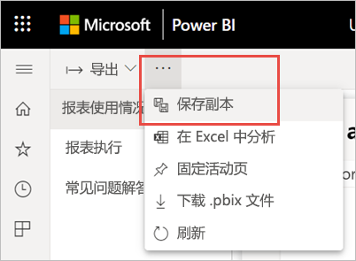

2. 在“保存报表”对话框中，输入名称，然后选择“保存”。

    Power BI 将创建可编辑的 Power BI 报表，并保存到当前工作区中，然后打开报表副本。 

3. 选择“更多选项”菜单 (...)，然后选择“编辑”以切换到“编辑”视图。 

    例如，可以更改筛选器、添加新页面和生成新的可视化效果、设置字体和颜色等。

1. 新建的报表会保存到当前工作区的“报表”选项卡中，还会添加到“最新动态”内容列表中。

    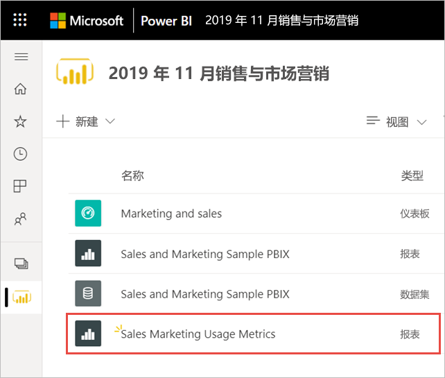
    
> [!NOTE]
> 保存使用情况指标报表的副本时，它将被视为常规 Power BI 报表。 在工作区中拥有查看权限的所有用户（包括查看者角色中的用户）都可以访问该报表。

### 在 Power BI Desktop 中创建新的使用情况报表

可以根据“使用情况指标报表”数据集，在 Power BI Desktop 中创建新的使用情况报表。 若要建立与“使用情况指标报表”数据集的连接并创建自己的报表，必须登录到 Power BI Desktop 中的 Power BI 服务。 

1. 打开 Power BI Desktop。

2. 如果未登录到 Power BI 服务，请在“文件”菜单中选择“登录”。

1. 若要连接到“使用情况指标报表”数据集，请在“主页”功能区选择“获取数据”。

4. 在左窗格中，选择“Power Platform”，然后选择“Power BI 数据集” > “连接”。

    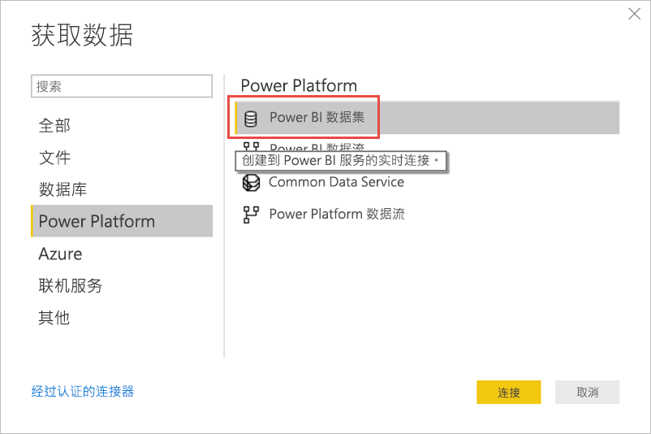

1. 滚动到所需数据集，或在搜索框中键入“使用情况指标报表”。 

6. 验证在“工作区”列选择了正确数据集，然后选择“创建”。 

    

7. 查看 Power BI Desktop 中的“字段”列表，该列表提供了对所选数据集中的表、列和度量值的访问权限。

    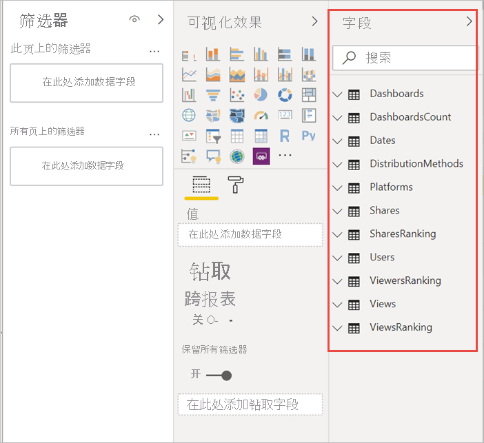

1. 现在，你可以创建和共享自定义使用情况报表，所有这些报表都来自相同的“使用情况指标报表”数据集。

### 在 Excel 中分析使用情况数据

当你连接到 Excel 中的使用情况数据时，可以创建使用预定义的度量值的数据透视表。 请注意，当连接到 Power BI 数据集时，Excel 数据透视表不支持对数值字段进行拖放聚合。

1. 首先，如果尚未执行此操作，[请创建使用情况指标报表的副本](#create-a-copy-of-the-usage-report)。 

2. 打开新的使用情况指标报表，选择“更多选项”菜单 (...)，然后选择“在 Excel 中分析”。

    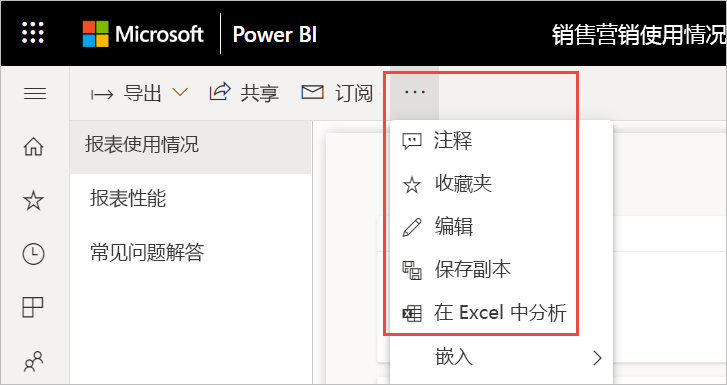

1. 如果看到“首先，需要一些 Excel 更新”对话框，选择”下载”并安装 Power BI 连接的最新更新，或选择”我已安装了这些更新”。

    

    > [!NOTE]
    > 某些组织可能有组策略规则，导致无法对 Excel 安装所需的“在 Excel 中分析”更新。 如果无法安装更新，请与管理员确认。

1. 在询问要如何使用 Usage Metrics report.odc 文件的浏览器对话框中，选择“打开”。

    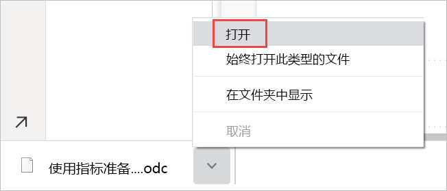

1. Power BI 启动 Excel。 验证 .odc 文件的文件名和路径，然后选择“启用”。

    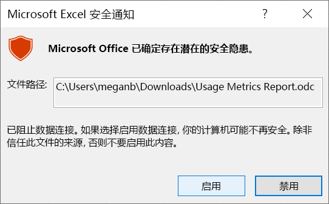

1. 现在，Excel 已打开，并且你有一个空的数据透视表，可以将字段拖到“行”、“列”、“筛选器”和“值”框中，并在使用情况数据中创建自定义视图。

    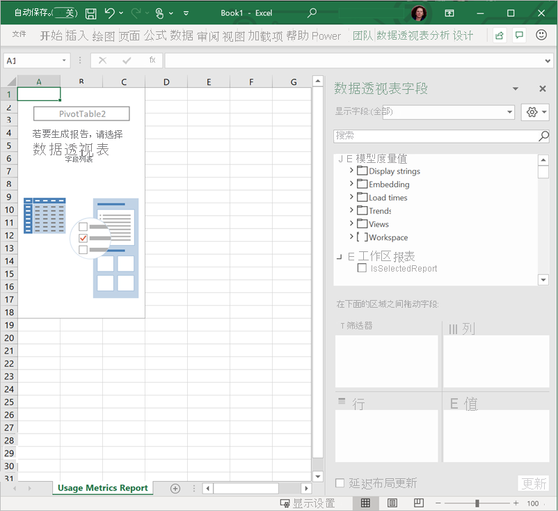

## 国家云中的使用情况指标

Power BI 在单独的国家云中可用。 这些云提供与全球版本 Power BI 相同级别的安全性、隐私、合规性和透明度，并结合了有关服务交付、数据驻留、访问和控制的本地法规的唯一模式。 新式使用情况指标目前可在以下国家/地区云中使用： 

- 美国政府社区云
- 美国政府社区云高
- 美国国防部
- 中国

有关详细信息，请参阅[国家云](https://powerbi.microsoft.com/clouds/)。

## 注意事项和限制

在比较改进的使用情况指标及其前身时，可能会出现差异，了解这一点很重要。 特别是报表使用情况指标现在基于从 Power BI 服务收集的活动数据。 以前版本的使用情况指标报表依赖于不总是与从服务中收集的使用情况指标匹配的客户端遥测。 此外，改进后的使用情况指标报表对“查看”使用不同定义。 查看是一种打开报表事件，每次用户打开报表时，该事件都记录在服务中。 更改报表页不再被视为一次查看。

> [!NOTE]
> 由于改进后的使用情况指标报表依赖于从 Power BI 服务收集的活动数据，因此使用情况指标现在与审核日志和活动日志中的活动聚合计数相匹配。 由于不一致的网络连接、广告拦截器或其他客户端问题而导致的活动计数不足或过多，将不再影响查看者和查看计数。

除了以前和改进的使用情况指标报表之间的上述差异外，请注意预览版本的以下限制：

- 仪表板使用情况指标仍依赖于以前版本的使用情况指标报表。
- 改进后的使用情况指标报表仅适用于新式工作区中的报表。 旧工作区中的报表仅支持以前版本的使用情况指标报表。
- 报表性能指标基于客户端遥测。 性能度量不包含某些类型的查看。 例如，当用户在电子邮件中选择报表链接时，该查看将在报表使用情况中被纳入考虑，但在性能指标中没有事件。
- 报表性能指标不适用于分页报表。 “报表使用情况”页上的“页”选项卡以及“报表性能”页上的图表不显示这些报表类型的数据。
- 使用嵌套组时，用户屏蔽没有按预期方式工作。 如果组织已禁用 Power BI 管理门户租户设置中内容创建者的使用情况指标中的每个用户数据，则只会屏蔽顶层的成员。 子组成员仍可见。
- 初始化“使用情况指标报表”数据集可能需要几分钟的时间，结果显示空的使用情况指标报表，因为 Power BI 用户界面不会等待刷新完成。 检查“使用情况指标报表”数据集设置中的刷新历史记录，以验证刷新操作是否成功。
- 初始化“使用情况指标报表”数据集可能会由于刷新过程中出现超时而失败。 请参阅下面的“故障排除”部分来解决此问题。
- 已为使用情况指标报表禁用共享。 若要向用户授予对报表的读取访问权限，你需要先向他们授予对工作区的访问权限。
- 在某些情况下，你可能会注意到性能数据缺失。 如果用户在报表完成加载之前打开报表并与其交互，或在报表加载过程中出现错误，则会发生这种情况。
- 性能数据依赖于发送数据到 Power BI 的客户端/设备。 根据组织设置的网络延迟、广告阻止程序、防火墙和网络规则，性能数据可能永远不会发送到 Power BI。 因此，性能数据只会显示一个示例，而不能包括或显示所有用户。 

## 常见问题解答

除了上述注意事项和限制以外，有关使用情况指标的以下问题和解答还可能对用户和管理员有所帮助：

**问：** 我无法在报表上运行使用情况指标。

**答：** 你只能看到自己拥有或有权编辑的报表的使用情况指标。

**问：** 为什么在我的现有使用情况指标报表的右上角看不到新的使用情况报表？

**答：** 改进后的使用情况指标报表仅适用于新式工作区中的报表。

**问：** 报表覆盖了哪个时间段？

**答：** 使用情况报表基于过去 30 天的活动数据，不包括当天活动。 可以使用“报表使用情况”页上的“日期”切片器来缩小时间段，例如仅分析上周数据。

**问：** 何时会看到最新的活动数据？

**答：** 使用情况报表包括活动数据，直到基于 UTC 时区的最后一个完整日。 报表中显示的数据也依赖于数据集的刷新时间。 Power BI 每日刷新一次数据集。

**问：** 数据好像不是最新的。

**答：** 请注意，新活动数据可能需要 24 小时才会出现在使用情况报表中。

**问：** 使用情况数据的数据源是什么？

**答：** “使用情况指标报表”数据集使用自定义使用情况指标数据连接器从 Power BI 内部使用情况指标存储区中导入数据。 可以在“使用情况指标报表”数据集设置页上更新使用情况指标数据连接器的凭据。

**问：** 如何连接到数据？ 或更改默认报表？

**答：** 可以创建只读预生成使用情况报表的副本。 报表副本将连接到相同的“使用情况指标报表”数据集，并使你能够编辑报表详细信息。

**问：** 什么是“查看者”，什么是“查看”？

**答：** 查看者是指在一段时间内至少打开一次报表的用户。 查看是一个打开报表事件。 每次有人打开报表时，都会记录一次报表查看。

请注意，查看的定义不同于以前的使用情况指标报表。 更改报表页不再被视为一次查看。

**问：** 如何计算“查看趋势”？

**答：** 查看趋势反映了一段时间内的查看计数变化。 它将所选时间段的前半部分与后半部分进行比较。 可以通过使用“报表使用情况”页上的“数据”切片器来更改时间段，例如计算每周或每两周的趋势。

**问：** “分发”和“平台”是什么意思？

**答：** 分发说明查看者如何获取对报表的访问权限：直接共享、通过工作区访问或通过应用共享。

平台指示查看者用于打开报表的技术：通过 PowerBI.com、移动或嵌入。

**问：** 报表排名如何工作？

**答：** 根据查看计数，排名显示了报表与组织中所有其他报表相比的受欢迎程度。 排名为 1 表示在组织的所有报表中，该报表的查看次数最多。

**问：** 什么是“未命名用户”？

**答：** 组织可以决定排除使用情况报表中的用户信息。 如已排除用户信息，则使用情况报表会将用户称为“未命名用户”。

**问：** 什么是“典型的报表打开时间”？

**答：** 典型的报表打开时间对应于打开报表所用时间的第 50 个百分位。 换句话说，这个时间低于 50% 的完成的打开报表操作的时间。 “报表性能”页还按使用方法和浏览器类型细分典型报表打开时间。

**问：** 如何计算“打开时间趋势”？

**答：** 打开时间趋势反映了一段时间内的打开报表性能变化。 它将所选时间段的前半部分报表的打开时间与后半部分的打开时间进行比较。 可以通过使用“报表性能”页上“数据”切片器来更改时间段，例如计算每周或每两周的趋势。

**问：** 使用情况指标报表的以前版本中有四个报表，但改进的版本仅显示三个。

**答：** 改进后的使用情况指标报表只包含过去 30 天内打开的报表，而以前的版本包含过去 90 天内打开的报表。 如果报表未包含在改进的使用情况指标报表中，则其使用时间可能尚未超过 30 天。

## 疑难解答：删除数据集

如果怀疑存在数据一致性或刷新问题，则删除现有“使用情况指标报表”数据集可能是有意义的。 然后，可以再次运行“查看使用情况指标”来生成新的数据集，其中包含关联的已改进的使用情况指标报表。 请执行以下步骤。

### 删除数据集

1. 打开包含要重置其“使用情况指标报表”数据集的报表的工作区。

2. 在顶部的黑色标题栏中，选择“设置”图标，然后选择”设置”。

    

3. 切换到“数据集”选项卡，然后选择“使用情况指标报表”数据集。 

    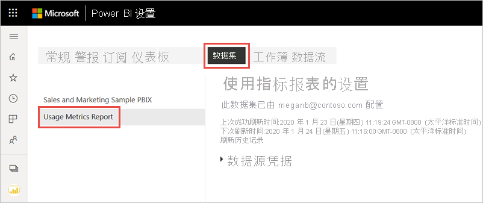

5. 从浏览器地址栏中显示的 URL 复制工作区 ID 和数据集 ID。

    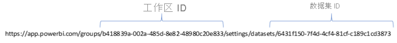

1. 在浏览器中转到 [https://docs.microsoft.com/rest/api/power-bi/datasets/deletedatasetingroup](/rest/api/power-bi/datasets/deletedatasetingroup)，然后选择“试用”按钮。

    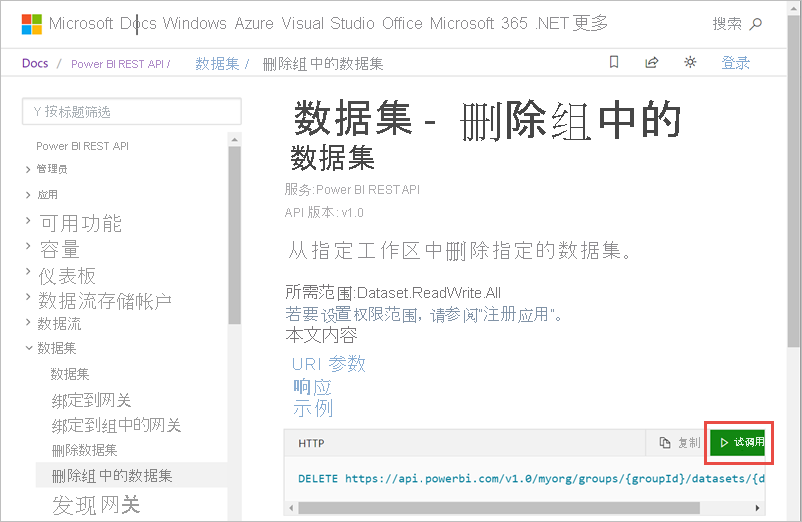

1. 登录到 Power BI，将工作区 ID 粘贴到“groupId”文本框，并将数据集 ID 粘贴到“datasetId”文本框，然后选择“运行”。 

    

1. 在“运行”按钮下，验证服务是否返回 200 响应代码。 该代码指示已成功删除数据集及其关联的使用情况指标报表。

    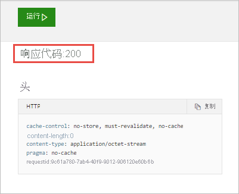

### 创建新的使用情况指标报表

1. 返回 Power BI 服务，你将看到数据集已消失。

    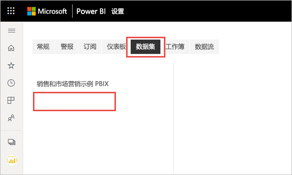

2. 如果在“报表”列表中仍显示“使用情况指标”报表，请刷新浏览器。

3. [创建新的使用情况指标报表](#create--view-an-improved-usage-metrics-report)。

## 后续步骤

[在管理门户中管理 Power BI](../admin/service-admin-portal.md)

更多问题？ [尝试参与 Power BI 社区](https://community.powerbi.com/)
