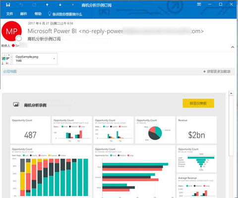
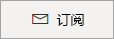
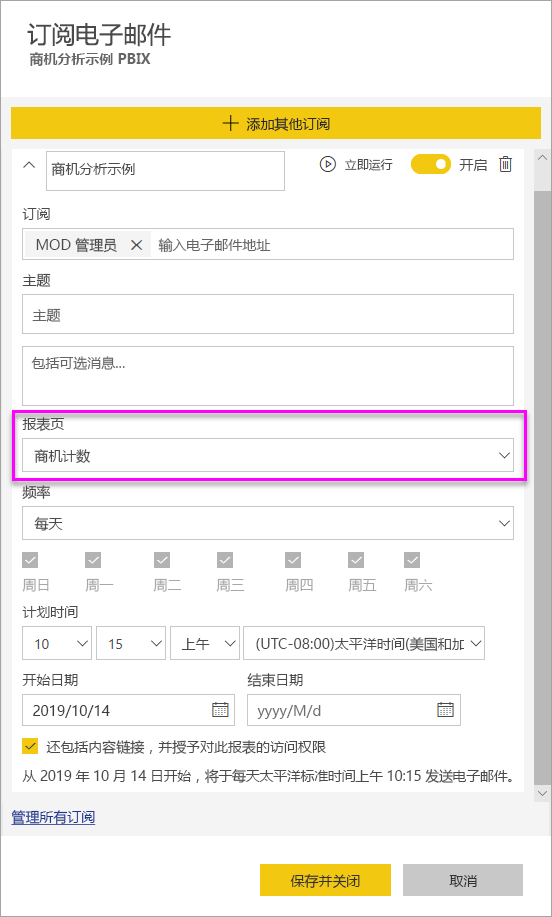

# 在 Power BI 服务中为自己和他人订阅报表和仪表板

你可以为自己和同事订阅对你来说最重要的报表页、仪表板和分页报表。 Power BI 电子邮件订阅让你可以：

- 决定接收电子邮件的频率：每天、每周、每小时、每月或是在初始数据更新后一天一次。
- 如果选择“每天”、“每周”、“每小时”或“每月”，请选择想要接收电子邮件的时间。
- 为每个 Power BI 报表或仪表板设置 24 个不同的订阅。  对于分页报表，可以设置的订阅数量没有限制。
- 发送带有报表图像的邮件，并链接到服务中的报表。  在安装了 Power BI 应用的移动设备上，选择此链接将启动 Power BI 应用，而不是在 Power BI 网站中打开报表或仪表板。
- 如果订阅的是分页报表，则会包含完整报告的附件。
- 如果 Power BI 内容托管在高级容量中，则可以将电子邮件发送给租户之外的用户。  管理员可以通过利用 Power BI 管理中心内现有的外部共享控制设置，控制谁可以向外部用户发送电子邮件订阅。

 

## 要求

创建订阅可由以下人员完成：

- 有 Power BI Pro 许可证的用户 
- 在 Premium 工作区或应用中查看内容的用户，即使没有 Power BI Pro 许可证，也可以订阅其中的内容。 

无需内容（仪表板或报表）编辑权限即可为自己创建订阅，但必须拥有编辑权限才能为他人创建订阅。

## 订阅仪表板、报表页或分页报表

无论是订阅仪表板、报表还是分页报表，订阅过程都类似。 使用同一按钮，即可订阅 Power BI 服务仪表板和报表。

订阅分页报表略有不同。 请参阅[在 Power BI 服务中为自己和他人订阅分页报表](../consumer/paginated-reports-subscriptions.md)，获取详细信息。
 
。

1. 打开仪表板或报表。
2. 在顶部菜单栏中，选择“订阅”或信封图标 。
   
    

1. 使用黄色滑块可启用和禁用订阅。 将滑块设置为“关”不会删除订阅。 若要删除订阅，请选择垃圾桶图标。

2. 电子邮件已存在于“订阅”收件箱中。 你还可以向订阅添加同一域中的其他电子邮件地址。 如果报表或仪表板托管在[高级容量](https://docs.microsoft.com/power-bi/service-premium-what-is)中，则可为其他个人电子邮件地址和组别名订阅，无论他们是否在你的域中。 如果报表或仪表板未托管在高级容量中，则可为其他个人订阅，但他们必须具有 Power BI Pro 许可证。 有关详细信息，请参阅下面的[注意事项和疑难解答](#considerations-and-troubleshooting)。

3. 填写电子邮件“主题”和“邮件”详细信息 。

4. 选择订阅的“频率”：“每天”、“每小时”、“每周”、“每月”或“数据刷新后(每天)”    。 要仅在某些天接收订阅电子邮件，请选择“每小时”或“每周”，然后选择要在哪几天接收电子邮件 。 例如，如果要仅在工作日收到订阅电子邮件，则选择“每周”，并清除“周六”和“周日”对应的复选框  。 如果选择“每月”，请输入要在每月的哪（几）天接收订阅邮件。

5. 如果选择“每天”、“每小时”、“每月”或“每周”，还可以为订阅选择“计划时间”    。 可使它按小时运行，或在过去 15、30 或 45 分钟时运行。 选择早上 (AM) 或下午/晚上 (PM)。 还可以指定时区。 如果选择“每小时”，请选择你希望订阅开始的“计划时间”，之后它将每小时运行一次 。

6. 默认情况下，订阅的开始日期是创建它的日期。 可以选择结束日期。 如果未设置结束日期，则结束日期自动是开始日期之后一年。 可以在订阅结束之前的任何时间将它更改为将来的任何日期（最多到 9999 年）。 当订阅达到结束日期时，它会停止，直到重新启用。 你会在计划结束日期之前收到通知，询问是否要延长它。

    在以下屏幕截图中，请注意订阅报表实际上订阅的是报表页。 要订阅报表中的多个页面，请选择“添加其他订阅”并选择另一个页面。
     
      

1. （可选）选择是否包含返回 Power BI 中内容的链接，以及是否允许用户访问你为他们订阅的内容。  如果选择包括链接，为了获得最佳体验，请确保所有用户都有权访问该报表。
2. 选择“保存并关闭”。 订阅者会按所选频率和时间收到仪表板或报表页的电子邮件和快照。 总共可以创建对每个报表或仪表板创建最多 24 个订阅，并可以为每个订阅提供独有的收件人、时间和频率。 对仪表板或报表，设置为“数据刷新后”的所有订阅仍然只会在第一次计划刷新之后发送电子邮件。

    > [!TIP]
    > 想立即通过订阅或随时按需发送电子邮件吗？ 选择“立即运行”以获取要发送的仪表板或报表的订阅。 你将看到一封电子邮件正发送给每个人的通知，通知内容是关于该特定订阅的。 执行此操作不计入每天每个报表或仪表板的 24 次预定订阅运行的限制。 这不会引起基础数据集的数据刷新。
    >

## 管理订阅

仅订阅创建者可管理该订阅。 订阅管理屏幕的路径有两个。 第一个是选择“订阅电子邮件”对话框中的“管理所有订阅”（见上述第 4 步） 。 第二个是选择顶部菜单栏中的 Power BI 齿轮图标 ，然后选择“设置”。

显示的订阅视当前处于活动状态的工作区而定。 若要一次性查看所有工作区的全部订阅，请确保“我的工作区”处于活动状态。 若要了解工作区，请参阅 [Power BI 中的工作区](service-create-workspaces.md)。

订阅将在以下任何情况下结束：

- Pro 许可证过期.
- 所有者删除仪表板或报表。
- 用于创建订阅的用户帐户已被删除。

Power BI 管理员可以使用 Power BI 审核日志来查看有关订阅的详细信息。 这些详细信息包括：

- 创建者
- 创建日期
- 内容订阅者
- 收件人
- 频率
- 修改者/
- 修改日期

## 注意事项和疑难解答

### 常规

- 与其他 BI 产品一样，设置订阅的时间是开始处理订阅的时间。  完成报表处理后，订阅将排队并发送给电子邮件收件人。  我们努力尽快处理和交付所有订阅。 但是，有时在需求高峰时，由于 Power BI 可以一次性发送的订阅数量较少，你可能会看到更长的延迟。 对于大多数客户，处理和发送报表的延迟时间不超过 15 分钟。 对于特定时间和使用量大的租户，可能最多需要 30 分钟。  我们从不希望从计划订阅时间起的任何交付延迟超过 60 分钟。  如果遇到这么长时间的延迟，请首先确保地址 `no-reply-powerbi@microsoft.com` 已被电子邮件提供商列入允许列表。  如果已列入允许列表，请联系 Power BI 支持人员以寻求帮助。
- 目前，为其他用户订阅时，不支持使用实时连接数据集的报表和仪表板的电子邮件订阅（分页报表除外）。 你可以使用安全上下文为其他人订阅分页报表。 阅读有关[订阅分页报表](../consumer/paginated-reports-subscriptions.md)的详细信息。
- 如果超过两个月一直没有人访问仪表板和报表，那么 Power BI 会自动暂停刷新与它们关联的数据集。 不过，如果添加对仪表板或报表的订阅，即使无人访问，也不会暂停刷新。
- 如果未收到订阅电子邮件，请确保用户主体名称 (UPN) 可以接收电子邮件。
- 如果你的仪表板或报表位于高级容量中，则可使用组电子邮件别名进行订阅，而不用一次使用一个电子邮件地址为同事订阅。 根据当前的 Active Directory 确定别名。
- 如果内容不位于高级容量中，则只有 Power BI Pro 用户可以接收电子邮件订阅。 
- 订阅当前不支持书签。

### 仪表板

- 具有超过 25 个固定磁贴或 4 个固定活动报表页面的仪表板可能无法完全呈现在发送给用户的订阅电子邮件中。 不会阻止通过大量磁贴订阅仪表板。 但如果遇到问题，它们会视为不受支持。 考虑对其进行相应修改，使其处于受支持的范围内。
- 在极少数情况下，电子邮件订阅可能需要超过 15 分钟才能发送到收件人。 如果发生这种情况，请在不同时间运行数据刷新和电子邮件订阅，以确保及时交付。 如果问题仍然存在，请联系 Power BI 支持。
- 对于仪表板电子邮件说明，如果任何磁贴应用了行级别安全性 (RLS)，则不会显示这些磁贴。
- 对于仪表板订阅，尚不支持某些类型的磁贴。 其中包括流磁贴、视频磁贴和自定义 Web 内容磁贴。
- 如果与租户外的同事共享仪表板，则无法为该同事也创建订阅，除非该仪表板位于 Premium 工作区或应用中。 因此，如果你是 `aaron@contoso.com`，则可以与 `anyone@fabrikam.com` 共享，但目前无法为 `anyone@fabrikam.com` 订阅并且他们也无法订阅共享内容。

### 报表

- 对于报表电子邮件说明，如果数据集使用 RLS，你可以为自己创建订阅。 对于应用了行级别安全性 (RLS) 的报表，你无法为其他用户订阅该报表（分页报表除外）。 你可以使用安全上下文为其他人订阅分页报表。 阅读有关[订阅分页报表](../consumer/paginated-reports-subscriptions.md)的详细信息。
- 报表页订阅与报表页面的名称是相关联的。 如果你订阅一个报表页，随后将其重命名，则必须重新创建订阅。
- 组织可能在 Azure Active Directory 中配置的某些设置会限制 Power BI 中电子邮件订阅的使用。 这些限制包括但不限于针对资源访问设置多重身份验证或 IP 范围限制。
- 电子邮件订阅不支持大多数[自定义视觉对象](../developer/power-bi-custom-visuals.md)。 已经过[认证](../developer/power-bi-custom-visuals-certified.md)的自定义视觉对象除外。
- 目前电子邮件订阅不支持 R 驱动的自定义视觉对象。
- 电子邮件订阅与报表的默认筛选器和切片器状态一起发送。 在订阅后对默认设置所做的任何更改都不会显示在电子邮件中。 分页报表支持此功能，并允许你为每个订阅设置特定的参数值。

## 后续步骤

- [在 Power BI 服务中为自己和他人订阅分页报表](../consumer/paginated-reports-subscriptions.md)
- 更多问题？ [尝试咨询 Power BI 社区](https://community.powerbi.com/)    
- [阅读博客文章](https://powerbi.microsoft.com/blog/introducing-dashboard-email-subscriptions-a-360-degree-view-of-your-business-in-your-inbox-every-day/)
