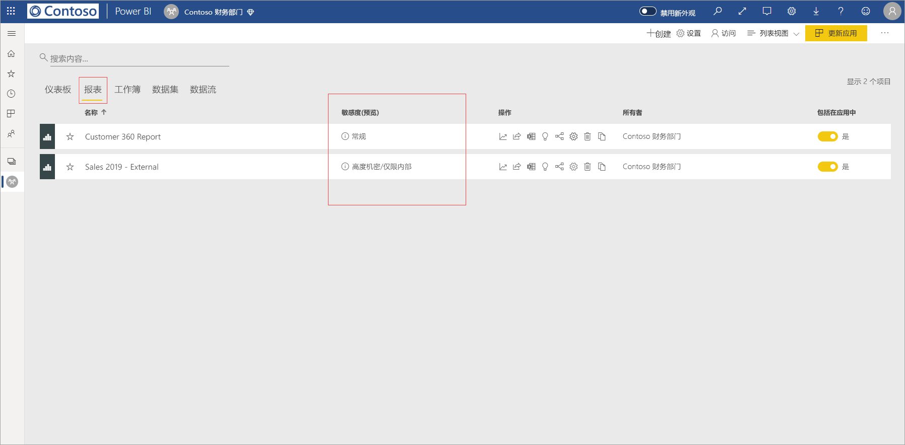
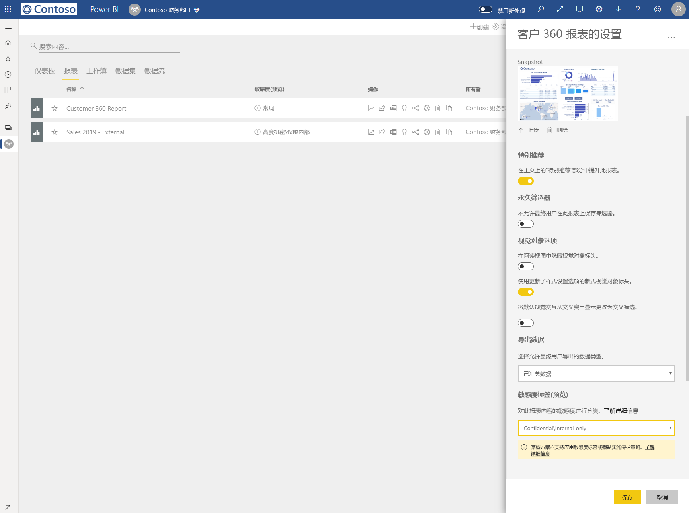
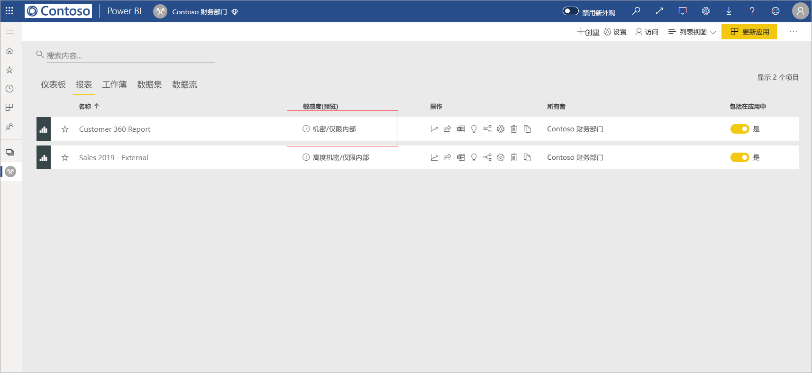
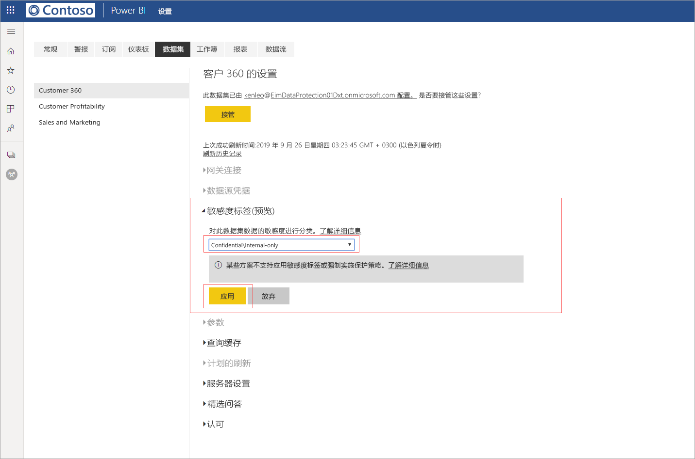

# 在 Power BI（预览版）中应用数据敏感度标签

如果在 Power BI 服务中启用了敏感度标签，则可以通过向仪表板、报表、数据集和数据流应用数据敏感度标签来保护它们，以防未经授权的访问和泄露。 使用数据敏感度标签正确标记数据，可确保只有经过授权的用户才能访问数据。

启用数据保护后，将在仪表板、报表、数据集和数据流列表视图中的敏感度列中显示敏感度标签。

> [!NOTE]
> 将敏感度标签应用于 Power BI 仪表板、报表、数据集和数据流需要特定的许可证和权限。 有关详细信息，请参阅[应用敏感度标签](#applying-sensitivity-labels)。

## 应用敏感度标签

若要在 Power BI 中应用敏感度标签，你和你的组织必须满足以下要求：

* 你的组织必须在 [Microsoft 365 安全中心](https://security.microsoft.com/)或 [Microsoft 365 合规中心](https://compliance.microsoft.com/)中定义了敏感度标签。
* 你必须在具有应用数据敏感度标签权限的安全组内，如标题为 [在 Power BI 中启用数据敏感度标签（预览版）](../admin/service-security-enable-data-sensitivity-labels.md#enable-data-sensitivity-labels)的文章中所述。
* 你必须具有 Power BI Pro 许可证和对要标记的资源的编辑权限。 
* 你必须具有 Azure 信息保护高级版 P1 或高级版 P2 许可证。 Microsoft Azure 信息保护可以单独购买，也可以通过 Microsoft 许可套件之一购买。 有关详细信息，请参阅 [Azure 信息保护定价](https://azure.microsoft.com/pricing/details/information-protection/)。

若要在报表上应用或更改敏感度标签，请单击工作区列表项上的报表设置图标，然后转到设置侧窗格中的数据敏感度部分。 选择相应的敏感度标签，并保存设置。

敏感度列中将显示更新的敏感度标签。 

在仪表板上应用或更改敏感度标签的过程与上述报表相关过程相同。 

还可以在数据集和数据流上设置敏感度标签。 下图显示了如何在数据集上设置敏感度标签；数据流相关步骤类似。

若要在数据集上设置敏感度标签，请选择数据集选项卡，单击要对其应用标签的数据集上的三个点，然后选择“设置”  。

在数据集的设置页上，打开敏感度标签部分，选择所需的敏感度标签，然后单击“应用”  。

在数据流上应用或更改敏感度标签的过程与报表中所述的过程相同。

## 删除敏感度标签
若要从报表、仪表板、数据集或数据流中删除敏感度标签，请按照[用于应用标签的相同过程](#applying-sensitivity-labels)操作，但在系统提示对数据的敏感度进行分类时，请选择“(无)”  。 

## 导出文件中的数据保护

从具有敏感度标签的[报表中导出数据](https://docs.microsoft.com/power-bi/consumer/end-user-export)时，所生成的文件（Excel、PowerPoint 和 PDF；CSV 不受支持）会继承敏感度标签。 敏感度标签将在文件中可见，仅限具有足够权限的用户访问此文件。

## 注意事项和限制

应用数据敏感度标签有以下注意事项：

* 要在 Power BI 中应用和查看 Microsoft 信息保护敏感度标签，需要 Azure 信息保护高级版 P1 或高级版 P2 许可证。 Microsoft Azure 信息保护可以单独进行购买，也可以通过一个 Microsoft 许可套件进行购买。 有关详细信息，请参阅 [Azure 信息保护定价](https://azure.microsoft.com/pricing/details/information-protection/)。
* 敏感度标签只能应用于仪表板、报表、数据集和数据流。
* 只有 Excel、PowerPoint 和 PDF 文件支持对导出文件执行标签和保护控件。 将数据导出到 CSV 文件、订阅电子邮件、嵌入视觉对象和打印时，不会强制执行标签和保护。
* 从 Power BI 导出文件的用户有权根据敏感度标签设置访问和编辑该文件。 导出数据的用户不会获得该文件的所有者权限。 
* 敏感度标签当前不可用于[分页报表]( https://docs.microsoft.com/power-bi/paginated-reports-report-builder-power-bi)和工作簿。 
* Power BI 资产上的敏感度标签仅在工作区列表和世系视图中可见。目前标签在收藏夹、与我共享、最近或应用视图中不可见。 但请注意，应用于 Power BI 资产的标签（即使不可见）将始终保留在导出到 Excel、PowerPoint 和 PDF 文件中的数据上。
* 在 [Microsoft 365 安全中心](https://security.microsoft.com/)或 [Microsoft 365 合规中心](https://compliance.microsoft.com/)中配置的敏感度标签“文件加密设置”仅适用于从 Power BI 导出的文件。该标签不会在 Power BI 中强制实施    。
* 在 Power BI 中应用的标签不支持 [HYOK 保护](https://docs.microsoft.com/azure/information-protection/configure-adrms-restrictions)。
* 要在 Office 应用中查看和应用标签，需满足[许可要求](https://docs.microsoft.com/microsoft-365/compliance/get-started-with-sensitivity-labels#subscription-and-licensing-requirements-for-sensitivity-labels)。
* 仅全球（公有）云中的租户支持敏感度标签。 其他云中的租户不支持敏感度标签。
* [外部用户（Azure Active Directory B2B 来宾用户）](../admin/service-admin-azure-ad-b2b.md)不支持敏感度标签。 这表示外部用户无法查看标签，并且将被阻止将数据导出到 Excel、PDF 和 PPTX 文件中。 [删除标签](#removing-sensitivity-labels)，使外部用户可以将数据导出到这些文件类型。

## 后续步骤

本文介绍如何在 Power BI 中应用数据敏感度标签。 以下文章提供了有关 Power BI 中数据保护的详细信息。 

* [Power BI 中数据保护的概述](../admin/service-security-data-protection-overview.md)
* [在 Power BI 中启用数据敏感度标签](../admin/service-security-enable-data-sensitivity-labels.md)
* [在 Power BI 中使用 Microsoft Cloud App Security 控件](../admin/service-security-using-microsoft-cloud-app-security-controls.md)