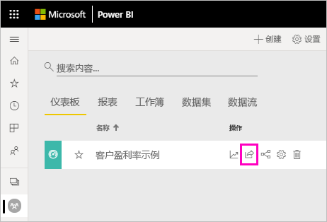
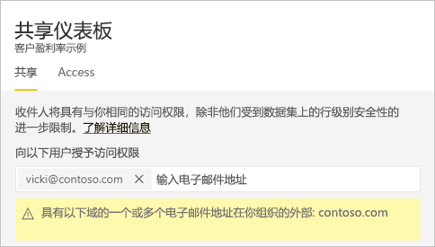
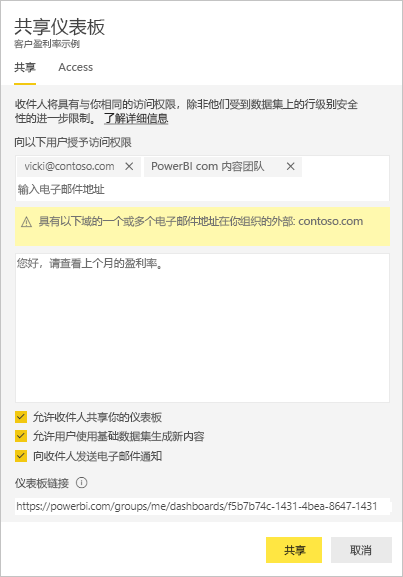
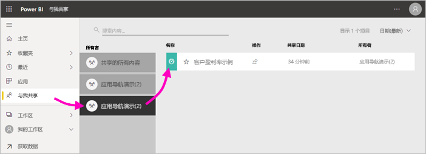
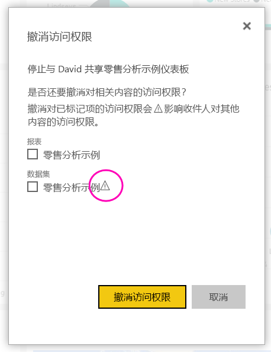

# 与同事和其他人共享 Power BI 仪表板和报表
共享是向授予用户对 Power BI 服务中的仪表板和报表的访问的最简单方法。 可以与组织内外的用户共享。

共享仪表板或报表时，你与之共享的人员可查看并与其交互，但不能编辑它。 他们会看到你在仪表板和报表中看到的相同数据，并且可以访问整个基础数据集，除非向基础数据集应用了行级别安全性 (RLS)。  如果你允许，与之共享的同事还可以与其他同事共享。 组织外的人员可以查看仪表板或报表并与之交互，但不能共享它。 

可以从 Power BI 服务中的大多数位置共享仪表板和报表：收藏夹、最近访问内容、我的工作区。 如果有其他工作区中的[管理员、成员或参与者角色](service-new-workspaces.md#roles-in-the-new-workspaces)，则还可以从该工作区进行共享。 如果所有者允许，你可以共享“与我共享”中的仪表板和报表。 

Power BI 服务还提供了其他开展协作和分发仪表板及报表的方式。 阅读 [Power BI 中的协作和共享方式](service-how-to-collaborate-distribute-dashboards-reports.md)，了解哪种方式最适合你的情况。 

要进行共享，无论是在组织内还是在组织外共享内容，你都需要一个 [Power BI Pro 许可证](../fundamentals/service-features-license-type.md)。 你的收件人也需要一个 Power BI Pro 许可证，除非内容位于[高级容量](../admin/service-premium-what-is.md)中。 

不能直接从 Power BI Desktop 进行共享。 将报表[从 Power BI Desktop 发布](../create-reports/desktop-upload-desktop-files.md)到 Power BI 服务。 但是，可[通过 Power BI 移动应用共享仪表板](../consumer/mobile/mobile-share-dashboard-from-the-mobile-apps.md)。  

## 共享仪表板或报表

1. 在仪表板或报表列表中，或在打开的仪表板或报表中，选择“共享”:::image type="icon" source="../media/power-bi-share-icon.png" border="false":::。

2. 在顶部框中，输入个人、通讯组或安全组的完整电子邮件地址。 不能与动态通讯组列表共享。 
   
   你可以与地址在组织外部的人员进行共享，但会看到一条警告。 阅读本文中有关[在组织外部进行共享](#share-a-dashboard-or-report-outside-your-organization)的详细信息。
   
    
 
   >[!NOTE]
   >输入框最多支持输入 100 个单独的用户或组。 有关与更多人员共享的方法，请参阅本文中的[与 100 多个用户共享](#share-with-more-than-100-separate-users)。

3. 如果需要，请添加一条消息。 可选。
4. 若要允许同事与他人共享你的内容，请勾选“允许收件人共享仪表板(或报表)”。
   
   允许他人共享称为重新共享。 如果你允许，他们可以从 Power BI 服务和移动应用重新共享，或将电子邮件邀请转发给组织中的其他人。 该邀请将在一个月后过期。 你的组织外的用户无法重新共享。 作为内容的所有者，你可以关闭重新共享，或者逐个撤消重新共享。 请参阅本文中[停止或更改共享](#stop-or-change-sharing)。

5. 如果选择“允许用户使用基础数据集生成新内容”，则用户可基于此仪表板的数据集在其他工作区中自行创建报表。 阅读有关[基于来自不同工作区的数据集创建报表](../connect-data/service-datasets-discover-across-workspaces.md)的详细信息。

1. 选择 **共享**。
   
     
   
   Power BI 将带有指向共享内容链接的电子邮件邀请发送给个人（而非组）。 你会看到成功通知。 
   
   当组织中的收件人单击该链接时，Power BI 会将仪表板或报表添加到他们的“与我共享”列表页中。 他们可以选择你的名字来查看你与之共享的所有内容。 
   
   
   
   当组织外部的收件人单击该链接时，他们会看到仪表板或报表，但不是在常用的 Power BI 门户中。 阅读本文中有关[与组织外部人员进行共享](#share-a-dashboard-or-report-outside-your-organization)的详细信息。

## 查看哪些人有权访问仪表板或报表
有时，需要查看与之共享的人员，并了解他们的共享对象。

1. 在仪表板或报表列表中，或在仪表板或报表中，选择“共享”:::image type="icon" source="../media/power-bi-share-icon.png" border="false":::。 
2. 在“共享仪表板”或“共享报表”对话框中，选择“访问权限”  。
   
    

    组织外的人员都将作为 **来宾** 列出。

    在此视图中，可以在本文中[停止或更改共享权限](#stop-or-change-sharing)。 

## 在组织外部共享仪表板或报表
与组织外的人员共享时，他们会收到带有指向共享仪表板或报表的链接的电子邮件。 他们必须登录 Power BI，才能看到你共享的内容。 如果他们没有 Power BI Pro 许可证，则可以在单击链接后注册一个许可证。

登录后，他们就可以在浏览器窗口（而不是常用的 Power BI 门户）中看到共享仪表板或报表。 若要在以后访问此仪表板或报表，他们需要为链接添加书签。

组织外的用户不能编辑此仪表板或报表内的任何内容。 他们可以与图表进行交互并更改筛选器或切片器，但不能保存更改。 

只有你的直接收件人才能看到共享仪表板或报表。 例如，如果发送电子邮件至 Vicki@contoso.com，只有 Vicki 才能看到仪表板。 其他任何人都无法看到该仪表板，即使 Vicki 将链接转发给他们。 Vicki 需要使用同一电子邮件地址来访问它；如果 Vicki 使用其他电子邮件地址登录，Vicki 将无法访问该仪表板。

如果角色级或行级安全性是通过本地 Analysis Services 表格模型实现的，组织外的人员将完全无法查看任何数据。

使用安全组（而不是通讯组）与包含具有外部电子邮件地址的用户的组共享。 通讯组中具有外部电子邮件的用户无法看到你共享的内容，除非他们是 Azure Active Directory (Azure AD) B2B 来宾用户。 详细了解 [Azure AD B2B 来宾用户](../admin/service-admin-azure-ad-b2b.md)。

如果从 Power BI 移动应用向组织外部人员发送链接，则单击链接会在浏览器（而不是 Power BI 移动应用）中打开仪表板。

### 允许外部用户编辑内容

Power BI 管理员允许外部来宾用户编辑和管理组织中的内容。 如果是这样，则外部用户不会有仅使用体验。 他们可以编辑和管理组织内的内容。 详细了解[使用 Azure AD B2B 将 Power BI 内容分发给外部来宾用户](../admin/service-admin-azure-ad-b2b.md)。

## 与 100 多个单独用户共享

在一次共享操作中最多可以与 100 个用户或组共享。 但是，可以为超过 500 个用户提供对某个项的访问权限。 下面是一些建议：

- 通过单独指定用户进行多次共享。
- 与包含所有用户的用户组共享。 
- 在工作区中创建报表或仪表板，然后从工作区创建应用。 可以与多个用户共享该应用。 阅读有关[在 Power BI 中分发应用](service-create-distribute-apps.md)的详细信息。

## 停止或更改共享
只有仪表板或报表所有者可以打开和关闭重新共享。

### 如果尚未发送共享邀请
* 请在发送之前，取消选中邀请底部的“允许收件人共享仪表板(或报表)”复选框。

### 如果已共享仪表板或报表
1. 在仪表板或报表列表中，或在仪表板或报表中，选择“共享”:::image type="icon" source="../media/power-bi-share-icon.png" border="false":::。 
2. 在“共享仪表板”或“共享报表”对话框中，选择“访问权限”  。
   
    
3. 选择“阅读并重新共享”旁边的省略号 (...) 并选择：
   
   
   
   * 阅读以防止该用户与其他人进行共享。
   * 删除访问权限以防止该用户查看共享内容。

4. 在“移除访问权限”对话框中，决定是否要同时删除对相关内容（例如报表和数据集）的访问权限。 如果删除带有警告图标 的项，则最好还应删除相关内容。 否则，它将无法正常显示。

    

## 限制和注意事项
共享仪表板和报表的注意事项：

* 在与同事共享仪表板时，还会共享基础数据集。 你的同事可以访问整个数据集，除非[行级别安全性 (RLS)](../admin/service-admin-rls.md) 限制其访问权限。 报表作者可以使用在查看报表或与报表交互时自定义用户体验的功能，例如隐藏列、限制对视觉对象执行的操作等。 这些自定义用户体验不会限制用户可以访问数据集中的哪些数据。 在数据集中使用[行级别安全性 (RLS)](../admin/service-admin-rls.md)，以便每个人的凭据都可以确定他们可以访问的数据。
* 与之共享的每个人都可以查看仪表板，并在[阅读视图](../consumer/end-user-reading-view.md#reading-view)中与相关报表交互。 通常，他们不能创建报表或将更改保存到现有报表。 但是，如果选择“允许用户使用基础数据集生成新内容”，则用户可基于此仪表板或报表的数据集在其他工作区中自行创建报表。
* 虽然任何人都不可以查看或下载数据集，但他们可以使用“在 Excel 中分析”功能来直接访问数据集。 管理员可以限制组内每个人使用“在 Excel 中分析”的能力。 但此限制适用于组内的每个人和该组所隶属的每个工作区。
* 每个人都可以手动[刷新数据](../connect-data/refresh-data.md)。
* 如果使用 Microsoft 365 收发电子邮件，可以通过输入与通讯组关联的电子邮件地址，与通讯组成员进行共享。
* 与你共享电子邮件域的同事，以及域不同但在相同租户中注册的同事可以与他人共享仪表板。 例如，假设域 contoso.com 和 contoso2.com 是在同一租户中注册的，而你的电子邮件地址是 konrads@contoso.com。 只要你向 ravali@contoso.com 和 gustav@contoso2.com 授予共享权限，两者都可以共享你的仪表板。
* 如果你的同事已经有权访问特定仪表板或报表，则当你在仪表板或报表上时，可以通过复制 URL 发送直接链接。 例如：`https://powerbi.com/dashboards/g12466b5-a452-4e55-8634-xxxxxxxxxxxx`。
* 同样，如果你的同事已经有权访问特定仪表板，你可以[将直接链接发送到基础报表](service-share-reports.md)。 

## 后续步骤

- [应如何针对仪表板及报表开展协作并进行共享？](service-how-to-collaborate-distribute-dashboards-reports.md)
- [排查共享仪表板和报表时遇到的问题](service-troubleshoot-sharing.md)
- [向共享仪表板或报表请求或授予访问权限](service-request-access.md)
- [共享筛选的 Power BI 报表](service-share-reports.md)
- 是否有任何问题? [尝试参与 Power BI 社区](https://community.powerbi.com/)
