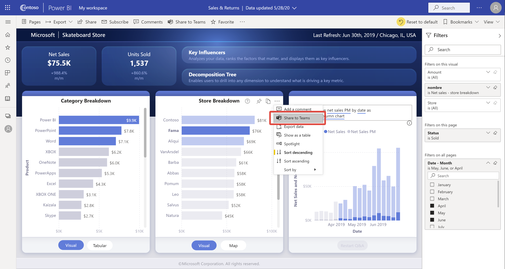

# 通过 Power BI 服务直接在 Microsoft Teams 中聊天

可通过 Power BI 服务直接在 Microsoft Teams 中就 Power BI 仪表板、报表和视觉对象进行聊天。 在 Power BI 服务中查看报表和仪表板时，使用“在 Teams 中聊天”功能可快速开始对话。

## 要求

若要在 Power BI 中使用“在 Teams 中聊天”功能，请确保你的 Power BI 管理员未在 Power BI 管理门户中禁用“共享到 Teams”租户设置 。 通过该设置，组织可隐藏“在 Teams 中聊天”按钮。 有关详细信息，请参阅 [Power BI 管理门户](../admin/service-admin-portal.md#share-to-teams)一文。

请参阅[使用 Power BI 在 Microsoft Teams 中开展协作](service-collaborate-microsoft-teams.md)，其中介绍了 Power BI 和 Microsoft Teams 协同工作的背景以及其他要求。

## 在 Microsoft Teams 中就 Power BI 内容进行聊天

按照以下步骤在 Power BI 服务中共享报表、仪表板和视觉对象的链接，并就 Microsoft Teams 频道和聊天开启对话。

1. 选择以下选项之一：

   * 仪表板或报表的操作栏中的“在 Teams 中聊天”：

       
    
   * 单个视觉对象的上下文菜单中的“在 Teams 中聊天”：
    
      

1. 在“共享到 Microsoft Teams”对话框中，选择要将链接发送到的团队或频道。 如果需要，可以输入一条消息。 系统可能会要求你先登录到 Microsoft Teams。

    

1. 选择“共享”以发送链接。
    
1. 该链接将添加到现有对话或开始新聊天。

    

1. 选择链接可在 Power BI 服务中打开该项。

1. 如果使用了特定视觉对象的上下文菜单，则在打开报表时会突出显示该视觉对象。

    

## 已知问题和限制

- 没有用于访问报表的 Power BI 许可证或权限的用户会看到“内容不可用”消息。
- 如果浏览器使用严格的隐私设置，“在 Teams 中聊天”按钮可能无效。 如果未正确打开对话框，则使用“遇到问题? 尝试在新窗口中打开”选项。
- “在 Teams 中聊天”不包括链接预览。
- 链接预览和“在 Teams 中聊天”不向用户授予查看该项的权限。 权限必须单独进行管理。
- 当报表作者将视觉对象的“更多选项”设置为“关”时，“在 Teams 中聊天”按钮在视觉对象上下文菜单中不可用  。
- 请参阅“在 Microsoft Teams 中开展协作”一文中的[已知问题和限制](service-collaborate-microsoft-teams.md#known-issues-and-limitations)部分以了解其他问题。

## 后续步骤

- [使用 Power BI 在 Microsoft Teams 中开展协作](service-collaborate-microsoft-teams.md)

更多问题？ [尝试咨询 Power BI 社区](https://community.powerbi.com/)。
