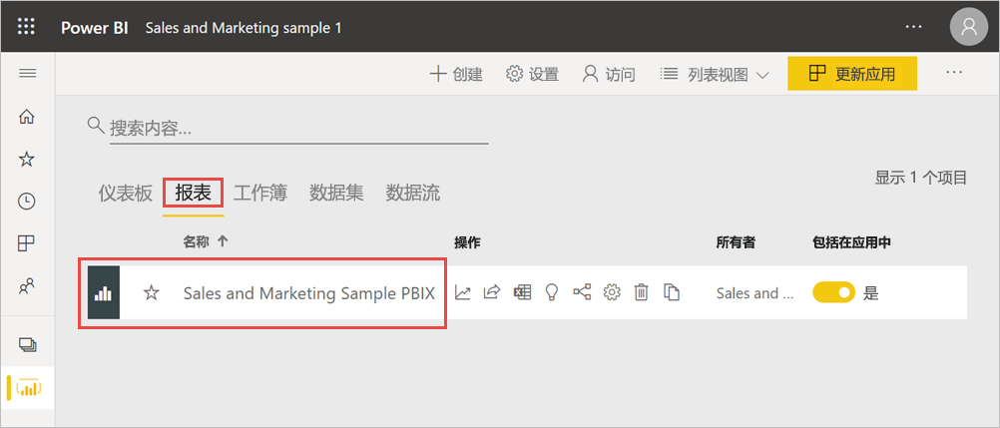
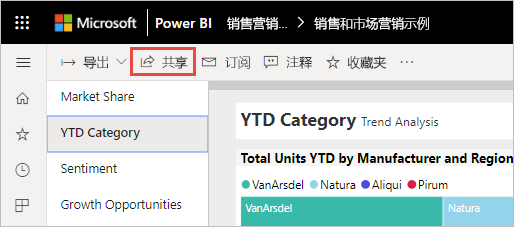
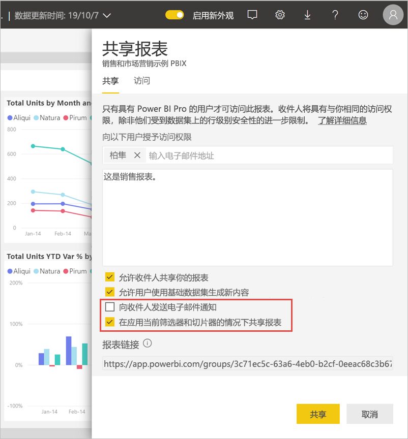
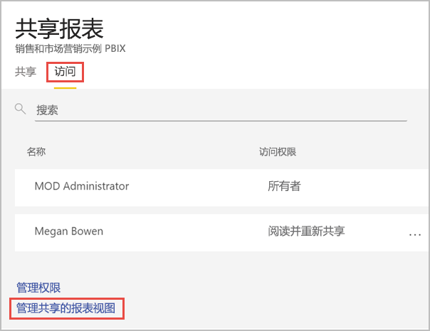
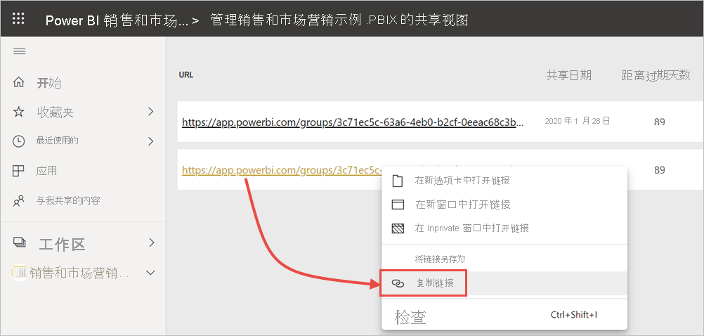

# 筛选并共享 Power BI 报表
共享是一种使多人能够访问你的仪表板和报表的有效方式。 如果你想要共享筛选的报表版本，该怎么办？ 也许你希望报表仅显示特定城市或销售人员或年份的数据。 本文介绍如何筛选报表并共享报表的筛选版本。 共享筛选报表的另一种方法是[将查询参数添加到报表 URL](service-url-filters.md)。 在这两种情况下，收件人第一次打开报表时，将对其进行筛选。 用户可以清除报表中的筛选选项。

Power BI 还提供了[其他开展协作和分发报表的方式](service-how-to-collaborate-distribute-dashboards-reports.md)。 要进行共享，你和收件人都需要一个 [Power BI Pro 许可证](../fundamentals/service-features-license-type.md)，或者内容需要位于[高级容量](../admin/service-premium-what-is.md)中。 

## 跟踪示例数据

本文使用市场营销和销售示例模板应用。 想要体验它？ 

1. 安装[市场营销和销售示例模板应用](https://appsource.microsoft.com/product/power-bi/microsoft-retail-analysis-sample.salesandmarketingsample?tab=Overview)。
2. 选择应用，然后选择“浏览应用”。

   

3. 选择铅笔图标以打开随应用一起安装的工作区。

    

4. 在工作区内容列表中，选择“报表”，然后选择报表“销售和市场营销示例 PBIX”。

    

    现在，已准备就绪，可以执行后续操作了。

## 在报表中设置筛选器

在[编辑视图](../consumer/end-user-reading-view.md)中打开报表并应用筛选器。

在此示例中，我们将筛选市场营销和销售示例模板应用的“YTD 类别”页，以仅显示其中“Region”等于“Central”的值。  
 

保存报告。

## 共享筛选的报表

1. 选择 **共享**。

   

2. 清除“向收件人发送电子邮件通知”，因此你可以改为发送已筛选的链接，选择“与当前筛选器和切片器共享报表”，然后选择“共享”。

    

4. 再次选择“共享”。

   

5. 选择“访问”选项卡，然后选择“管理共享报表视图”。

    

6. 右键单击所需的 URL，并选择“复制链接”。

    

7. 当你共享此链接时，收件人会看到你筛选的报表。 

## 限制和注意事项
共享报表的注意事项：

* 如果通过管理权限、共享报表或仪表板或者发布应用来共享数据集，则将授予对整个数据集的访问权限，除非[行级别安全性 (RLS)](../admin/service-admin-rls.md) 限制其访问权限。 报表作者可以使用在查看报表或与报表交互时自定义用户体验的功能，例如隐藏列、限制对视觉对象执行的操作等。 这些自定义用户体验不会限制用户可以访问数据集中的哪些数据。 在数据集中使用[行级别安全性 (RLS)](../admin/service-admin-rls.md)，以便每个人的凭据都可以确定他们可以访问的数据。

## 后续步骤
* [在 Power BI 中共享工作的方式](service-how-to-collaborate-distribute-dashboards-reports.md)
* [共享仪表板](service-share-dashboards.md)
* 更多问题？ [尝试参与 Power BI 社区](https://community.powerbi.com/)。
* 想提供反馈？ 请转到 [Power BI 社区站点](https://community.powerbi.com/)提出你的建议。
